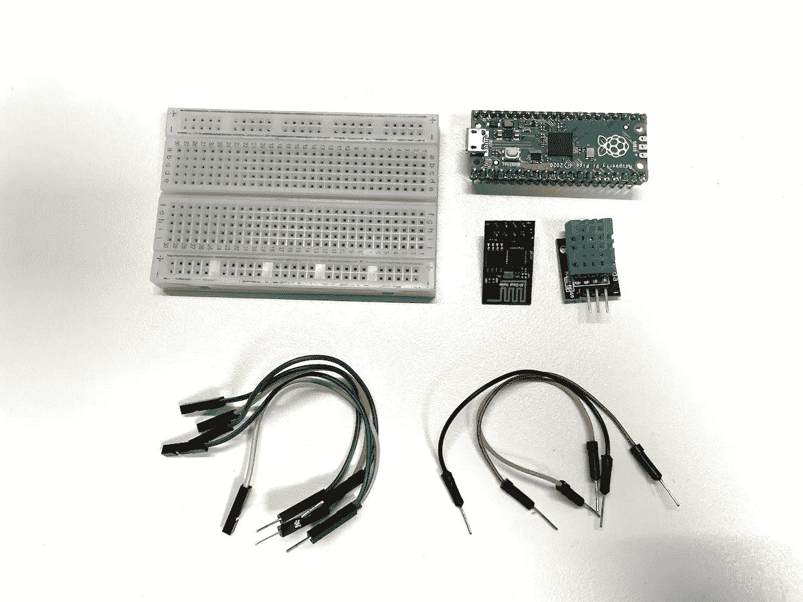
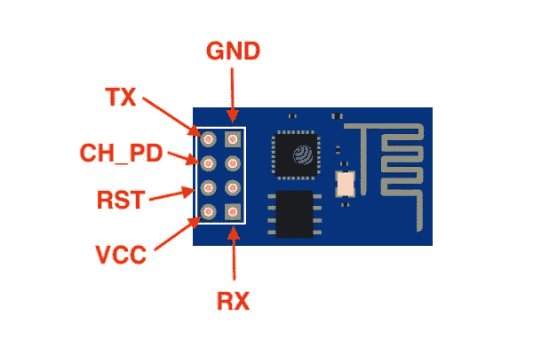
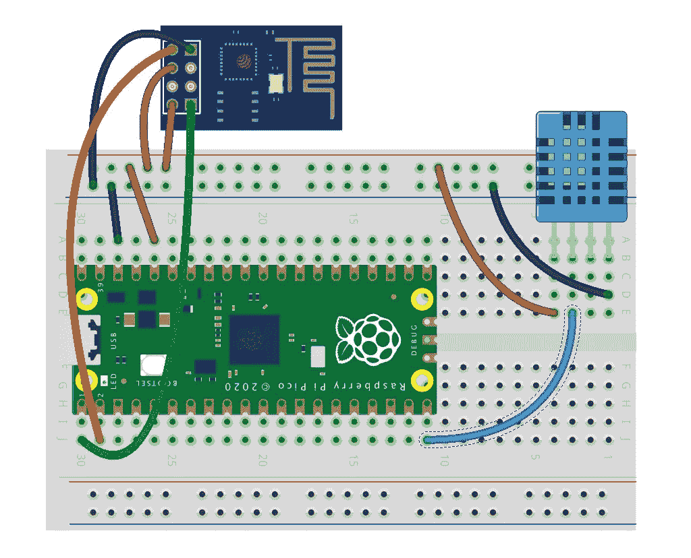
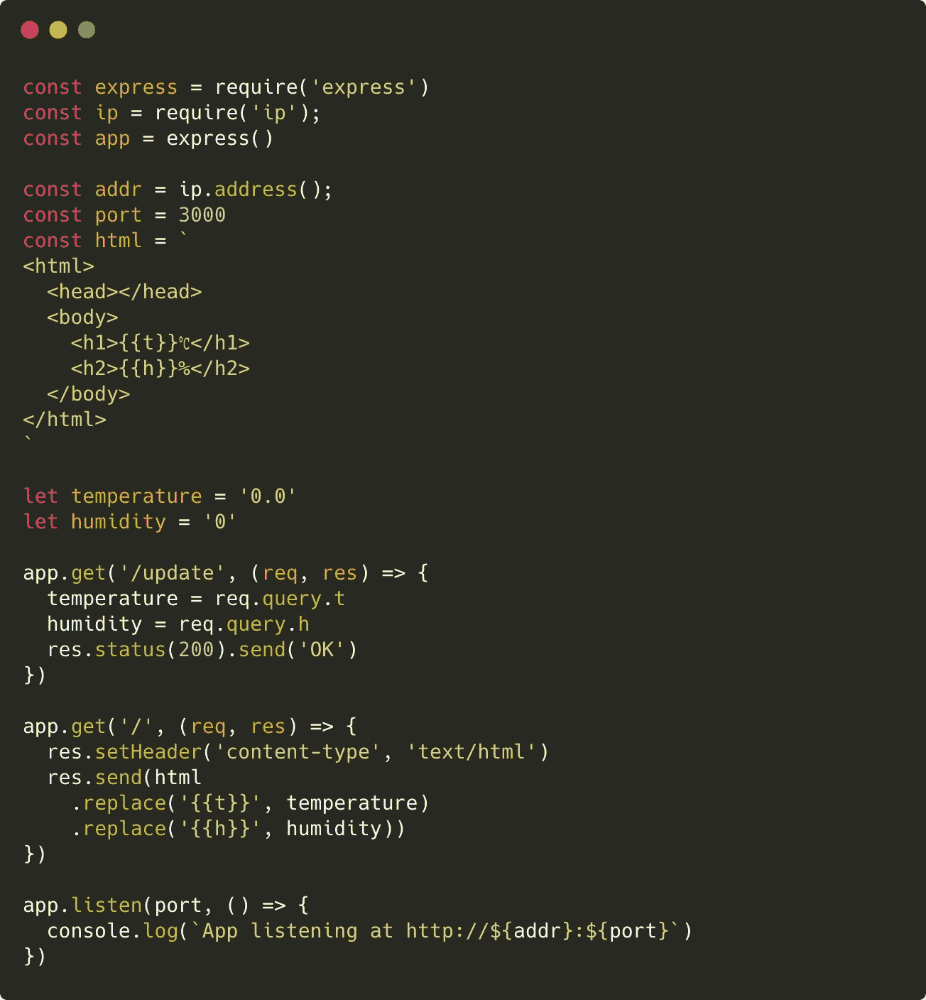
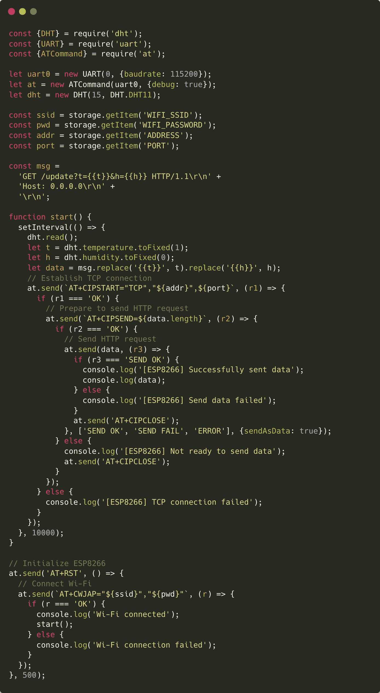
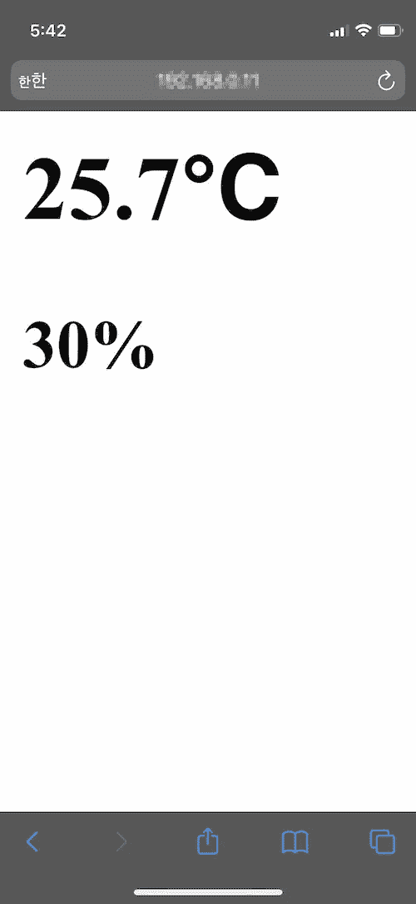
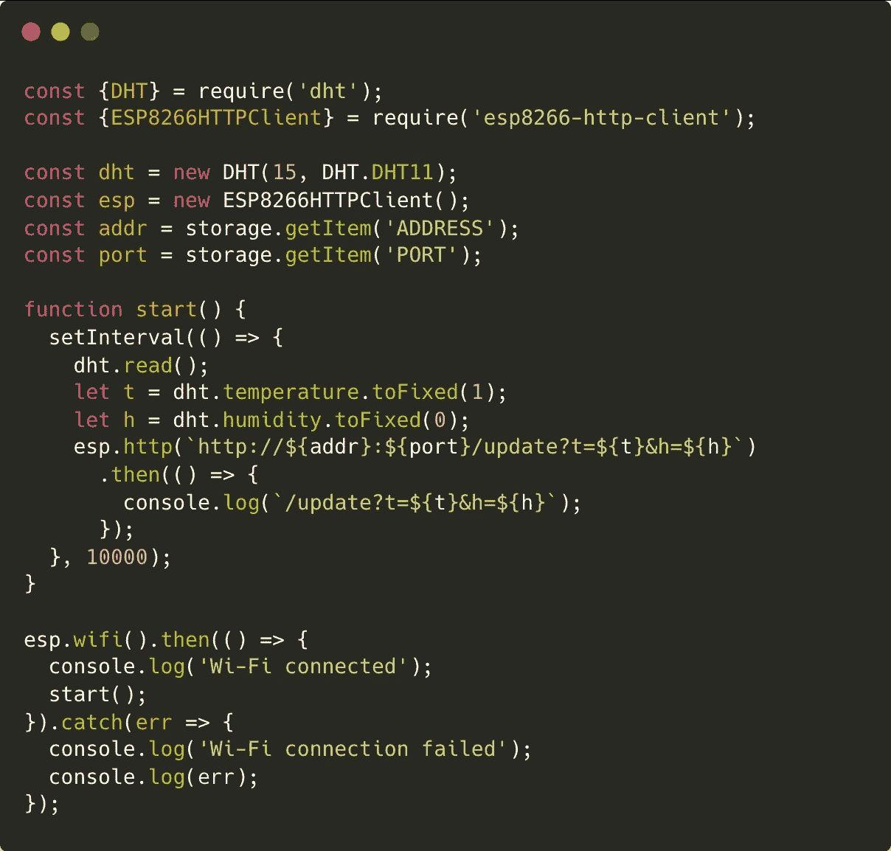

# 使用 JavaScript 的物理计算(8/8) —连接到互联网

> 原文：<https://javascript.plainenglish.io/physical-computing-with-javascript-8-8-connecting-to-internet-151ba3dfce59?source=collection_archive---------2----------------------->


在本教程中，让我们通过 UART(通用异步接收器/发射器)控制 Wi-Fi 模块来连接互联网。

> [目录](https://niklauslee.medium.com/physical-computing-with-javascript-table-of-contents-69c38fd74e61)

# 成分

*   树莓派 Pico — 1 件。
*   试验板— 1 个。
*   DHT11 传感器— 1 个。
*   Wi-Fi 网络模块(ESP8266、ESP-01 模块)— 1 个。
*   跳线(M-M 和 M-F 型)



Components for connecting to Internet

ESP8266 是一款具有 Wi-Fi 网络功能的微控制器。因为价格便宜，所以很受欢迎。为了方便使用，它以各种模块类型出售。这里，使用尺寸小且价格低的 ESP-01 模块。在该模块中，通常会上传可以使用 at 命令的固件。



Pinout of ESP-01 module

# 电路



Circuit for DHT11 and ESP-01 module

将 ESP-01 连接到 **UART0** 端口，并将 **CH_PD** 引脚连接到 **3V3** 。DHT11 传感器的 **OUT** 引脚也连接到 **GPIO15** 。不幸的是，ESP-01 模块不是设计用来插入试验板的。所以，它应该通过 M-F(公-母)型跳线连接。

# 通用异步收发器

与上一教程中介绍的 I2C 和 SPI 不同，UART(通用异步收发器)不使用时钟引脚。因此，需要匹配设备之间的通信速度。这个叫 baudrate，用的最多的是 9600bps 和 115200bps。Pico 中提供了两个端口: **UART0** 和 **UART1** 。与 I2C 和 SPI 不同，UART 不是总线。因此，每个端口只能连接一台设备。

在 Kaluma 中，可以通过如下图所示的`uart`模块使用。通过`write()`功能可以进行数据传输。但是没有接收数据的功能。由于外部 UART 设备不知道何时发送数据，接收的数据通过`data`事件发送。由于接收到的数据是一个`Uint8Array`类型，如果你想在终端上打印它，你需要把它转换成一个`String`类型。

```
const {UART} = require('uart');
let uart0 = new UART(0);
uart0.write('Hello\n');
// ...
uart0.on('data', (data) => {
  var s = String.fromCharCode.apply(null, data);
  print(s);
});
// ...
uart0.close();
```

# 掌握

AT Command(又名 Hayes 命令集)是为早期调制解调器开发的一组命令。命令通常以文本“AT”开头，所以它们被称为 AT 命令，这是“注意”的缩写。虽然它是很久以前开发的，但直到最近才被广泛用作控制各种设备的命令。ESP8266 也支持此 AT 命令来控制无线网络。

首先，我们用 AT 命令控制连接到 **UART0** 的 ESP8266，如上图电路图所示。为了将 AT 命令直接从终端发送到 UART 并在终端上打印接收到的数据，在终端中逐行输入(复制并粘贴)下面的代码。下面的代码只是为 UART 端口 0 创建一个对象，并在接收到数据时将它打印到终端。由于接收到的数据是一个`Uint8Array`类型，它被转换成一个字符串以便于读取和输出。

```
> const {UART} = require('uart');
> let uart0 = new UART(0, {baudrate: 115200});
> uart0.on('data', d=>{print(String.fromCharCode.apply(null, d))});
```

首先，让我们看看 ESP8266 是否正确连接并正常响应 AT 命令。让我们通过 UART 发送`AT\r\n`字符串，如下所示。那么`OK`将在收到发送命令的回应后立即被接收。注意`\r\n`必须始终附加在 at 命令的末尾。

```
> uart0.write('AT\r\n');
undefined
> ATOK
```

接下来，让我们发送一个命令来重置 ESP8266。一些奇怪的字符串大量出现。如果开始时看到`OK`，结束时看到准备好，初始化就成功了。

```
> uart0.write('AT+RST\r\n');
undefined
> AT+RSTOK
...
load 0x40100000, len 1856, room 16 
tail 0
chksum 0x63
load 0x3ffe8000, len 776, room 8
...
Ai-Thinker Technology Co. Ltd.ready
```

我们将主要在站模式下使用，因此我们必须将 ESP8266 模块更改为站模式，如下所示。

```
> uart0.write('AT+CWMODE=1\r\n');
undefined
> AT+CWMODE=1OK
```

最后，我们发个命令扫描一下附近的 AP，看看 Wi-Fi 功能是否好用。来看看我身边的无线网络搜的好不好。

```
> uart0.write('AT+CWLAP\r\n');
undefined
> AT+CWLAP
+CWLAP:(3,"xxxxxxxxxxx",-78,"xx:xx:xx:xx:xx:xx",1,10,0)
+CWLAP:(3,"xxxxxx",-53,"xx:xx:xx:xx:xx:xx",11,-2,0)
...OK
```

能看清楚我周围的网络吗(出于安全考虑，SSID 和 BSSID 都换成`x`)？这就足以理解 ESP8266 的 AT 命令是如何执行的了。有关 AT 命令的更多详细信息，请参考相关文档。作为参考，下面的链接是一个简要总结了 ESP8266 的 at 命令的文档。

 [## ESP8266 — AT 命令参考

### ESP8266 在其默认配置下启动进入串行调制解调器模式。在这种模式下你可以和它交流…

房间-15.github.io](http://room-15.github.io/blog/2015/03/26/esp8266-at-command-reference/) 

# 启动外部 web 服务器

为了将 Pico 测量的温度和湿度数据传输到互联网，需要一个可以接收它的服务器。现在我们用 Node.js 创建一个简单的 web 服务器来使用 express.js 接收数据，创建一个如下所示的文件夹，初始化 Node.js 项目，然后添加`express`和`ip`模块。

```
$ mkdir thermo-server
$ cd thermo-server
$ npm init -y
$ npm install express, ip --save
```

如下编写`server.js`程序。如果您使用浏览器连接到此服务器，将显示当前的温度和湿度。此外，还提供了 HTTP GET 方法的 REST API，以便 Pico 中的 DHT11 传感器测量的温度和湿度信息可以作为`/update?t=27.5&h=45`传输到服务器。



A web server for temperature and humidity (server.js)

写完代码后，让我们启动 web 服务器。它使用 web 服务器的 IP 地址和端口号执行，如下所示。

```
$ node server
App listening at [http://xxx.xxx.x.xx:3000](http://192.168.0.11:3000)
```

# 向 web 服务器发送数据

现在，您需要做的就是将 Pico 的温度和湿度数据发送到 web 服务器。但是，很难向外界透露 Wi-Fi 密码或服务器地址等信息。由于 Kaluma 中创建的所有项目目前都处于公共模式，因此存在此类信息被暴露给外部的风险。所以，让我们使用[存储 API](https://docs.kaluma.io/api-reference/storage) 将信息存储在 Pico 的闪存中，而不是在代码中暴露出来。首先，我们将把 Wi-Fi SSID、密码、地址和端口保存到 Pico 的闪存中。在终端中输入以下内容。

```
> storage.setItem('WIFI_SSID', 'xxxxxxx');
> storage.setItem('WIFI_PASSWORD', 'xxxxxxxx');
> storage.setItem('ADDRESS', 'xxx.xxx.x.xx');
> storage.setItem('PORT', '3000');
```

这些保存的项目可以按如下方式回读。通过允许代码读取这些存储的项，可以防止信息被暴露。

```
> storage.getItem('WIFI_SSID');
> storage.getItem('WIFI_PASSWORD');
> storage.getItem('ADDRESS');
> storage.getItem('PORT');
```

现在，我们把下面的代码写出来，然后上传。我们使用 Kaluma 提供的`at`模块来更方便的处理 AT 命令。使用它，您可以非常方便地传输 AT 命令，也可以轻松地将传输结果传递给回调函数。在创建`ATCommand`类时，传递连接到 ESP-01 模块的 UART 对象，如果想看到从这里进出的数据，可以将`debug`选项设置为`true`。在开发阶段，查看调试信息会非常方便。参考`at`模块的参考，查看完整功能。

[](https://kalumajs.org/docs/api/at-command/) [## 卡鲁玛

### at 模块支持发送 AT 命令和处理响应。该模块适用于受控设备…

kalumajs.org](https://kalumajs.org/docs/api/at-command/) 

执行代码时，ESP8266 用`AT+RST`命令初始化，然后用`AT+CWJAP`命令尝试连接 Wi-Fi。当连接成功时，执行`start()`函数，每 10 秒测量一次来自 DHT11 传感器的温度和湿度，并生成一个 HTTP GET 请求发送到服务器。



在 Pico 将温度和湿度数据传输到服务器后，现在让我们通过智能手机或 PC 上的浏览器访问服务器来检查温度和湿度。如果服务器有一个可以从外部访问的静态 IP，您可以在任何地方检查温度和湿度。



# 使用第三方模块

直接编写 HTTP 请求消息并作为 AT 命令发送是非常麻烦的。让我们使用一个简单的模块来简化这个过程。

[](https://github.com/niklauslee/esp8266-http-client) [## GitHub-niklauslee/esp8266-HTTP-client:用于 ESP8266 模块的简单 Kaluma HTTP 客户端库

### 一个简单的 Kaluma HTTP 客户端库用于 ESP8266 模块-GitHub-niklauslee/ESP8266-HTTP-client:一个简单的 Kaluma HTTP…

github.com](https://github.com/niklauslee/esp8266-http-client) 

```
$ npm i [https://github.com/niklauslee/esp8266-http-client](https://github.com/niklauslee/esp8266-http-client)
```

当您需要与 HTTP 服务器通信时，该模块消除了直接发送 AT 命令的需要，也消除了手动创建 HTTP 请求消息的需要，并且还自动解析接收到的响应消息。使用这个模块，您可以非常简洁地编写代码，如下所示。



Code using esp8266-http-client module

在上一篇教程中，我们尝试使用 AT 命令通过互联网传输温度和湿度。到目前为止，我试图通过本教程尽可能容易地使用 JavaScript 传达物理计算的基础知识。现在，做自己感兴趣的项目怎么样？

结束。

*更多内容尽在*[*plain English . io*](http://plainenglish.io/)