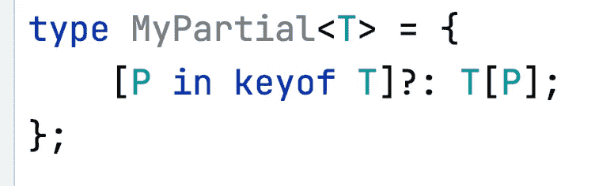
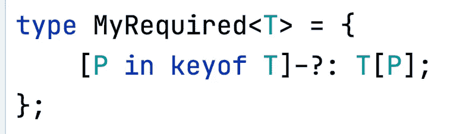

# 通过 TypeScript 中的值进行选择——这是许多著名项目中广泛使用的技巧，您应该知道

> 原文：<https://javascript.plainenglish.io/pick-by-values-in-typescript-a-widely-used-trick-in-many-famous-projects-that-you-should-know-38801eaac1aa?source=collection_archive---------2----------------------->


如果你读过一些用 TypeScript 编写的开源项目的源代码，你会发现有很多令人惊叹的技巧。它们可以帮助我们真正享受 TypeScript 的优势，而不是将其退化为任何脚本。

现在让我们从一个简单的例子开始。下面是一个对象类型`User`:

如果我们想基于`User`创建一个新类型，保留`name`和`age`属性，放弃`level`和`isMember`，我们该怎么做？

最直接的方法是复制和粘贴:

```
type UserInfo = {
    name: string,
    age: number
}
```

但是这种编码方式并不是通用的。更常见的方法是使用`Pick`生成新类型。

`Pick<Type, Keys>`是[在 TypeScript](https://www.typescriptlang.org/docs/handbook/utility-types.html) 中内置的实用程序类型，它通过从`Type`中挑选属性集`Keys`(字符串文字或字符串文字的并集)来构造类型。

```
type UserInfo = Pick<User, 'name' | 'age'>
```


Now, the user is UserInfo type, which doesn’t have a level property.

这个知识很简单，相信很多读者已经掌握了。如果还不熟悉，可以看看[官方文件](https://www.typescriptlang.org/docs/handbook/utility-types.html)中的相关介绍。

但是让我们更深入地思考一下:

1.  `Pick`是如何工作的？我们能自己实现`Pick`吗？

如果你读过官方文档中的实用程序类型一节，你会发现有很多内置的实用程序类型。这些实用程序类型的基本原理是什么？

2.如果我们需要通过值来选择，而不是通过属性名来选择，例如，从`User`中选择所有字符串类型的属性，我们应该怎么做？

这是一个著名的开源项目的代码片段， [utility-types](https://github.com/piotrwitek/utility-types) ，你明白吗？

如果你不知道这两个问题的答案，你就很难理解别人写的 TypeScript 代码。在本文中，我将围绕这两个问题，和大家一步步学习相关知识点。

# 基础知识

在我们进入这两个问题之前，我们首先需要理解一些基本的 TypeScript 概念。如果你对这些有信心，你可以跳过它。

## keyof

在[正式文件](https://www.typescriptlang.org/docs/handbook/2/keyof-types.html)中，`keyof`的定义是:

> keyof 操作符接受一个对象类型，并生成其键的字符串或数字文字并集。

比如 keyof `User`返回`'name' | 'age' | 'level' | 'isMember'`。


## 条件类型

TypeScript 中的条件类型的形式看起来有点像 JavaScript 中的条件表达式。

> 某种类型扩展另一种类型？TrueType:false type；

在 JavaScript 中，我们可以使用条件表达式:

```
let num = 30;
let isOdd =  num / 2 == 0 ? false : true;
```

这相当于:

```
let num = 30;
let isOdd;if (num / 2 == 1){
  isOdd = false
} else {
  isOdd = true
}
```

在 TypeScript 中，条件类型的工作方式类似:

```
interface A {}

interface B extends A {} 

type C = B extends A ? number : string
```

上面的代码意思是:如果`B`扩展了`A`，那么`C`应该是数字类型，否则`C`应该是字符串类型。

关于条件类型的更多细节，可以参考[官方文件](https://www.typescriptlang.org/docs/handbook/2/conditional-types.html)。

## 访问对象类型的属性

上面的用户类型非常类似于 JavaScript 中的对象文字。事实上，在 TypeScript 中，这种类型也被称为对象类型，我们可以像访问 JavaScript 对象一样访问它们的属性。


在上例中，`department`被赋予了`User['department']`，也就是`'coding' | 'marketing'`。所以`dep`可以分配`'marketing'`而不能分配`'22'`。

然后，我们还可以访问多个属性:


此时，我们使用`'department' | 'age'`来访问`User`，因此`departmentAndAge`等于`User['department']`和`User['age']`的并集，即`'coding' | 'marketing' | number`。所以`value`可以分配`'marketing'`或`1`而不能分配`'hi'`。

好了，这些是你应该知道的基本知识。

# 映射类型

映射类型是本文的重点，也是解决以上两个问题的关键。

TypeScript 中的映射类型是什么？先说个例子。

这里我们有一个界面`Point`:

```
interface Point {
  x: number;
  y: number;
}
```

如果我们想创建一个新的类型`PointString`，其中也有`x`和`y`作为属性，但是将它们设置为字符串类型，我们应该怎么做？

你甚至可以复制粘贴:

```
interface PointString {
  x: string;
  y: string;
}
```

正如我们之前提到的，这种编码方式有很多缺陷:

*   很多重复的代码，不好看
*   代码不能重复使用

这里，我们可以使用映射类型:


这个语法乍一看可能令人望而生畏，所以让我们一点一点地分解它:

*   我们正在定义一个类型，`PointString`。
*   在方括号中，我们使用的是`keyof`操作符。`keyof Point`表示类型为`Point`的所有属性名，等于`'x' | 'y'`
*   方括号中的关键字`in`表示我们正在处理一个映射类型。`[key in keyof Point]: string`表示类型`Point`的每个属性`key`的类型应该转换为`string`。

`[key in keyof Point]: string`是一种类似于 JavaScript 中的`for ... in`语法的语法。它遍历`Point`的键来创建一个新类型:


但是上面的代码好像还是没用，因为`PointString`只能处理 Point。改进的想法很简单，我们只是用一个**泛型类型**替换了类型点。


```
type Stringify<Type> = {
    [key in keyof Type]: string
}
```

这段代码与前面的代码做同样的事情。唯一不同的是，我们使用的是泛型而不是`Point`，所以这个`Stringify`可以是通用的。

这是映射类型的用法。它可以映射现有类型的所有属性，然后我们可以在这个过程中对它们进行一定的修改，最终创建一个我们想要的新类型。这是一个非常强大的技术，我们可以用它做很多事情。

# 内置实用程序类型

在 TypeScript 中，有许多内置的实用程序类型，包括 Readonly、Partial 和本文开头提到的 Pick。它们都是使用底层的映射类型实现的。我们自己试试吧。

如果你不熟悉这些公用事业类型，你可以自己阅读[的官方文件](https://www.typescriptlang.org/docs/handbook/utility-types.html)，我在这里重复介绍它们是没有用的。

## 只读

> Readonly <type>构造一个类型，其中`Type`的所有属性都设置为`readonly`，这意味着构造的类型的属性不能被重新分配。</type>

要实现 Readonly，我们可以这样写:


是的，我们只需要在表达式前添加一个`readonly`修饰符，然后它会使所有的属性都变成只读的。

`MyReadonly`的用法与内置型`Readonly`完全相同。


## 部分的

> Partial <type>构造一个类型，其中`Type`的所有属性都设置为可选。该实用程序将返回一个表示给定类型的所有子集的类型。</type>

要实现分部，我们可以这样写:



`?`是一个修饰符，表示该属性是可选的。

`MyPartial`的用法与内置类型`Partial`完全相同。


## 需要

> `Required<Type>`构造一个由设置为 required 的`Type`的所有属性组成的类型。`Partial`的反义词。

要实现分部，我们可以这样写:



`-`是表示除去某物的特殊修饰语，`-?`的意思是使不可选择。

`MyRequired`的用法与内置实用程序类型`Required`完全相同。


现在，`user2`的所有属性都不是可选的。

## 挑选

好了，在练习了几次映射类型之后，现在让我们回到开始的问题:如何实现`Pick`。


在这种情况下，我们不会遍历`T`的所有属性，相反，我们只遍历扩展`K`的属性，因此其他属性将被删除。然后它生成一个新的类型。

这里是`MyPick`的用法，和内置实用类型`Pick`完全一样。


如果我们用图表来表示这个过程，它看起来像这样:


好了，我们在开头完成了第一个问题:理解`Pick`的底层，然后自己实现。

然后，我们还实现了许多其他内置的实用程序类型，我希望这将提高您对这些类型的理解。

# 按值选取

然后我们可以发现，`Pick`的核心思想是通过属性名挑选一组属性。但是，如果我们想通过值来选择，例如，选择数字类型的用户的所有属性，我们应该写什么？


本文开头已经给出了实现:


用法:


正如我们所看到的，字符串类型属性`name`和布尔类型属性`isMember`已经被删除，只剩下两个数字类型属性。

但是，如何理解这个代码呢？

我们可以先分解一下问题。如果我们为此定义一个类型:

```
type SetUnwantedTypeToNever<T, ValueType> = {
    [Key in keyof T] -?: T[Key] extends ValueType ? Key : never
}
```

这意味着如果`T`的一个属性是一个`ValueType`，那么把它的值改成它的名字文本；否则将属性设置为`never`。下面是一个例子:


在这种情况下，我们选择`User`的所有字符串类型属性，然后将它们的值改为 name literal。`User`的其他属性被设置为从不。

考虑到这一点，我们可以用一个图表来表示`PickByValue<User, number>`的过程:


这就是我们通过值选择类型的诀窍。好了，我们从一开始就解决了第二个问题。

# 结论

我们从两个问题开始:内置类型`Pick`是如何实现的，以及如何实现通过值类型选择属性的实用程序类型。

然后我们简单介绍一些基本概念，比如`keyof`，条件类型，以及其他实用类型的用法。

然后我们学习了映射类型，并用它来实现这些内置的实用程序类型。希望通过这个手动实现的过程，让你对内置的实用工具类型和映射类型有更深入的了解。

最后，我们使用一个复杂的技巧来实现按值选取，然后用一个图表来解释。

希望这篇文章对你有用，能让你更流利的阅读 TypeScript 代码。