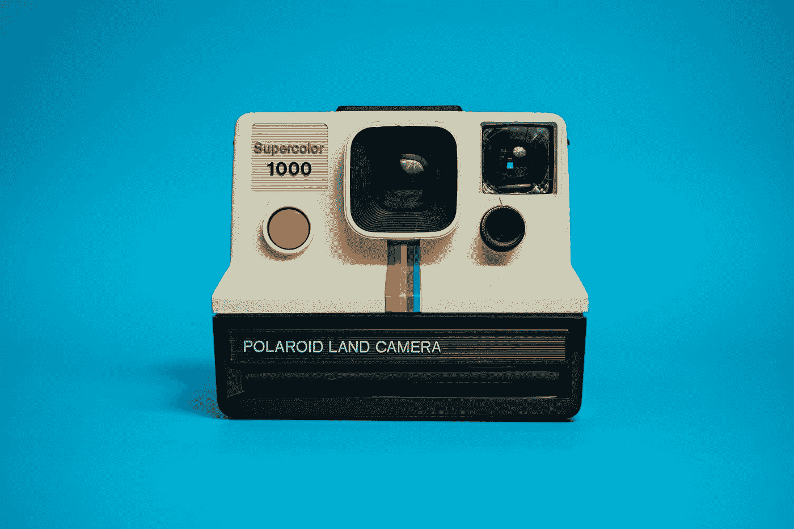
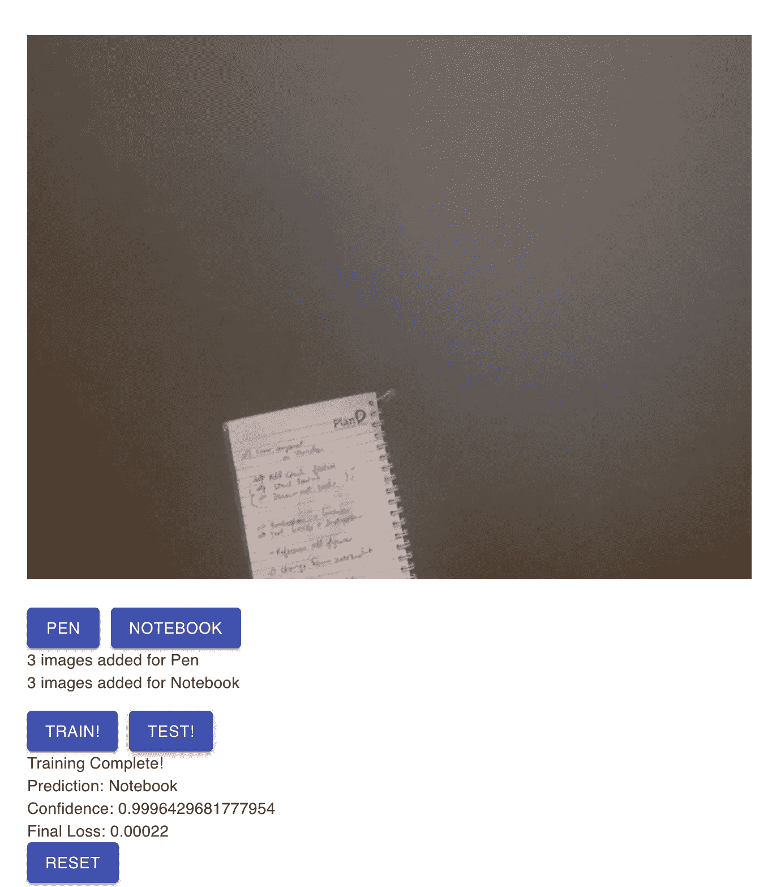

# 使用 React + ml5 进行图片分类

> 原文：<https://javascript.plainenglish.io/picture-classification-with-react-ml5-c45672aeb961?source=collection_archive---------6----------------------->

Photo by [Patrick](https://unsplash.com/@pf91_photography?utm_source=medium&utm_medium=referral) on [Unsplash](https://unsplash.com?utm_source=medium&utm_medium=referral)

在过去几年中，图像分类应用越来越受欢迎。自动驾驶汽车是图像分类如何用于现实世界应用的一个显著例子。另一个应用可以在脸书上看到。当你在脸书上传一张图片时，脸书的[DeepFace 算法](https://research.fb.com/publications/deepface-closing-the-gap-to-human-level-performance-in-face-verification/)会自动预测图片中出现的用户，并提供建议来标记在该图片中检测到的用户。

从头开始有效地训练图像分类模型需要资源，例如足够的计算能力、时间，以及最重要的是非常大的图像数据集。这些要求通常限制了学生或其他初学者轻松探索图像分类领域。

一个名为 [**ml5.js**](https://ml5js.org/) 的新高级库建立在 Tensorflow.js 之上，旨在使人们能够以更简单的方式玩图像分类。这个用户友好的库提供了对预训练图像分类模型的访问，这些模型可用于在诸如**转移学习**和**特征提取**等原则的帮助下构建定制模型。

在不涉及太多技术细节的情况下，让我们来讨论如何构建自己的基于图像分类的 web 应用程序。我们将构建一个 React 应用程序，用户可以使用他们的网络摄像头捕捉图片，使用这些图片来训练图像分类模型，然后立即测试它。

首先，建立一个 React 项目，导入 ml5 和 p5。

在一个新组件中，设置一个画布。这里，我们将使用 p5.js 构建一个网络摄像头组件，允许用户从他们的网络摄像头捕捉图片。然后，在 ml5 的帮助下，我们将把那些图片用于我们将要建立的图像分类模型。要了解有关特征提取和 MobileNet 的更多信息，请参考 ml5 的文档。

接下来，我们创建一个训练函数。单击我们界面上的按钮后，该组件将使用我们通过网络摄像头捕获的图像，开始训练我们的图像分类模型。

现在，让我们创建另一个允许用户测试他们的模型的函数。点击测试按钮后，网络摄像头将捕捉新图像，并将其发送到我们的图像分类模型进行测试。然后，我们将保存收到的结果。我们将得到一个预测的标签、置信度值和损失值。

将所有东西连同按钮放在一起后，我们将有一个类似这样的组件:

要克隆整个项目，请在此处参考 [**。**](https://github.com/nhammad/Picture-Classification-with-ml5)

如前所述，训练图像分类模型需要大量数据集。从图形用户界面的角度来看，用户使用网络摄像头捕捉成千上万的图像可能是不可行的。然而，由于 ml5 提供了一些功能，我们可以使用预先训练的图像分类模型，并在它们的基础上建立我们自己的模型，整个过程变得非常用户友好。这样，用户也可以用每个物体的 3 张图片来训练模型！

Ml5.js 是一个出色的库，可以用来向学生和其他非专家教授机器学习及其局限性。一个这样的项目是**面向非专家的机器学习**，在那里用户可以深入了解基本的机器学习概念，如过度拟合和欠拟合。您可以在这里进行测试(不支持移动设备):

 [## React 应用

### 使用 create-react-app 创建的网站

mlfornonexperts.netlify.app](https://mlfornonexperts.netlify.app/) 

*更多内容请看*[***plain English . io***](http://plainenglish.io)