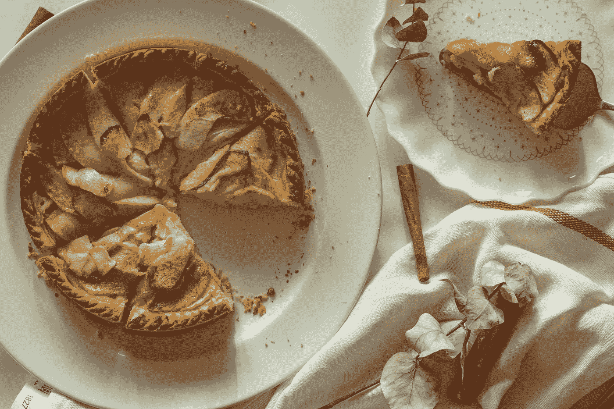
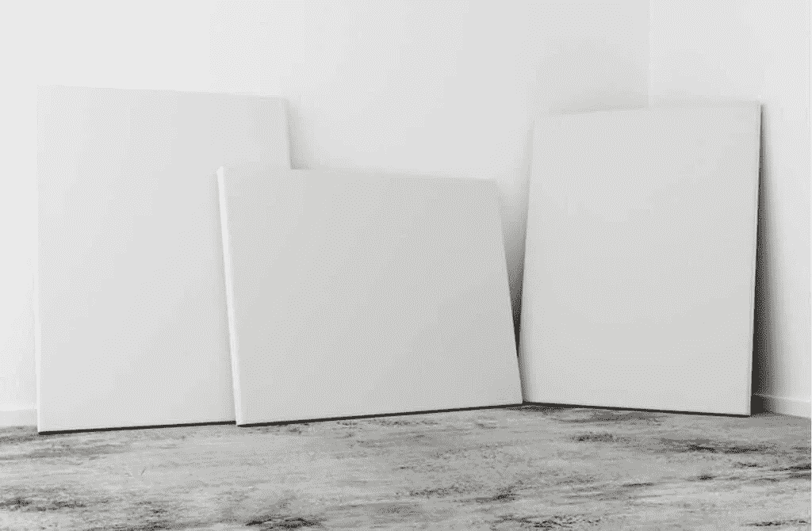
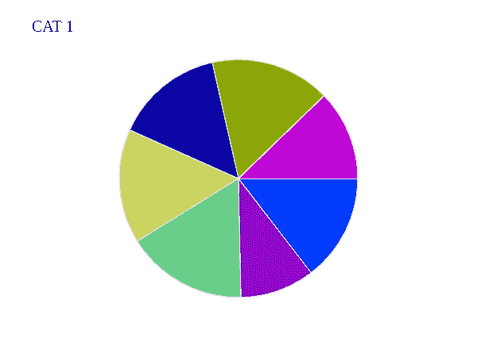

# 使用角度和 HTML 画布的饼图

> 原文：<https://javascript.plainenglish.io/pie-chart-using-angular-and-html-canvas-part-one-9164f4b09956?source=collection_archive---------24----------------------->

## 第 1 部分:如何创建可缩放的 HTML 画布饼图



> 饼图是数据展示中常见的图表。在本教程中，您将学习如何创建一个 HTML 画布饼图，您可以根据自己的喜好缩放！

让我们完全诚实地说，数据是好的，有很多东西要接受！是的，你不能通过简单地查看原始数据来理解数据。这就是为什么需要有呈现数据的方式和方法——最基本的方法之一是使用饼图。

数据表示最好使用图表，在本教程中，我们将学习如何从头开始创建饼图！是的，没错，我们将使用 Angular 来这样做，尽管你可以在其他框架中使用相同的逻辑，甚至是普通的 java 脚本。那么，事不宜迟，我们开始吧！

## 我们将使用什么

您可以想出许多现成的方法来创建饼图，但在这种情况下，我们将使用 HTML Canvas 来创建我们的饼图。

由于本教程将包含其他形式的图表，我们将使用创建饼图作为一个**库**，并简单地将其导入到更大的项目中。

最后，我们将使用一个理论案例研究，我们需要了解学生的总体成绩以及他们在每次考试中的表现。

## 定义数据


Defining the data.

我明白，我们并不都喜欢数据准备，但是相信我，最好是尽早准备数据并定义它，这样我们就能在脑海中想象出我们的饼状图会是什么样子。因此，既然我们正在做一个饼图角度教程，那么在这种情况下，我们将使用接口来定义数据的外观。因此，我们将有几个接口:

```
// IExam
export interface IExam {
    uuid: string;
    label: string;
    subjects: ISubject[];
}

// ISubject
export interface ISubject {
    name: string;
    unitCode: string;
    score: number;
    maxScore: number;
    percentage: number;
}

// IArc
export interface IArc {
    x: number;
    y: number;
    startAngle: number;
    endAngle: number;
    direction: boolean;
    color: string;
}
```

**注意:当然，你可以以最适合你的数据的方式自由地改变你的接口定义，但是在这样做的时候，记住在剩下的代码中改变你如何定义你的接口，以免你收到一个编译错误！**

## 准备画布

嗯，就像每个艺术家一样，我们需要一个地方来绘制我们的内容。因此，我们将定义一个画布，然后像这样将其标记为引用元素，这是因为它是一个饼图角度教程，否则，您可以使用另一种方法来引用您的画布元素。

现在，在组件上，我们将像这样获得被引用的 canvas 元素。

```
import { ElementRef, Input, OnInit, ViewChild } from '@angular/core';

// Code snippet

export class PieChartComponent implements OnInit {
  @Input() data: IExam[] = [];
  @Input() radius!: number;

  @ViewChild('canvasRef', {static: true})
  private _canvasRef!: ElementRef;

  // More code here
}
```

## 在画布上绘制之前，先对其进行一些样式设计



Styling the canvas a bit before drawing onto it.

现在画布已经准备好了，在我们开始创建饼图之前，我们需要确保画布已经准备好了，这样我们的饼图就可以舒服地放在上面。既然我们正在创建一个饼图角度教程，那么这意味着我们正在与组件。因此，一个组件基本上可以接受输入形式的配置，一个这样的输入，除了**数据**就是**半径**。这将是我们希望饼图具有的**半径**大小。

因此，我们将把它传递到我们的饼状图组件中，或者您可以使用任何其他方式与组件通信，但关键是，我们需要使我们的绘图区域变得更大**，其大小与所需饼状图的半径**相同。

```
// This method should be inside a component, this is just a snippet
private _styleCanvas(): void {
    this._canvasRef.nativeElement.width += this.radius;
    this._canvasRef.nativeElement.height += this.radius;
    this._canvasRect = this._canvasRef.nativeElement.getBoundingClientRect();
    this._renderer2.setStyle(this._canvasRef.nativeElement, 'background-color', this._canvasBackgroundFill);
}
```

请注意，我们这样做，而不是使用**渲染器 2** ，然后将宽度和高度设置为像素。这样做的原因是，将其设置为像素会使我们的渲染产生不希望的结果。所以最好是没有单位的值。

## 将原始数据转换成弧线

现在，下一个重要的部分是将数据转换成弧线，因为我们将使用 HTML Canvas arcs 来创建一个漂亮的 Angular 饼图。因此，正如你在上面的界面中看到的，我们需要做一些数据转换。这些是:

**计算考试可能的总分。**

在给定的时间，我们将查看给定检查的结果。因此，我们需要计算学生在那次考试中可能得到的最高分。为此，我们将使用以下方法:

```
// This method should be inside a component, this is just a snippet
private _calculateTotalPossibleScore(): void {
    this._totalPossibleScore = this._examBeingViewed.subjects.map(subject => subject.maxScore).reduce((prev, current) => {
        return prev + current;
    });
}
```

**计算主题百分比。**

现在，下一个重要的部分是将科目转换为总可能分数的百分比。嗯，这有点棘手，也不直截了当。所以，我们需要做的是:

```
// This method should be inside a component, this is just a snippet
private _calculateSubjectScoreAsPercentageOfTotal(): void {
    const studentTotalScore = this._examBeingViewed.subjects.map(subject => subject.score).reduce((prev, current) => {
        return prev + current;
    })
    const studentScoreOutOfTotal = studentTotalScore / this._totalPossibleScore;
    this.data.forEach(exam => {
        exam.subjects.forEach(subject => {
        subject.percentage = ((subject.score / this._totalPossibleScore) * 100) / studentScoreOutOfTotal;
        });
    });
}
```

所以，我们要做的第一件事是计算学生的总成绩，为考试做准备。接下来，我们找出学生的分数，占他们在考试中可能达到的总分数的比率。然后，我们将每个受试者的分数表示为总可能分数的百分比，然后除以他们的总分数与总可能分数的比率。

这将给出一个反映值，即学生在每个科目上的分数与总累积分数的比值。当然，你可以想出其他方法来表示一个分数相对于可能的总分数，但这是我们将在这个饼图角度教程中使用的。

**将主题转换成弧线。**

现在，下一步是将主题转换成弧线。这一点我们将使用下面的方法:

```
// This method should be inside a component, this is just a snippet
private _createArcsForSubject(): void {
    const circleCenterY: number = this._canvasRect.height / 2;
    const circleCenterX: number = this._canvasRect.width / 2;
    this._examBeingViewed.subjects.forEach((subject, index) => {
        let startAngle: number = 0;
        let arcDegree = (subject.percentage / 100) * 360;
        const lastArc = this._arcs.slice(-1)[0];
        if (lastArc) {
        startAngle = lastArc.endAngle;
        arcDegree = lastArc.endAngle + arcDegree;
        }
        this._arcs.push({
        y: circleCenterY,
        x: circleCenterX,
        startAngle: startAngle,
        endAngle: arcDegree,
        direction: false,
        color: this._arcColors[index]
        })
    })
}
```

为了解释，每个弧都需要一个参考点来开始绘制。这就是为什么我们在 X 轴**和 Y 轴**都使用画布的中心。现在，对于每个主题，我们将计算起始角度和终止角度。

因此，对于第一个主题，startAngle 为 0，那么 endAngle 将是主题在饼图上显示时的大小，我们通过 **subject.percentage * 360** 来实现，我们称之为 arcDegree。

现在，对于除了第一个对象之外的每个对象，起始角度将是添加到我们的弧列表中的最后一个弧的终止角度。至于 endAngle，这将是最后一个弧的 endAngle 加上这个对象的 arcDegree。

之后，我们继续设置方向(顺时针或逆时针)和颜色——这两个只是为了让事情变得更好，你可以自由地与它们互动，并根据你的需要改变它们。

## 绘制画布

现在，是时候让我们的代码在画布上做一些绘制了。这里，我们将使用下面的代码:

```
// This method should be inside a component, this is just a snippet
private _renderContentOnCanvas(): void {
    const ctx = this._canvasRef.nativeElement.getContext('2d');
    this._arcs.forEach((arc, index) => {
        if (ctx) {
        const startRad = (arc.startAngle / 180) * Math.PI;
        const endRad = (arc.endAngle / 180) * Math.PI;
        ctx.beginPath();
        ctx.moveTo(arc.x, arc.y);
        ctx.arc(arc.x, arc.y, this.radius / 2, startRad, endRad);
        ctx.fillStyle = arc.color;
        ctx.strokeStyle = this._canvasBackgroundFill;
        ctx.lineWidth = 10 / this._examBeingViewed.subjects.length;
        ctx.fill();
        ctx.stroke();
        }
    });
    if (ctx) {
        ctx.font = '20px Snippet';
        ctx.fillStyle = '#000000';
        ctx.fillText(this._examBeingViewed.label, 40, 40)
    }
}
```

我们要做的第一件事是首先掌握画布的上下文。由于我们正在做一个饼图角度二维饼图，我们将使用**‘2d’**上下文。之后，我们将继续渲染画布上的每个弧线**一个接一个**。重要的是注意到**一个接一个的**强调。这是因为画布绘制是如何发生的。

因此，在循环中，我们将首先计算每个主题的度数的弧度表示，然后将它们存储为 startRad 和 endRad。之后，我们现在做 **ctx.beginPath()** ，这实际上是真实的交易，你可以试着注释掉它，看看会发生什么。

beginPath()要做的是发出正在绘制的前一条路径的闭包，然后发出正在绘制的另一条路径的开始信号！这是一个非常重要的概念，相信我，它几乎抓住了我！

之后，我们将执行 **ctx.moveTo()** ，指定我们想要从哪里绘制弧线，注意，这意味着对于每个弧线，一旦我们发出我们想要 beginPath()，我们将从 moveTo()位置开始。

然后我们现在将绘制我们的弧 **ctx.arc(cx，cy，radius / 2，startInRadian，endInRadian)** 这将绘制我们的弧。但是你可能想知道为什么 **radius / 2** ，这是因为我们希望我们的饼状图适合我们的 HTML 画布！现在你差不多完成了。

现在，接下来的步骤非常简单:

*   CTX . fill style = arc . color-设置用于填充此弧线的填充颜色。
*   ctx.strokeStyle = this。_canvasBackgroundFill —设置您想要的笔触样式，我们将使用与画布背景相似的样式。
*   ctx.lineWidth = 10 / this。_ exam being viewered . subjects . length-设置在画布上绘制的线条的粗细。
*   CTX . fill()-现在填充绘制的圆弧。
*   CTX . stroke()-删除弧线。

**需要注意的是，我们正在为每个绘制的弧配置上下文。这是因为一个上下文将使用它拥有的最后一个配置**。记住这一点，你就会明白我们为什么要这样做。

```
// This method should be inside a component, this is just a snippet
if (ctx) {
    ctx.font = '20px Snippet';
    ctx.fillStyle = '#000000';
    ctx.fillText(this._examBeingViewed.label, 40, 40)
}
```

在我们在画布上写东西之前，上面的代码将设置我们希望 ctx 拥有的样式。如果我们不这样做，那么 fillStyle 之类的东西将采用应用于上下文的最后一个 fillStyle。

所以，是时候看看结果了… ***鼓卷！！！！***

## 结论



Conclusion

最后，在本教程中，您已经学习了如何创建角度饼图。您可以通过该链接找到该代码的链接:[***【https://github.com/benwainaina/charts】***。](https://github.com/benwainaina/charts.)您可以随意尝试代码并与之交互。

记住要注意教程的下一部分，我们将对饼图进行样式化，使其具有标签并接受更多的数据！

***快乐编码！***

> 你有兴趣学习**角度**？在我的网站上查看类似的精彩文章:[疯狂代码>有角度](https://bingeoncode.com/category/angular)