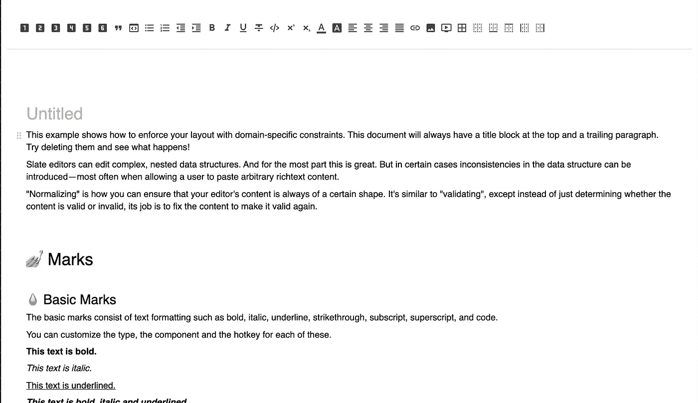

# Plate 革新了 React 中的富文本编辑器

> 原文：<https://javascript.plainenglish.io/plate-revolutionizes-rich-text-editors-in-react-1dbfdb74546b?source=collection_archive---------7----------------------->

## Plate 让每个 web 开发人员都可以轻松地免费构建定制的富文本编辑器。


Photo by [ThisisEngineering RAEng](https://unsplash.com/@thisisengineering?utm_source=medium&utm_medium=referral) on [Unsplash](https://unsplash.com?utm_source=medium&utm_medium=referral)


如果您正在 React 中构建一个富文本编辑器，您可能会发现从头构建很困难。免费和开源的库总是有限的。 [Plate](https://plate.udecode.io/) 和它的底层框架 [Slate](https://docs.slatejs.org/) ，通过让每个 web 开发人员都可以轻松地免费构建定制的富文本编辑器，正在彻底改变这个行业。你可以在这里阅读更多关于旧图书馆的限制。如果您没有时间阅读整篇文章，您可以在下面的全功能编辑器中查看 Plate 的强大功能(感谢 [udecode](https://github.com/udecode) 为构建该编辑器所做的工作):



# 石板

[**Slate**](https://docs.slatejs.org/) 是 ReactJS 的一个开源编辑器框架，使得构建完全自定义的编辑器成为可能。Slate 既是模块化的，也是声明性的。编辑器中的每个元素都以与 react 功能组件相同的方式呈现:

```
// Define a React component renderer for our code blocks.
const CodeElement = props => {
  return (
    <pre {...props.attributes}>
      <code>{props.children}</code>
    </pre>
  )
}
```

使用 Slate，您可以为 Shopify、WordPress、Squarespace 等应用程序构建从基本文本编辑器到交互式编辑器的一切。Slate 将编辑器值表示为嵌套对象，类似于 react 表示其虚拟 DOM 的方式。例如，基本的场记板编辑器值如下所示:

```
 const [value, setValue] = useState([
    {
      type: 'paragraph',
      children: [{ text: 'A line of text in a paragraph.' }],
    },
  ])
```

这使得将 slate 值作为 JSON 持久存储在数据库中变得容易，也使得将 slate 值序列化为 HTML 变得容易。

# 盘子

[**Plate**](https://plate.udecode.io/) (插件— slate)填补了 slate 中缺失的空白，同时又不牺牲可定制性。Slate 本身的主要问题是它太简单了，以至于缺少一些您在时间敏感的项目中可能需要的默认功能。

Plate 附带了许多有用的 API，因此您可以在几分钟内构建一个完整的编辑器。它有默认元素、序列化程序和工具栏控件。Plate 甚至有更复杂的功能，比如拖放和画布插图。Plate 中有如此多有用的工具，以至于我还没有时间全部尝试。正如你在下面的沙盒例子中看到的，你可以用几百行代码构建一个与非常成功的博客应用程序不相上下的编辑器。

Plate 为您提供了大量有用的 API，而没有牺牲 Slate 的任何可定制性。例如，将`target: "_blank"`添加到一个链接的道具是如此简单:

```
createLinkPlugin({
  serializeHtml: withProps(LinkElement, { target: "_blank" })
})
```

选择你想要的默认功能很容易，因为一切都是插件。例如，将插件列表传递给编辑器将只包含您选择的功能:

```
const plugins = [
    // elements
    createParagraphPlugin(),      // paragraph element
    createBlockquotePlugin(),     // blockquote element
    createCodeBlockPlugin(),      // code block element
    createHeadingPlugin(),        // heading elements

    // marks
    createBoldPlugin(),           // bold mark
    createItalicPlugin(),         // italic mark
    createUnderlinePlugin(),      // underline mark
    createStrikethroughPlugin(),  // strikethrough mark
    createCodePlugin(),           // code mark
  ];
```

Plate 的内置插件允许大量定制，但除此之外，Plate 甚至有自己的 API`createPluginFactory`，用于创建完全定制的元素和标记，而不用担心 Plate 的内部。例如，以下是在编辑器中创建自定义段落的方法:

```
const createParagraphPlugin = createPluginFactory<HotkeyPlugin>({
  key: ELEMENT_PARAGRAPH,
  isElement: true,
  component: ParagraphElement,
  handlers: {
    onKeyDown: onKeyDownToggleElement,
  },
  options: {
    hotkey: ['mod+opt+0', 'mod+shift+0'],
  },
})
```

或者，如果您想要自定义文本对齐功能:

```
// Example
const createAlignPlugin = createPluginFactory({
  key: KEY_ALIGN,

  // Note that we're using `then` to access to the editor.
  then: (editor) => ({
    inject: {
      props: {
        nodeKey: KEY_ALIGN,
        defaultNodeValue: 'left',
        styleKey: 'textAlign',
        validNodeValues: ['left', 'center', 'right', 'justify'],
        validTypes: [getPluginType(editor, ELEMENT_DEFAULT)],
      },
    },
  }),
});
```

盘子是两全其美的。您可以在几分钟内从沙盒中创建一个全功能的文本编辑器，然后定制一切以适应您的用例。对开发者来说是梦想成真。点击查看板块文件[。](https://plate.udecode.io/docs/installation)

感谢您的阅读。

*更多内容看* [*说白了。在这里注册我们的*](http://plainenglish.io/) [*免费周报*](http://newsletter.plainenglish.io/) *。*