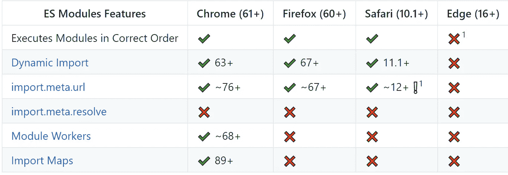

# 什么是 Polyfills？

> 原文：<https://javascript.plainenglish.io/polyfills-what-the-hell-are-they-596baaab4a0e?source=collection_archive---------16----------------------->

## 您如何创建 Polyfill？


Photo by [Deepanker Verma](https://www.pexels.com/@deepanker70) on [Pexels](https://www.pexels.com/photo/black-google-smartphone-on-box-1482061/)

# 介绍

当建立一个网站时，确保它在所有主要浏览器上一致工作是很重要的。毕竟，每个浏览器在它提供的开发功能上都是独一无二的。

例如，查看以下图表:



Diagram by [guybedford](https://github.com/guybedford) on [Github](https://github.com/guybedford/es-module-shims)

上图列出了 ECMAScript 模块的特性及其对 Chrome、火狐、Safari 和 Edge 的支持。请注意，有些浏览器支持某些功能，而有些浏览器不支持。例如，如果导入地图是你的应用程序中的一个关键组件，你的应用程序会在除了 Chrome 之外的所有浏览器中崩溃。

**这是聚合填料进入的地方。**

# 什么是聚合填料/聚合填充？

举个例子，假设`fetch`不是所有的浏览器都支持，我们经常在我们的应用程序中使用它。

```
/* 
Let's say that Chrome supported the fetch api, but Firefox didn't.
*/
fetch('https://BACKEND/ROUTE').then((response) => {
   console.log("Got Response");
 });
```

结果，我们的应用程序会在火狐中崩溃。为了弥补这一点，我们可以为不支持它的浏览器创建自己的`fetch`实现，并将其设置为`window.fetch`(获取聚合池的[示例](https://github.com/github/fetch))。这就是聚合填充。

**如果某个特性在某个环境中不存在，我们可以用我们的实现来修补它。**

Polyfills 使我们能够使用相同的代码库支持多种环境。虽然我们需要实现 polyfill，但从长远来看，创建 polyfill 比为每个浏览器/环境维护单独的应用程序版本更快、更容易。

# 制作泡沫塑料

让我们用普通的 JavaScript 实现一个用于网络的`Array.prototype.forEach`poly fill。

```
let fruits = ["Strawberry", "Melon", "Orange"];// super convienent way of iterating through a collection
fruits.forEach((fruit) => {
    console.log("I ate", fruit);
});
```

让我们把它分成两个步骤:

*   对 Polyfill 进行编码
*   导入 Polyfill

## 对 Polyfill 进行编码

首先，我们来看看当前的浏览器是否支持`Array.prototype.forEach`。

```
const isForEachSupported = !Array.prototype.forEach;
```

如果支持`.forEach`，我们就让本机实现保持原样吧。如果它不被支持，那么我们需要添加我们的定制实现。

让我们将`Array.prototype.forEach`绑定到我们的实现中。

*免责声明:为简洁起见，我省略了*`thisArg`*`Array.prototype.forEach`*。**

*我们现在可以用自己的实现来支持没有`Array.prototype.forEach`的浏览器。*

## *导入 Polyfill*

*为了完成它，我们需要在我们的 HTML 文件中导入 polyfill。polyfill 文件必须在任何使用`Array.prototype.forEach`的文件或脚本标签之前。假设以下是我们的初始 HTML 文件:*

*而上面的 polyfill 是在`forEachPolyfill.js`。*

***恭喜恭喜！你写了你的第一封聚合邮件！**然而，并非所有的聚合填充都以相同的方式完成，也不具有相同的难度。例如，看看这些 [ES6 承诺](https://github.com/taylorhakes/promise-polyfill)和[获取](https://github.com/github/fetch)的聚合填充。*

*总而言之，聚合填充包括修补环境中不支持的功能，以提供更好的向后兼容性和可用性。在本文中，我们只是尝试了一下 Polyfills，如果您想深入了解，请查看 [Github Polyfills](https://github.com/search?utf8=%E2%9C%93&q=polyfill&type=) 。*

***说完，感谢阅读！***

**更多内容请看*[***plain English . io***](https://plainenglish.io/)*