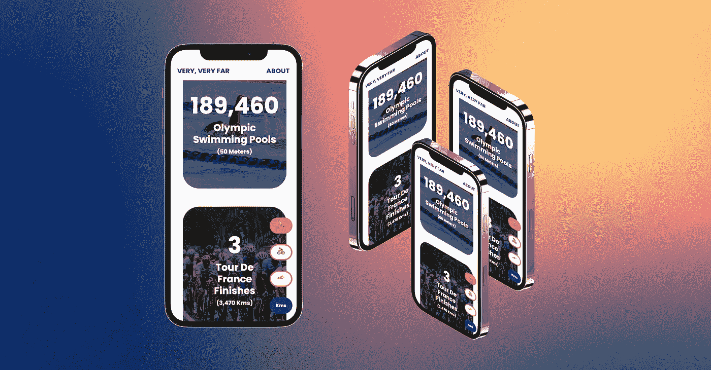

# 我如何使用 Strava 构建一个 React Web 应用程序来跟踪用户的健身情况

> 原文：<https://javascript.plainenglish.io/portfolio-project-very-very-far-f77d1241a626?source=collection_archive---------7----------------------->

*一款移动优先的 React web 应用程序，可与用户的 Strava 帐户连接，以独特的方式检查他们跑步、骑自行车和游泳的总距离。*

你穿越美国了吗？整个地球呢？你离月球有多近？


今年三月，我建造了[非常非常远的](https://veryveryfar.vercel.app/)。它检查了用户在流行的体育社交媒体平台 Strava 上的活动，并以独特的方式进行比较。


一旦用户使用他们的 Strava 帐户登录，他们可以选择并组合他们的**跑步**、**骑行**和**游泳**总数，以查看这些总数如何使用右侧的选择栏与不同的有趣距离进行比较。



用户还可以根据自己的喜好将单位从**公制(公里)**切换到**英制** **(英里)**。

## 这个概念

> 我们花了这么多时间在移动，但实际上我们走了多远？

作为一名终身跑步者，我对 Strava 非常熟悉。这是我见过的所有跑步者中最受欢迎的社交媒体平台。我刚刚完成了[一个使用公共 Web API 的项目](https://jackdunleavy.medium.com/portfolio-project-spotify-mood-ring-dba09b6da1e0)，我很兴奋地发现 Strava 有了自己的。文档看起来很棒，我知道我想用它创造一些东西。

我知道的一件事是跑步者喜欢数据。是 Strava 存在的理由！耐力运动员喜欢看到他们的活动被分解成速度、劈腿、心率、卡路里、最大摄氧量等。这是这个项目背后的中心思想。用户已经完成了所有这些工作，让我们向他们展示这一切是如何累积起来的！

## 技术

这个项目的完整资源库可以在 GitHub [这里](https://github.com/dunleavyjack/Strava-Very-Very-Far)获得，为了构建它，我使用了:

*   **做出反应**
*   **反应路由器**
*   **Redux**
*   **Axios** (针对 Strava API 的请求)
*   **OAuth2 授权**
*   **自举 5**
*   **图马**(用于设计 UI)
*   **Vercel** (用于托管和部署)

## 用户界面注意事项

斯特拉发明显是橙色的。这是他们的特征之一，也是我想融入这个项目的东西。我不想看起来像 Strava，但是我想提醒用户他们的信息来自哪里。

由于这个项目的重点是呈现数据，我喜欢一个简单的，有点几何图形用户界面的想法。我还选择了靛蓝色来搭配 Strava 标志性的橙色，同时也给我的项目带来了自己的感觉。

## 状态管理

在整个应用程序中，我使用 Redux store 处理状态。我了解到较小的项目并不总是需要一个，但我想得到一些使用该技术的实践。

我需要跟踪的第一件事是用户喜欢什么单位。我还需要知道用户选择了什么运动。下面是默认状态的一个简短选择:

```
 metric: true,
 sports: ['running'],
 totalDistance: 16639
```

为了简单起见，我使用了一个布尔值在公制和英制之间切换，并使用一个数组来表示所选择的运动。我使用`‘running’`作为默认值，这样用户一登录就会看到一些数据，使用`metric`是因为我目前住在韩国。

将代表用户选择的所有活动的总数的`totalDistance`放入商店也使得在应用程序需要计算时调用该值变得更容易。

接下来，我需要存储用户基于运动的运动总量:

```
 userActivities: {
    runTotal: {
      kms: '9473.53',
      miles: '5886.58',
      count: 816
    },
    rideTotal: {
      kms: '7166.34',
      miles: '4452.95',
      count: 286
    },
    swimTotal: {
      kms: '1.57',
      miles: '0.98',
      count: 2
    }
  }
```

由于来自 Strava API 的数据是以米为单位给出的，所以我创建了一个简单的函数将其转换成公里和英里。这样，我只需运行一次转换计算，然后简单地切换两个值。

接下来，我为每个动作设置了动作创建者和减少者。下面是一个我用来**添加**和**从用户选择中删除**运动的减速器的例子:

```
const setSportsReducer = (sports = [], action) => { switch (action.type) { case "ADD_SPORT": return [...sports, action.payload]; case "REMOVE_SPORT": return sports.filter((unit) => unit !== action.payload); default: return sports; }};
```

我还为每个动作设置了类似的减速器，并安装了 [Chrome Redux DevTools 扩展](https://chrome.google.com/webstore/detail/redux-devtools/lmhkpmbekcpmknklioeibfkpmmfibljd?hl=en)来可视化整个过程中的一切。

## 挑战和解决方案

**选择栏放在哪里？**

最初，我在底部有选择栏，但我不确定我是否喜欢它。我得到了一些非常友好、有用的建议，可以把它移到屏幕的右边，我很高兴我听了。

**Strava OAuth2 登录**

Strava API 功能强大且组织良好，但他们的 JavaScript 文档有时有点难以理解。使用它的项目也比我预期的要少，除了 Strava 的一些稍微模糊的指导，我找不到设置登录的教程或指南。

所以，我想通了，写了一个[教程](https://levelup.gitconnected.com/add-strava-oauth2-login-to-your-react-app-in-15-minutes-6c92e845919e)来节省别人一些时间。这是由 **Javascript 用简单英语**在 Medium 上发布的，希望它能帮到一些人。

**mapStateToProps→use selector()**

在这个项目的第一稿中，我只能以我所学的唯一方式访问 Redux 商店，每次我需要商店里的东西时都使用`connect`和`mapStateToProps`。我以为这是唯一的办法！

直到我在网上发布了这个项目，才有人指出了非常有用的`useSelector()`和`useDispath()`挂钩。它干净多了，所以我回去重构了所有访问状态的东西。改变已经运行良好的东西有点让人头疼，但是我真的很高兴我这么做了。

## 总而言之

在这个项目中，我学到了很多关于 Redux 的知识，使用 OAuth2 授权和来自外部 API 的错误处理请求也是一次很好的体验。

我也很开心地和朋友们分享了这个，听到他们的反馈和建议真是太棒了。

我对下一个项目感到兴奋！

*更多内容请看*[*plain English . io*](http://plainenglish.io/)