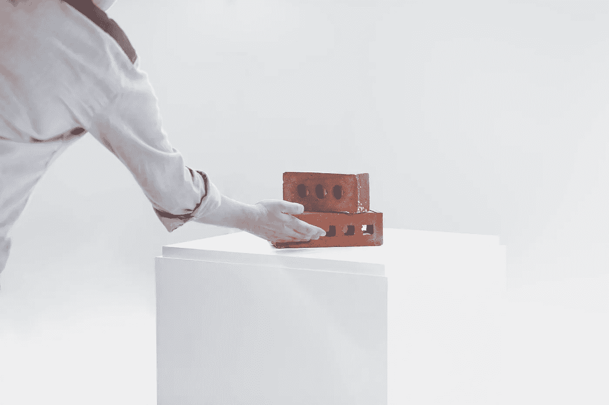
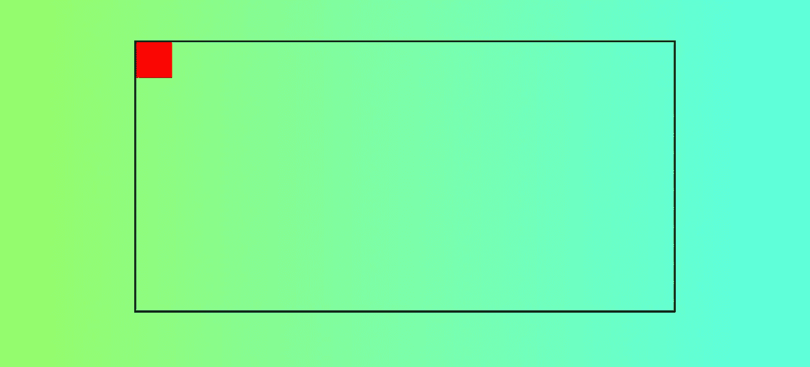
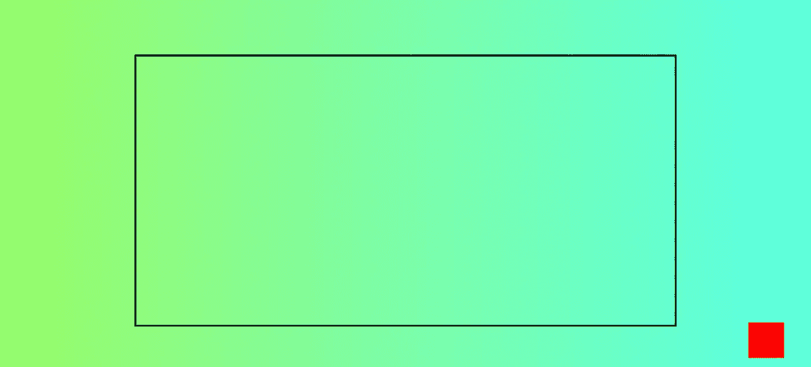
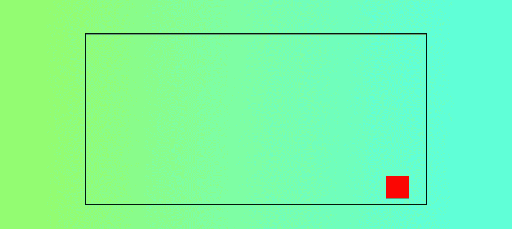

# CSS 中的绝对和相对位置——最简单的指南

> 原文：<https://javascript.plainenglish.io/position-absolute-and-relative-in-css-the-simplest-guide-32f47312d4ae?source=collection_archive---------10----------------------->

## 看起来很难的简单属性。

Photo by [Brands&People](https://unsplash.com/@brandsandpeople?utm_source=unsplash&utm_medium=referral&utm_content=creditCopyText) on [Unsplash](https://unsplash.com/s/photos/adjustment?utm_source=unsplash&utm_medium=referral&utm_content=creditCopyText)

我记得我开始前端旅程的时候。

CSS 引起了很多令人头疼的问题。像大多数人一样，我认为这很容易。然后，当我不能让它工作时，我很恼火。

我通常的流程是:

1.  发现问题。
2.  谷歌一下。
3.  在 StackOverflow 上找到解决方案。
4.  C/P 它没有任何理解。

绝对位置和相对位置是我经常遇到的属性。*“他们到底是什么？”我以前很好奇。*

它们的使用频率应该远低于你可能使用它们的频率，如果使用得当，它们是非常简单的。

让我们更深入地探讨这个话题。

# 绝对位置和相对位置有什么关系？

通常，所有元素都遵循 DOM 流。

但是有时候，你需要打破这种流动，告诉一个元素确切的位置。

假设我有这个 HTML 页面:

代码非常简单:

HTML

CSS

我想立刻确定我的`absolute-item`的位置，并告诉它确切的位置。我希望它总是在`bordered-container`里面；`10px`远离底部，`30px`远离右侧。

让我们添加代码:

Absolute Item CSS

结果是:

很明显，这不是我们想要的。正方形的位置`10px` / `30px`远离整个文档的边缘，而不是`bordered-container`！

这就是为什么我们需要`position: relative;`。

# 这不是黑魔法

每当您将`position: absolute;`设置为一个元素时，它必须相对于来定位**。**

你的绝对元素将寻找与`position: relative;`最近的父元素，并相对于它定位自己。

如果没有这样的元素，它将相对于`body`元素定位。这发生在我们之前的案例中。

要解决这个问题，我们只需将`position: relative;`添加到我们的`bordered-container`中:

Bordered Container CSS

结果是:

Absolutely Positioned Item!

是的，就这么简单。

# Z-Index 到底是什么？

在处理绝对头寸时，您可能会在`z-index`上遇到，因此值得一提。

我敢肯定你已经试着把它设置到`9999`了，但还是没用。

当有多个绝对位置元素时，使用`z-index`。

具有最大`z-index`的**绝对定位**元素将位于顶部。最低的那个，在底部。

就是这样。

让我们保持简单。

# 绝对位置的缺点

绝对定位的元素会中断 DOM 流。

它们不占用文档的任何物理空间。

这意味着上面/下面的元素可能会与重叠，即使你不想要它。

这可能变得难以维护。

我们的元素应该是孤立的，如果我们改变了其中的一个，我们不想调整其他的一切。

那不代表`position: absolute;`不好！这意味着它有自己的用例，你需要了解它们。

# 何时使用它

如果你需要调整一个页面或组件的布局，你应该在 99%的情况下避免使用`position: absolute;`。选择加入 Flexbox 或 Grid。

但是，如果你想给自己的形象加上一个徽章，那就再合适不过了。你总是希望徽章在图像的顶部(或边缘)，这样它看起来就像是图像的一部分。

或者如果您想要将一些图像/元素堆叠在一起。除了`position: absolute;`没有别的办法。

这就是终极指南:**只有在没有其他方法可以实现绝对定位时，才使用绝对定位。**

# **结论**

绝对定位是强大的，没有它，网页就不会有这样的外观。

如果使用得当，这是一种魅力。

但是这些用例非常少见。如果你经常使用它，你会让你的应用程序变得难以维护。

如果你找到一个带`position: absolute;`的 StackOverflow 答案，尽量跳过。继续找。还有其他方法吗？

如果是这样，就避开`absolute`。

*更多内容请看*[***plain English . io***](http://plainenglish.io/)