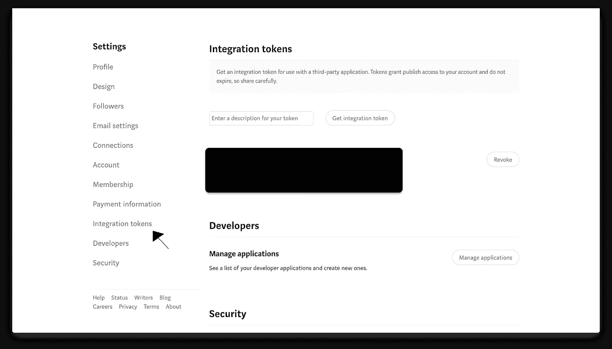
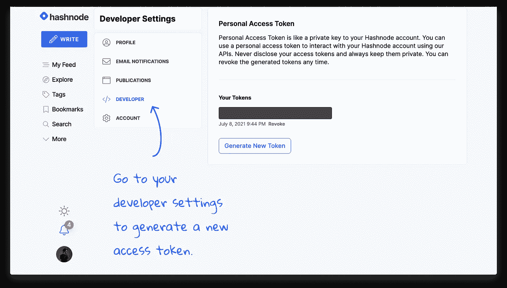
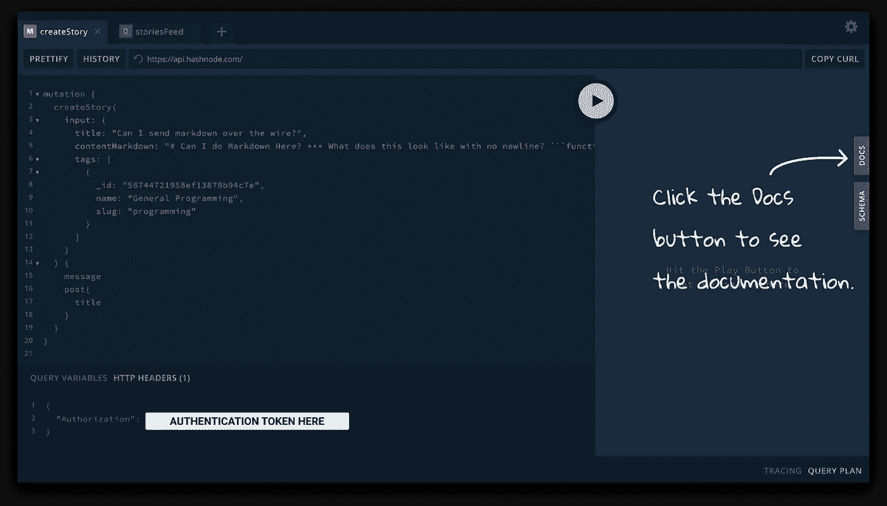
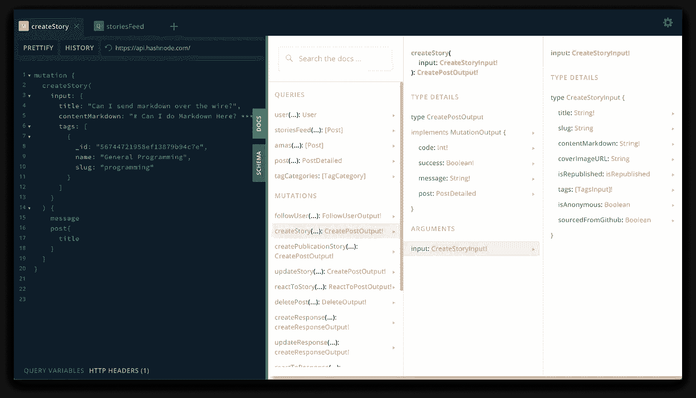

# 使用它们的 API 发布到 Dev、Hashnode 和 Medium

> 原文：<https://javascript.plainenglish.io/post-to-dev-hashnode-and-medium-using-their-apis-61b6df99bd07?source=collection_archive---------27----------------------->


> 本文的目标是帮助您连接到这些站点的每个 API，以便以编程方式发布、更新和享受这些服务。

为我的个人博客写一个 markdown 文件，然后复制粘贴到其他博客平台上并不太难…除非我需要编辑一些东西。一个简单的类型更改需要我加载四个不同的站点，在它们大不相同的 UI 中导航，以便进行简单的更改。

> 这很快就过时了。

我们是开发者。将这些重复性的任务自动化会更有趣，也更有益。

## 中等 API

> 文档—[https://github.com/Medium/medium-api-docs](https://github.com/Medium/medium-api-docs)

## 获取身份验证令牌

1.  登录到媒体
2.  导航到集成令牌
3.  输入令牌的描述，然后单击“获取集成令牌”按钮



*Medium’s integration token panel*

这将生成一个令牌，该令牌将包含在对介质的 API 的请求中。

## 获取已验证用户的详细信息

Medium 提供端点`GET https://api.medium.com/v1/me`来获取经过身份验证的用户数据。

下面是一个使用 NodeJS 的请求示例:

```
fetch('https://api.medium.com/v1/me', {
  method: 'GET',
  headers: {
    'Content-Type': 'application/json',
    Authorization: 'Bearer <AUTHENTICATION TOKEN HERE>',
  },
})
  .then(res => res.json())
  .then(res => console.log(JSON.stringify(res)))
```

从这个端点返回的数据中有一个`id`。您将希望保存这个 ID 值，因为使用 NodeJS 创建一个中型文章将需要它。

## 以编程方式创建中等文章

现在我们有了认证令牌和 ID，我们可以使用端点`POST https://api.medium.com/v1/users/{{authorId}}/posts`。上面发布的文档详细介绍了需要和/或可用的参数。

此端点接受 markdown 或 HTML。您需要明确地将`contentFormat`字段设置为`markdown`或`html`。

下面是一个使用 NodeJS 的请求示例:

```
fetch('https://api.medium.com/v1/users/<USER-ID>/posts', {
  method: 'POST',
  headers: {
    'Content-Type': 'application/json',
    Authorization: 'Bearer <REPLACE WITH TOKEN GENERATED ABOVE>',
  },
  body: JSON.stringify({
    title: 'Liverpool FC',
    contentFormat: 'markdown',
    content: '# You can put Markdown here.\n***\nSee what it looks like?',
    canonicalUrl: 'http://jamietalbot.com/posts/liverpool-fc',
    tags: ['football', 'sport', 'Liverpool'],
    publishStatus: 'public',
  }),
})
  .then(res => res.json())
  .then(res => console.log(JSON.stringify(res)))
```

如果这返回了 201 状态码，你现在应该可以在[Medium.com](https://medium.com)上看到你的帖子了

## 可用端点:

以下是可用端点的列表:

**获取认证用户的详细信息:**

`GET [https://api.medium.com/v1/me](https://api.medium.com/v1/me)`

**列出用户的出版物:**

`GET [https://api.medium.com/v1/users/{{userId}}/publications](https://api.medium.com/v1/users/{{userId}}/publications)`

**获取出版物的投稿人:**

`GET [https://api.medium.com/v1/publications/{{publicationId}}/contributors](https://api.medium.com/v1/publications/{{publicationId}}/contributors)`

**创建帖子:**

`POST [https://api.medium.com/v1/users/{{authorId}}/posts](https://api.medium.com/v1/users/{{authorId}}/posts)`

**在出版物下创建文章:**

`POST [https://api.medium.com/v1/publications/{{publicationId}}/posts](https://api.medium.com/v1/publications/{{publicationId}}/posts)`

**上传图像:**

`POST [https://api.medium.com/v1/images](https://api.medium.com/v1/images)`

不幸的是，Medium 的公共 API 相当有限。我们可以创建和获取帖子，但是还没有以编程方式编辑它们的能力。我希望这最终会改变，给程序员更好的工具来使用它们，

## API 开发

> 文档—[https://docs.forem.com/api/](https://docs.forem.com/api/)

## 获取身份验证令牌

这将需要一个开发人员帐户。导航到他们的[文档](https://docs.forem.com/api/#section/Authentication)并按照说明获取认证令牌。

## 使用他们的 API 创建 dev.to 文章

他们的文档远比 Medium 的公共 API 广泛。他们关于这个端点的文档在这里是。如果您单击文章下拉箭头，您可以看到他们接受的所有参数。你可以

## 使用 Node.js 的请求示例:

```
fetch('https://dev.to/api/articles', {
  method: 'POST',
  headers: {
    'Content-Type': 'application/json',
    'api-key': '<AUTHENTICATION TOKEN HERE>',
  },
  body: JSON.stringify({
    article: {
      title: 'Hello, World!',
      published: true,
      content: '# You can put Markdown here.\n***\n',
      tags: ['discuss', 'help'],
      series: 'Hello series',
    },
  }),
})
  .then(res => res.json())
  .then(res => console.log(JSON.stringify(res)))
```

## 哈希节点 API

> 文档—[https://api.hashnode.com/](https://api.hashnode.com/)

Hashnode 的 API 是一个 GraphQL API，不同于我们为 Medium 和 dev.to 使用的 REST APIs。

他们在他们的[博客](https://engineering.hashnode.com/)中有一些讨论他们公共 API 的博客帖子，但它们是在 2019 年发布的，所以文章中讨论的一些东西已经被否决，如`GLOBAL`和`FOR_ME` FeedType。如果您想更好地理解这些内容，请阅读它们，但是请记住，许多参数已经被否决了。

## 获取身份验证令牌

您可以从 Hashnode 设置中创建/撤销它们。登录您的帐户，转到开发者设置并生成一个新的令牌。



*Generate Hashnode Auth Token*

## 证明文件

我发现真相的来源就在他们的 [GraphQL 操场](https://api.hashnode.com/)里。您需要在他们的操场周围单击，以查看哪些端点可用以及预期的输入。



*Hashnode’s GraphQL Api Playground*



*Hashnode Documentation Navigation*

## 使用 Node.js 的请求示例:

```
fetch('https://api.hashnode.com', {
  method: 'POST',
  headers: {
    'Content-Type': 'application/json',
    Authorization: '<AUTHENTICATION TOKEN HERE>',
  },
  body: JSON.stringify({
    query:
      'mutation createStory($input: CreateStoryInput!){ createStory(input: $input){ code success message } }',
    variables: {
      input: {
        title: 'What are the e2e testing libraries you use ?',
        contentMarkdown: '# You can put Markdown here.\n***\n',
        tags: [
          {
            _id: '56744723958ef13879b9549b',
            slug: 'testing',
            name: 'Testing',
          },
        ],
        coverImageURL:
          'https://codybontecou.com/images/header-meta-component.png',
      },
    },
  }),
})
  .then(res => res.json())
  .then(res => console.log(JSON.stringify(res)))
```

## 结论

既然我们可以通过编程向这三个站点发布内容，我们就可以构建一个允许动态输入的应用程序，比如一个文件阅读器将一个`.md`文件传递给请求`content`和`contentMarkdown`参数，编辑帖子，以及其他许多事情。我们

保持警惕。我计划花些时间为开发博客们建立一个界面，这样就能做到这一点。在四个不同的网站上手动编辑每个帖子中的相同文本并不有趣。我希望解决那个问题。

祝你好运！

通过 Twitter [@codybontecou](https://twitter.com/CodyBontecou) 让我知道你对这篇文章的看法

*更多内容看* [***说白了就是 io***](http://plainenglish.io/) ***。*** *报名参加我们的* [***免费每周简讯点击这里***](http://newsletter.plainenglish.io/) ***。***