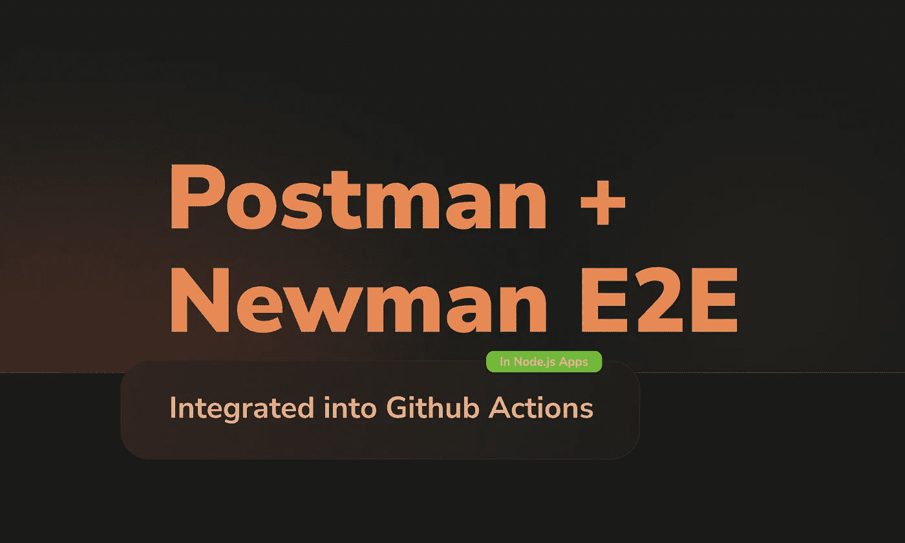

# 邮差 E2E 测试与纽曼集成到 GitHub 行动管道

> 原文：<https://javascript.plainenglish.io/postman-e2e-tests-integrated-into-github-actions-pipeline-with-newman-e800bb5e0235?source=collection_archive---------4----------------------->

# 目的

允许通过 Postman 工具构建的 E2E 测试包含在 GitHub Actions 管道中。

因此，构建 E2E 测试的方式变得更加广泛，不仅仅限于代码，还包括可视化方法。

最后，除了在 GitHub Actions 管道中集成之外，还有集合和测试环境的版本控制。

# 风景

我在我上一篇文章的样本库中对这篇文章的全部内容进行了采样:[JavaScript 中提炼的六角形架构——终极指南](/hexagonal-architecture-distilled-in-javascript-ultimate-guide-aac2eaa6726c)。

 [## GitHub-pedromoraisf/hexagon-architecture-elisted:理解六边形的终极指南…

### 理解 JavaScript 六边形架构(也称为端口和适配器)的终极指南。单击此处查看我的…

github.com](https://github.com/pedromoraisf/hexagonal-architecture-distilled) 

这个存储库包含一个用 JavaScript 编写的博客的后端，运行在 Node.js 中。

1.0 — Scenario overview.

我们将在本出版物中练习什么:

*   Postman 集合和环境的版本控制。
*   使用 Postman API 在测试中编写断言。
*   使用 Newman，Postman 的 headless CLI 运行版本化测试。
*   在 GitHub Actions 管道中集成 Newman 运行的测试。

# 构建集合和版本

如开篇主题中所述，我将使用 JavaScript——终极指南出版物库中提炼的[六角形架构作为示例。](/hexagonal-architecture-distilled-in-javascript-ultimate-guide-aac2eaa6726c)

我建议读者从存储库中下载内容，并将集合和环境导入到 Postman 中。两者都在目录`./e2e/postman/**`中版本化。

## 准备测试

我们常用的工具有邮差、失眠等。，演示 API 路线的示例案例。

我们会做同样的事情。但是，增加了一个断言，它将在 Postman 的请求结束后运行。

1.0 — Example of using the “Tests” tab.

在“Tests”选项卡中，如图 1.0 所示，我们可以访问 Node.js 运行时来执行我们的测试。

测试工具是 Postman 本身的 API，语法在[ChaiJS BDD](https://www.chaijs.com/api/bdd/)—Postman 官方文档:[编写测试| Postman 学习中心](https://learning.postman.com/docs/writing-scripts/test-scripts/)之上。

在这个测试示例中，我添加了两个期望，作为对这条路线需要提供的内容的接受。

*我们在*[*Bom Pra Crédito*](https://www.bompracredito.com.br/)*的一款产品中加入了类似的策略。这样的断言尊重包含在* [*用户故事*](https://en.wikipedia.org/wiki/User_story) *中的接受。*

注意，在`line 12`中，我给赋值添加了一个条件。因此，我在环境中添加了插入到 base 中的 Post ID，以便需要这个 *fixture* 的下一个测试可以使用它。

1.1 — Test execution order.

当使用 Newman 运行测试脚本时，重要的是要记住测试是按照它们在菜单布局中的顺序进行的。

在这种情况下，我首先执行“创建 Post”测试，使用`line 13`中的赋值为下一个“获取特定 Post”测试准备环境。

## 测试版本化

按照我在示例存储库中实践的模型，我导出了测试集合和环境变量。两家都位于`./e2e/postman/**`。

通过执行这两个文件的版本控制，我们能够为团队中未来的工程师提供如何轻松使用项目路线的示例。

另一点是，将这些文件保存在项目的中央存储库中对于用 Newman 和 GitHub 操作运行测试的策略是必不可少的。

我们可以在管道中执行测试策略，通过链接共享这些文件。

但是那样我们就不能在我们的版本控制系统中留下共享的信息。因此，我继续使用本出版物中提出的初始形式。

1.2 — Postman collection sharing via link.

# 测试脚本和管道集成

既然我们已经有了结构化和版本化的测试，我们继续到出版物的最后一部分。

让我们声明将与 Newman 一起运行测试脚本的脚本，并最终将其集成到 GitHub Actions 管道中。

## 介绍纽曼

它是一个 CLI，运行由 Postman headless 定义的集合。

多亏了这个工具，我们将运行独立测试图形依赖的脚本。

首先，在您的 GitHub 资源库中添加一个⭐️来增强这个惊人的项目。

 [## GitHub-post manlabs/Newman:Newman 是 Postman 的命令行收集运行程序

### 利用业界最完整的 API 开发环境，在 Postman 中管理您组织的所有 API…

github.com](https://github.com/postmanlabs/newman) 

要查阅 Postman 网站上提供的文档，请访问:[使用 Newman 在命令行上运行收集](https://learning.postman.com/docs/running-collections/using-newman-cli/command-line-integration-with-newman/)。

## 安装和定义脚本

首先，让我们使用`npm i -D newman`命令将 Newman 作为开发依赖项安装到我们的项目中。

安装后，我们需要在`package.json`中声明一个脚本，考虑到版本化的集合和环境，该脚本运行 Newman。

查看示例存储库中文件`./package.json`的`line 19`，我们得到了想要的脚本。

`"test:postman:headless": "newman run ./e2e/postman/hexagonal-architecture-distilled.postman_collection.json -e ./e2e/postman/hexagonal-architecture-distilled-dev.postman_environment.json"`

在脚本的第一个输入中，我们有了测试集合的位置。第二，我们将运行的环境。

如前所述，我们可以告知云中各个文件的链接。这取决于你。

## 构建 GitHub 动作管道

在这一部分发布之前，我们已经对 Postman 进行了自动化测试，并准备好在我们的存储库中与 Newman 一起运行。

现在，让我们将应用程序基础设施上传到 GitHub Actions 流中的一个容器中(目前运行在 Microsoft Azure 基础设施上)。

在示例应用程序中，我们使用 MongoDB 进行数据持久化。我们需要一个包含 MongoDB 的临时容器来运行 E2E 测试。

为了在 GitHub 动作中定义容器，我们使用 S [服务容器](https://docs.github.com/en/actions/guides/about-service-containers)。

使用`services`定义，我们可以指定在这个工作流中使用哪些 Docker 图像。

以示例存储库中的文件`.github/workflows/acceptance-tests.yml`为例，我们可以看到在`line 13`中，我们用 MongoDB 的官方映像定义了一个容器。

1.3 — Github Actions Sample Workflow.

查看官方的 GitHub Actions 文档，如果我们的服务容器是在工作流本身中指定的，我们需要执行显式的端口映射。

在`line 18`上，我映射主机端口 27017 在 Docker 容器中是随机的。

因此，主机通过端口 27017 理解与 MongoDB 的通信，就像它是一个别名一样。

这个策略的结果在`line 29`中，我将环境变量`MONGO_URL`赋给`mongodb://mongo:${{ job.services.mongodb.ports[27017] }}/hexagonal-blog`。

包含在内插中的变量的结果，在运行时通过“别名”27017 访问，将是 Docker 容器的端口。

更换港口是集装箱波动的结果。因为它的生命周期是面向执行的，所以每次工作流运行时，我们都为 MongoDB 服务提供不同的通信端口。

最后，在`line 26`的`step`“运行服务器并与纽曼一起测试”中，我使用命令`npm run start`在`env.HOST_URL`和`env.PORT`中指定的地址提升服务器，并将其与脚本`npm run test:postman:headless`连接以与纽曼一起执行测试。

**黄金提示:**重要的是要记住这个范例库的*冷启动*实际上是空的。例如，在一个有几个插件的无服务器应用程序中，我们需要在`npm run start`之后链接一个提供延迟的命令。
举例:`npm run start & sleep 30 npm run test:postman:headless`。

# 结论

我们实现了出版物开始时提出的一切:由运行在 GitHub Actions pipeline 中的 Postman 创建的独立于图形界面的测试。

该出版物的主题是:[连续交付管道:如何更快地构建更好的软件，Dave Farley](https://www.amazon.com.br/Continuous-Delivery-Pipelines-Software-English-ebook/dp/B096YGZVZ9/ref=sr_1_1?__mk_pt_BR=%C3%85M%C3%85%C5%BD%C3%95%C3%91&dchild=1&keywords=dave+farley&qid=1632067059&sr=8-1) 。

在连续交付管道中，这些 E2E 测试将处于验收阶段。

我们可以链接其他类型的自动化测试，为项目始终处于发布阶段提供必要的安全性。

但那是另一个出版物的主题。

# 参考

*   [邮递员](https://www.postman.com/)
*   [纽曼是邮差(github.com)的命令行收款员](https://github.com/postmanlabs/newman)
*   [期待/应该——柴()](https://www.chaijs.com/api/bdd/)
*   [功能 GitHub 动作](https://github.com/features/actions)
*   [Mongo —官方图片| Docker Hub](https://hub.docker.com/_/mongo)
*   [失眠](https://insomnia.rest/)
*   [连续交付管道:如何更快地构建更好的软件，戴夫·法利](https://www.amazon.com.br/Continuous-Delivery-Pipelines-Software-English-ebook/dp/B096YGZVZ9/ref=sr_1_1?__mk_pt_BR=%C3%85M%C3%85%C5%BD%C3%95%C3%91&dchild=1&keywords=dave+farley&qid=1632067059&sr=8-1)

*更多内容尽在*[plain English . io](http://plainenglish.io/)