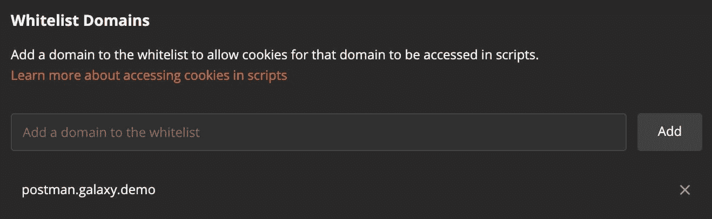
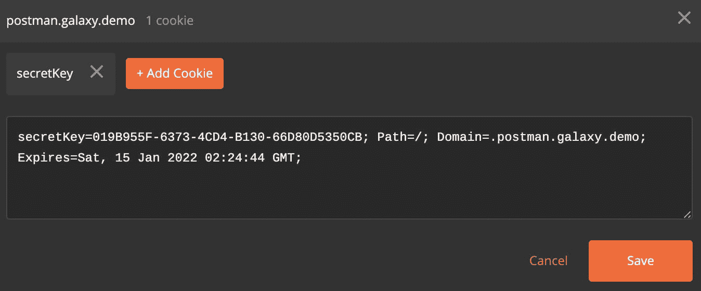
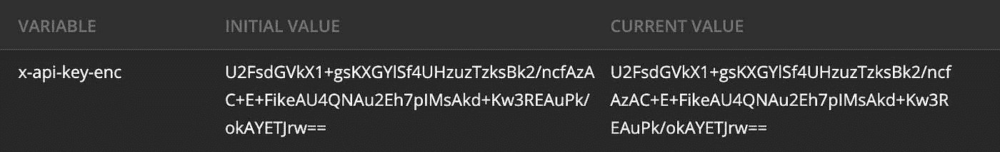
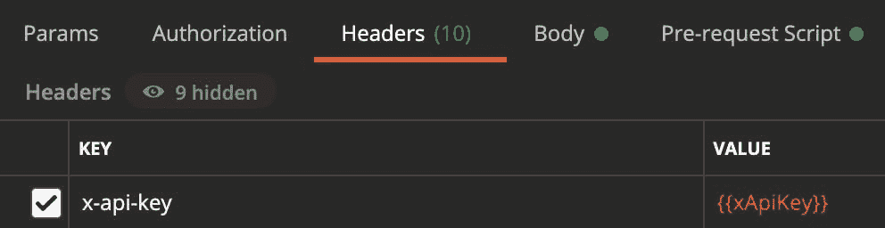

# 如何使用 CryptoJS 和 Cookies 在 Postman 中处理秘密

> 原文：<https://javascript.plainenglish.io/postman-secrets-cookies-cryptojs-4051db70e8c2?source=collection_archive---------7----------------------->


Photo by [Food Photographer | Jennifer Pallian](https://unsplash.com/@foodess?utm_source=medium&utm_medium=referral) on [Unsplash](https://unsplash.com?utm_source=medium&utm_medium=referral)

在我之前的文章中，我们探索了[如何在 Postman 中使用 cookies 来存储你的秘密](https://medium.com/javascript-in-plain-english/how-to-use-cookies-to-store-secrets-in-postman-afa9a666590d)。根据您的安全需求，您可能需要使用加密技术。这就是 CryptoJS 可以帮忙的地方。

# 生成加密秘密的脚本

我们可以使用本地 Node.js 脚本和 CryptoJS 库来加密这个秘密。下面的例子显示了我们将如何加密一个 API 密钥。

```
const CryptoJS = require('crypto-js');
const { API_KEY: apiKey, SECRET_KEY: secretKey } = process.env;
const encryptedText = CryptoJS.AES.encrypt(apiKey, secretKey).toString();
console.log('encryptedText:', encryptedText);
```

我们将 API 密钥和秘密密钥(用于加密 API 密钥)设置为环境变量。这样我们就不会将数据硬编码到我们的脚本中。

# 在 Postman 中使用加密的秘密和密钥

我们将密钥存储为 cookie 以避免共享值，并将加密的 API 密钥存储为环境变量。

我们将一个 cookie 域列入白名单。



我们创建一个 cookie 来存储密钥。



我们创建一个具有加密 API 密钥的环境变量。



我们创建一个预请求脚本来从 cookie 中获取密钥，从环境变量中解密加密的 API 密钥，并用明文 API 密钥设置一个临时变量(Postman Sessions)。

```
// https://postman-quick-reference-guide.readthedocs.io/en/latest/libraries.html
const cookieJar = pm.cookies.jar();
const sessionVarName = "xApiKey";
const cookieName = "secretKey";
const domain = "postman.galaxy.demo";
cookieJar.get(domain, cookieName, (error, secretKey) => {
  if (error) {
    console.error(error);
    pm.variables.set(sessionVarName, "error");
  }
  if (secretKey) {
    // decryption
    console.log('secretKey', secretKey);
    const xApiKeyEnc = pm.environment.get('x-api-key-enc');
    console.log('xApiKeyEnc', xApiKeyEnc);
    const xApiKey = CryptoJS.AES.decrypt(xApiKeyEnc, secretKey).toString(CryptoJS.enc.Utf8);
    console.log('xApiKey', xApiKey);
    pm.variables.set(sessionVarName, xApiKey);
  } else {
    console.error("Cookie is missing")
    pm.variables.set(sessionVarName, "missing");
  }
});
```

我们编写一个测试，在请求完成后显式删除`xApiKey`变量。

```
pm.variables.unset("xApiKey");
```

我们可以使用`xApiKey`变量来使用明文 API 密钥。



# 结论

通过使用 cookies，我们可以在避免共享密钥的同时使用密钥。通过使用 CryptoJS，我们可以将加密的数据存储在环境变量中，对其进行解密，并且只在请求执行期间使用明文(即解密的)数据。

阅读第 1 部分:“如何使用 Cookies 在 Postman 中存储秘密。”

[](/how-to-use-cookies-to-store-secrets-in-postman-afa9a666590d) [## 如何在 Postman 中使用 Cookies 存储秘密

### 在 Postman 环境中存储您的秘密(例如，API 密钥和密码)可能无法满足您的安全需求…

javascript.plainenglish.io](/how-to-use-cookies-to-store-secrets-in-postman-afa9a666590d) 

# 在你走之前

加入我的邮件列表来接收关于我写作的更新。参观 miguelacallesmba.com/subscribe并报名。

注册一个[中级会员](https://miguelacallesmba.medium.com/membership)，阅读更多类似的帖子。

保持安全，米格尔

*原载于*[*MiguelACallesMBA.com*](https://miguelacallesmba.com/postman-secrets-cookies-cryptojs)