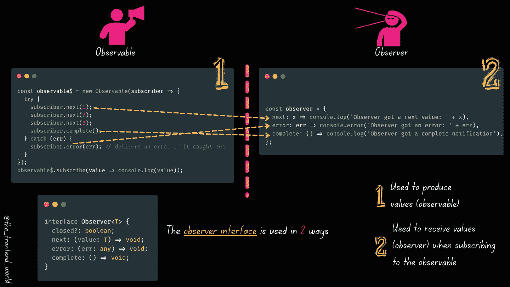
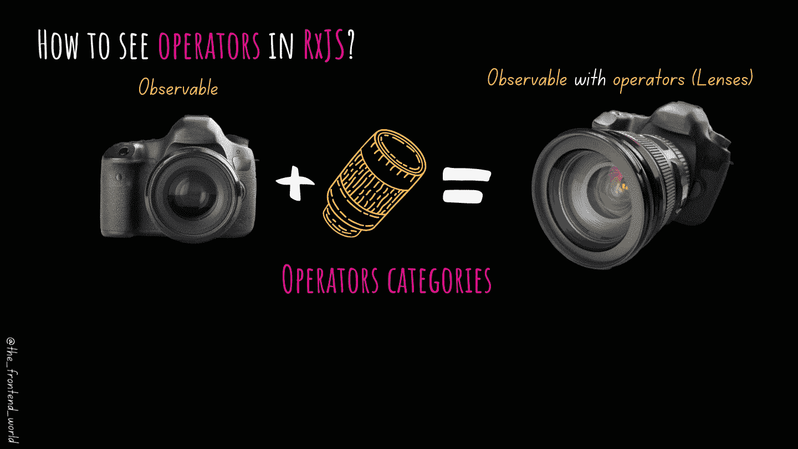
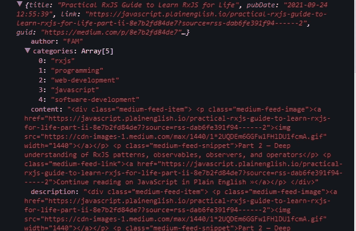
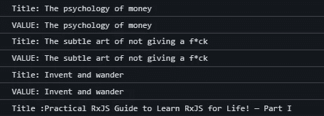

# 第二级:实用 RxJS 指南，学习 RxJS 终身学习

> 原文：<https://javascript.plainenglish.io/practical-rxjs-guide-to-learn-rxjs-for-life-part-ii-8e7b2fd84de7?source=collection_archive---------3----------------------->

## 第 2 级——对 RxJS 模式、可观察对象、观察者和操作者的深入理解

By FAM

嗨，欢迎来到实用 RxJS 指南的第二部分。如果你还没看过第一部，下面有链接。

这一集包括:

*   **了解 n 2 RxJS 支柱…观察员**
*   **管理订阅**
*   **操作人员(处理可观察的结果，并根据您的应用程序的确切需求制作/调整数据)**
*   **创建您自己的操作员**

如果您还没有看过其他文章、大图和第 1 部分，如果您不了解 RxJS，我鼓励您去看看。

 [## 实用 RxJS 指南终身学习 RxJS！—第一部分

### 深刻理解 RxJS 模式和可观察性

levelup.gitconnected.com](https://levelup.gitconnected.com/practical-rxjs-guide-to-learn-rxjs-for-life-part-i-63645a10100f) 

你的 ***头脑*** 准备好了吗？如果是，那就开始吧！

# **1。了解 n 2 RxJS 支柱…观察员**

在上一篇文章中，我通过示例展示了如何通过在浏览器控制台上显示值来消费 observable 返回的值。

在本文中，我将深入探讨。我们将看到如何在观察者端管理错误和完成。

> 观察器是回调函数的集合。他们的工作是处理来自可观察对象的值。

那些回调函数恰好与我们通过可观察对象传递数据和消息时调用的函数相同。这部分是我学习 RxJS 时最困惑的部分。

By FM

是的，如你所见，`observable`和`observer`都实现了`Observer<T>`接口。

正如您在上面的观察者示例中所看到的。我们可以显示值 receive 以及错误和完整的回调。

这就是关于可观测量和观察者的全部故事。你需要记住的是:

*   可观察对象是数据生产者(他是调用 API 和数据源来获取您想要发送给观察者的数据的人)
*   观察者接收数据，但是只有当他订阅了发送他想要的数据的可观察对象时。
*   只有当我们对其调用`subscribe`方法(`observable$.subscribe({...});`)时，可观察对象才会被执行；
*   我们通常将`$`添加到一个可观察对象中，以使开发人员能够很容易地识别出它是代码中的一个可观察对象。这不是强制性的。
*   可观察对象和观察者都实现相同的观察者接口。这意味着在两边我们都可以调用`next()`，为可观察对象发送值，为观察者接收值。`error()`发送和接收任何发生的错误。最后，用`complete()`的方法说出 ***【我完成了】*** 。
*   您不必在两端都实现所有这些方法。您只能使用`next()`方法来发送和接收数据，但是如果您发送错误(如果有的话)并在控制台上说我已经完成了(如果您这样做的话，调试对您来说将会更加简单明了，可读性更好)。
*   对`subscribe`的每次调用都会触发特定观察者的独立执行。理解这一点很重要，这里有一个具体的例子:

我们可以看出，我们得到的三个信息，来自不同的观察者。最重要的是，每一个显示的时间与每个观察者相差 1 秒。因为所有三个观察者都记录了可观察对象产生的时间，这让我们知道观察者触发了可观察对象的新执行，这解释了显示时间的差异。

恭喜你，你已经了解了观察者！

现在，当你已经收到你想要的数据，并且不再需要从可观测值中产生的值时，我们该怎么办？(耳语:关键词`subscription`)

# 2.**管理订阅**

有时候你会因为 x 或 y 的原因想要停止或取消一个可观察对象的执行。在这些情况下，我们需要处理订阅。

> 订阅可能看起来没用，但它们有一个好处，那就是停止或取消订阅

一个很好的常见用例是当你在一个 Angular 应用上工作的时候。假设您的组件订阅了一个服务来获取数据。当组件被破坏时，您需要关闭/停止订阅，因为您不再需要从该服务接收数据。该组件在`OnDestory`之后将不再存在。

要取消订阅，我们需要首先创建订阅。我们一直在间接地这样做。下面是一个例子:

很简单，不是吗？

在[这篇](https://medium.com/swlh/how-do-server-sent-events-sse-or-eventsource-work-in-angular-e9e27b6a3295)文章中，我有一个当时正在处理的真实案例。我在第 4 节中使用了可观察值。如您所见，导入文件后，我会立即关闭订阅。不一定只有当应用程序被销毁时，也可以是不再需要服务器提供的数据时。

 [## 服务器发送事件(SSE)或 EventSource 在 Angular 中是如何工作的？

### +提供代码和授权令牌的真实用例

medium.com](https://medium.com/swlh/how-do-server-sent-events-sse-or-eventsource-work-in-angular-e9e27b6a3295) 

不仅如此，我们还可以使用`add`和`remove`添加或删除订阅:

# 3.经营者

By FAM

说到相机镜头，你有无限的选择。这取决于你和你的需求。这与 RxJS 中的操作符非常相似。您可以添加任意数量的镜头，以获得您想要的最终效果。

> 运算符是接受一些配置信息并返回函数的函数。该函数将一个可观察值作为输入，并返回另一个可观察值。

先从基础算子及其实际应用说起。

这是一个简单的例子，但 RxJS 运营商真的就像阿里巴巴的洞穴，在那里你可以找到并做很多事情，真的有很多关于数据的奇妙事情。

By FAM

如您所见，有许多不同的操作符。而且即使你有 ***特定的*** 需求，你也可以自己创造。

下面是我的媒体文章提要的另一个例子:

> **【更新】——感谢@推特上** [**万字**](https://twitter.com/Swastik68946955) **的反馈。**

这个例子没有解释。抱歉，^^'.这是:

*   ***mergeMap*** 步骤:获取响应内的数据(一个 ajax 响应有很多我们在这种情况下不需要的细节，比如响应状态、响应类型、请求……等等。).我们想要的只是`AjaxResponse.response.items`。您可以通过在控制台上显示`ajaxResponse`对象来玩它，并查看您的数据在哪里。
*   ***过滤*** 步骤:在这一步，我希望 RxJS 过滤我的文章，只选择那些特定于前端开发的文章。为此，我使用了 categories 属性。这是我在发表文章前储存标签的地方:

*   ***点击*** 步骤，过滤后，我想让 RxJS 显示标题以查看最终返回的文章标题。
*   订阅时，最终返回的对象是一篇文章，它有标题、链接和其他可以在应用程序中使用的属性。

很棒，不是吗？想象一下操作符给你用简单的代码行塑造数据的可能性。它是可见的、可读的、有条理的。

By FAM

选择是无穷无尽的。你可以用`catchError` API 捕捉错误。要记住的一件重要的事情是，运算符获取一个可观测值并返回一个可观测值，这就是它的威力所在。这种方式很灵活，你可以做很多事情。

RxJS 内置了 100 多个运算符。然而，您可能有理由创建自己的操作符。

# **4。创建自己的运营商**

> 运算符只是一个函数

运营商特征:

*   返回一个函数的函数
*   将可观察值作为输入，并返回可观察值
*   可以配置

这是我们定制的 doublerOperator:

太简单了？

注意每个操作符中的`return`语句(还记得吗？它是一个返回函数的函数)

控制台结果:

应我亲爱的读者的要求，我决定创作第三部分。更高级的 RxJS 文章。这需要时间，因为你可以看到这些类型的文章需要相当大的努力和时间来为你做一篇高质量的文章。

## 3d 部分将涵盖:

*   **多播可观测量&主题**
*   **冷** ⛄ **对热**🔥**可观测量**
*   **组播运营商**
*   **可观察的执行**
*   **控制和调度可观测量的执行**
*   **测试可观察性和订阅(单元测试，构建单元测试…等。)**

我希望这篇文章让你对 RxJS 世界有了很好的深入了解。任何反馈对其他读者和我都是启示，所以请不要犹豫让我知道。

> 这篇文章很长，我承认。然而，这三个部分将使你终生学习 RxJS。因为这不是一个超级专业解释，所以那些文章涵盖了我作为一个开发人员在开始使用 RxJS 时无法找到的深刻理解！

下一篇文章的预告片😉

By FAM

亲爱的读者，感谢你在我生命中的存在。

**让我们联系一下** [**中**](https://medium.com/@famzil/)**[**Linkedin**](https://www.linkedin.com/in/fatima-amzil-9031ba95/)**[**脸书**](https://www.facebook.com/The-Front-End-World)**[**insta gram**](https://www.instagram.com/the_frontend_world/)**[**Youtube**](https://www.youtube.com/channel/UCaxr-f9r6P1u7Y7SKFHi12g)**或&**********

****看我的关于网络基础和一般文化的电子书。****

*****更多内容看*[***plain English . io***](http://plainenglish.io/)****