# 闭包的实际用法

> 原文：<https://javascript.plainenglish.io/practical-usage-of-closures-in-javascript-b3203770ba2?source=collection_archive---------11----------------------->

## 了解程序员如何使用闭包来解决各种问题

Photo by [Wes Hicks](https://unsplash.com/@sickhews?utm_source=medium&utm_medium=referral) on [Unsplash](https://unsplash.com?utm_source=medium&utm_medium=referral)

> 本文是这个系列的第三部分，我们将探索闭包的起源、幕后工作、现实生活中的用法以及与闭包相关的面试问题。

# 闭包和内存

闭包可以让我们的代码非常节省内存。我在这里有一个函数，我们称它为`find()`，在这个函数中，我们创建了一个名为`bigArray`的数组。我们使用了数组自带的填充方法，用 10000 填充它🙏。我们的函数根据作为参数提供的索引返回 bigArray 的元素。

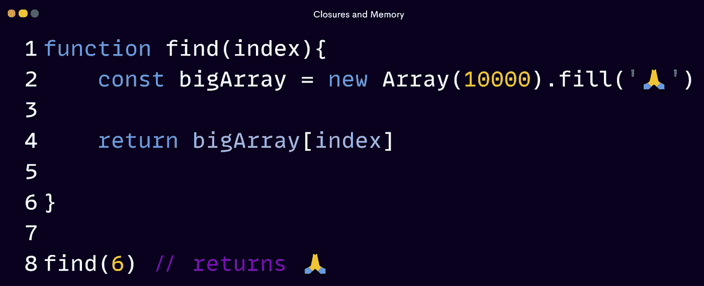

每当我们调用`find()`，它就为`bigArray`创建一个内存空间。随着时间的推移，这会影响我们代码的性能。让我们用同一个代码调用 `find()`四次。

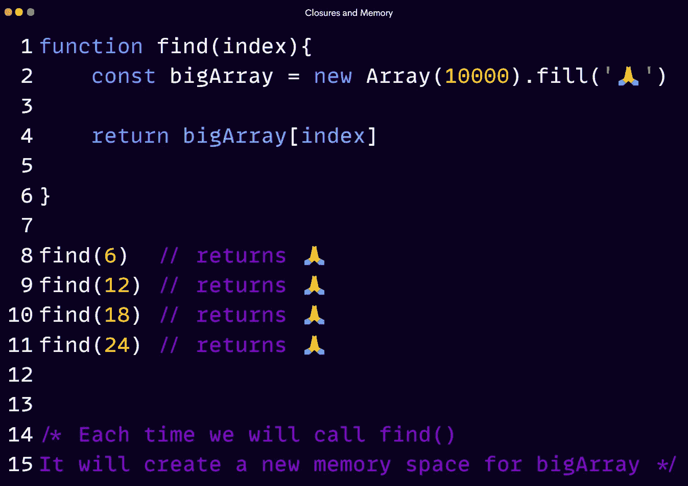

Lets have a look at the execution speed in the pictures below!

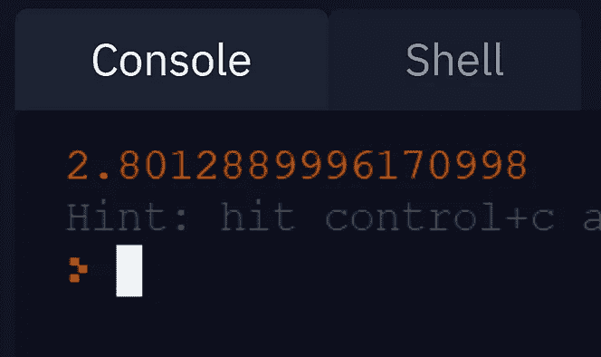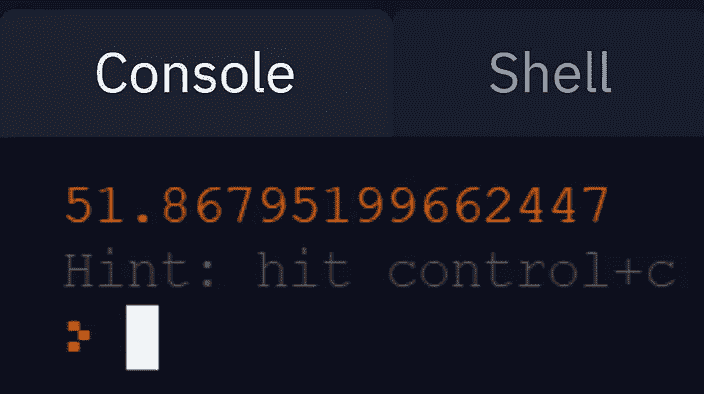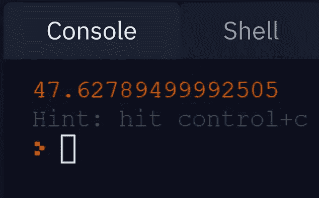

不止一次打电话让事情变得更糟！

**让我们用我们的 closure 知识来看看我们是否能对此做些什么！**

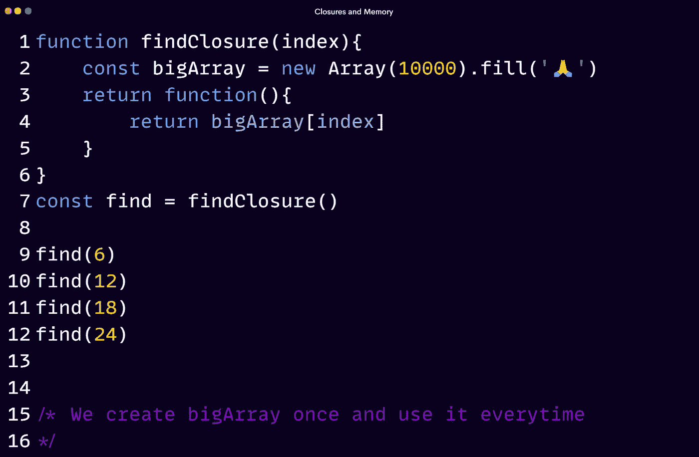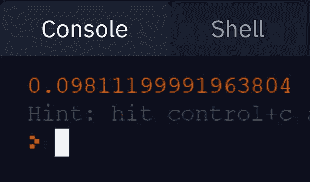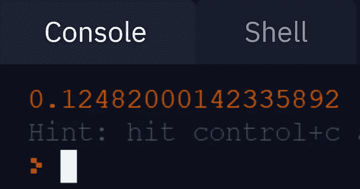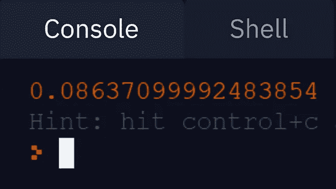

你看到了吗？我们的代码执行有了巨大的改进。

# 封闭和封装

闭包就是封装的一个例子:它将代码体和词法范围封装在一起。进入胶囊的唯一途径是通过函数:函数就像一个“方法”，捕获的词法环境的元素就像对象中的“插槽”。

在许多编程方言中，你会发现公共和私有作用域。在 JavaScript 中，没有这样的东西。我们可以通过闭包之类的东西模仿公共和私有作用域！

例如，通过在模块设计中利用 JavaScript，我们可以设置公共和私有范围。创建私有作用域的一个基本方法是将我们的函数包装在一个函数中。正如[我们所学的](https://medium.com/@polymathsomnath/most-important-feature-ever-put-in-a-programming-language-5b139e1e170f)， ***函数创建的作用域将事物排除在全局作用域之外。***

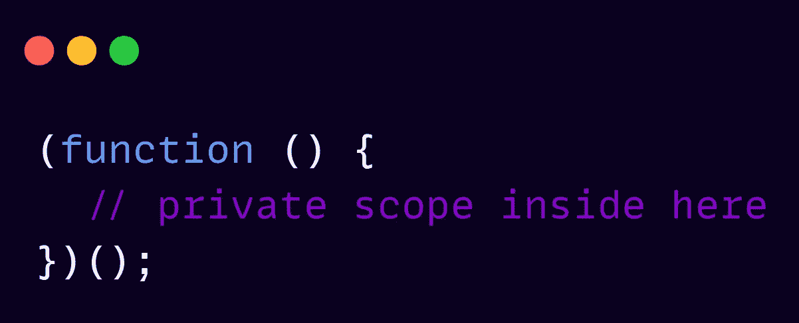

为了给你一个视角，让我们用 JavaScript 编码一些东西。让我们制作一个 API 来帮助我们提高房子的安全性。

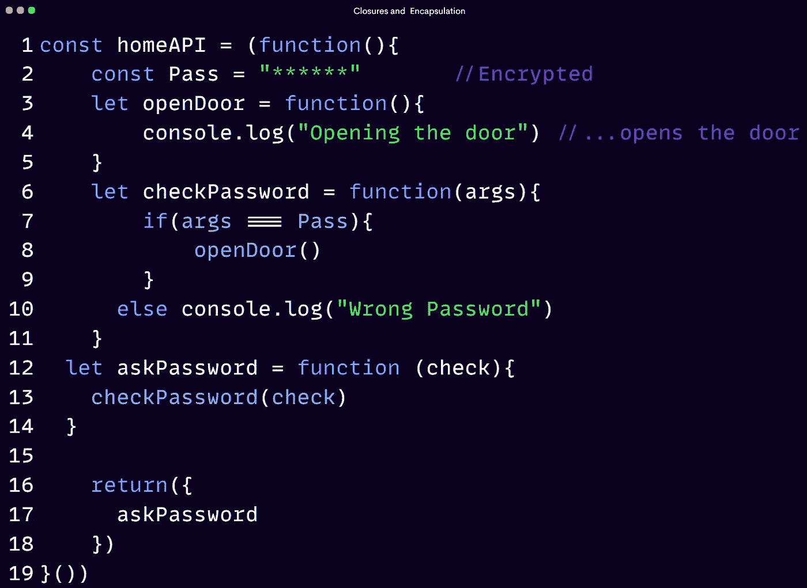

We are not assigning a function to homeAPI. We are assigning the result of invoking
that function. Notice the ( ) on the last line.

我们的 API 将要求输入密码，并检查它是否正确。如果它是正确的，那么它将打开门！否则会打印“**错误密码**

我们正在返回一个方法，它将允许我们访问 API

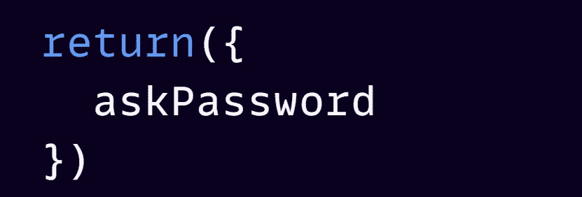

让我们看看这个

`openDoor()`也在同一代码中定义。难道不能直接访问，绕过密码询问机制吗？

Nope! We can’t access it even though openDoor() it is in the same code.

这就陷入了 ***最小特权原则、*** *一* 安全原则这一点相当重要！

你看，当涉及到编程时，你不想让任何人访问你的 API 的特殊函数或变量。

使用闭包，我们可以访问像“Pass”这样的东西，没有它，我不希望任何人进入这个房子。同时，我仍然希望人们能够接触到像`askPassword`这样的东西

这样，如果他们有正确的密码，就可以尝试进入！
这是 ***数据封装*** 闭包的主要好处之一，它指的是 ***一些数据不应该直接暴露*的思想。**

# 闭包的经典用法

比方说，我们有一个用于设置应用程序视图的函数，但是这个函数应该只运行一次。

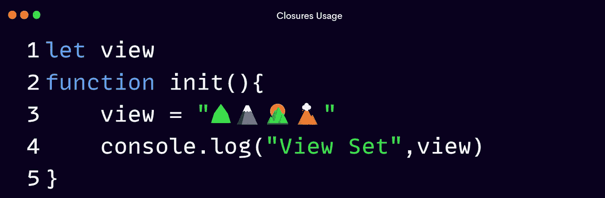

你在一个团队中工作，你的开发团队中有一个新人，他不知道这个东西应该只被调用一次，而是在他们的代码中被调用一次，他们初始化了很多次，也许这不是你想要做的！

When I run this, you see that we can set the view three times perhaps, even end up resetting the web page.

根据我们对闭包的了解，我们能不能把这个函数变成一个只能调用一次的函数？因此，即使有人可能会滥用它并多次运行它。只要该功能已经运行过一次。它只会运行一次。

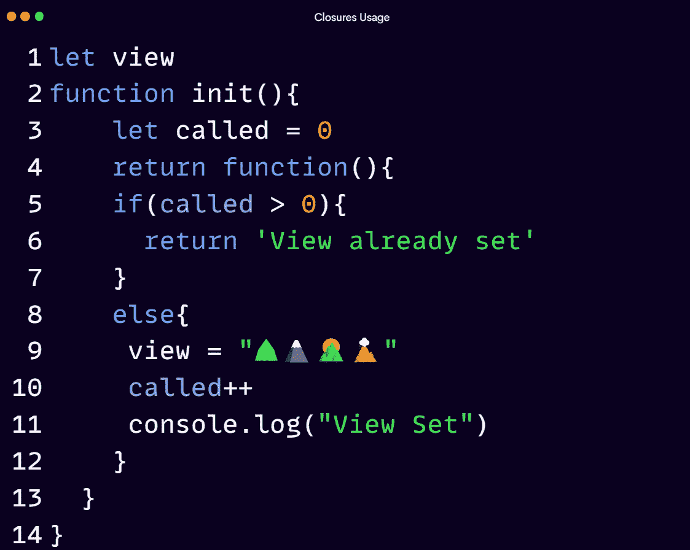

使用 closure，我们实现了我们想要的，看看吧！

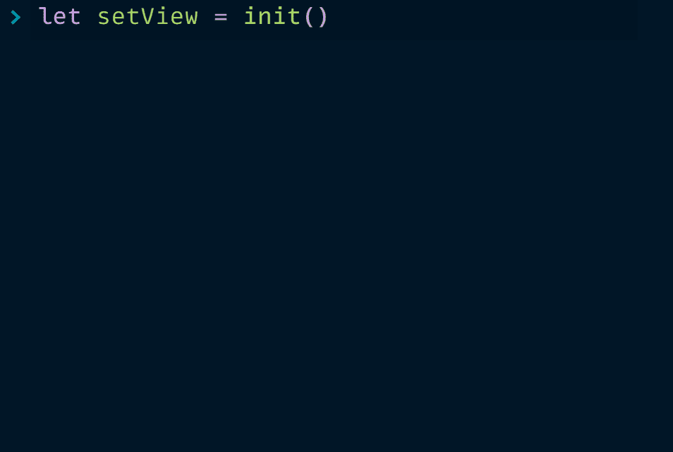

让我们看到另一个问题！

下面我们有一个`array`，一个`for loop`，和一个`setTimeout()`函数。我们希望在 3 秒后打印每个元素的索引。

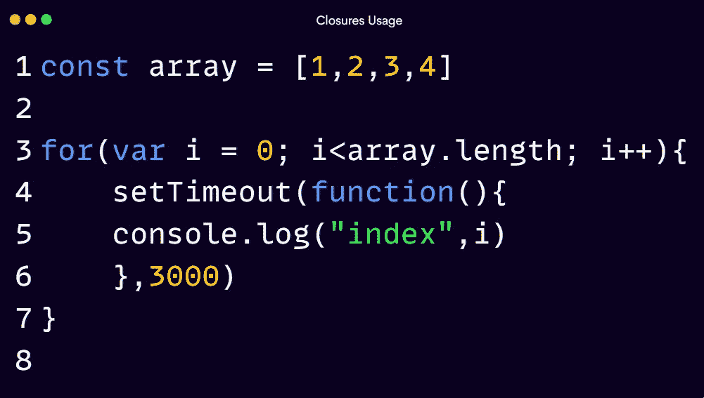

我们没有得到预期的产量！循环只打印最后一个索引，而不是全部。

这是一个使用闭包解决的经典问题。我每隔一次面试都会被问到这个问题。

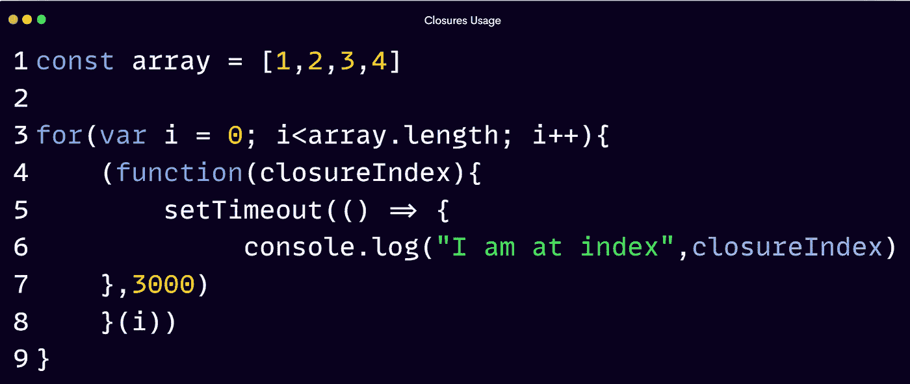

我们得到了我们想要的输出！

这是一个只能在 2015 年前使用 closure 解决的问题。

ES6 在 2015 年引入了数据块范围。同样的问题现在可以通过使用`let`关键字的块作用域来解决。

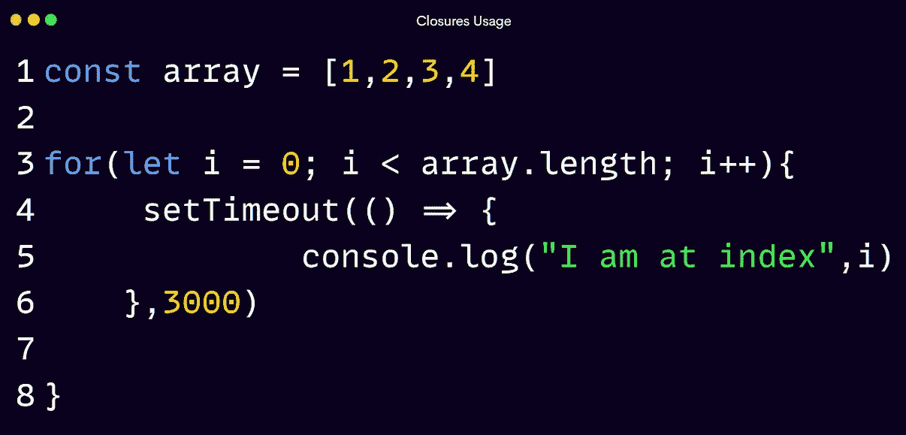

你看到了吗？是一样的代码！我们所做的只是将声明的变量从`var`改为`let`。

# 闭包和函数式编程

闭包和函数式编程是齐头并进的！

正是因为闭包，我们才能处理高阶函数、Currying、Memoization、局部应用、管道和组合、Arity 等等！

你可能已经使用或听说过的功能，如地图，过滤，减少。嗯，他们都使用闭包来使事情成为可能！

探索它们超出了本文的范围！我们将在以后做一系列关于函数式编程的文章时探索所有这些问题！🙂

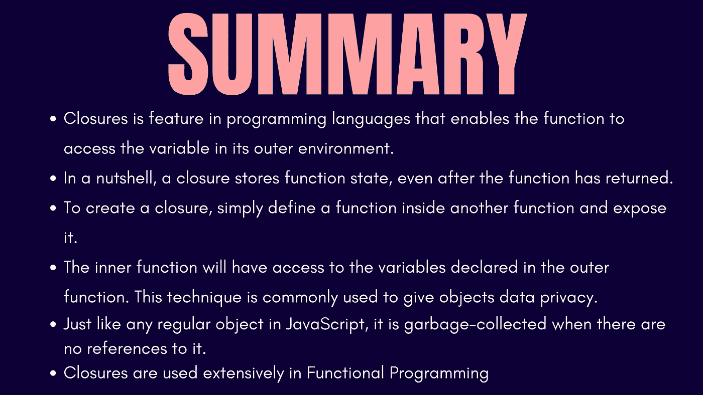

好了，现在够了！如果你没有得到全部，那么不要担心！我们都有自己的节奏去寻找东西。一遍又一遍，直到你明白为止。

有更多的方法可以让闭包为我们所用。去探索它们吧！

在[的下一篇](https://medium.com/p/8dd12a210677/edit?source=your_stories_page-------------------------------------)中，我们将看到 get 进入面试场景。到目前为止，我们所学的一切都将受到检验！

[***不见不散！***](https://medium.com/p/8dd12a210677/edit?source=your_stories_page-------------------------------------)

# 如果你错过了这个系列，这里有链接。😊

## [1。编程语言中最重要的特性](/most-important-feature-ever-put-in-a-programming-language-5b139e1e170f?sk=baff3bd18de9be10a66bb27eb2d265d4)

## [2。在 JavaScript 中寻找闭包](/grokking-closure-in-javascript-7e8194924398?sk=0f6e01511d6400590608f10f0ea85017)

## [3。闭包的实际用法](/practical-usage-of-closures-in-javascript-b3203770ba2?sk=dc404a83106d791c943d16b6b389e26c)

## [4。终极 JavaScript 面试问题—结束](/ultimate-interview-questions-on-javascript-closures-8dd12a210677?sk=4d15f7e3756b76a9e2886b97515975b1)