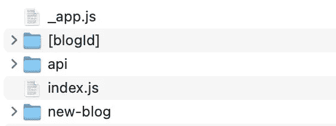

# 用 Next.js 预渲染动态路线

> 原文：<https://javascript.plainenglish.io/pre-rendering-dynamic-routes-with-nextjs-9bca622c6677?source=collection_archive---------6----------------------->

## 在这篇博文中，你将学习如何使用 NextJS 结合 MongoDB 来预渲染带有动态路径的站点

在我以前的文章中，我描述了如何[将 MongoDB 集成到 Next.js](https://medium.com/@kevintomas1994/integrating-mongodb-to-nextjs-f7038f90051a) ，以及如何[用 Next.js](https://medium.com/@kevintomas1994/storing-data-to-mongodb-with-nextjs-6372319d498b) 将数据存储到 MongoDB。如果您需要更新关于 NextJs 的知识，请随时查看这些故事。

在这篇文章中，我们将讨论如何使用 Next.js 预渲染动态路线。一个典型的用例可以是个人博客，其中有几篇文章，它们都有自己的 URL:[https://mypersonalblog/[dynamic route](https://mypersonalblog/[dynamicRoute)。我将引入一个名为`getStaticPaths`的新概念，需要它来定义将被预渲染的路径列表。

## 定义要预渲染的路线

一般目录结构可能如下所示:

您会注意到 blogId 目录写在**方括号中，**表示这将是一个**动态路由**！blogId 只是博客文章的实际 Id 的占位符，它将被呈现。下面您可以找到 **getStaticPaths()** 函数，它将位于**【blogId】**目录中:

这个函数有趣的部分确实发生在 return 语句中。在此之前，我们连接到我们的数据库，并将我们博客帖子的所有 id 存储在常量数据中。

在 return 语句中，我们定义的第一件事是 **fallback 键。这定义了 NextJs 将如何处理路径(在我们的例子中是 blogIds ),这些路径并不存在。后退可以设置为“真”、“假”和“阻止”。**

如果 fallback 为**假**，那么在上面的函数中没有定义的任何路径将导致一个 **404 页面**。如果 fallback 被设置为 **true，** NextJs 将呈现你的站点的一个回退页面。最后，如果 fallback 是**阻塞**并且输入了一个不存在的路径，NextJs 将在第一次请求时进行 SSR 并返回生成的 HTML(但是在这种情况下没有任何博客数据),这个路径将被添加到预呈现页面的列表中。

我们的`getStaticPaths`函数的返回语句中的第二个键是`paths.`,它决定哪些路径将被预渲染。在这种情况下，我们迭代我们的常量`data`中的所有数据点，并且我们只存储 **blogId** ，因为这是这里唯一感兴趣的东西。你会注意到，我不得不将带有`datapoint._id.toString()`的实际 ID**转换成一个字符串。这是因为 MongoDB 没有将自动生成的 ID 存储为字符串，而是存储为一个特殊的对象。**

## 定义要预呈现的内容

在下面的`getStaticProps`函数中，我们为某篇博客文章定义了要预先呈现的实际内容。

引入了一个新概念，这在我以前的文章中还没有涉及到。这是**上下文**参数，我们将其传递给`getStaticProps`函数。该参数包含几个键，如参数、预览等。在本帖中，我们将只仔细看看 **params** 键。

Params 为使用动态路由的页面携带路由参数，这实际上是我们之前在`getStaticPaths`函数中定义的！所以通过`context.params.blogId`，我们可以访问当前的 **blogId。**

但是我们为什么需要 blogId，”，你可能会问。如果你看一下上面代码的第 11 行，你会发现我们再次重用了 blogId。在`yourCollection.findOne({_id: ObjectId(blogId),})`中，我们使用 blogId 在我们所有的博客文章中搜索这个 blogId。然后，这个数据将在`return`语句中使用，将其存储在 params 键中，该键将由实际的页面组件接收。

在这个例子中，我们希望收到一个 id、一个标题、一个描述、一个图像和一个内容，这些内容稍后可以在实际的页面组件中使用。代码中最后一个有趣的键是**revidate。**通过默认它的值被设置为 false 但是在这里我们把它设置为 1。这意味着 NextJs 将在每次收到请求时尝试重新生成页面，并且每 1 秒钟再生成**和**！所以说实话，在个人博客的情况下，把 revalidate 设置为一秒没有太大意义，因为你博客上的数据不会更新那么频繁。它放在这里是为了演示。

这就是关于定义 NextJs 要预渲染的路线和内容的大部分内容！

## 在页面组件中使用预先呈现的数据

这是一个简短的例子，说明了如何使用通过 **props** 参数传递的组件中的数据。你可以注意到我们在 **Head** 组件中动态添加了元数据，这对 SEO 优化你的页面内容非常有用。在此之下，我们在一个定制的 BlogDetail 组件中使用其余的数据。

## **结论**

因此，在这篇博文中，你有望了解到如何结合使用 Next.js 和 MongoDB 来预渲染带有动态路由的站点。如果你喜欢这个内容，请在评论中告诉我，并随时关注我的 medium.com！

在下一篇博文中，我将讲述如何用 Next.js 实现一个全功能的认证流程！感谢您的关注，再见！

*更多内容请看*[***plain English . io***](http://plainenglish.io)