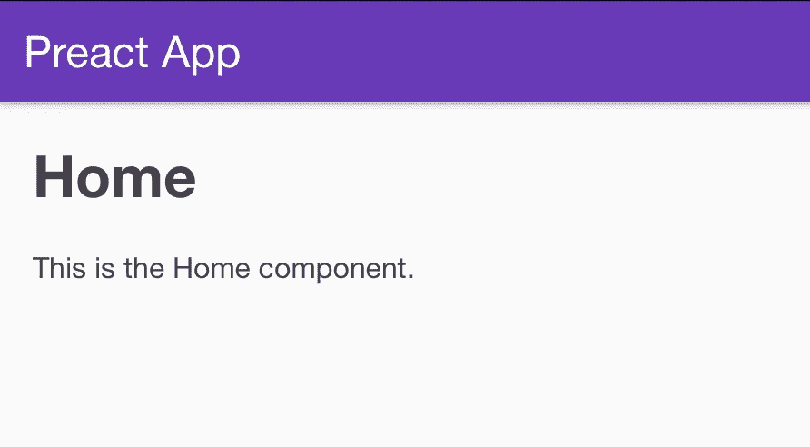
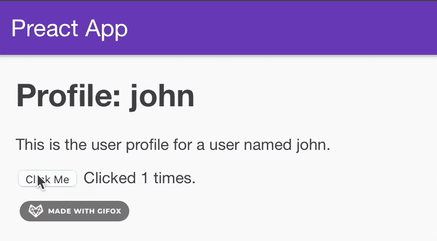

# 预先完成设置 A-Z: TypeScript、SCSS、MobX Lite 和路由器

> 原文：<https://javascript.plainenglish.io/preact-js-complete-setup-a-z-typescript-scss-mobx-lite-router-a2c07fd37ca0?source=collection_archive---------8----------------------->


Photo by [Domenico Loia](https://unsplash.com/@domenicoloia?utm_source=medium&utm_medium=referral) on [Unsplash](https://unsplash.com?utm_source=medium&utm_medium=referral)

Preact 是 react 备选框架之一，您应该在您的项目中尝试。原因是这个框架以较小的包大小提供了很好的性能。这是一个轻量级的框架，使得它的语法更加简单明了。因为它的包比 React 小，所以您的用户将下载更少的 JavaScript 代码来解析和执行它。react 和 Preact 之间有一些比较，结果正如我们可能猜测的那样，Preact 包的大小比 react 小 78%,性能比 React 快 17%。

如果您是 React 开发人员，那么 Preact 对您来说很容易上手。当然，React 也有一些不同之处，但总的来说，本文可以帮助您更快地进行设置，因为在本文中，我们将有一个完整的样板文件——preact js，带有 Typescript 和 SCSS，以及 MobX Lite 来管理我们的全局状态。

如果你来自另一个 JavaScript 框架，比如 Vue.js，不要害怕，PreactJS 可能没有你想象的那么可怕。不到一周就能上手。显然，为您的下一个前端项目尝试 PreactJS 是值得的。

在我们开始之前还有一件事。如果你想知道，为什么我们应该使用 TypeScript 而不是 JavaScript？嗯，会有一些解释的。但是简单来说，TypeScript 使用显式类型更可靠。因此，TypeScript 非常适合大型/复杂的项目。

# 概观

*   我们的目标
*   打字稿和 SCSS —主页
*   打字稿和 SCSS-个人资料页
*   类型脚本和 SCSS —路由器/应用程序组件
*   使用 MobX Lite 的商店提供商

## #1 我们的目标

本文的目标是修改 PreactJS 已经拥有的 Typescript & SCSS 的现有样板文件，并添加 MobX 来管理全局状态。

首先，让我们创建一个新的 Preact 安装。

```
npx preact-cli create default my-project
```

正如您注意到的，全新安装 Preact 使用了 Javascript 和 CSS 类。但在本文中，我们将使用 SCSS 的 Typescript。所以开始，我们先修改一下主页。

## #2 打字稿和 SCSS —主页

让我们打开 *src/routes/home/index.js* ，将文件名改为 *index.ts* 。然后，它会产生错误，因为我们需要对它做一些调整。在本文中，我们将使用 *htm* npm 包来帮助我们返回 JSX。

```
npm i htm
```

然后，我们可以修改 *index.ts* 成为这样一个:

*src/routes/home/index.ts*

注意，我们使用 Preact 中的 *FunctionalComponent* ，还使用我们刚刚安装的 *htm* 包，并使用`html ```语法轻松返回 JSX。



到目前为止还不错，但是 SCSS 怎么样？在项目中实现 SCSS 非常简单，我们只需要一些可以编译我们的 SCSS 的包。

```
npm i --save-dev node-sass sass-loader@10
```

然后，我们把文件名*src/routes/Home/style . CSS*修改成 *style.sccs* ，在*首页*页面导入。

```
import style from './style.scss';...
```

## #3 打字稿和 SCSS-个人资料页

让我们继续使用 Typescript 和 SCSS 修改 *Profile* 页面。然后打开*src/routes/profile/index . js*，将文件名改为 *index.ts* 。另外，不要忘记将 *style.css* 名称修改为 *style.scss* 。

*src/routes/profile/index.ts*

为了处理状态，我们可以很容易地使用 *FunctionalComponent* 中的 Preact 钩子。您可能已经知道， *FunctionalComponent* 是一个无状态的组件，但是由于 Preact 挂钩，我们可以在需要的时候让这个组件“有状态”。

## #4 打字稿和 SCSS —路由器/应用程序组件

最后，让我们使用 Typescript 来转换路由器组件。打开 *src/components/app.js* ，将文件名改为 *app.ts*

src/components/app.ts

## MobX Lite 排名第五的商店提供商

现在是我们管理我们全球状态的时候了。在我们继续之前，我们需要 *mobx* 包，所以我们先安装它。

```
npm i mobx-react-lite
```

然后，在*src/services/store context . ts*中创建一个新文件。

src/services/StoreContext.ts

然后，我们需要导入我们的 *StoreContext* 以使它对我们所有的 pages &组件可用。让我们修改 *src/components/app.ts.*

*src/components/app.ts*

正如您在第 14 行看到的，我们添加了刚刚创建的 *StoreProvider* 。我们应该测试一下我们的全局状态是否工作正常，好吗？

如果您还记得在*配置文件*页面上，我们在内部管理计数器状态。出于测试目的，我们将全局移动计数器状态。



我们走吧。我们已经成功地将全局状态用于计数器。当然，对于这个上下文，计数器状态应该在本地管理，但是上面的演示确保了我们的全局上下文/状态按预期工作。

最后，我们建立了一个新的 PreactJS 项目，一切就绪——Typescript 和 SCSS 用于较大的项目，MobX/Provider 用于管理我们的全局状态。你可以在下面我的 Github repo 中找到完整的代码，希望这篇文章对你开始使用 Preact 有所帮助。
干杯！🍻

# 参考

[](https://github.com/Cerwyn/preact-complete-boilerplate) [## cer wyn/preact-完整-样板文件

### 在 GitHub 上创建一个帐户，为 cer wyn/preact-complete-boilerplate 开发做出贡献。

github.com](https://github.com/Cerwyn/preact-complete-boilerplate) [](https://preactjs.com) [## 提前

### 快速 3kB 替代方案，可与相同的现代 API 一起使用开始切换到 Preact 函数 Counter ( ) { const…

preactjs.com](https://preactjs.com) [](https://serokell.io/blog/why-typescript) [## 为什么您应该在 2021 年使用 TypeScript

### 近几年来，TypeScript 越来越受欢迎。它被列为五大最…

serokell.io](https://serokell.io/blog/why-typescript) [](https://medium.com/swlh/react-vs-vue-js-vs-preact-which-one-should-you-use-d3b3ba809ec1) [## react vs vue . js vs Preact——你应该用哪个？

### 从性能角度来看，您应该选择哪种 Web 框架。

medium.com](https://medium.com/swlh/react-vs-vue-js-vs-preact-which-one-should-you-use-d3b3ba809ec1) 

*更多内容看*[***plain English . io***](http://plainenglish.io/)