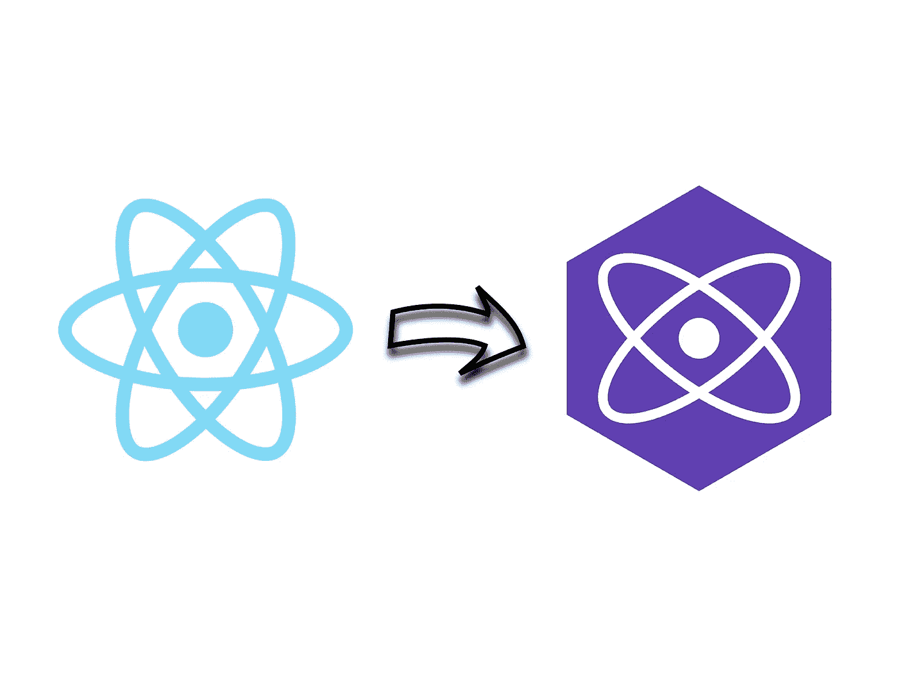
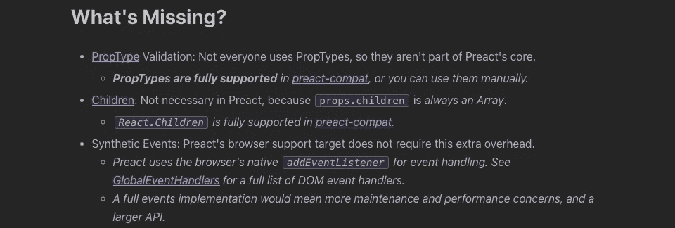

# 为什么您可能想将 React 应用程序切换到 Preact

> 原文：<https://javascript.plainenglish.io/preact-vs-react-56f9571d32de?source=collection_archive---------5----------------------->

## 以下是原因和方法

Source: the author

他们说，最终，最好的技术会占上风。

然而，在构建 React.js 应用程序时，我们经常犯一个错误:
我们没有使用 Preact。我在这里不是要说“React 已死”或
“我们应该抛弃 React”之类的废话

我在这里让你知道一个很酷的替代反应。

大多数 React 开发人员已经听说过它。然而，在我看来，它没有得到充分利用。Preact 提供了与 react 几乎相同的 API 和语法，但导致了更小的包大小和性能。

与此同时，Preact 还支持 react 支持的几乎所有东西——因此，是时候考虑将你的应用程序切换到 Preact 了。

以下是原因和方法。

# 将我的应用程序切换到 Preact 的结果

首先，给你一点动力。

我主要是 React.js 开发者。因此，我也用它来建立我的个人项目。像许多其他 react 开发人员一样，我忘记了 Preact 确实存在的事实——并且用 React 实现了一些个人项目。当意识到，我可以节省大量的包大小，我变得焦虑。

我确信完全转换到 Preact 不会那么容易。尽管如此，我还是尝试了一下——并感到惊讶。

首先，我将 Astro 中基于 React 的页面切换到 Preact。这是现成的，因为 Astro 完美地支持这两个库。

包大小的变化:从 333 千字节到 54 千字节。
差别真大！我也很震惊。

下一个应用是我在 Gatsby 做的一个老项目。该页面基于 React.js，大小为 403 千字节。将它切换到 Preact 导致了 205 千字节的包大小——再次节省了大量空间。

希望你现在更有动力给 Preact 一个机会——以下是你需要了解的关于转换的信息。如果您想了解 Preact 与 react 在性能方面的更多信息，请查看以下内容:

 [## 我用 React 和 Preact 构建了相同的应用程序。以下是不同之处

### 以及测量的大小、性能和实现

javascript.plainenglish.io](/i-built-the-same-app-with-react-and-preact-here-are-the-differences-b0da382a6f72) 

# 将我的应用程序移动到 Preact 可以吗？

Preact 并不打算取代 React.js。然而，这是一个相当完整的 React.js *替代方案*。虽然，由于它的规模，它有只提供少数功能的名声，但这是不正确的。Preact 文档让我们更详细地了解 Preact 缺少哪些功能:

Source: [preactjs.org](https://preactjs.com/guide/v8/differences-to-react/)

正如你所看到的，根据 Preact 本身的说法，差别并不太大。甚至我们从 React 中知道的所有钩子都可以通过特定于 Preact 的导入来使用，例如`import { useState } from "preact/hooks"`。

那么，所列出的缺失功能呢？嗯，正如 Preact 声明的那样，例如，PropTypes 在`preact-compat`中是完全支持的。这个工具帮助我们将应用程序迁移到 Preact，基本上不需要改变我们的代码库(我们稍后会看到)。

# 那么，我如何将我的 React 应用程序切换到 Preact？

切换到 Preact 并不困难，取决于您已经存在的设置。尤其是在 Gatsby 和 Next.js 这两个当今构建 React 应用最常用的工具中，切换并不复杂。两者都将 preact-compat 用于交换机。这意味着您现有的特定于 React 的代码库将被转换为 Preact。您可以使用 React 导入和功能，preact-compat 支持您。

关于如何在 Gatsby 和 Next.js 中切换，我做了两个额外的指南:

 [## 如何通过启用 Preact 支持来缩减 Gatsby 包的大小

### 无需重写您的代码库

javascript.plainenglish.io](/gatsby-preact-bfe5543bf27b)  [## 想让你的 Next.js App 更快？启用预先支持(方法如下)

### 如何在你的 Next.js 应用上启用 Preact 支持，并几乎免费节省几千字节。

javascript.plainenglish.io](/next-js-preact-f993c95a3f93) 

将我们的 CRA React 应用程序切换到 Preact 也并不困难，这要感谢一个很酷的第三方工具:`cra-preact`，它是 Preact 兼容层`preact/compat`的包装器。我们可以用`yarn add cra-preact`安装。

然后，我们需要做的一切就是像这样替换`package.json`中的脚本部分:

现在，只需运行`yarn run build`——preact compat 应该会自动处理您的 react-imports 并将它们重定向到 Preact，在引擎盖下。为了测试这一点，我使用`useState`和`PropTypes`构建了一个小的 React 应用程序。

React 应用的生产版本是 140 千字节，在用`cra-preact`切换到 Preact 后，只剩下 30.2 千字节——然而，一切都正常。

对于 React.js 中的大多数生产应用程序，create-react-app 不是首选工具。自从我们介绍了 Next 和 Gatsby 之后，仍然缺少使用 Webpack 或 package 之类的工具进行切换。谢天谢地，Preact 的文档为这些开关提供了很好的指导。

# 从头开始使用 Preact

到目前为止，我展示了如何从 React 切换到 Preact。这个过程的好处是，你可以在 React 中编写一切，preact-compat 应该处理一切。当你想从一开始就用 Preact 编写你的应用程序时，还需要知道几个不同之处:

差异:

*   可以用`class`代替`className`作为属性来提供 CSS 类。
*   传递道具的工作方式不同:
*   Preact 使用浏览器的本地全局事件处理程序来处理事件。因此，Preact 使用`onInput`而不是`onChange`作为输入字段。(浏览器的原生`onchange`并不像 React 那样每次按键都会触发。只有当您在更改了输入的情况下离开文本字段时，它才会被触发。)
*   本地全局事件处理程序的不同也会影响`onDoubleClick`。Preact 使用的本地实现是`onDblClick`。

# 最终想法

Preact 越来越演变成一个很好的 React.js 替代品。尽管它声称不是替代品，但在许多情况下，我会称之为替代品。是的，对我来说，Preact 似乎是更好的选择。

由于它方便的迁移工具，我们可以像往常一样构建 React.js 应用程序，然后尝试将它们迁移到 Preact 以节省包的大小。或者，你也可以用 Preact 从头开始构建你的应用程序，取代 CRA 或者只是在你的捆绑包中打开 Preact 支持。

感谢您的阅读！

## [在 Twitter 上关注我，了解最新消息](https://twitter.com/louispetrik)

*更多内容请看*[***plain English . io***](http://plainenglish.io)