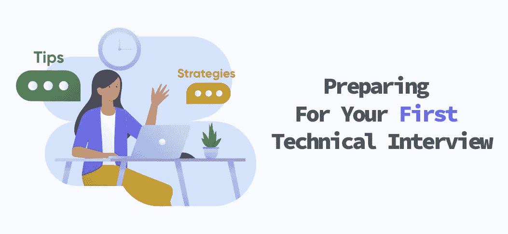
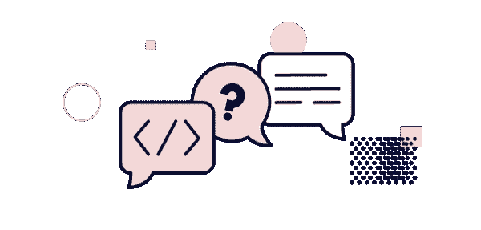

# 如何准备你的第一次技术面试

> 原文：<https://javascript.plainenglish.io/preparing-for-your-first-technical-interview-773f7e2976aa?source=collection_archive---------15----------------------->

## 遵循这些建议，给面试官留下深刻印象，赢得编码挑战

无论你是刚刚从训练营毕业，还是刚刚获得计算机科学学位，你都有可能通过一次技术面试来获得你的第一份工作。这些面试不同于任何其他工作面试，旨在测试你的编码知识、解决问题的能力和个性。这常常让人觉得是一个令人畏惧的过程，尤其是如果这是你的第一次。为了帮你度过难关，这里有一个指南，里面有一些提示和建议。

# 准备面试

## 彻底了解你简历上的技术

不是所有的技术面试都是关于算法的，很多时候面试官想确定你是一个称职的程序员，你需要构建一个应用程序的一部分。例如，如果你在简历中列出你知道 React，你最好知道如何构建一个组件，并了解如何使用 React 钩子。

准备好回答关于编程语言或框架的问题来参加面试。还要确保使用正确的术语和概念。

## 练习算法和数据结构

你很少会事先知道要考什么。因此，你必须保持敏锐，尽可能多的练习。外面有很多很棒的资源。首先，你可以查看 [LeetCode](https://leetcode.com/) 和 [AlgoExpert](https://www.algoexpert.io/) 。这两个网站都允许你解决顶级公司提出的常见问题。

不要因为更难的问题而气馁。如果这是你的第一次技术面试，你只需要回答简单到中等的问题。

## 理解 Big-O 符号和时空复杂性

你不需要深入了解这些话题，但是你要明白它是如何运作的。在解释你对算法问题的解决方案时，使用这些概念将使你与众不同。

YouTube 上有大量的视频和文章，用谷歌快速搜索应该很容易找到。

## 让你的电梯平稳下降

在面试的前几分钟，你将有机会了解你的面试官，并相互寒暄。他们会问你一些关于你自己的问题，你应该有一个完美的、熟练的回答。除了测试你的技术能力，他们还想全面了解你的个性。

这是你和面试官建立融洽关系的机会，并且可能找到一些共同点。一旦你有了某种融洽的关系，它会自动让你感到更自在。

## 练习面试

事实证明，每一次面试，你都会变得更好，改进你的答案。因此，练习面试很重要。无论是用问题测试你自己，还是和你以前的同学练习，确保你练习了。

Pramp 是一个很好的资源。注册是免费的，你可以和同行一起练习现场采访。

# 在面试之前

## **测试你的科技工具**

如果技术面试将通过视频会议进行，请务必**测试你的技术**。请确定您的电脑已充满电，并且您的视频和麦克风工作正常。

## 看起来很专业

研究一下公司的着装规范是什么样的，穿得比它高一个层次。例如，如果公司有便装规定，就穿商务便装。不要看起来像刚从床上爬起来。

## 排除任何干扰

确保没有警报响起，不会有随机的人在背景中走来走去，你的狗不会叫，等等。

# 面试的时候

## 提出澄清性问题

您应该在编写一行代码之前就这样做。在开始之前，你要确保自己完全理解了挑战/问题，你甚至可以从面试官那里得到暗示。

## 传达你的思考过程

当你开始编码时，你要确保你一直在大声思考。比得到解决方案更重要的是阐明你是如何得到解决方案的。它甚至可能有助于伪代码来演示您期望/需要代码做什么。

无论你是在和面试官说话，还是只是通过你的代码说话，有效的沟通会让面试官看到你的分析思维和解决问题的技能。面试官也可以把你推向正确的方向，看看你如何处理反馈。

## 如果你被困住了，保持冷静

如果你被卡住了，不要惊慌。相反，尝试新的想法，继续交流你的思考过程。通过尝试新的想法，只要它们与问题相关，这将展示你创造性思维的能力。很多时候，面试官甚至会介入并建议尝试某些事情。

此外，如果您知道该做什么，但不记得语法或正确的方法名，请询问您是否可以查找。许多面试官允许这样做，最糟糕的情况是他们会说“不”。

# 结论

关于技术面试的一个最大的误解是你需要正确地解决挑战，虽然你这样做很好，但这并不总是正确的。面试官在这个过程中寻找的不仅仅是你的编码技能。他们也会注意你的沟通技巧，你如何处理反馈，你解决问题的能力，以及你是否适合他们的文化。

如果这是你的第一次，可能会很吓人，但希望这里分享的建议能帮助你做好准备并战胜它。一旦你完成了，深呼吸，别忘了在面试后 24 小时内发一封感谢信，让自己给人留下深刻印象。

即使你没有得到这份工作，你也得到了很好的锻炼，现在你会知道下一份工作会是什么样的了！

*更多内容看*[***plain English . io***](http://plainenglish.io)