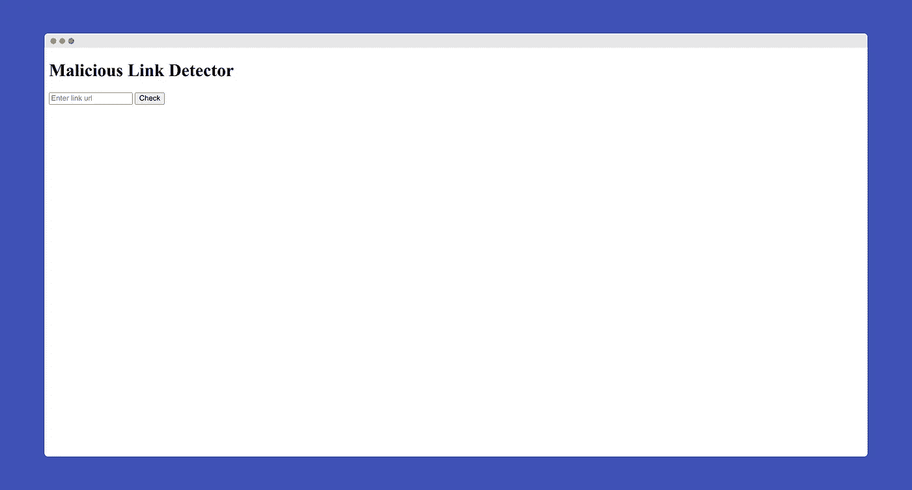
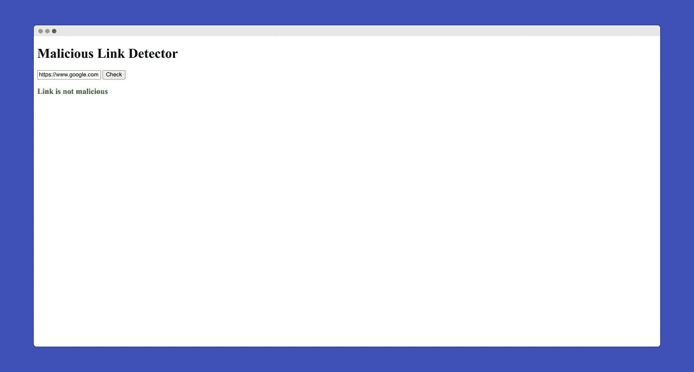
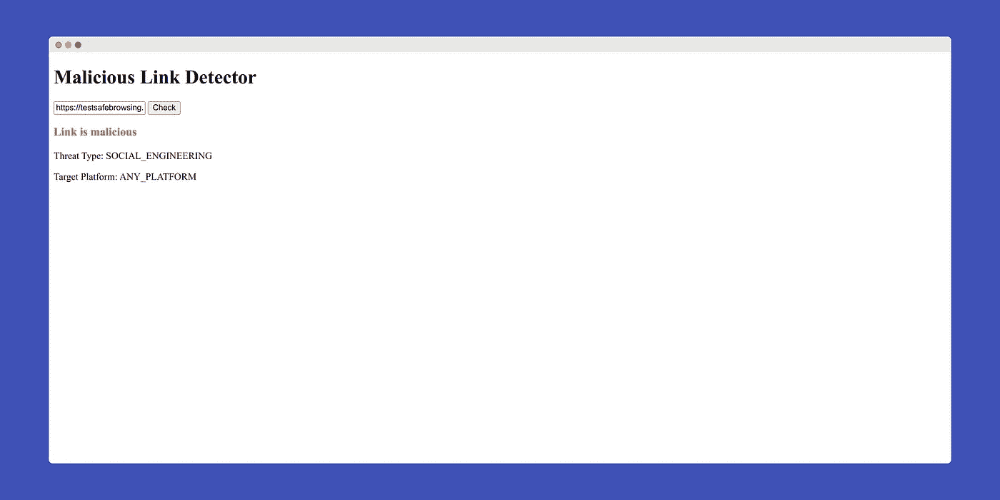

# 防止黑客在您的 Web 应用程序中发布恶意链接

> 原文：<https://javascript.plainenglish.io/prevent-hackers-from-posting-malicious-links-in-your-web-applications-a6b17b9e0b82?source=collection_archive---------19----------------------->

## 阻止用户点击不想要的链接

Photo by [Scott Webb](https://unsplash.com/@scottwebb?utm_source=medium&utm_medium=referral) on [Unsplash](https://unsplash.com?utm_source=medium&utm_medium=referral)

减少 web 漏洞并确保高安全性是 web 开发人员的首要任务。为新业务或 SaaS 应用程序部署网站时，我们需要确保我们的系统不会受到任何潜在风险的影响。

从事网络安全工作的首要规则是永远不要相信用户。有时黑客会在网站上发布恶意链接，攻击点击这些链接的用户。有时，黑客会发布网络钓鱼链接，以获得对用户敏感信息的未授权访问。作为 web 开发人员，我们的主要责任是不允许用户在我们的 web 应用程序中发布恶意链接。

在本文中，我们将讨论如何检测 web 应用程序中的恶意链接。我们将使用谷歌安全浏览器 API 来检测恶意链接。因此，没有进一步的行动，让我们开始吧！

# 什么是谷歌安全浏览？

根据[谷歌开发者文档](https://developers.google.com/safe-browsing)，

> 安全浏览是谷歌的一项服务，让客户端应用程序根据谷歌不断更新的不安全网络资源列表检查 URL。不安全 web 资源的例子有社交工程站点(网络钓鱼和欺骗性站点)以及托管恶意软件或不需要的软件的站点。

为了简单起见，谷歌保留了不安全网络资源的记录，当我们搜索特定链接时，谷歌会根据该记录搜索该链接。通过使用 Google 安全浏览 API，我们可以检测威胁类型、目标平台和所有其他必要的信息。

# 让我们开始实现吧

让我们创建一个简单的 HTML 网站来输入链接，并告诉用户这是否是一个恶意链接。如果用户输入的链接是恶意的，我们将向用户描述威胁的类型和目标平台。为了更方便，我们将使用 JQuery。

这里，我们已经创建了一个基本的 HTML web 脚本，用户将在其中输入链接，并确定他们输入的链接是否是恶意的。

Website Result

现在，我们需要检测链接是安全的还是恶意的。为此，我们需要调用 Google 安全浏览 API。

## 获取 API 密钥

要调用 Google 安全浏览 API，我们首先需要有一个 API 键。获取 API 密钥实际上很简单。

首先，进入[谷歌开发者控制台](https://console.developers.google.com/)。用你的 Google 帐户登录，然后创建一个新项目，如果你没有的话。然后从左侧面板进入 API &服务>库，搜索“*安全浏览 API* 激活安全浏览 API。从搜索结果中获得安全浏览 API 后，点击它，应该会得到一个“*启用*按钮。点击“*启用*按钮来激活安全浏览 API。

接下来，单击左侧面板中的 API & Services > Credentials，并单击“ *Create Credentials* ”。从下拉菜单中选择 *API key* ，复制 API key，并保存在安全的地方。

## 调用 API

现在，我们已经得到了 API 键，是时候调用 API 了。让我们像下面的代码一样修改 HTML 代码来调用 API 来检测恶意链接。

如果我们在浏览器中测试这段代码，我们可以看到恶意链接和真实链接的结果。

Results for Genuine Link

Result for Malicious Links

相当令人印象深刻的权利！

您可以在[安全浏览测试链接](https://testsafebrowsing.appspot.com/)网站上找到恶意链接列表。如果你愿意，可以用其他恶意链接进行测试。希望它能检测出目前互联网上的大多数恶意链接。

# 结论

我们现在将能够检测我们网站上的恶意链接，并阻止我们的用户点击它们。

虽然 Google 安全浏览 API 仅用于非商业用途，但我们可以将 [Google Web Risk API](https://cloud.google.com/web-risk) 用于商业用途。

如果你喜欢我的文章，这里有另一篇文章是关于在 JavaScript 中存储认证令牌的最终方法。

 [## 在 JavaScript 中存储身份验证令牌的最终方式

### 像专业人士一样处理认证

javascript.plainenglish.io](/the-ultimate-way-to-store-authentication-tokens-in-javascript-41900756c1ae) 

祝您愉快！

*更多内容请看*[***plain English . io***](http://plainenglish.io/)