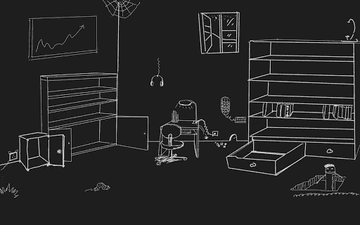
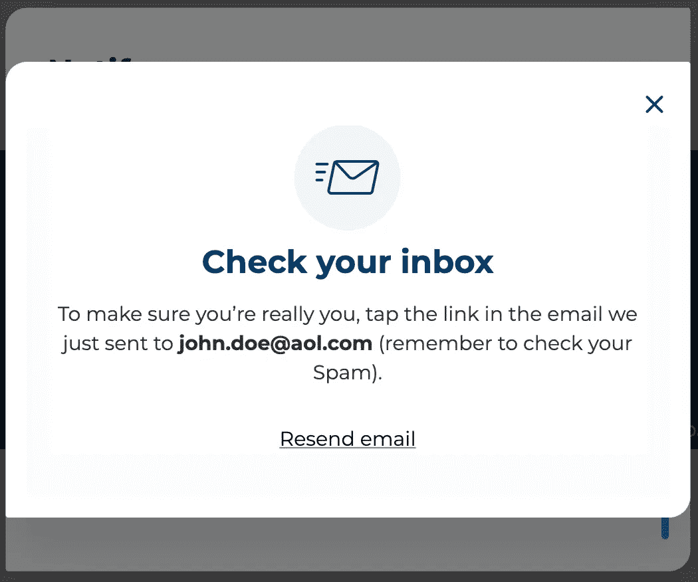
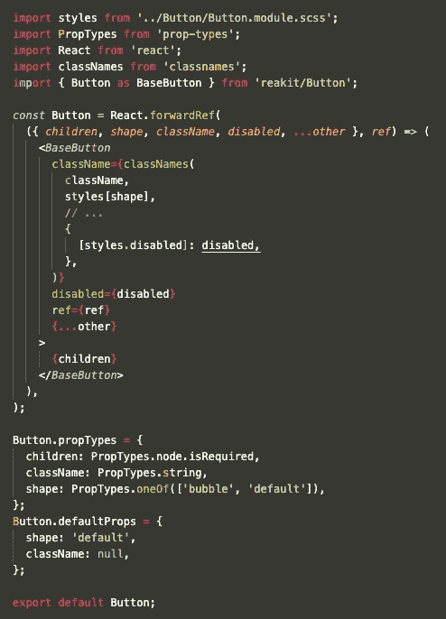
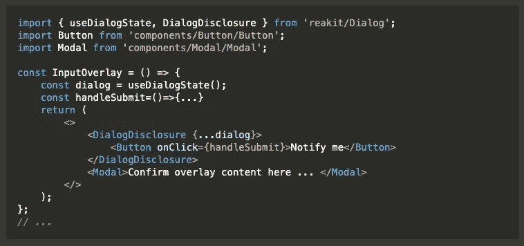
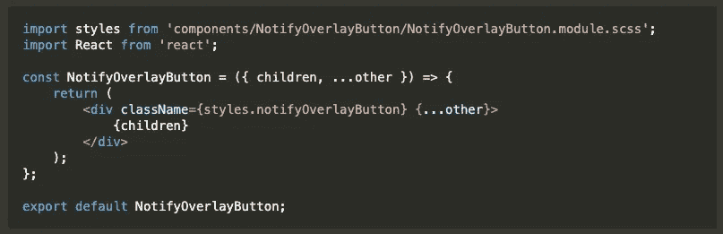
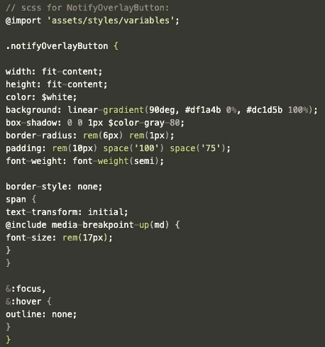
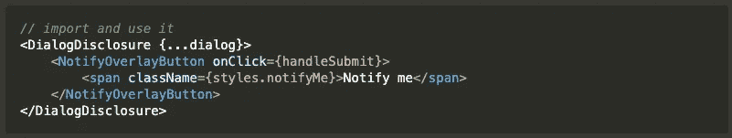

# 如何防止嵌套

> 原文：<https://javascript.plainenglish.io/prevent-validatedomnesting-button-descendant-error-21d9a34e5984?source=collection_archive---------11----------------------->

## 你熟悉这个错误吗？💻

Every day is a miracle 🌸

在我最近正在做的项目中，我需要创建一个“**对话框**”作为包含一个基本的“**输入表单**”的**覆盖图**。在这个覆盖图中，还有一个可点击的**按钮**，可以打开一个“**电子邮件确认**覆盖图。

为了让它更清晰，我们先来看看“输入表单”的叠加，它应该是这样的:

The overlay in the middle is opened by the red button at the top right of the background page

*🔴红色按钮是使用*[***Reakit***](https://reakit.io/docs/get-started/)*库创建的按钮组件。Reakit 是一个低级组件库，用于构建可访问的高级 UI 库，用 React 设计系统和应用程序。*

点击这个"**输入表单上的按钮**叠加，经过一些验证后，你将能够打开"**邮件确认"**叠加:

**“email confirmation”** overlay is opened from the button within “**input form**” overlay, the email address is just an example

步骤非常简单:

首先，我们创建一个**可重用按钮组件**(在本例中是红色的***通知我***按钮)，为了使整个页面看起来和谐统一，没有必要重复创建类似的按钮:

part of reusable Button Component example

其次，创建带有这个红色按钮的"**input verlay**"组件，它可以打开" **email confirmation** "覆盖图( **Modal** )，我们在其中导入我们的按钮组件，类似如下:

“**email confirmation**” overlay(in this case: **Modal,** which is another reusable component) will be opened from this button within DialogDisclosure

就这样？！那很容易！让我们打开控制台检查一下。

💥啊，在这里！一切正常，页面看起来不错，但是我注意到实际上存在一个错误:`validateDOMNesting(…): <button> cannot appear as a descendant of <button> ...`

作为一个追求完美的开发者，我不希望那些红字出现，我得做点什么来防止，忘了文章开头的笑话吧…

经过一系列检查，我找到了原因:

默认[**dialog Disclosure**](https://reakit.io/docs/dialog/)使用 [**Disclosure**](https://reakit.io/docs/disclosure/) ，由 PopoverDisclosure 及其衍生产品使用，Disclosure 使用**按钮**。

这意味着:

在“input form”覆盖中， **DialogDisclosure** 已经嵌套在一个**按钮**组件中，因此出现了错误，像我之前那样将按钮包装在 DialogDisclosure 中并不是最好的方式，这就是为什么“ *validateDOMNesting(…): <按钮>不能作为<按钮> …* 的后代出现，虽然这并不影响程序的运行。🌦

以下是我的简单解决方案:

🌟创建了一个简单的类似**按钮的**组件，并在对话框中使用它代替**按钮**:

“Button-like” component: NotifyOverlayButton returns a simple “div”

给它一些样式，使它看起来像我们的按钮:

Please ignore the scss module for this example

在 **InputOverlay** 组件中，导入并使用它代替“**按钮**”。

现在错误没有了！

## 结论

从这个简单的经历中，我学会了如何正确阅读错误信息，以及一步一步找到错误根源的重要性。有时候有些错误并不影响应用，但是你学到的每一个知识点都会让你感到快乐！

我希望你喜欢这篇文章，还有一篇文章与这个例子有关:

 [## 用对话框覆盖反应电子邮件验证

### —电子邮件验证有时令人头疼，🧊

medium.com](https://medium.com/geekculture/react-email-validation-with-dialog-overlay-472ee564d585) 

谢谢大家，编码快乐！

*更多内容看* [***说白了. io***](http://plainenglish.io)