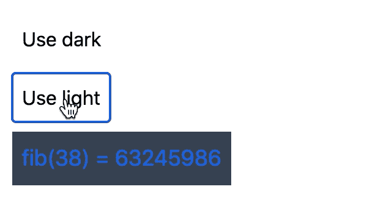

# 防止 React 中出现过多的重复渲染

> 原文：<https://javascript.plainenglish.io/preventing-redundant-re-renders-in-react-c0de7c92d0b6?source=collection_archive---------6----------------------->

在开发 React 应用程序时，我通常不会过多考虑渲染性能。React 有其著名的[树协调算法](https://reactjs.org/docs/reconciliation.html)，可以有效地更新 UI。这种方法工作良好，直到它不工作，这就是这篇文章的内容。

**渲染功能可能非常昂贵**

让我们考虑一个显示第 n 个斐波那契数的组件，来模拟现实生活中在 render 方法中进行大量数据处理的应用程序组件。

它使用一个非常无效的递归算法来计算第 n 个斐波那契数，所以随着 n 的增加，它变得非常慢。假设`Fibonacci`组件呈现在一个频繁更新的组件内部。

演示组件保持文本的状态，所以它将在每次文本改变时重新呈现。即使`Fibonacci`组件道具没有改变，默认情况下也会被重新渲染。如何解决这个问题？

这相当简单，只需将`Fibonacci`组件包装在`React.memo`中

```
export default React.memo(Fibonacci)
```

这将防止 react 在属性不变的情况下重新渲染组件。默认情况下，React 在以前的和新的属性之间执行浅层相等检查。或者，自定义比较器函数可以作为第二个参数传递。就我个人而言，我不推荐后者，请记住，运行定制的比较器函数可能成本很高(例如，一些大型对象的深度比较)。

应用`React.memo`解决了我们的性能问题，完美！

比方说，出于某种原因，我们想要计算斐波那契数列被点击的次数。这很简单，我们只需添加`onClick`处理程序。

不幸的是，每次点击后都会出现小故障。看起来每次点击 Fibonacci 组件都会重新呈现。原因是什么？由于`Demo`组件在其状态中保持计数，因此每次计数更新时都会重新呈现。即使`Fibonacci`组件被包装在`React.memo`中，onClick 处理程序在每次渲染中都是不同的函数。解决方案？函数应该只创建一次，并在随后的渲染中重用。为 react 提供了`useCallback`钩子。

现在，每次渲染`handleFibNumberClicked`都会引用相同的函数，所以`React.memo`执行的浅层等式检查将会成功。

是一种特定于反应的记忆函数的方式。相当于接下来要描述的`useMemo(() => function, [...deps])`。

有一天，产品负责人提出了一个请求，要求根据当前的主题调整组件的外观。由于主题化是一个全球性的问题，它被实现为包装应用程序的上下文提供者。

嗯，改变应该很容易。我们可以用`useTheme`钩子获得当前主题，然后应用一些 CSS。

好吧，我们现在有一个问题，委婉地说，改变主题感觉不是很爽快。



这是为什么呢？由于`Fibonacci`组件订阅了`Theme`上下文，所以每次上下文值改变时，它都会被重新呈现。这是有意义的，毕竟所有的 CSS 类都必须更新。但是假设`n`没有改变，我们能防止重新计算 fib 函数结果吗？

幸运的是`useMemo`虎克前来救援！改变很容易。您所需要的只是像这样包装对一个昂贵函数的调用

```
const result = useMemo(() => fib(n), [n]);
```

第二个参数是一个依赖数组。只要数组中的值在两次渲染之间保持不变，`fib`函数将只执行一次。请记住，在每次渲染时，react 都需要创建一个依赖数组，并对相应的元素执行浅层相等检查，因此这种优化不是免费的！尽管如此，它对于记忆昂贵的计算来说还是很有意义的。

我希望这篇文章有助于理解`React.memo`、`useCallback`和`useMemo`如何帮助解决 React 中的性能问题。我很高兴听到你在这方面的经验。

一些有用的资源:

*   [https://github . com/Facebook/react/issues/15156 # issue comment-474590693](https://github.com/facebook/react/issues/15156#issuecomment-474590693)
*   [https://kentcdodds.com/blog/usememo-and-usecallback](https://kentcdodds.com/blog/usememo-and-usecallback)
*   [https://reactjs.org/docs/hooks-reference.html#usememo](https://reactjs.org/docs/hooks-reference.html#usememo)
*   [https://reactjs.org/docs/hooks-reference.html#usecallback](https://reactjs.org/docs/hooks-reference.html#usecallback)
*   [https://reactjs.org/docs/react-api.html#reactmemo](https://reactjs.org/docs/react-api.html#reactmemo)