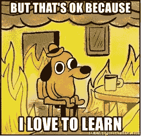

# 防止下一次 NPM 病毒爆发

> 原文：<https://javascript.plainenglish.io/preventing-the-next-npm-virus-outbreak-7403e0d672cc?source=collection_archive---------11----------------------->

如今，做`npm install`似乎成了开发者的第二天性。但是你知道吗，如果没有适当的关注和审计 npm 包，下次我们不知不觉地做`npm i`时，你也可能安装恶意脚本。

# NPM 病毒是免费的吗？

我们知道国家预防机制包是由第三方行为者维护的。这可以是一个开发者，一个开发团队或者一个超级大的公司。

NPM 本身是非常可靠的。但是 NPM 能保证你安装的任何软件包都没有病毒吗？可惜没有。

所以这些天来，经常听到[一些开发者](https://youtu.be/24tQRwIRP_w?t=935)预见到有一天一次成功的病毒攻击会通过 NPM 数百万台机器传播开来。

抱歉，如果我是第一个告诉你的人:**NPM**🤦🏼‍♂️.

我不会深入所有的技术细节，如何利用可能在 NPM。只需知道 npm 已经[公开](https://blog.npmjs.org/post/141702881055/package-install-scripts-vulnerability)披露，一个明显“正常”的 NPM 包(或其依赖项)有可能在你的机器中执行恶意代码并造成严重破坏。

对于*来说，任何*包都可能被破坏。你可能已经安装了 ESLint 吧？你猜怎么着？它的一个依赖项(不久前)遭到破坏，并在用户机器上安装了恶意代码。ESLint 团队和 NPM 迅速采取行动解决问题，他们的事故报告可以在这里看到。但这并不是最后一次发生病毒事件。现在，NPM 安全小组正在发布此类事件的每周报告。

# 防止暴露于未来的 NPM 病毒爆发

漏洞可被定义为利用代码中的漏洞导致意外或恶意行为发生的脚本。一个漏洞可能是 ESLint 事件的罪魁祸首。我们可以采取一些措施来保护我们的代码，以避免感染任何未来的恶意脚本事件。

# NPM 安全建议:

## **1。安装新的 NPM 软件包之前请三思**

你确定你真的需要它吗？保养的好吗？你能自己编码吗？在添加新的依赖关系之前，问自己以下问题。保护你自己的最好方法就是简单地减少*和*套餐。如果你是团队的一员，你也可以**在安装一个新的软件包之前咨询你的团队**。即使你只是在尝试。你可能不想成为那些使用看似无害的包，然后被报道含有漏洞的人之一，就像最近的 [**报道**](https://www.zdnet.com/article/malicious-npm-packages-caught-installing-remote-access-trojans/) 中发生的那样。

## **2。手动使用**`**npm audit**`

**该命令由 NPM 发布，以应对其脆弱性。实际上每次你做`npm install`，npm 审计也会自动运行。`npm audit`命令将扫描你的包的漏洞。你甚至可以通过`npm audit fix`自动修复漏洞。该命令的有效性取决于它如何更新到最新的威胁和报告，但它必须是您的编码库的一部分。您应该手动运行此命令，根据需要进行检查和修复。你可以在 [**文档**](https://docs.npmjs.com/cli/v6/commands/npm-audit) 上了解更多。这里还有一个 [**的好视频**](https://youtu.be/rXV6-eXB26s) 涵盖了运行这个命令时的常见情况。**

## ****3。Github 警报****

**如果你使用 Github，那么只需通过它的依赖 bot alerts 来利用 Github，这是免费的。如果你忽略了这些警告，不要。在 [**Github 文档**](https://docs.github.com/en/github/managing-security-vulnerabilities/about-alerts-for-vulnerable-dependencies) 上了解更多信息。**

## ****4。使用第三方软件****

**如果你是大团队的一员，这很有用。有很多开发安全的工具可以扫描你的依赖关系来寻找漏洞。部分选项有 [**Snyk**](https://snyk.io/) 和 [**白源**](https://www.whitesourcesoftware.com/) 。**

## ****5。支付开源维护者****

**你没听错。许多 NPM 软件包都是开源的。维护者最终必须支付他们的账单，支持他们不仅可以在经济上帮助他们，还可以让他们承担道德责任。**

## ****6。向 NPM 报告可疑包裹****

**就像你在机场听到的一样。对于 support@npmjs.com 来说，如果你看到任何可疑的事情，就报告给 [**。**](mailto:support@npmjs.com)**

## ****7。禁用 NPM 脚本****

**您可以通过选择不使用脚本来阻止恶意脚本。这对某些人来说可能是一个障碍，因为它也禁用了 package.json 上的定制脚本。可能会出现软件包安装不正确以及 npm run 或 npm test breaking 等常见命令的意外后果。一些人通过使用 shell 别名如`nrun = npm run --ignore-scripts=false`或`ntest = npm test --ignore-scripts=false`来允许一些特定的脚本工作。我不能保证你还会遇到什么问题。尝试这种策略，风险自担。**

# **结论**

**那么下一个将影响数百万台电脑的末日 NPM 病毒何时到来？谁知道呢。因此，虽然我们可能无法阻止下一次爆发，但作为开发人员，我们需要保护自己。**

**我们总是渴望开始编码，并希望尽快设置好。但是下一次你准备安装 npm 的时候，问问你自己:*在安装*之前，我应该执行什么安全检查吗？我们总有办法审计我们的 NPM 套餐。**

****

**通过应用这些 NPM 安全建议，我们的代码变得更加安全，我们可以大大降低下次爆发时被感染的风险。**

***原载于 2021 年 2 月 11 日 https://fbohz.com***。****