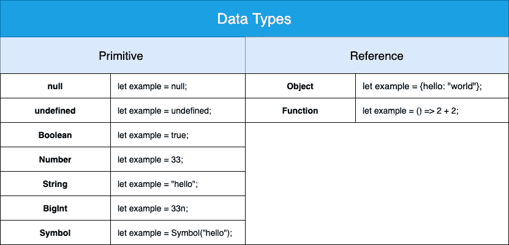
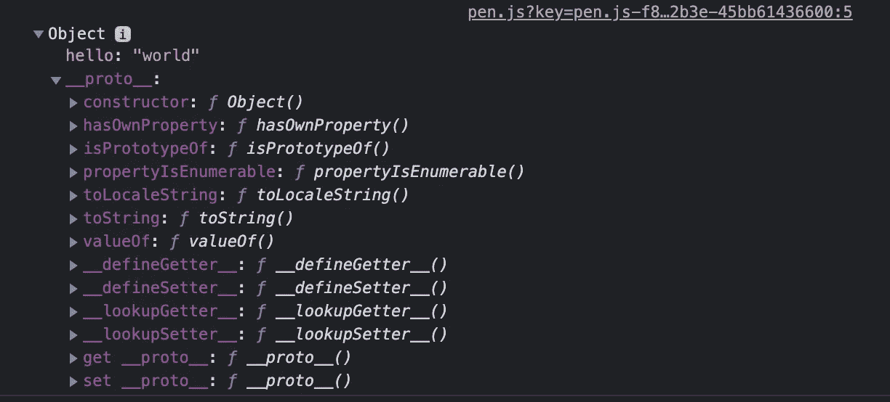
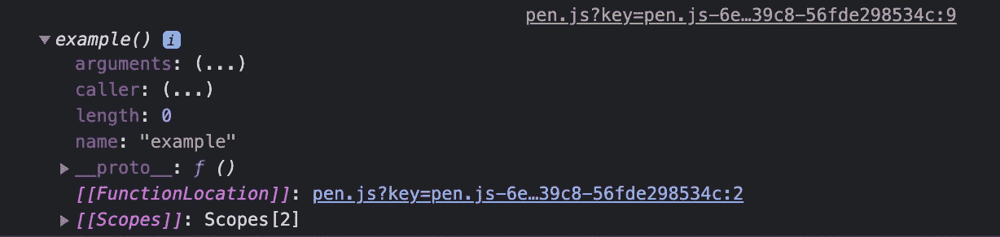
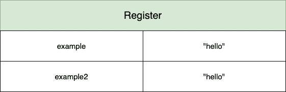
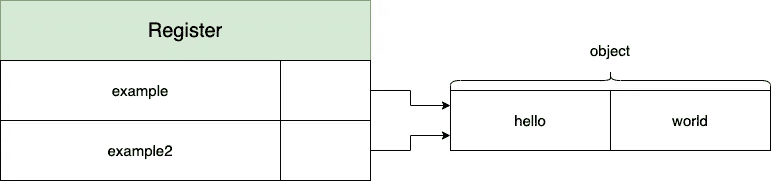

# JavaScript 中的原始和引用数据类型

> 原文：<https://javascript.plainenglish.io/primitive-and-reference-data-types-in-javascript-2b3916cae1ef?source=collection_archive---------12----------------------->


在下面的概述中，您会看到一个基本数据类型和引用数据类型的列表，每个类型都有一个示例。



在我们指出记忆行为的区别之前，让我们仔细看看这些类型。

您可以使用检查的*类型检查任何变量的数据类型。*

```
let example = "hello";console.log(typeof example);
// outputs: > "string"
```

## 原始数据类型

数据类型 **null** 表示有对象缺失或无效。

> 特殊的[原语](https://developer.mozilla.org/en-US/docs/Glossary/Primitive)类型对其值有额外的用法:如果对象没有被继承，那么`null`被显示；

```
let example = null;console.log(typeof example);
// outputs: > "object"
```

数据类型**未定义**顾名思义，值尚未定义。

```
let example;
let count = 6;if (count > 7) {
    example = "gets a value";
}console.log(typeof example);
// outputs: > "undefined"
```

数据类型**布尔**只能有两个值*真*或*假*。它经常被用来写条件来控制程序的流程。

```
let example = true;
if (example) {
    example = false;
}console.log(typeof example);
// outputs: > "boolean"
```

数据类型**数字**表示一个介于(2⁵1)和 2⁵1)之间的浮点数。

```
let example = 33; // or something more precise 33.33console.log(typeof example);
// outputs: > "number"
```

数据类型**字符串**是用于表示文本的字符序列，例如字母、数字、特殊字符和控制字符。

```
let example = "hello";console.log(typeof example);
// outputs: > "string"
```

数据类型 **BigInt** 保存数值，如果您需要处理超过数据类型 Number 的安全整数限制的非常大的数字，这种数据类型是相关的。您可以查看带有*数字的最大安全整数。MAX_SAFE_INTEGER*

```
console.log(Number.MAX_SAFE_INTEGER);
// outputs: 9007199254740991**let example** **= 33n ** 33n;****console.log(typeof example);
// outputs: > "bigint"**console.log(example);
// outputs: > 129110040087761027839616029934664535539337183380513nlet example2 = 33 ** 33; // number data typeconsole.log(example2);
// outputs: > 1.2911004008776101e+50let example3 = 33 ** 33n; // number and bigint is not mixableconsole.log(example3);
// outputs: "Uncaught TypeError: Cannot mix BigInt and other types, use explicit conversions"
```

数据类型**符号**是一种有保证的方式，以确保该值是唯一且不可变的。

```
**let example = Symbol("hello");****console.log(typeof example);
// outputs: > "symbol"**let example2 = Symbol("hello");console.log(example === example2);
// outputs: > false
```

## 参考数据类型

数据类型**对象**保存了一组无序的数据和指令的键值对。可以用`new Object()`或字面语法`{}`创建

```
**let example = {hello: "world"};** // same as...
let example2 = new Object();
example2.hello = "world";**console.log(typeof example);
// outputs: > "object"**// console.dir gives you more insights about the inheritance in the // dev console -> see the image below
console.dir(example);
```



数据类型**函数**可以封装一段代码，可以自我继承或者被其他代码调用。

```
// arrow functions are a compact alternative to function
**let example = () => 2 + 2;**// same as...
function example2() {
    return 2 + 2;
}**console.log(typeof example);
// outputs: > "function"**// insights about the inheritence and scopes -> see the image below
console.dir(example);
```



关于数据类型的更多细节，请访问 Mozilla 的优秀文档[这里](https://developer.mozilla.org/en-US/docs/Web/JavaScript/Data_structures)。

## 原始类型的内存行为

对于每个基本类型，该值将总是单独保存，即使您将变量 example 保存到 example2 中。

```
let example = "hello";
let example2 = example;console.log(example);
console.log(example2);// outputs: > "hello"
// outputs: > "hello"
```



这里的关键点是变量 example 的变化不会影响 example2，因为值是复制的。

```
example = "hello world";console.log(example);
console.log(example2);// outputs: > "hello world"
// outputs: > "hello"
```

## 引用类型的内存行为

与基本类型相反，引用类型顾名思义只保存对值的引用，在本例中是对象。

```
let example = {hello: "world"};
let example2 = example;console.log(example);
console.log(example2);// outputs: > {hello: "world"}
// outputs: > {hello: "world"}
```



这里的关键点是变量 example 的变化并不影响 example2，因为该值只是被引用。

```
example.additionalField = 33;console.log(example);
console.log(example2);// outputs: > {hello: "world", additionalField: 33}
// outputs: > {hello: "world", additionalField: 33}
```

如果您将您的引用移交给一个函数，您的原始对象会受到更改的影响。

```
let example = {hello: "world"};const exampleFunction = (object) => {
  object.number = 33;

  return object;
}exampleFunction(example);console.log(example);
// outputs: > {hello: "world", number: 33}
```

您可以通过使用 spread 操作符轻松解决这个问题，并将副本保存到一个新变量中。你可以阅读更多关于传播运营商[在这里](https://developer.mozilla.org/en-US/docs/Web/JavaScript/Reference/Operators/Spread_syntax)。

```
let example = {hello: "world"};const exampleFunction = (object) => {
  const newObject = **{...object}**;
  newObject.number = 333;
  console.log(newObject);

  return object;
}exampleFunction(example);console.log(example);
// outputs: > {hello: "world", number: 33}
// outputs: > {hello: "world"}
```

请记住，用 **new** 关键字创建的几乎所有东西都是一个对象的实例，数组也是如此，不管你是通过调用`new Array()`还是仅仅通过`[]`来创建它们。

我希望我对基本类型和引用类型做了全面的介绍。欢迎在评论中写下你的任何问题！

*更多内容请看*[***plain English . io***](http://plainenglish.io)