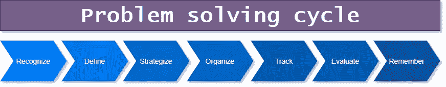

# 软件开发人员的问题解决

> 原文：<https://javascript.plainenglish.io/problem-solving-101-429d4437f5fc?source=collection_archive---------11----------------------->

## 解决问题 101

在这篇文章中，我想讨论解决问题，这是软件开发人员需要掌握的关键技能之一。作为一名软件开发人员，你会整天面对问题。一般来说，IT 和软件开发都是为了解决问题。如果你不喜欢这样做，那么你可能不会那么喜欢软件开发。

这个内容是我的 [Dev 概念系列丛书](https://dev-concepts.dev)的[第一卷](https://gum.co/DevConcepts-Part-01-SoftwareCraft)的一部分。

# 早期

在你作为开发人员的早期，你会花很多时间与编译器、解释器和 linters 对抗。为什么这个表达式无效？那个功能有什么问题？这里应该使用什么类型？等等。随着时间的推移，一旦你克服了这些学习上的困难，你就可以在更“重要”的问题上碰壁了，比如:

*   这个变量应该怎么称呼？
*   我没有导入那个模块吗？
*   为什么此时该值为空？
*   这一点上不应该是真的吗？
*   十分钟前我在做什么？

开个玩笑！然而，更严重的是，由于多年来你会经历不断的试错过程，你会一次又一次地面对和解决相同类型的问题，尽管形式不同。解决这些问题对你来说会变得越来越容易。但是新的变种会出现，总是让你大吃一惊。像病毒一样，总有新的问题变种。

此外，你越有经验，你要解决的问题就越复杂(最复杂的问题总是与团队协作有关)。随着经验的增长，另一个有趣的部分是你将能够预见问题并避免其中的一些，例如从一开始就创建更可靠的架构/设计。

当你不断面对问题时，有两种主要的可能反应:发疯或觉得有趣，以及着手解决手头的新难题。希望你能成为第二组的一员。有时候，解决一个问题会花你几分钟时间，而且不会给你带来太多麻烦。但有时，问题需要几个小时甚至几天才能解决，这会打击你的士气，尤其是当你感到压力的时候。还有一些你无法解决的问题，你和你的团队将不得不寻求外部帮助或解决方法。

# 解决问题的周期和方法

解决问题可以用系统的方法来处理。例如，使用*解决问题周期*:

*   **发现问题**:在做任何事情之前，我们需要发现问题所在
*   **定义问题**:我们需要明确需要解决的问题
*   **制定解决问题的策略**
*   **组织信息**:关于这个问题，我们有什么信息，我们需要找出什么，等等
*   **跟踪进度**:如果我们不跟踪自己的进度，那么我们可能会花费太多的时间/精力。通过评估进展，我们将能够在需要时设计/尝试其他策略
*   **评估找到的解决方案(正确性、效率等)**:如果有多个解决方案，这尤其有用
*   **记住**:记录以前遇到的问题及其解决方案，以避免将来不得不再次寻找相同的解决方案

在分析问题的同时，我们可以创建一个 [*论证图*](https://en.wikipedia.org/wiki/Argument_map) ，这是一个可视化*问题空间*的有用工具。我们还可以利用许多其他的[问题构造方法](https://en.wikipedia.org/wiki/Problem_structuring_methods)。

重新表述一个问题对于确保它被清楚地理解也是非常有用的。一旦清楚地表达出来，就应该尽可能地简化/减少。目标是简化，关注本质，去除所有的噪音。

*   **头脑风暴**:找出许多想法和潜在的解决方案，但不要马上做出判断
*   **类比**:与其他类似问题进行比较
*   分而治之:把问题分解成更小、更容易解决的部分
*   抽象:在真正的系统上解决问题之前，先在纸上/思想中/原型上解决问题
*   **假设验证**:验证部分解决方案
*   **根本原因分析**:识别问题的真正来源
*   **消除**:返工甚至消除一个系统或子系统，使问题完全消失。有时候，消除问题的根源是前进的最快方式
*   等等

例如，我们可以创建一个[问题树](https://en.wikipedia.org/wiki/Issue_tree)，它将一个问题的可能解决方案可视化，并分别探索这些解决方案。对于根本原因分析，我们可以使用[五个为什么](https://en.wikipedia.org/wiki/Five_whys)技巧和/或[石川图表](https://en.wikipedia.org/wiki/Ishikawa_diagram)。

我们还可以使用，这是我们可以用来组织信息/知识和分析概念/想法的更强大的工具之一。我是思维导图的超级粉丝。当试图解决问题时，思维导图也非常有用。

总的来说，可视化和[图解推理](https://en.wikipedia.org/wiki/Diagrammatic_reasoning)对*帮助很大*，所以不要犹豫去阅读关于可视化技术的文章/书籍；它*将*证明是有用的。

作为专业的问题解决者，当我们最终“啊哈”的时候，会有一种真正的快乐力矩(又称[尤里卡效应](https://en.wikipedia.org/wiki/Eureka_effect))；当谜题最终被解开时。只持续一瞬间(因为下一个问题已经摆在你面前了)，但那一瞬间就是*极乐*。有时解决方案会出乎意料。许多开发人员已经带着他们脑海中的问题入睡了，并且在早上有了解决方案。

在其中，问题往往有许多可能的解决方案。当然，有些比其他的好，但这并不总是显而易见的。

# 参考

*   [理想的问题解决者:提高思维、学习和创造力的指南](https://www.amazon.com/Ideal-Problem-Solver-Improving-Creativity/dp/0716722046?tag=dsebastien00-20)作者约翰·d·布朗斯福德和巴里·s·斯坦
*   [解决问题](https://en.wikipedia.org/wiki/Problem_solving)
*   [破解了！:如何解决大问题](https://www.amazon.com/Cracked-problems-solutions-strategy-consultants-ebook/dp/B07DMFYH2R?tag=dsebastien00-20)作者:伯纳德·加雷特、科里·菲尔普斯和奥利维尔·西博尼
*   [出库树](https://en.wikipedia.org/wiki/Issue_tree)
*   [五个为什么](https://en.wikipedia.org/wiki/Five_whys)术
*   [石川图](https://en.wikipedia.org/wiki/Ishikawa_diagram)
*   [思维导图](https://en.wikipedia.org/wiki/Mind_map)
*   托尼·布赞对思维导图的掌握
*   [图解推理](https://en.wikipedia.org/wiki/Diagrammatic_reasoning)
*   [尤里卡效应](https://en.wikipedia.org/wiki/Eureka_effect)
*   [如何解决](https://www.amazon.com/How-Solve-Aspect-Mathematical-Method/dp/069116407X?tag=dsebastien00-20)作者 G. Polya
*   [思考，快与慢](https://www.amazon.com/dp/0141033576?tag=dsebastien00-20)通过丹尼尔·卡内曼

# 结论

在本文中，我讨论了解决问题的技巧，这是所有软件设计师的关键。我已经介绍了解决问题的周期，以及一些可以用来解决最复杂问题的方法。请务必查看我在上面分享的参考资料，因为它们包含了更多帮助你解决你将面临的迷人难题的钥匙。

解决问题确实需要特定的思维模式/思维过程、分析思维和特定的技能，我们将在下面讨论。

你最喜欢的解决问题的方法是什么？

今天到此为止！

PS:如果你想了解大量关于软件/Web/产品开发的其他很酷的事情，那么[订阅我的时事通讯](https://dsebastien.net/news)，[查看我的开发概念书籍](https://dev-concepts.dev/)，[加入软件工匠社区](https://join.slack.com/t/softwarecrafterstalk/shared_invite/zt-umgx3v06-4rtJ20PXz867GTPzCk1zeQ)，并且[来 Twitter 上打招呼！](https://twitter.com/dSebastien)

*原载于 2021 年 9 月 11 日 https://dsebastien.net***。**