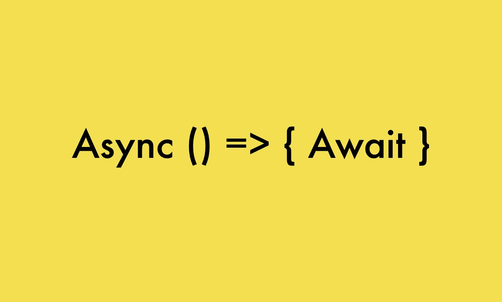

# 从异步 Await 函数返回值的问题

> 原文：<https://javascript.plainenglish.io/problem-with-returning-values-from-async-await-function-javascript-e99c94a47ca5?source=collection_archive---------2----------------------->

在 JavaScript 中，有时当你不知道事情是如何工作的时候，你开始挠头，但是你找不到解决的办法，这是很烦人的。在这篇文章中，我将讨论一个有趣的问题。本文基于 async 和 await。



## 什么是异步和等待？

简而言之，它们是承诺嵌套的语法糖。如果你没有意识到这一点，请阅读我解释异步的文章，并在这里等待。

假设你已经阅读了上面的文章，知道什么是异步和等待，让我们举一个简单的例子。

```
async function foo() {
   const result1 = await new Promise((resolve) => setTimeout(() =>   resolve('1')))
   console.log(result1); //Output is 1
}
```

上述函数的输出是 1，非常简单明了，await 将阻塞主线程，直到 promise 被解析。现在让我们来看看上面代码片段的有趣版本。

## **你能猜出下面代码片段的输出吗？**

```
async function foo() {
   const result1 = await new Promise((resolve) => setTimeout(() => resolve('1')))
   return result1;
}
let output = foo();
console.log('Output is' + JSON.stringify(output) );
```

对于那些认为输出为 1 的人，你们错了。复制代码并尝试在任何在线编译器上运行，输出是{}。

## **为什么会这样？**

因为异步函数总是返回一个承诺，而不是解析上面例子中的承诺，所以我们试图从中提取值。

## **有什么解决办法？**

```
async function foo() {
   const result1 = await new Promise((resolve) => setTimeout(() =>    resolve('1')))
   return result1;
}
let output = foo().then(data => {
 console.log('Result is' + JSON.stringify(data)) 
});
```

由于异步函数在上面的代码片段中返回了一个承诺，我们在**的帮助下解决了这个问题。然后使用**方法并从中提取值。

## **更好的方法**

我们使用异步和等待，因为我们想避免承诺链或。然后表达，所以相当于使用。然后我们可以使用 async 并等待它自己来解析承诺，下面的代码片段将代表这一点。

```
async function foo() {
   const result1 = await new Promise((resolve) => setTimeout(() => resolve('1')))
   return result1;
}async function test(){
 let output = await foo();
 console.log('Result is' + JSON.stringify(output)); // Output is 1 
}test()
```

阅读愉快，在我的下一篇文章中再见。

**同一作者的更多文章:**

1.  [JavaScript 中的一切如何都是对象？](https://mevasanth.medium.com/how-everything-is-object-in-javascript-a4164d7e6a2d)
2.  [JavaScript 中的吊装:访谈热点](https://mevasanth.medium.com/hoisting-in-javascript-hot-topic-for-interview-43b463a6a77?source=follow_footer---------0----------------------------)
3.  [JavaScript 的记忆化——采访热门话题](https://mevasanth.medium.com/memoization-in-javascript-hot-topic-for-interview-815475544ab0)

在这里阅读作者[的所有文章。](https://mevasanth.medium.com/)

*更多内容请看*[***plain English . io***](http://plainenglish.io)