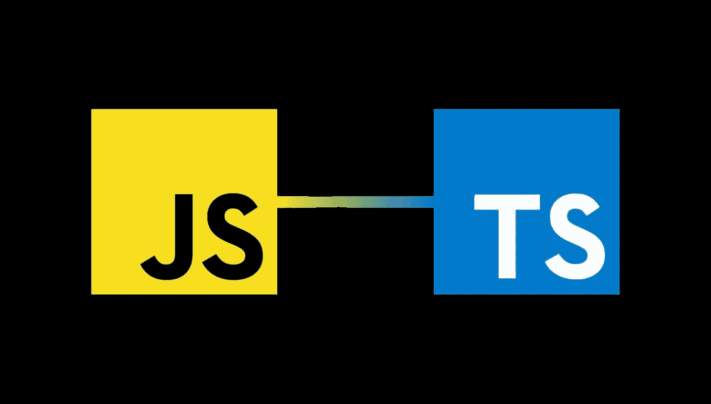

# 从纯 JavaScript 项目的 TypeScript 中获利

> 原文：<https://javascript.plainenglish.io/profit-from-typescript-in-pure-javascript-projects-5208a2f5c9b0?source=collection_archive---------23----------------------->

## 将 TypeScript 链接到 JavaScript 并启用类型检查



从 TypeScript 中获利有一个简单的方法，特别是在基于项目的操作中。当迁移不可行或已经提出疑问但没有得到任何*是*或*否*的回答时。从 JavaScript 迁移到 TypeScript 也意味着可能会出现问题，例如在某些情况下代码不兼容，或者没有足够经验的程序员来迁移项目，或者您的项目依赖于 Microsoft。

但是，TypeScript 是 JavaScript 的超集，这使得将 JavaScript 移植到 TypeScript 变得很容易。这意味着所有编写的类型脚本代码都是有效的 JavaScript (JS)代码。认为 TypeScript 编译器只适用于用 JavaScript 编写的项目是错误的。TypeScript (TS)编译器不关心文件 **的结尾。js* 或 **。ts* 没啥意思。因为 JS 没有从 TS 得到语言特性，也没有信息类型。

看起来旅程的终点是项目完全是 ts 或停留在 JS，但是还有第三种选择，通过 TypeScript 丰富基于 JS 代码的项目，而不需要完全迁移，从而创建混合。

# 明智地使用类型系统

到目前为止，我解释的内容限制了 TypeScript 的类型系统，并且它只在语言本身中可用。JS 不识别类型。JS 代码中存在无法识别类型的可能性，这可能会导致错误。那么，如何让这一切成为可能呢？

注释不是一个选项，因为 JavaScript 中没有有效的语法，比如

```
let x: number, y: number;
```

最简单的方法是使用注释。将注释的样式与 JSDoc 已知语法对齐。将先前声明的变量键入如下

```
*/** @type {number} */* let x;
*/** @type {number} */* let y;
```

访问这两个变量意味着我们可以分配两个数。

```
x = 23;
y = 23;
```

不幸的是，每隔一个值赋值不会导致错误。虽然应该有一个。下面的代码是有效的。

```
x = 'Hallo Welt!'; 
y = false;
```

这种有效代码的原因是:TS 只在基于 TS 项目的环境中检查类型，而不是在 JS 环境中。幸运的是，我们可以通过添加一行来启用这种类型的手动检查。该行必须是:

```
*//@ts-check*
```

一个例子可能是这样的:

```
*//@ts-check

/** @type {number} */* let x;
*/** @type {number} */* let y;
```

它现在将实现类型检查，将错误的类型值赋给两个变量中的任何一个都会导致编译器错误。你可以在这里阅读 TypeScript [支持的 JSDoc 的每一个关键字。](https://jsdoc.app/)

# **配置您的 JavaScript 项目**

想象一下在每个文件中放入一行 **//@ts-check** 。这是一个繁琐的过程，更实际的做法是让 TypeScript 在全球范围内使用。幸好有办法！

必须创建文件 *jsconfig.json* ,只需要一行代码就可以在整个项目中全局启用。 *Jsconfig.json* 看起来和众所周知的 *tsconfig.json* 几乎一模一样，但是当然，得到了 JS 特有的条目。因此，可以对所有文件启用类型检查。

是否要排除特定文件？将它们添加到 *jsconfig.json* 文件的排除列表中，或者将

```
*//@ts-nocheck*
```

从 TS 3.7 开始，你可以从类型声明中生成 **.d.ts* 文件，对此我们使用 JSDoc 注释。这意味着我们也可以在库中键入变量，而根本不用迁移到 TypeScript。为此，您需要一个 *tsconfig.json* 文件，尽管它仍然是一个纯 JavaScript 项目。添加行*编译器选项*和一堆首选项:

```
{ "include": [ "./src/**/*.js" ],
    "compilerOptions" : {
        "allowJs" : true,
        "declaration" : true,
        "emitDeclarationOnly" : true,
        "outDir": "./dist"
    }
}
```

***allow JS:true****:*甚至考虑项目中的 JS 文件，进行类型声明。在 TypeScript 项目中将忽略默认 JavaScript。
***声明:true*** :告诉编译器以 **.d.ts* 文件的形式显式创建类型声明。
***emitDeclarationOnly:true****:*你只想得到类型声明而不是代码的翻译。
***outDir:<dirPath>***:类型声明不是源代码的一部分。因此，粘贴在您的首选目录。

如果您不喜欢编辑 JSON，可以用如下参数启动编译器

```
$ npx tsc ./src/***/*.js --allowJs --declaration --emitDeclarationOnly --outDir ./dist*
```

已正确设置文件 package.json 中的 types-field。否则，模块无法找到相应的 **.d.ts* 文件。记住明智地选择集合属性也很重要。严格模式在 TS 中非常有用和有意义，但在 JS 中毫无意义。

# 结论

创建 JavaScript 和 TypeScript 的混合体只需要几个步骤。至少可以在不迁移整个代码库的情况下将类型系统实现到仅包含 JS 的项目中。

这是因为 TypeScript 基于像 JSDoc 这样的注释，JS-Codebase 的文档得到了增强，至少在使用 JSDoc 时是这样。我不能否认，您只能获得 TypeScript 提供的一些有意义的特性，这些特性将随完整的迁移一起提供。在这里得出一个结论:有总比没有好。

TypeScript 功能强大，可以为您节省大量时间和调试工作。对于大型项目，您需要一个好的理由来继续使用 JS，而不是迁移到 ts。但是正是因为这个特殊的原因，covered 方法提供了一种方法，至少有几个方便的可用选项。