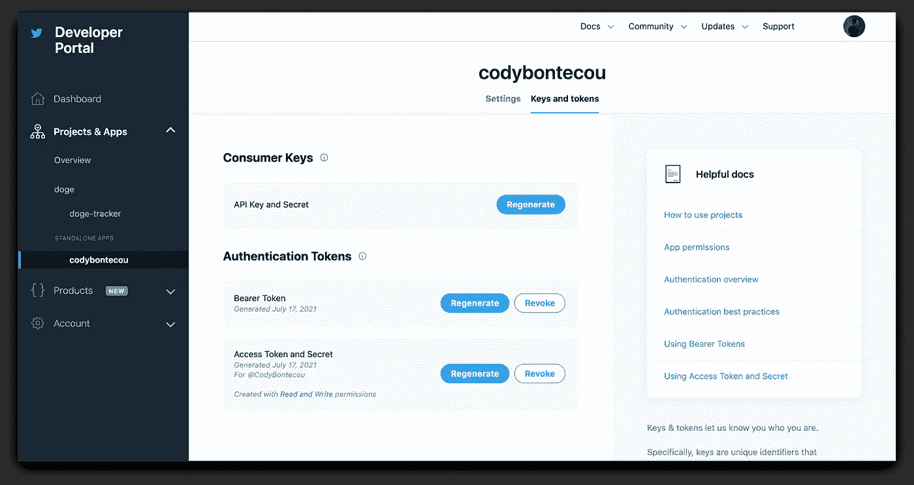

# 用 Node.js 创建 Tweet

> 原文：<https://javascript.plainenglish.io/programmatically-tweeting-with-nodejs-cc58b5eeed59?source=collection_archive---------9----------------------->


> 这篇文章是写给我的 [#100DaysOfCode](https://twitter.com/hashtag/100DaysOfCode?src=hashtag_click) 的**天 1** 的。在这篇文章中，我将讨论如何使用 Node.js 以编程方式向 Twitter 发送 tweet。

## 获得认证

[获得一个 Twitter 开发者账户](https://developer.twitter.com/en/docs/twitter-api/getting-started/getting-access-to-the-twitter-api)

您需要按照上面链接的说明创建一个开发者帐户。这使您可以创建一个[项目](https://developer.twitter.com/en/docs/projects/overview)和一个[应用](https://developer.twitter.com/en/docs/apps/overview)。

您最终会发现自己在 Twitter 开发人员仪表板中，在这里您可以生成身份验证令牌，这对于发出请求是必不可少的。



## 为您的应用奠定基础

*确保你已经安装了*[*node . js*](https://nodejs.org/en/)T22

*我更喜欢* [*纱*](https://yarnpkg.com/) *，但是如果你更喜欢*也可以用 npm 代替

1.  搭建你的项目:`yarn init -y`
2.  下载 [twitter-lite](https://github.com/draftbit/twitter-lite) 与 twitter 的 API 进行交互:`yarn add twitter-lite`
3.  下载 [dotenv](https://github.com/motdotla/dotenv#readme) 进行安全管理。env 变量和您的授权令牌:`yarn add dotenv`

您的`package.json`文件现在应该看起来像这样:

```
{
  "name": "programmatic-tweeting-with-nodejs",
  "version": "1.0.0",
  "main": "index.js",
  "license": "MIT",
  "dependencies": {
    "dot-env": "^0.0.1",
    "twitter-lite": "^1.1.0"
  }
}
```

1.  在项目根文件夹中创建一个. env 文件，并添加 Twitter 的 API 提供的令牌

`.env`文件应该是这样的:

```
consumer_key = '<CONSUMER KEY>'
consumer_secret = '<CONSUMER SECRET>'
access_token_key = '<ACCESS TOKEN>'
access_token_secret = '<ACCESS TOKEN>'
```

只要确保用 Twitter 提供的令牌替换掉`<>`文本。

确保你没有犯错误。env 文件到 Github 或任何其他版本控制系统。这些令牌非常重要，不应该与任何人分享！

## 制造职位

1.  在项目根目录下创建一个 index.js 文件
2.  导入您之前安装的软件包

```
const twitter = require('twitter-lite')
require('dotenv').config()
```

1.  使用您的配置创建一个与 Twitter 对话的客户端

```
const client = new twitter(config)
```

1.  编码请求

```
client
  .post('statuses/update', { status: 'Hello World' })
  .then(result => {
    console.log('You successfully tweeted this : "' + result.text + '"')
  })
  .catch(console.error)
```

第 4 步是创建一个 POST 请求，用参数`status = 'Hello World'`发送到 [Twitter 的端点](https://developer.twitter.com/en/docs/twitter-api/v1/tweets/post-and-engage/api-reference/post-statuses-update) `statuses/update`。

1.  提出请求

现在在你的终端中输入`node index.js`,然后按回车键。这将生成一条带有文本“Hello World”的 Tweet。

我希望这篇文章对你有帮助，如果你有任何问题、评论或建议，请告诉我

*更多内容看* [***说白了就是 io***](http://plainenglish.io/) ***。*** *报名参加我们的**[***免费每周简讯点击这里***](http://newsletter.plainenglish.io/) ***。****