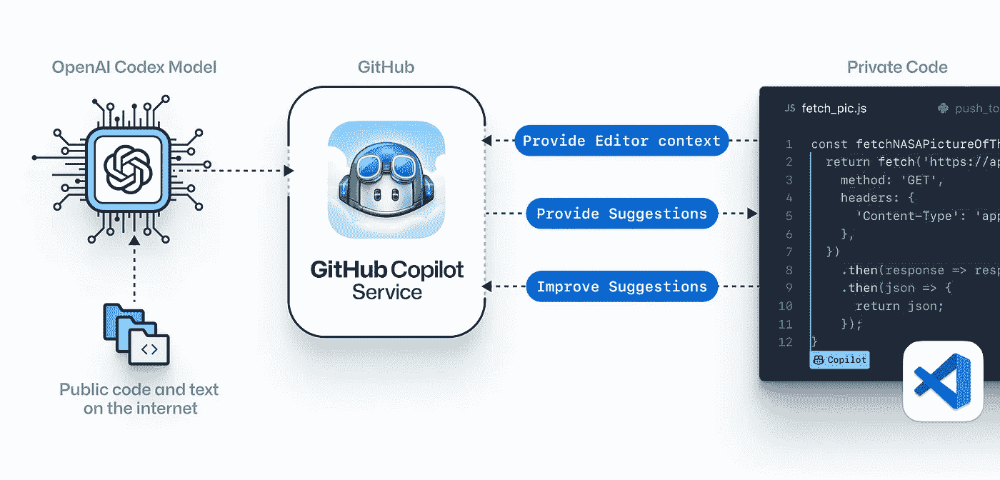
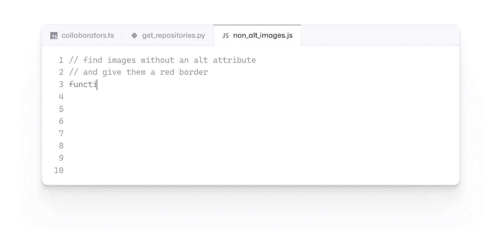

# 编程将永远改变

> 原文：<https://javascript.plainenglish.io/programming-is-about-to-change-forever-5c39841bbe86?source=collection_archive---------1----------------------->

## 你准备好迎接下一波生产力革命了吗？

[📷](https://unsplash.com/@zoltantasi?utm_source=medium&utm_medium=referral)

软件开发正在进入生产力变革的第三次浪潮。

*   第一个是编译器、调试器、垃圾收集器和语言等工具的发明，这些工具使开发人员更有效率。
*   第二个是开源，全球开发者社区聚集在一起，在彼此的工作基础上进行构建。
*   第三次革命将是人工智能在编码中的应用。

微软在 OpenAI 上的 10 亿美元投资开始得到回报——首先是 GPT-3，现在是让全世界程序员兴奋的事情。

我们已经看够了 GPT 3，这是一个基于深度学习的自回归语言模型，可以产生类似人类的文本。

现在有 OpenAI Codex，它是 GPT-3 的更好的后代。

有什么新鲜事吗？OpenAI Codex 生成代码，而 GPT-3 生成英语。

微软刚刚发布了 Copilot，它基于 OpenAI Codex。

它在 GitHub 上接受高质量代码回复的培训——与 [VSCode](https://marketplace.visualstudio.com/items?itemName=GitHub.copilot) 很好地集成，并可以为单独的行或整个函数建议代码完成。

# 有时候我们需要的只是一点点魔法

使用 Copilot 时，您可以循环选择并手动调整 Copilot 给出的代码。然后，它会根据您所做的更改来适应您的编码风格。

它可以使用您编写的代码的上下文，并给出建议来帮助您更快地完成工作。

你也可以写一个注释来描述你想要编码的逻辑，GitHub Copilot 会汇编代码。

据说它能很好地处理重复的代码模式，因此用户可以让它生成其余的代码。

在我看来，Copilot 通过语言输入来控制计算机，使技术更接近人们。

人类在几十年前就开始了这种进化，当时他们用类似英语的编程语言，如汇编、C 和 Python，改进了穿孔卡片。

# 即使你知道它是怎么做的，它仍然是神奇的！

Codex 接受了从 GitHub 获取的数万亿字节的公开可用代码的培训，并使用这些培训向软件开发人员推荐代码，供他们在编程时使用。(这只是我的看法，还是你也觉得这听起来像科幻电影的开场？)

你可以把它想象成一对程序员，他们和你一起在键盘前工作，提供第二双眼睛和建议。

它会检查已键入的代码以及光标的位置，然后建议添加其他行。

随着程序员接受或拒绝建议，Copilot 可以随着时间的推移自我改进。

目前精通 Python、JavaScript、TypeScript、Ruby、Go。

你可以在这里了解更多关于[的信息。](https://copilot.github.com/)

# 这会让我失去程序员的工作吗？

我们有了人工智能驱动的自动驾驶汽车，这是否意味着所有的司机都走了？

不要！不是吗？在这种情况下也是如此。

GitHub Copilot 是一个人工智能助手，它的目标是帮助你，而不是取代你的位置。

您不必浪费时间在互联网上搜索一个简单的代码片段来执行一项任务，这不是很好吗？

你不必记忆正则表达式来检查电子邮件地址或类似的东西。

是不是很神奇？

好吧！我可以看到你眉头紧锁。

让我们来看看数字:根据一项研究，程序员将一半的时间浪费在工作调试上，而不是编程上，每年给这个行业造成 3120 亿美元的损失。

像 Copilot 这样的自动化编程工具可以帮助减少这种浪费。

它不会取代你！然而，它可能会对重复性的任务有所帮助，并使那些编码新手的事情变得简单一些。

> “如果你感到沮丧，你就是生活在过去。如果你焦虑，你是生活在未来。如果你心平气和，你就活在当下。”
> 
> ——刘子

我们使用的技术变得越来越智能，这真是太棒了。这是一个更聪明的方法。

只有渴望成为房间里最聪明的人，才会关心周围的一切是否变得比他更聪明。否则就是真福了。

# AI 未来会取代开发者吗？

我想让你明白，人工智能的种子是由计算机自己编程的想法孕育出来的。

六十年过去了，我们距离实现这一理想还有很长的路要走，但它迟早会实现。问题是你和我能否活着看到那一天。

> "永远不要太安逸，你是可以被取代的."
> 
> —匿名

人类被机器取代并不稀奇。过去人们在银行、金融、商业、通信、军事、教育和其他领域所做的许多工作已经被计算机取代。

这些行业的人曾经对电脑有抵触情绪；现在，这些行业的人无法想象没有他们的工作。

技术正朝着人工的方向发展，计算机将能够比人类更好地思考一百万倍，因为思维从根本上来说就是计算。

思考只是从储存在我们记忆中的材料中产生一些可感知的东西。

数据被同化，然后从中衍生出一些感性的东西。

随着计算机的发展，计算机在这方面将比人类做得更好。这种发展甚至不需要很长时间就能完成。它会在短时间内发生。

那么人类的思想就没有价值了。所有的思想家都会失业！

# 放松点，亲爱的——生命太短暂，不能承受任何压力。

目前形式的 Copilot 是辅助自动化的一个例子。它将通过自动化部分(如果不是全部的话)工作负荷来提高开发人员的工作效率。

但随着 Copilot 和其他软件自动化工具的改进，它们可能会成为替代品——完全自动化人类程序员——这将是具有讽刺意味的。

但是，索姆，你刚刚向我保证我不会丢了工作！是的，我是这么说的，但前一句话的讽刺也是无法避免的。

> “如果我**放开**我**是谁，我就会变成**我**可能**是谁”
> 
> —老子。

作为一名程序员，你会做什么？

如果你还不知道，让我告诉你:作为程序员，你的职责是解决问题，而不仅仅是编写代码！

我们写代码是因为这是告诉计算机做什么的唯一方法。

因为在很多方面，我们就是问题所在——我们做的任何事情都不可避免地会以同样的方式表现出来。我们花时间解决的问题可能会改变。但是总会有问题需要人类去解决。

# 放马过来。

如果你有兴趣看看与 Copilot 配对编程是什么感觉，你可以在 GitHub 上注册[等候名单。](https://copilot.github.com/)

通过注册，您同意允许额外的[遥测数据](https://docs.github.com/en/github/copilot/about-github-copilot-telemetry)被收集——这是加入该行的必要条件。

根据 GitHub 的说法，这些信息将用于跟踪滥用和增强 Copilot VS Code 插件以及“相关的 GitHub 产品”

如果你喜欢这篇文章，你可能也会喜欢: [***以下是 Donald Knuth 给新程序员的建议。它不应该被忽视。***](/heres-donald-knuth-s-advice-to-new-programmers-it-should-not-be-ignored-6963c0aba7aa)

# 感谢信

我想利用这最后的机会说声谢谢。

感谢您的光临！如果没有像你这样的人，我不可能做我现在所做的事情。

我希望你能 [**和我一起**](https://polymathsomnath.medium.com/subscribe) 发表 [**我未来的博文**](https://polymathsomnath.medium.com/subscribe) 并留下来，因为我认为我们这里有一些伟大的东西。我希望在未来的许多年里，我能在你的职业生涯中帮助你！

下次见。再见！

***图片演职员表:*** *GitHub。*

*更多内容请看*[*plain English . io*](http://plainenglish.io/)