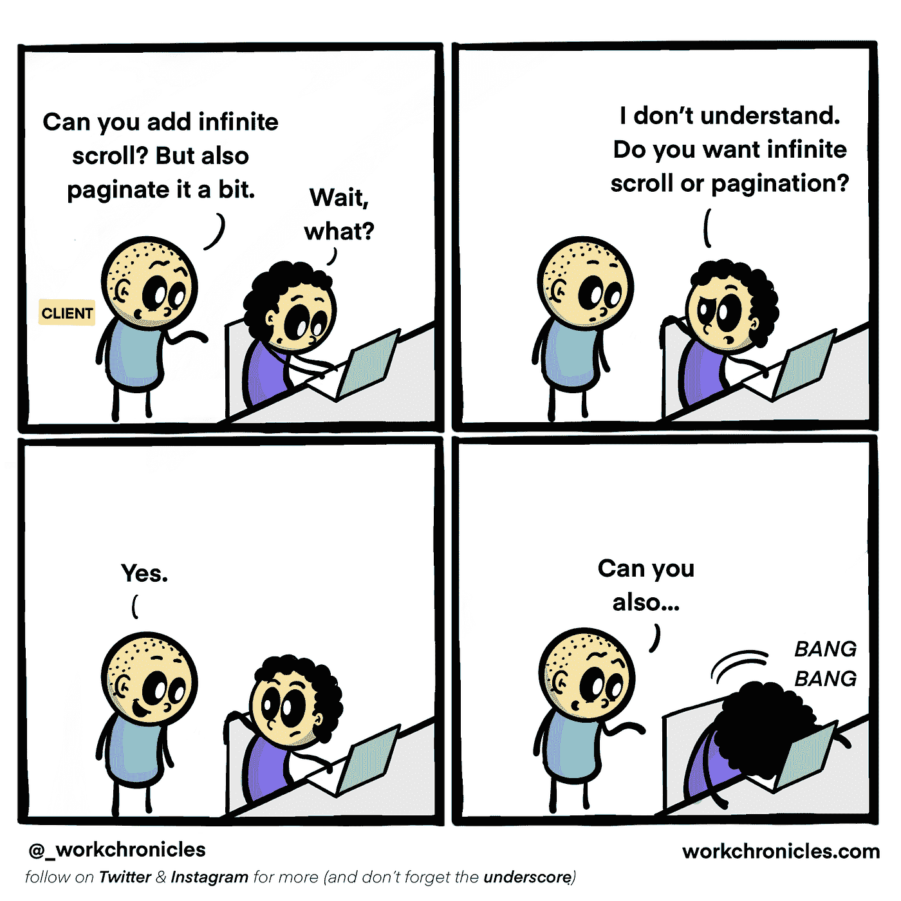
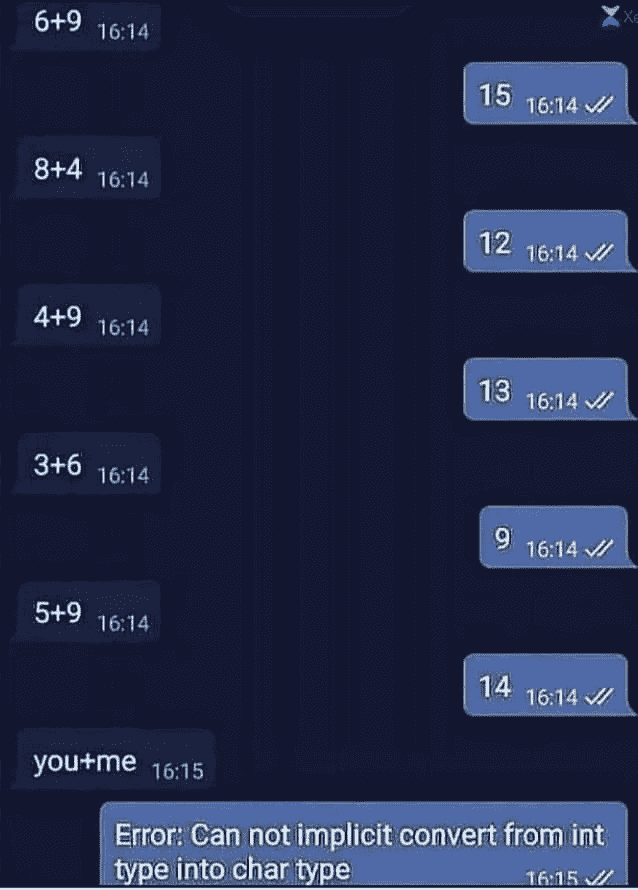
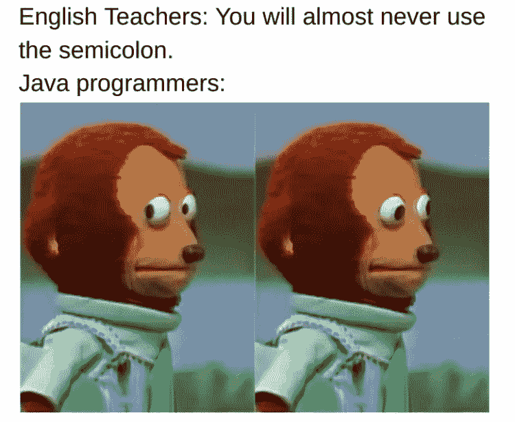

# 编写能让任何人发笑的笑话

> 原文：<https://javascript.plainenglish.io/programming-jokes-that-can-make-anyone-laugh-e6d4d31ac197?source=collection_archive---------1----------------------->

## 程序员动机的每周照片

## 最佳编程迷因汇编(第 14 部分)

Photo by [Shot By Ireland](https://unsplash.com/@shotbyireland?utm_source=medium&utm_medium=referral) on [Unsplash](https://unsplash.com?utm_source=medium&utm_medium=referral)

***模因和快乐有什么联系吗？*** 如果你是我这种类型的人，那么你可能也爱在下班后查看手机。猜猜我在那里看到了什么？

我主要是在互联网上看到**视频、抖音和模因**。我不知道为什么，但这有助于我提神醒脑，减轻工作压力。这就是为什么我相信 *laugher 是人类最好的刷新按钮。*

在这篇文章中，我收集了一些我喜欢的网络迷因。

# 那他们为什么教书？

Picture Credit: [https://www.facebook.com/yuva.krishna.memes/](https://www.facebook.com/yuva.krishna.memes/photos/a.105527467815845/452785859756669/)

# 有些不对劲…

Picture Credit: [https://www.facebook.com/yuva.krishna.memes/](https://www.facebook.com/yuva.krishna.memes/photos/a.105527467815845/452785859756669/)

# 完全正确，当经理要求演示完成的内容时…

Picture Credit: [https://www.facebook.com/yuva.krishna.memes/](https://www.facebook.com/yuva.krishna.memes/photos/a.105527467815845/452785859756669/)

# 是的，但是一些虫子来了…

Picture Credit: [https://www.facebook.com/yuva.krishna.memes/](https://www.facebook.com/yuva.krishna.memes/photos/a.105527467815845/452785859756669/)

# 完全正确…没有时间编码和交付…

Picture Credit: [https://www.facebook.com/yuva.krishna.memes/](https://www.facebook.com/yuva.krishna.memes/photos/a.105527467815845/452785859756669/)

# 相信我！是我… LOL

Picture Credit: [https://programmerhumor.io/programming-memes/read-no-thanks/](https://programmerhumor.io/programming-memes/read-no-thanks/)

# 警告只是警告无视…哈哈

Picture Credit: [https://programmerhumor.io](https://programmerhumor.io/programming-memes/read-no-thanks/)

# 你的目标是什么？

Picture Credit: [https://workchronicles.com/](https://workchronicles.com/)

# 客户…他们在一页上问所有的问题…

Picture Credit: [https://workchronicles.com/](https://workchronicles.com/)

# 地狱…

**最后备注:** [希望你喜欢这篇文章。请通过这个链接加入媒体来支持我。](https://sheetalpatel93.medium.com/membership)

# 进一步阅读

# 你最喜欢哪一个？我以前有一个新的文件夹系列…

[https://www.reddit.com/r/ProgrammerHumor/comments/ojxtdg/git/](https://www.reddit.com/r/ProgrammerHumor/comments/ojxtdg/git/)

# 有史以来最好的编程回复…对面可怜的人…

[https://www.facebook.com/photo/?fbid=1200115330452532&set=gm.2876702175930666](https://www.facebook.com/photo/?fbid=1200115330452532&set=gm.2876702175930666)

# 当我获得 Windows 更新时，我也有同样的感觉…

[https://www.facebook.com/photo?fbid=1070897396773567&set=gm.6406455706046826](https://www.facebook.com/photo?fbid=1070897396773567&set=gm.6406455706046826)

# 你是人类吗？是的，我确实注意到了一些小事…

[https://www.facebook.com/BlaxkerHacker/photos/a.122991386210034/333988921776945/](https://www.facebook.com/BlaxkerHacker/photos/a.122991386210034/333988921776945/)

# 每当我被从库中看到的简单代码所吸引，一旦我开始使用它…

[https://www.monkeyuser.com/2021/new-library/](https://www.monkeyuser.com/2021/new-library/)

# 黑暗模式是生活…

[https://www.reddit.com/r/ProgrammerHumor/comments/ojvsfq/light_attracts_bugs/](https://www.reddit.com/r/ProgrammerHumor/comments/ojvsfq/light_attracts_bugs/)

# 我绝对需要全部…

[https://twitter.com/PR0GRAMMERHUM0R/status/1415295034891591688/photo/1](https://twitter.com/PR0GRAMMERHUM0R/status/1415295034891591688/photo/1)

# Java 程序员就像…

[https://programmerhumor.io/programming-memes/thats-wrong-boy/](https://programmerhumor.io/programming-memes/thats-wrong-boy/)

# 当产品负责人不理解技术依赖并询问需求时…

[https://programmerhumor.io/programming-memes/his-product-owner-clearly-didnt-understand-what-a-technical-dependency-was-during-spring-gooming/](https://programmerhumor.io/programming-memes/his-product-owner-clearly-didnt-understand-what-a-technical-dependency-was-during-spring-gooming/)

*更多内容看* [***说白了. io***](http://plainenglish.io/)