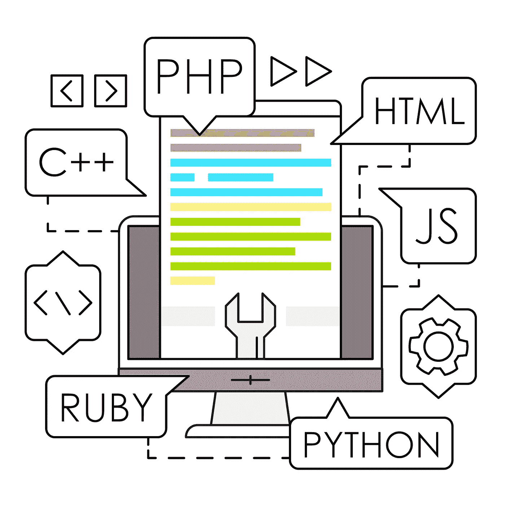
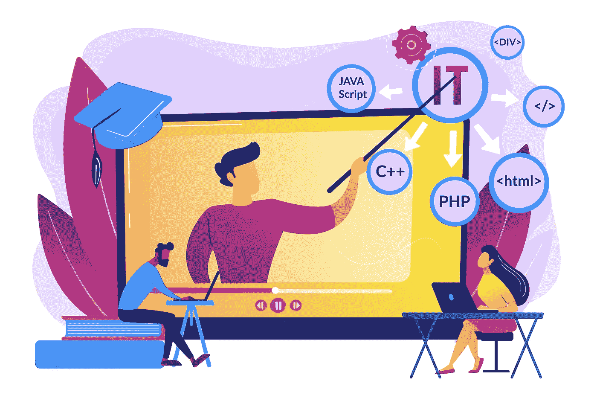

# 2022 年要学的编程语言(为了工作和未来)

> 原文：<https://javascript.plainenglish.io/programming-languages-to-learn-in-2022-for-job-future-3f72aa48fc02?source=collection_archive---------1----------------------->

## 2022 年最好学的编程语言**能让你找到工作。**

程序员你好，我真的很高兴通过这篇文章回到你们中间，今天我们将谈论 2022 年要学习的**编程语言
(为了未来的工作&)。**

因为你们中的大多数单独学习或参加编程课程的人会自动认为他学习的语言是好的。

但是，我们所知道的是，在编程中，我们应该在哪里使用所有这些理论信息。

也许你的答案是否定的，因为在如此多的编程语言中，你的老师会教给你一切。

如果你喜欢编程语言，或者你想在编程方面做出一番事业，那么你必须知道市场上需要哪些编程语言，为什么。

嗯，开发人员和开发人员社区正在以前所未有的速度发展。一些新的编程语言和框架正在出现，它们是为不同类别的开发人员(初学者、中级人员和专家)和不同的用例(web 应用程序、移动应用程序、游戏开发、分布式系统等)量身定制的。).

如果你正在考虑提高你的技能，并进入这个非常受欢迎的领域，你需要知道不同类型和水平的编程，当然还有哪些编码语言最好学。

哪些语言最受客户追捧！

或者哪些编程语言会给你带来不错的薪水。

因此，今天在这里，你将获得 2022 年要学习的编程语言的最佳细节，并可能给你一份工作。

# 1) JavaScript

最近几年， [**JavaScript 在计算机领域的需求越来越大**](https://www.javascript.com/) ，因为它的发明是为了让网页活起来。

如今，许多组织，往往是创业公司，都使用**[**NodeJS**](https://nodejs.org/en/)，这是一个基于 **JavaScript 的运行时环境，** Node.js 允许开发者使用 JavaScript 进行服务器端脚本编写，即在页面被发送到用户的 Web 浏览器之前，执行服务器端脚本来产生动态的网页内容。**

**如果你正在你最喜欢的初创公司寻找一份很酷的技术工作，那么你应该认真考虑一下**在 2022 年学习 JavaScript。****

# **2) Python**

**[**Python**](https://www.python.org/) 通常被认为是最先学习的编程语言，因为它非常容易上手。它是一种快速、易于使用和部署的编程语言，广泛用于开发可伸缩的 web 应用程序。YouTube、Instagram、Pinterest、SurveyMonkey 都是用 [**Python**](https://www.python.org/) **打造的。****

**编程语言为初学者提供了一个很好的起点。如果你正在寻找一种最容易理解和最流行的编码语言来学习，你应该试试 Python！许多创业公司使用 Python 作为他们的主栈，所以这为**全栈 Python 开发者打开了许多机会。****

**如果你想进入数据科学或人工智能行业，你几乎肯定需要学习 Python。也可以用在其他领域，比如 web 开发。多功能性和可访问性使其成为初学者的绝佳选择。**

# **3) Golang(或 Go)**

**[**Go**](https://go.dev/) 又称 **Golang** ，是由 **Google** 设计的一种编程语言。它提供了出色的多线程支持，因此经常被严重依赖分布式系统的公司以及硅谷的初创公司使用。那些有兴趣加入专注于核心系统的硅谷创业公司的人可能会想学习 Golang**

# **4) PHP**

**[**PHP**](https://www.php.net/) 是最流行的后端编程语言之一。虽然 PHP 面临 Python 和 JavaScript 的激烈竞争，但市场仍然需要大量的 **PHP** 开发者。那些希望加入一个相对成熟的组织成为后端开发人员的人应该考虑学习 PHP 编程。**

# **5) Swift**

**如你所知，在**成为开发者的最爱**之后，它的要求越来越高。**

**这种编程语言使用用于 iOS、 **iOS、WatchOS、**等应用的开发应用。**

**和 [**Java**](https://www.java.com/en/) **，** [**Swift**](https://developer.apple.com/swift/) 一样，也是非常容易维护和阅读的，也是速度快，代码行数少。**

****还有，如果我说的是语法选购，那就很简单了。****

**使用 **Swift** ，您可以在 4 到 5 个月内开始创建应用程序，甚至可以启动您的应用程序。**

**在那之后，如果我们谈论薪水，它再次取决于你的经验和知识，所以如果你正在考虑在 2022 年**成为一名移动开发者，你正在庆祝你的正确选择。****

# **那么，什么是最好的编程语言呢？**

**你选择学习哪种编程语言将取决于你的职业目标。例如，如果你想深入机器学习和深度学习，你就不应该把时间花在学习 Java 或 C#上。为了帮助你做出这个决定，我们将简要回顾一些语言和它们的用法。**

**Python 和 JavaScript，两种最流行的语言，正在成为创业界的趋势。很多创业公司使用 Django (Python)、Flask (Python)、NodeJS (JavaScript)作为后端框架。这两种语言都很容易学习，因此被认为是初学者学习的最佳编程语言。除此之外，这些职位在市场上还有很多机会。**

**Java 和 PHP 是企业世界中常用的语言。许多组织使用 Spring (Java)和 Laravel(PHP)作为他们的 web 后端框架。**

****

**至此，我希望您对学习哪种编程语言的问题有了答案。你的目标应该是选择一门语言，从事与你职业目标相关的项目。这需要努力，但也很值得！**

**如果你已经知道一门编程语言，那么你就不需要学习一门新的，因为最好的办法是提高你已经知道的东西。**

**对于那些还没有选择或者还在犹豫的人，我会要求你们选择你们想要发展的领域。**

**感谢您的阅读。**

***更多内容看* [*说白了. io*](http://plainenglish.io/) *。在这里注册我们的* [*免费周报*](http://newsletter.plainenglish.io/) *。***