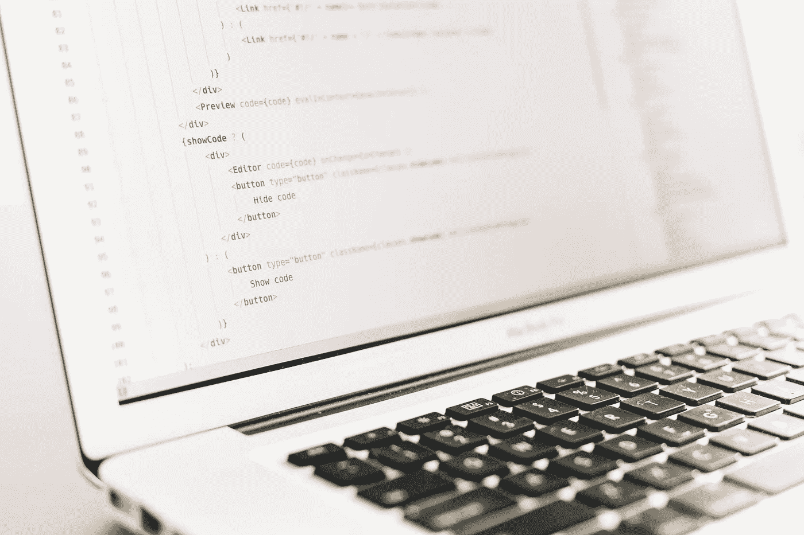

# 2020 年之前我不知道的编程

> 原文：<https://javascript.plainenglish.io/programming-things-i-dont-know-as-of-2020-4713e39cd5d1?source=collection_archive---------17----------------------->

## 不知道一切都好

Photo by [Artem Sapegin](https://unsplash.com/@sapegin?utm_source=unsplash&utm_medium=referral&utm_content=creditCopyText) on [Unsplash](https://unsplash.com/s/photos/programming?utm_source=unsplash&utm_medium=referral&utm_content=creditCopyText)

人们认为，在任何行业工作几年以上，就应该知道所有的事情。那不是真的！在这篇文章中，我列出了我没有意识到或目前正在学习的东西。

## 我不知道的事情列表:

*   Unix 命令和 bash——我可以用`ls`、`cd`来管理，世界著名的`rm -rf`可以用 grep 来管理，但是对于其他的东西，我必须查找。
*   CSS 方法论——没有 BEMs，没有 OOCSS。我可以做简单的 CSS。目前使用顺风 CSS 或样式组件。 **CSS-in-JS** 就是我现在摇摆的那个🤘
*   类型脚本 javascript 中的类型检查不是我所喜欢的，☕
*   生成器—仅使用 JavaScript 传输数据流😱
*   容器——我可以创建一个 docker 并启动一个容器，仅此而已📦
*   动画——使用 CSS 或 SVG 动画，让我心烦。
*   python——没有“你好，世界！!"还有。🐍
*   机器学习——也许明年会开始🎰
*   测试——我可以用 JavaScript、React 和 Vue 进行单元测试，但是在 2021 年，我必须实现一键自动化🔥
*   redux——一直没机会看
*   AWS——这是我目前关注的焦点，我已经开始做了一两件事。AWS Amplify 让我的生活变得轻松😇

我知道随着时间的推移产生的知识差距。学习永无止境，坚持学习总是好的

💡帖子灵感来自[丹·阿布拉莫夫的帖子](https://overreacted.io/things-i-dont-know-as-of-2018/)

 [## 截至 2018 年我不知道的事情

### 人们经常认为我知道的远比我实际知道的多。这是一个不错的问题，我也没有抱怨…

反应过度了](https://overreacted.io/things-i-dont-know-as-of-2018/)