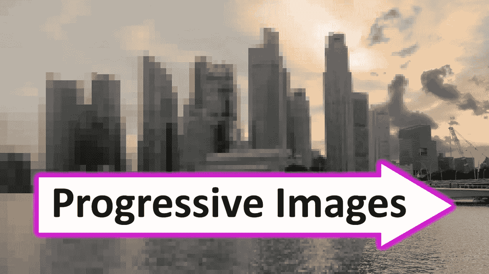
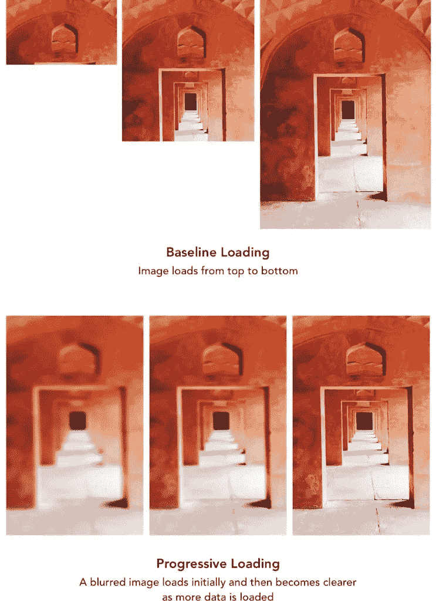
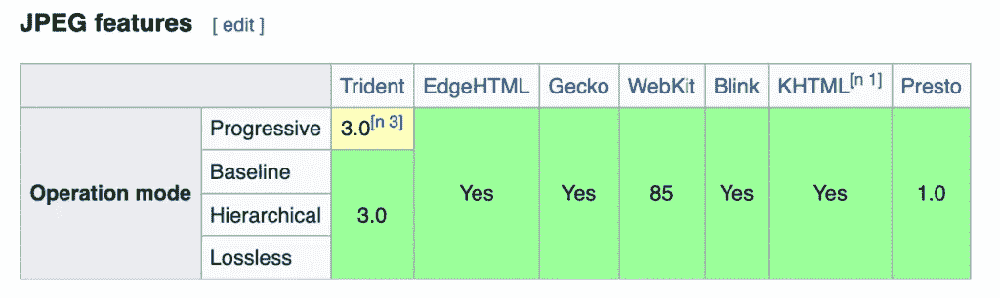

# 渐进式 JPEG:它们是什么以及它们如何帮助改善网页性能

> 原文：<https://javascript.plainenglish.io/progressive-jpeg-what-they-are-and-how-they-help-improve-web-performance-fef02758ffdc?source=collection_archive---------10----------------------->

## 渐进式 JPEG 图像是以不同于基准 JPEG 的方式编码的 JPEG 图像。



渐进式 JPEG 图像是以不同于基准 JPEG 的方式编码的 JPEG 图像。它会一波一波地加载，直到加载一张清晰的图片。这可以提高网站的性能，因为图像看起来加载更快。

# 渐进 JPEG 和基线 JPEG 的区别

渐进 JPEG 和基准 JPEG 的区别主要在于编码和压缩。它们在网速较慢的情况下最明显。

基线格式从上到下一次加载一行。而渐进式 JPEG 一开始看起来模糊且像素化，然后载入更清晰的图像。



可以看出，渐进式 JPEGs 极大地改善了用户体验。

# 转换图像

虽然有相当多的工具，包括应用程序和基于 web 的工具，但 web 开发人员希望 CLI 能够做到这一点。而 jpegtran 正是如此。

```
$jpegtran -progressive old.jpeg > new.jpeg
```

还有一个 [NPM 包](https://www.npmjs.com/package/jpegtran)给它。

同样值得注意的是，所有主流浏览器都支持渐进式 JPEG:



Safari 是个例外，它会一次性渲染图像。所以渐进式 JPEGs 也适用于 Safari，而不是其他地方。但至少没坏！

这就是所有关于进步 JPEGs 的分享。现在就开始在您的应用中使用它们吧！

*原载于 2021 年 7 月 31 日*[*【https://www.wisdomgeek.com】*](https://www.wisdomgeek.com/development/web-development/progressive-jpeg-what-and-how-they-help-improve-web-performance/)*。*

*更多内容看* [***说白了。报名参加我们的***](http://plainenglish.io/) **[***免费周报***](http://newsletter.plainenglish.io/) *。在我们的* [***社区不和谐***](https://discord.gg/GtDtUAvyhW) *获得独家获取写作机会和建议。***