# JavaScript 承诺:让我们一劳永逸地解决这个问题

> 原文：<https://javascript.plainenglish.io/promise-in-javascript-94ea3795c7ad?source=collection_archive---------9----------------------->

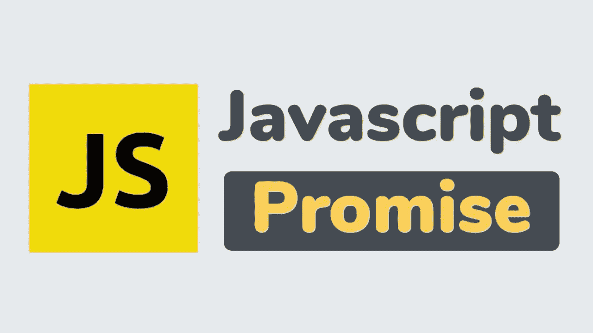

Pic Source: Google Images

承诺一直是 JavaScript 初学者最困惑的话题。

两年前，我也像你一样，犹豫是否与我的开发伙伴讨论 Promise，只是复制粘贴代码而不理解它，当我试图深入了解它时，它看起来很复杂。

然而，在这个行业工作了几年后，我想我在 JavaScript 中得到了承诺的概念。什么是承诺？我们如何使用它？为什么我们需要使用承诺？我将在这篇文章中回答所有这些问题。所以说重点吧。

*“承诺是一个经过某种处理后给你提供价值的对象”*

# 什么是承诺？

正如我们所知，JavaScript 是一种[异步语言](https://developer.mozilla.org/en-US/docs/Learn/JavaScript/Asynchronous/Introducing)，这意味着 Javascript 不会等待一个耗费时间的进程执行，而是直接进入下一行执行。所以，如果这是 JavaScript 的典型行为，我们要写的代码，是我们想在进程完成后执行的。我知道你会说，我们用 [***回调***](https://developer.mozilla.org/en-US/docs/Glossary/Callback_function) 来说明这一点，但是你也知道回调的局限性以及回调所带来的问题。

那么，有什么解决办法呢？

**承诺**就是解决。

**Promise** 承诺我们在流程完成后返回成功或失败的结果，之后您可以在 **then()或 catch()** 函数中编写代码，我们将在本文稍后讨论。

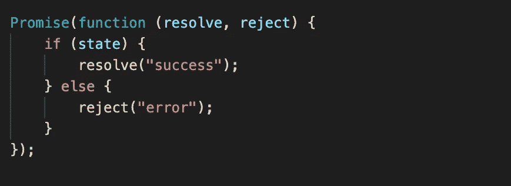

A simple example of Promise

Promise 只接受一个函数作为参数，它也接受两个参数，这两个参数是 Promise 的状态，你要相应地调用 Resolve & Reject。根据您的逻辑，如果您希望成功，您可以调用 resolve()，或者在出现任何错误或异常时，您可以调用 reject()。就像上面的例子一样，我们基于*状态*变量调用 resolve 或 reject。

# 承诺的状态

根据承诺的定义*“承诺是一个经过某种处理后为你提供价值的对象”，*这意味着承诺有不同的生命周期，比如当它处理某个请求时和当它给出某个响应时。

因此，当 Promise 处理某个请求时，它处于**未决状态**，当它给出结果时，它处于**已解决状态。**

现在，我们再次知道稳定状态可以是成功状态或失败状态，因为我们将稳定状态分为两种状态**满足状态(成功)&拒绝状态(失败)。**

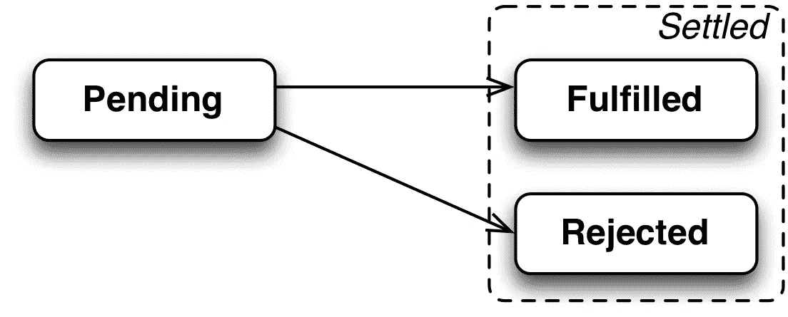

Pic Source: [Exploring JS](https://www.google.com/url?sa=i&url=https%3A%2F%2Fexploringjs.com%2Fimpatient-js%2Fch_promises.html&psig=AOvVaw1iHCSKjqyUkXU-BNkeJeFi&ust=1628243363775000&source=images&cd=vfe&ved=0CAwQjhxqFwoTCNjCjrDNmfICFQAAAAAdAAAAABAD)

# 处理承诺

现在让我们看看，在成功和失败的案例中，我们如何处理来自承诺的那些反应。看看下面的代码。

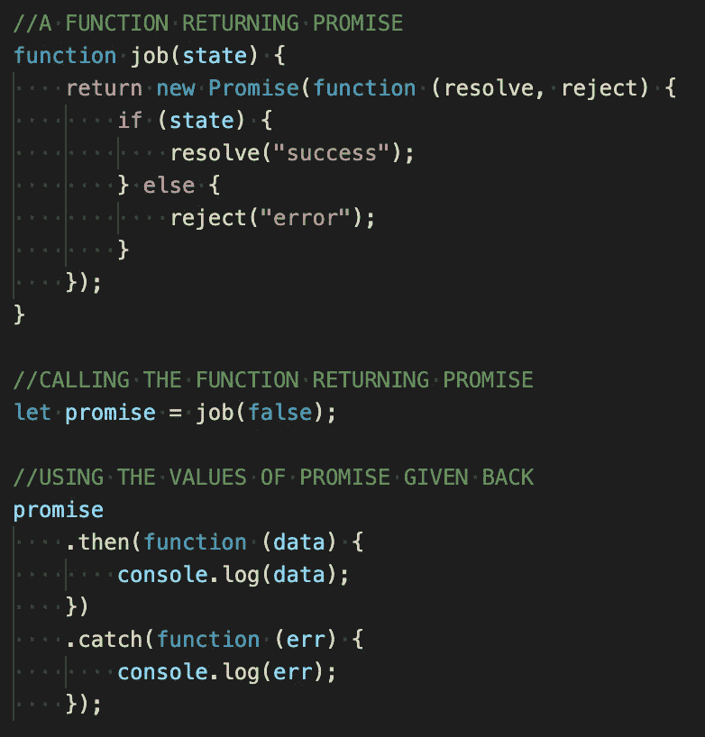

Example of How to handle Promise

在上面的代码中你可以看到，我们有一个名为 ***job*** 的函数，它根据传递给它的 ***state*** 参数返回一个承诺。现在我们调用的是*函数中的**(它可以命名任何东西，它的关键字不是* 变量)。当 ***作业*** 承诺得到解决并发送数据给 ***承诺*** 变量时，它在**中处理。然后&。捕捉**功能。**

***“如果****resolve()****函数执行完毕它就转到* ***然后*** *如果****reject()****函数执行完毕它就转到****catch****”。***

**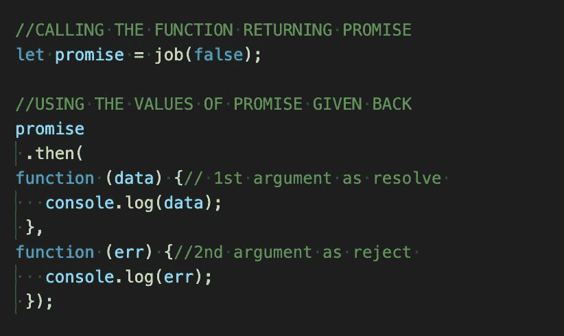**

**Another way of handling Promise**

**迷茫？如果你看到我们在这里做了什么，我们只是将 **catch** 方法作为第二个参数传递给**和**方法，它将产生相同的结果。因此，基本上有三个要点需要注意。
**=>**Promise***then()***方法接收 ***resolve()*** 函数作为**第一个自变量**其中**第二个自变量**是 ***reject()*** 函数*(可选)*。
**= >** 您既可以在***【catch()***方法中处理*，也可以在函数中将第二个参数传递给 ***then()*** 方法。
**= >** 还有一个比较有趣的事情，***【catch()】***方法就跟 ***then()*** 方法一样但是取第一个实参(成功一个)作为 **null。*****

**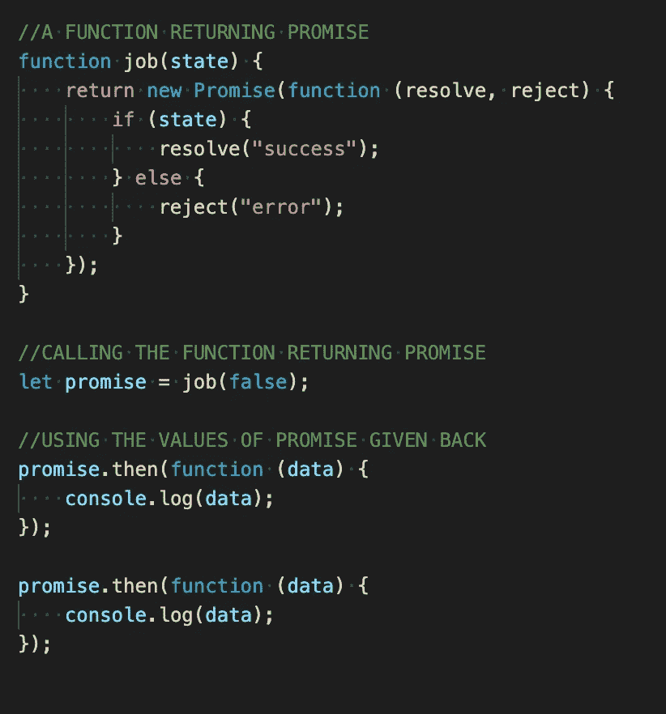**

**Consuming Promise response multiple times**

**在上面的例子中，我们可以看到我们调用了 Promise 一次，但是消耗了它的结果两次。你可以多次使用承诺回复。**

# **承诺链**

**就像我们可以多次使用 Promise 结果一样，我们可以将 then()方法的结果作为新的 Promise 传递给另一个 then()方法。这意味着每个 then()方法都返回一个对附加到它的另一个 then()方法的承诺。您可以附加多个 then() & catch()方法来编写您的代码流。看看下面的代码。**

**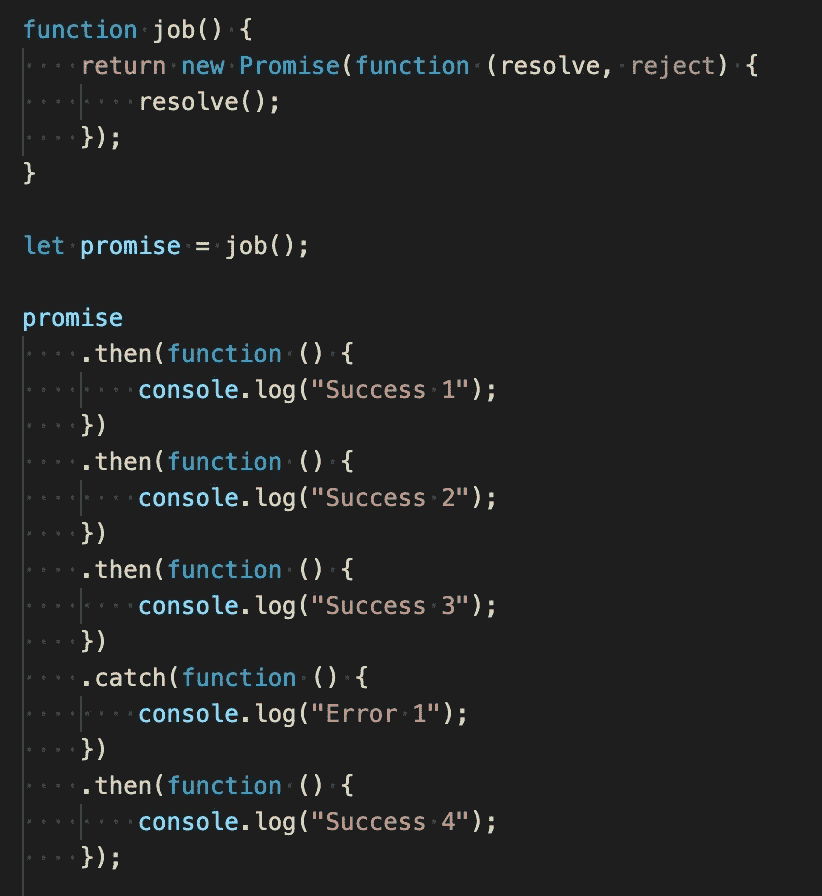**

**Chaining of Promise**

**在上面的例子中，我们可以看到我们创建了一系列的 then() & catch()方法，它们一个接一个地执行。现在有一些简单的规则来理解这个重要的代码流。**

## ****承诺链规则****

*   *****然后()*** & ***抓住()*** 两种方法都返回**只许**个。**
*   **代码永远不会转到 **catch()** 块，除非您从 main **Promise** 调用 **reject()** 函数或者在 then()方法中抛出任何错误。
    喜欢:*thow“3”；***
*   **所有连锁的 **then()** 方法以同步的顺序一个接一个地执行。**
*   **即使你这样返回:返回新的错误(“错误”)；它将转到 then()方法，你不是抛出任何错误，而是返回一个错误。**

**借助这 4 条规则，你可以很容易地找到承诺链的输出。**

**再举一个例子来说明这个问题。**

**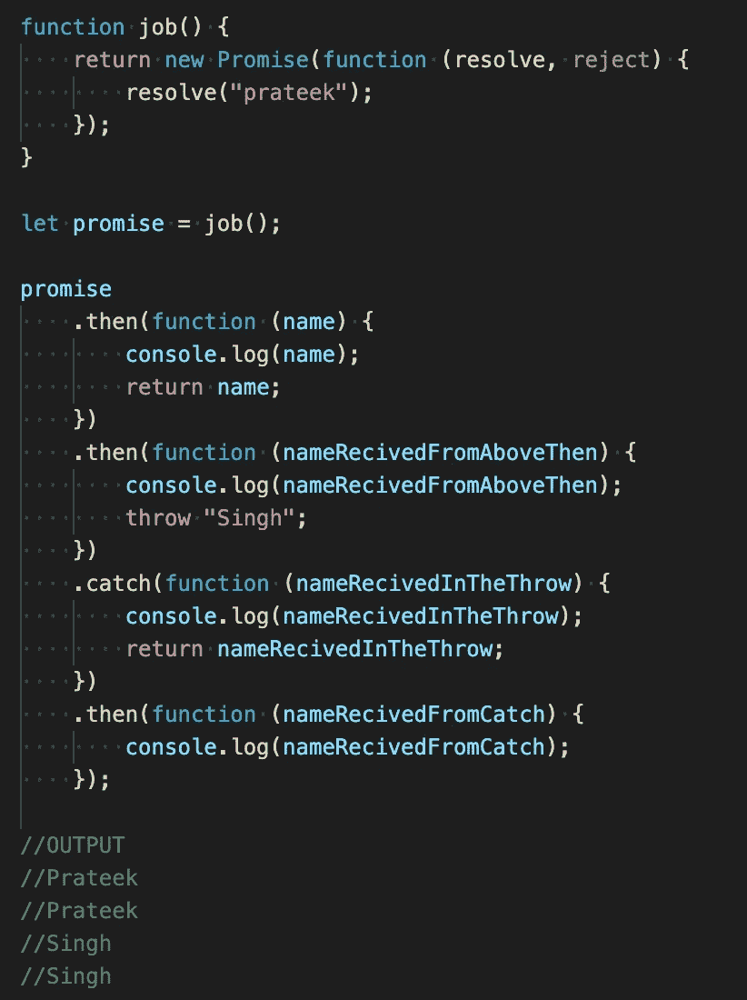**

**Example for Chaining of Promise**

# **承诺方法**

**现在假设您需要同时调用多个承诺，并且您的进一步执行取决于该结果。万岁！JavaScript 提供了一些 owssm Promise 方法，通过这些方法我们可以做到这一点。让我们看看它们。**

## ****调用多个承诺的功能****

## ****1。Promise.all()****

**Promise.all()接受一个承诺数组，并且仅当所有承诺都被解析时，才返回数组中所有承诺的结果。如果任何承诺被拒绝，它将进入 Catch()状态。**

**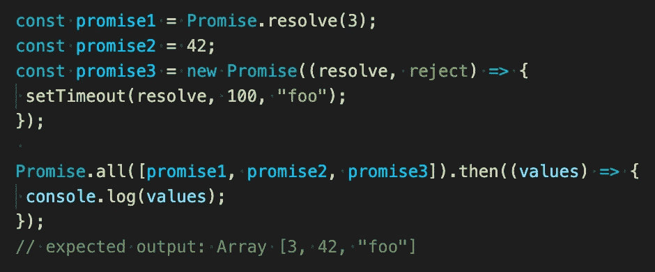**

**Example of Promise.all()**

## ****2。Promise.allSettled()****

**Promise.allSettled()接受一个承诺数组，如果所有承诺都被解析或拒绝，则返回数组中所有承诺的结果。它给出了一个带有承诺状态及其值的对象数组。**

****

**Example of Promise.allSettled()**

## ****3。Promise.race()****

**Promise.race()接受一组承诺，并返回先解决或先拒绝的一个承诺的结果。**

**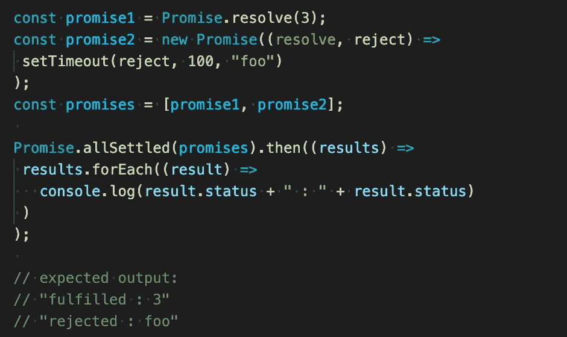**

**Example of Promise.race()**

## ****4。Promise.any()****

**Promise.any()接受一个承诺数组，并返回先解决的一个承诺的结果。如果某个承诺先失败了，它就变成 catch()。**

**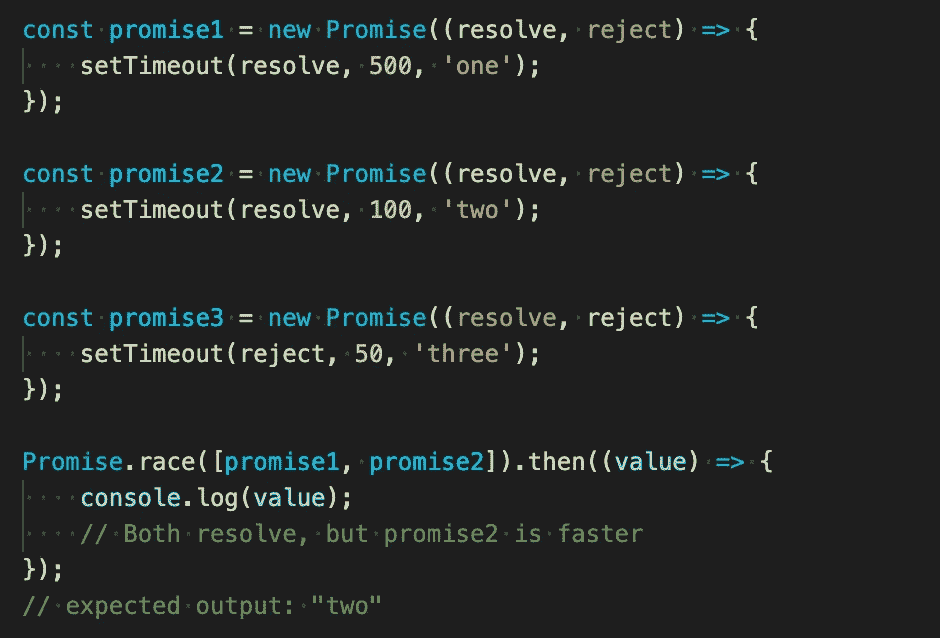**

**Example of Promise.any()**

**现在我们知道了关于承诺的一切，为了更好地理解，我建议你完成这些[练习题](https://www.codingame.com/playgrounds/347/javascript-promises-mastering-the-asynchronous/what-is-asynchronous-in-javascript)。**

**感谢您的阅读，并快乐编码:)**

***更多内容看*[***plain English . io***](http://plainenglish.io)**