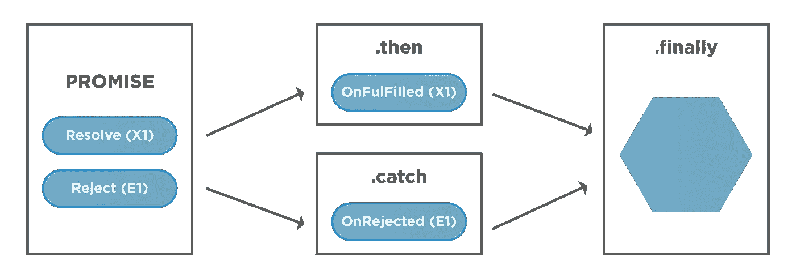

# JavaScript 中的承诺(包含所有方法)

> 原文：<https://javascript.plainenglish.io/promise-in-javascript-with-all-the-methods-b7357196a57e?source=collection_archive---------2----------------------->



Promise in javascript

承诺是一个物体，一旦完成任务，它要么在未来给你一个结果，要么给你一个错误。它是一种流行的设计模式，用于处理 Node.js 中的异步任务。它可以处理许多任务的并行/串行执行以及它们的链接规则。promise 结构还提供了有效的错误捕捉机制。

## Promise.resolve():

Promise.resolve()方法返回一个带有给定值的已解析的 Promise 对象。根据确定的承诺值，它

1.如果履行了承诺，则返回承诺
2。如果满足值
3，则返回一个值。通过采用最终状态返回可接受的承诺，如果可接受的承诺得到履行

此函数将类似承诺的对象(例如，解析为可解析为某物的承诺的承诺)的嵌套层展平为单一层。

```
Promise.resolve('Success').then((value) => {
  console.log(value); // "Success"
}).catch((error) => {
  console.log(error);
});
```

## Promise.reject()。

Promise.reject()方法返回一个因给定原因而被拒绝的 Promise 对象。

```
Promise.reject('failure').then((value) => {
  console.log(value); 
}).catch((error) => {
  console.log(error); // "failure"
});
```

## Promise.then():

**then()** 方法返回一个承诺。它最多需要两个参数:回调函数用于`Promise`的成功和失败情况。

```
const promise1 = new Promise((resolve, reject) => {
  resolve('Success!');
});promise1.then((value) => {
  console.log(value);
  // expected output: "Success!"
}, (error) => {
  console.log( error);
});
```

## Promise.catch():

**catch()** 方法返回被拒绝的承诺。其行为与调用 promise . prototype . then(undefined，onRejected)相同。调用 Promise.catch(onRejected)内部调用 Promise.then(undefined，onRejected)。

```
const promise1 = new Promise((resolve, reject) => {
  throw 'Exception handling';
});promise1.then((value) => {
  console.log(value);
}).catch((error) => {
  console.error(error);
});> "Exception handling"
```

## Promise.finally():

**finally()** 方法返回一个承诺。当承诺完成时，执行指定的回调函数。这为代码运行提供了一种方式，而不考虑承诺结算。finally 回调不会收到任何参数，因为无法确定承诺是被履行还是被拒绝。

```
const promise1 = Promise.reject("Rejecting Promise");
promise1
  .then(value => {
    console.log(value)
  })
  .catch(err => {
    console.log(err)
  })
  .finally(() => {
    console.log("completed promise")
  });> "Rejecting Promise"
> "completed promise"
```

# 常见的承诺效用方法:

## 无极. all():

Promise.all()方法接受一个承诺数组并返回一个承诺，该承诺根据任何可迭代的承诺被解析或拒绝。如果数组中的所有承诺都解析，则它解析；如果有任何承诺拒绝，则它拒绝。

```
const promise1 = Promise.resolve("hello world");
const promise2 = "Promise 2";
const promise3 = new Promise((resolve, reject) => {
  setTimeout(resolve, 100, 'foo');
});Promise.all([promise1, promise2, promise3]).then((values) => {
  console.log(values);
});
// expected output: Array ["hello world", "Promise 2", "foo"]
```

## 无极. race():

Promise.race()方法也接受一个承诺数组并返回一个承诺，该承诺基于一个可迭代承诺数组被解析或拒绝。与 promise.all()不同，它不会等到所有的承诺都执行了。一旦任何承诺被解决或拒绝，它将返回承诺。

```
const promise1 = new Promise((resolve, reject) => {
  setTimeout(resolve, 300, 'Hello world');
});const promise2 = new Promise((resolve, reject) => {
  setTimeout(resolve, 100, 'Goodbye world');
});Promise.race([promise1, promise2]).then((value) => {
  console.log(value);
  // Both resolve, but promise2 is faster
});
> "Goodbye world"
```

## 无极. any():

Promise.any()方法接受一组承诺并返回一个承诺。如果数组中的任何承诺用解析的值解析，它将解析。如果所有承诺都被拒绝，承诺将被拒绝，并显示错误“aggregate error:All promises are rejected”。`[AggregateError](https://developer.mozilla.org/en-US/docs/Web/JavaScript/Reference/Global_Objects/AggregateError)`，`[Error](https://developer.mozilla.org/en-US/docs/Web/JavaScript/Reference/Global_Objects/Error)`的一个新子类，将单个错误组合在一起。

```
const promise1 = Promise.reject(0);
const promise2 = Promise.resolve('Hello world');
const promise3 = new Promise((resolve) => setTimeout(resolve, 300, 'Good bye'));const promises = [promise1, promise2, promise3];Promise.any(promises).then((value) => console.log(value));> Hello world
```

## Promise.allSettled():

方法接受一个承诺数组并返回一个承诺。当数组中的承诺相互独立，并且拒绝一个承诺不会阻止另一个承诺时，通常使用这种方法。Promise.all()和 Promise.allSettled()之间的主要区别在于，prior 停止执行任何被拒绝的承诺，主要用于承诺相互依赖的情况，而 following 将等到所有承诺都被解决，并以数组形式给出结果。

```
const promise1 = Promise.resolve("Hello world");
const promise2 = Promise.reject('Rejecting');;
const promises = [promise1, promise2];Promise.allSettled(promises).
  then((results) => results.forEach((result) => console.log(result)));> Object { status: "fulfilled", value: "Hello world" } 
> Object { status: "rejected", reason: "Rejecting" }
```

在接下来的一篇文章中，我们将关注 async/await，这是一个更加语法化的东西，它可以从根本上简化代码，增加可读性，并显著减少代码行。

***感谢阅读。最初发表于 2021 年 5 月 26 日 https://noob2geek.in/****[***。***](https://noob2geek.in/)*

**更多内容请看*[*plain English . io*](http://plainenglish.io/)*