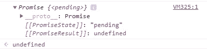
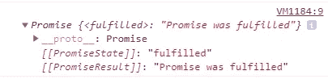
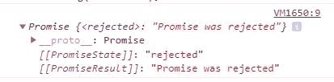

# 用例子解释 JavaScript 中的承诺

> 原文：<https://javascript.plainenglish.io/promises-in-javascript-explained-with-examples-deb1bf6dfdd0?source=collection_archive---------4----------------------->

## 通过实例了解 JavaScript 中的承诺。


Photo by [James Harrison](https://unsplash.com/@jstrippa?utm_source=medium&utm_medium=referral) on [Unsplash](https://unsplash.com?utm_source=medium&utm_medium=referral)

承诺是困扰许多初学者的重要 JavaScript 特性之一。它们看起来很难理解，但是如果你花时间去了解它们，它们会简单得多。

JavaScript 中的承诺与现实生活中的承诺非常相似，你承诺做某事，你要么完成，要么无法实现。

在本文中，我们将通过实际例子来学习 JavaScript 中的承诺。所以让我们开始吧。

# 什么是承诺，为什么我们要使用它？

承诺是 ES6 非常重要的特征之一。如我所说，把它们想象成我们在现实生活中做出的承诺。当你承诺做某事时，有两种结果:你是否完成了承诺或没有完成。

同样的事情也适用于 JavaScript 中的承诺。承诺有三种可能的结果:

*   待定:当承诺仍处于待定状态时(初始状态)。
*   履行:当承诺实现并得到解决(成功)。
*   拒绝:当承诺失败时(拒绝)。

我们通常将这些承诺用于异步操作(当您有多个任务需要同时运行时)。所以我们用它们来提供未来某个时刻的结果或任务。

# 创造你的第一个承诺

在 JavaScript 中，promise 只是我们使用关键字`new`和构造函数`Promise`创建的一个对象。

构造函数`Promise`接受一个回调函数，该函数有两个参数:`resolve`(当承诺成功时)和`reject`(当承诺失败时)。

看看下面的例子:

```
const ourPromise = **new** **Promise**((**resolve**, **reject**) => {
 //Your code here.
});
```

如您所见，我们通过向构造函数`Promise`传递一个具有两个参数(`resolve`和`reject`)的函数，创建了一个承诺`ourPromise`。我们没有兑现那个承诺。这就是它处于挂起状态的原因。

让我们把它打印到控制台上，向您展示结果:

```
**console.log(ourPromise);**
```

*输出:*



Capture from the console.

如你所见，状态为 pending，承诺返回`undefined`，因为我们没有对承诺做任何事情，我们只是将回调函数传递给了构造函数。我们根本没有完成承诺。

# 使用解决和拒绝

我们在上一个例子中创建的承诺停留在待定状态。现在，让我们创建一个承诺，它可以根据情况解决(成功)或拒绝(失败)任务。

这里有一个例子:

```
const ourPromise = **new Promise**((**resolve**, **reject**) => {
let number = 6 + 4; if(number === 10) {
    **resolve**("Promise was fulfilled");
  } else {
    **reject**("Promise was rejected");
  }
});**console.log(ourPromise);** //output: Promise was fulfilled
```

*输出:*



Capture from the console.

在上面的例子中，因为数字等于 10，所以承诺实现了。因此，`ourPromise`返回一个函数`Promise`,该函数显示已完成的状态和我们在 resolve 函数中传递的消息。

这是另一个拒绝承诺的例子:

```
const ourPromise = **new Promise**((**resolve**, **reject**) => {
let number = null;if(number === 10) {
    **resolve**("Promise was fulfilled");
  } else {
    **reject**("Promise was rejected");
  }
});**console.log(ourPromise);** //output: Promise was rejected
```

*输出:*



Capture from the console.

正如您在输出图像中看到的，承诺在这种情况下被拒绝，因为数字变量是`null`。

# 履行承诺

当承诺实现或被拒绝时，你需要对结果做些什么。例如，当您从一个 API 请求数据时，需要时间来获得响应。但是当您获得数据时，您将需要对它做一些事情，比如在 UI 上显示它。

为此，我们使用方法`then()`来处理实现的承诺。另一方面，我们使用`catch()`方法来处理被拒绝的承诺。

这两个方法`then`和`catch`以一个函数作为参数。在这个函数中，你写下你想对响应做什么。

这里有一个例子:

```
const ourPromise = **new Promise**((**resolve**, **reject**) => {
let number = 5 + 5;if(number === 10) {
    **resolve**("succeed");
  } else {
    **reject**("failed");
  }
})**.then(response** => console.log('Promise ' + **response**)**)**
**.catch(error** => console.log(**error**)**)**;//output: Promise succeed
```

正如您所看到的，由于承诺已经实现(数字变量等于 10)，方法`then`被执行，参数`response`被设置为我们在 resolve 函数中传递的值。这就是为什么我们得到`Promise succeed`的结果。

如果承诺被拒绝，方法`catch`而不是`then`被执行，参数`error`被设置为我们在 reject 函数中传递的值。

# 回电与承诺的例子

使用回调或承诺的一个常见情况是当我们想要等待超时(异步操作)时。

*回调示例:*

```
**setTimeout**(function(){
 sendMessage("Displays after 3 seconds");
}, 3000);

function sendMessage(message) {
  console.log(message);
}//output: Displays after 3 seconds
```

*使用承诺的相同示例:*

```
let ourPromise = **new Promise**((resolve, reject)=> {
 **setTimeout**(()=> resolve("Displays after 3 seconds"),3000);
})
.**then**(response => console.log(response))
.catch(error => console.log(error));//output: Displays after 3 seconds
```

承诺在我看来比回调干净多了。

# 结论

综上所述，我想说当你想做异步操作时，比如等待一个文件、获取数据等等，可以使用承诺。在我看来，它们比使用回调简单得多。

感谢您阅读这篇文章。希望你觉得有用。

**更多阅读**

[](/5-useful-javascript-features-that-nobody-is-talking-about-b630838dedba) [## 没有人谈论的 5 个有用的 JavaScript 特性

### 你应该知道的冷门 JavaScript 特性。

javascript.plainenglish.io](/5-useful-javascript-features-that-nobody-is-talking-about-b630838dedba) 

*更多内容尽在* [***说白了***](https://plainenglish.io/)