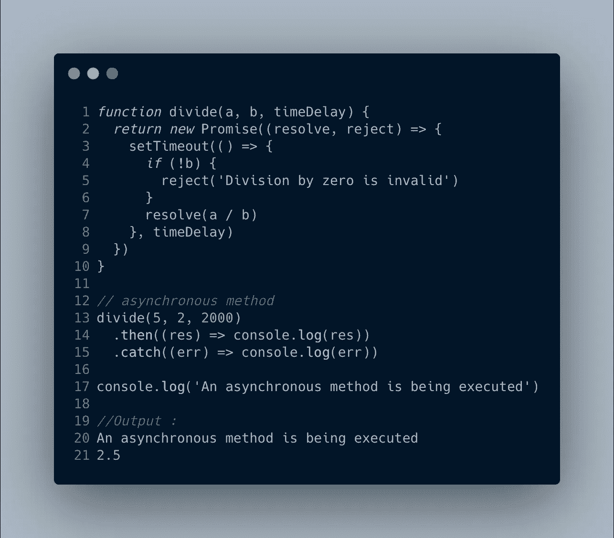
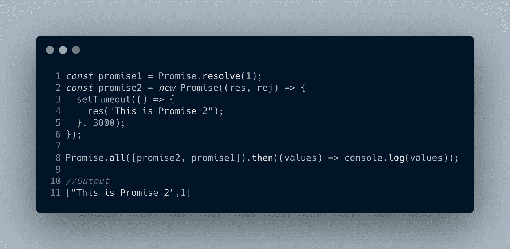
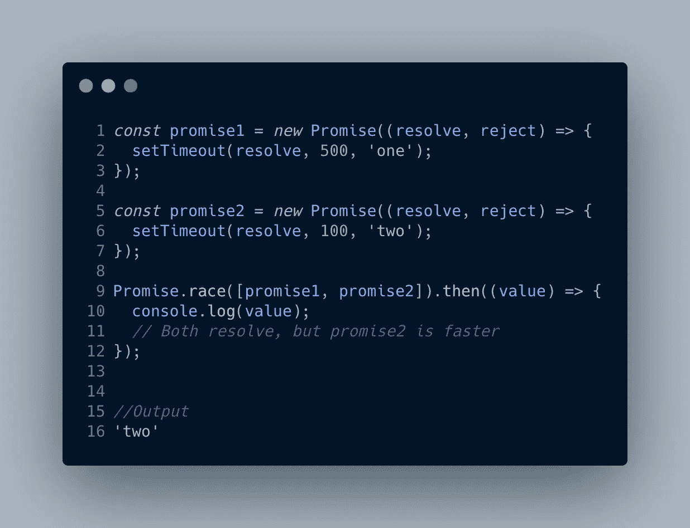
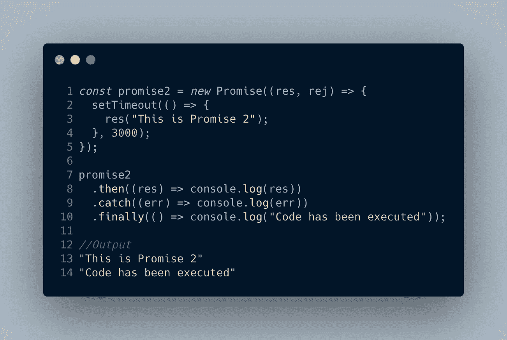
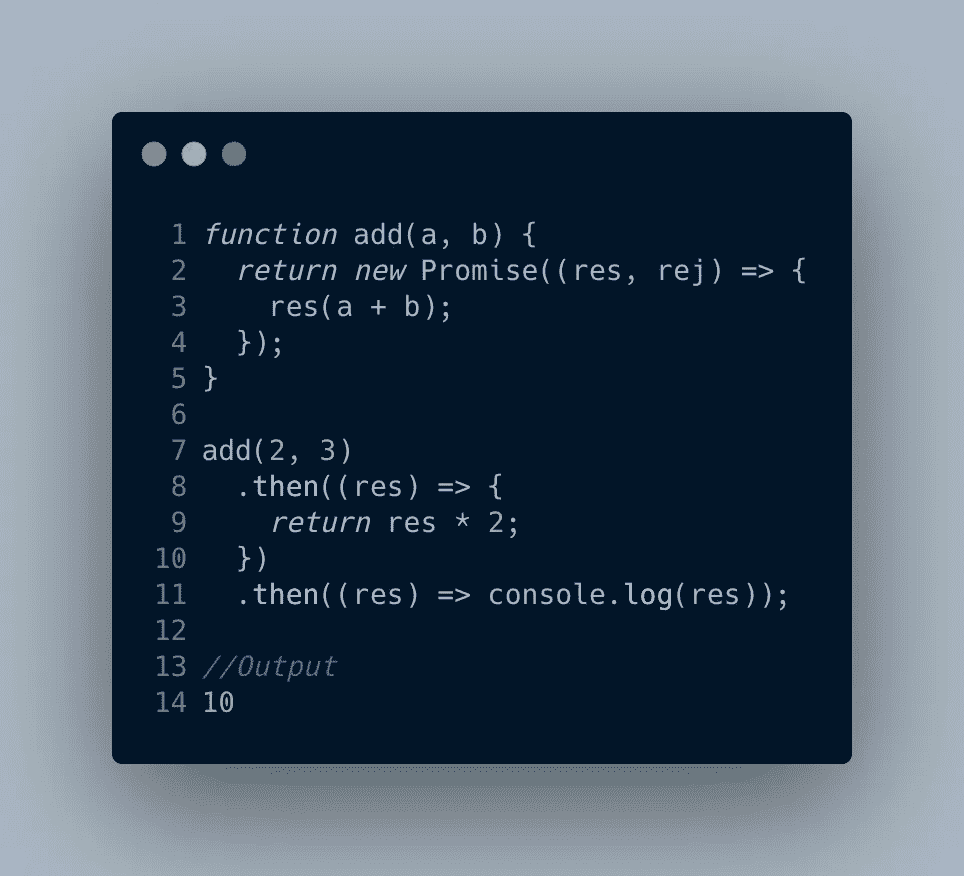

# JavaScript 中的承诺——JavaScript 访谈系列

> 原文：<https://javascript.plainenglish.io/promises-in-javascript-javascript-interview-series-fd65be7cb0b2?source=collection_archive---------8----------------------->

## 一个简单而全面的 JavaScript 承诺教程，包括基础知识、重要方法和承诺链。

承诺是 JavaScript 中最重要的主题之一，是作为 ES6 的一部分引入的。这是大多数 JavaScript 访谈中经常被问到的问题，也是大多数基于 web 的 JavaScript 库背后的主要机制之一。在这篇文章中，我们将详细了解承诺及其功能。所以让我们开始吧。

还记得你最后一次去麦当劳点你最喜欢的汉堡吗🍔 🍔？嗯，这一定是发生了什么。

Source : unsplash.com

1.  你下了订单。
2.  支付了与您的订单相应的金额。💵
3.  服务员给你开了一张订单收据(上面有订单号)。📄
4.  你等着你的饭准备好。🥱🥱
5.  最后，当您的订单到达时，您将收据换成订单。🍔 🍟 🥤

嗯，这与承诺的工作方式非常相似，事实上也是理解承诺的最佳类比之一(归功于凯尔·辛普森)。

# **JavaScript 中的承诺是什么？**

Source : unsplash.com

根据 MDN docs " *，*，**，*承诺*，**，*是在创建承诺时不一定知道的值的代理。它允许您将处理程序与异步操作的最终成功值或失败原因相关联。这使得异步方法像同步方法一样返回值:异步方法不是立即返回最终值，而是返回一个在未来某个时间提供该值的承诺。*”

根据前面提到的类比，在你最喜欢的麦当劳点餐是一个异步的行为，也就是说，你不会在支付所需金额后立即收到食物💵。然而，你得到的是一张收据📄或者承诺在未来的某个时间供应这顿饭🍔 🍟 🥤。

请记住， ***Promise 是一个对象* t** 并且有与之相关联的方法，例如 *then()* 和 *catch()* 。 *then* 方法用于解决承诺时，即异步方法的已解决或已完成结果准备就绪时(即您的订单已准备好放在柜台上)，而 *catch* 方法用于拒绝承诺时(想象一下麦当劳的可乐用完了😱😱 ).还有其他一些重要的方法，将在本文后面探讨。目前，这应该足够了。

承诺处于以下状态之一:

*   ***待定*** :初始状态，既不履行也不拒绝。
*   ***完成*** :表示操作成功完成。
*   ***拒绝*** :表示操作失败。

现在我们对承诺有了一些了解，让我们通过一个代码例子来理解承诺。

Example code 1.

让我们理解示例代码 1。

1.  在第 13 行。执行的 *divide* 函数是异步的，即它不会立即返回其操作值，但由于 setTimeout 方法(第 3 行)会有 2 秒的延迟。因此，试图打印' *a'* 除以' *b'* 的结果将是致命的。因此，由于 divide 方法的异步特性，我们在这里使用了 promise。
2.  当执行函数 *divide* 时，返回一个承诺(第 2 行。)
3.  承诺要么被解决，要么被拒绝。这里由于' *b'* 不等于 0，所以执行第 7 行，解决承诺。
4.  一旦承诺被解析，promise 对象的 *then()* 方法被执行，该方法使用解析的结果。
5.  如果*‘b’*等于 0，那么 *catch()* 方法将会执行。

唷！现在我们继续。

承诺对象中有很多重要的方法(参考 [MDN 文档](https://developer.mozilla.org/en-US/docs/Web/JavaScript/Reference/Global_Objects/Promise))。我们将在这里讨论一些常用的。

# **承诺对象的重要方法**

**promise . all:***promise . all()*接受一个承诺数组作为输入，然后将输出解析为输入承诺的结果数组。请注意，promises 数组的输出顺序与输入 Promises 数组的顺序相同。它会在任何输入承诺拒绝或非承诺抛出错误时立即拒绝，并将使用第一个拒绝消息进行拒绝

Example Code 2.

**promise . race**:*promise . race()*方法返回一个承诺，该承诺在 iterable 中的一个承诺满足或拒绝时立即满足或拒绝。

Example Code 3.

**Promise . prototype . finally**:该方法用于在承诺被处理(即拒绝或履行)时执行一个函数。这可用于避免*中的重复编码。然后()*和*。catch()* 方法。

Example Code 4.

# **JavaScript 中的链接承诺:**

好了，现在我们已经对承诺有了足够的了解，让我们试着去理解承诺链。

Source : unsplash.com

在我们继续之前，必须了解每个*。然后()*，*。catch()* 和*。Promise 对象的 finally()* 方法返回一个新的 Promise，该 Promise 可用于链接。让我们试着借助一个例子来快速理解链接。

Example Code 5.

自*。然后()*方法返回一个承诺，还有另一个*。然后()*法附以新的许诺。新承诺的解决结果将是新*的争论。*接着()【法链】。因此，这可以用来按顺序执行一系列承诺。

我希望你已经理解了本文中承诺的用法和它们的功能。如有任何疑问，请在评论区留下您的评论。

在下一篇文章中，我们将学习如何为 a Promises 和 Promise.all 创建 polyfill。

*更多内容请看*[***plain English . io***](http://plainenglish.io/)