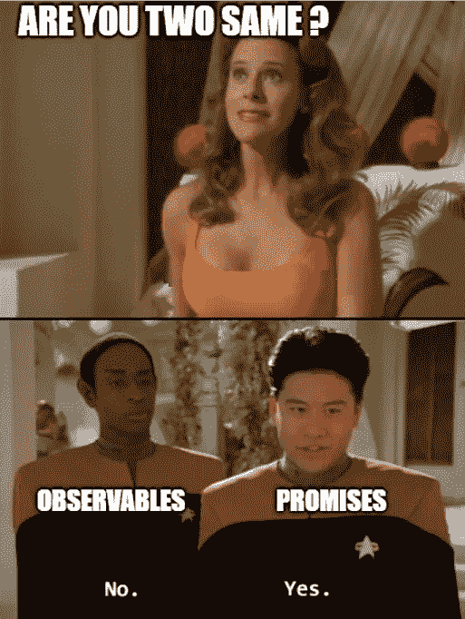

# 承诺与观察——领先的是什么？

> 原文：<https://javascript.plainenglish.io/promises-vs-observables-what-is-ahead-of-the-pack-7567d5f6582a?source=collection_archive---------9----------------------->

Photo by [Oskar Yildiz](https://unsplash.com/@oskaryil?utm_source=medium&utm_medium=referral) on [Unsplash](https://unsplash.com?utm_source=medium&utm_medium=referral)

# 角度为 11 的示例

现代复杂的 web 应用程序通过利用现代 web 浏览器的增强功能和客户端设备上更便宜的计算和资源成本，严重依赖于客户端。它们远远超越了简单的基于内容的静态网站，甚至也不再是简单的动态应用程序所能比拟的。漫长而复杂的用户旅程和复杂的业务逻辑验证预计将在客户端处理。

web 应用程序开发中的一个主要考虑因素是，随着传输/处理的数据量越来越大，应用程序在客户端的性能如何。

这也是异步和并发编程技术应用于客户端实现的地方。

在**非常高的级别**，异步和并发编程的区别是:

*   异步本质是在等待一些已经触发的其他任务完成的同时执行另一个任务的能力。如果同步进程序列中有任何任务被阻塞，整个应用程序都应该等待。但是相比之下，在异步进程中，应用程序可以继续执行其他非阻塞任务，直到阻塞任务完成。
*   并发是指同时并行计算多个任务的能力。
*   与顺序编程相比，唯一的缺点是异步和并发编程都会增加额外的计算和资源开销。但是我们仍然应该承担实现功能性和非功能性需求的成本。**这不再是一个交易**。

Who is ahead of the pack? — Photo by [Eva Blue](https://unsplash.com/@evablue?utm_source=medium&utm_medium=referral) on [Unsplash](https://unsplash.com?utm_source=medium&utm_medium=referral) ❤

在本文中，我将讨论两个主要的异步支持框架实用程序及其差异。

*   承诺
*   看得见的

如上所述，两者都是异步支持实体。由于大多数适用于异步解决方案的用例都可以通过应用这些实体中的一个来克服，所以一眼看去，有些甚至可以断定它们是否相同？

大家讨论一下。

The answer is NO

可观察到的特性比承诺的要多，并且在性能和资源利用方面已经采取了一些有价值的额外措施。由于这些事实，现在我们经常使用 Observables 而不是 Promises，甚至 Angular 本身也默认使用 Rx.js Observables 而不是 Promises 来处理 HTTP。

这里有一些与棱角分明的[官方指南](https://angular.io/guide/comparing-observables)的关键区别，我已经用例子详细说明了。

# 1.渴望 vs 懒惰

在 Promises 中，一旦创建了 Promise，构造函数就会被触发，函数就会立即执行。

示例:

执行顺序:

1.  这是最初的块，执行者将要创建一个承诺
2.  这就是许诺在本质上是热切的意思。在创建时，将执行作为构造函数参数传递的函数。现在它已经初始化并开始服务。Executor 现在从 Promise 函数出来，按顺序往下走。
3.  执行者执行承诺解析器之前的部分
4.  然后，executor 满足承诺的“Then”回调，它将被注册/排队，但不会立即执行回调。相反，它会向下运行 Promise resolver 后的块。承诺的这种确定的异步性质将在后面进一步讨论。
5.  然后，排队的任务将被执行，而回调函数将被执行。
6.  其余的命令将在回调函数中执行

由于可观察性本质上是声明性的，所以除非有人请求，否则不会触发主体执行。这使得可观的是懒惰的设计。

示例:

执行顺序:

1.  Observable 初始化，但是传递的函数不会被执行，直到其他用户开始监听它
2.  执行者在可观察的订阅者之前执行部分
3.  然后 Observable 被订阅，回调函数将被执行并返回发出的值
4.  执行订阅的成功回调中的剩余任务。
5.  然后，它执行“完成”块
6.  Executor 在可观察的订阅之后执行部分

# 2.单值与多值

Promises 确保它通过设计只解析一个值，它可以是一个原始值、一个对象或一个对象数组，但它仍然应该是一个被引用的实体。承诺最常见和最频繁的用法是利用它们来处理 HTTP 通信。正是由于上面提到的原因，我们只能期望对所提出的请求有一个响应。

示例:

可观测量能够传递多个值或一系列值。如下例所示，将在订阅中执行多次发射，这在处理各种情况时非常有用

*   DOM 事件流
*   处理推送通知或除面向请求的半双工 HTTP 查询之外的任何类型的双向通信。

示例:

# 3.异步与同步/异步

承诺在设计上是异步的。即使我们感觉像是，执行注册回调将被立即执行，但这不是基本规则中定义的方式。

执行顺序:

1.  执行者执行承诺解析器之前的部分
2.  然后，执行程序满足承诺“然后”回调将被注册/排队，但不会立即运行回调。相反，它会向下运行 Promise resolver 后的块。
3.  然后，排队的任务将被执行，而回调函数将被执行。
4.  其余的命令将在回调函数中执行。

但是当这与可观测量相比时，它并不强制执行行为。相反，它同步执行回调函数，但它让回调函数的内容按预期执行，这意味着如果有任何异步执行的内容，那么它将异步执行，反之亦然。

执行顺序:

1.  Observable 初始化，但是传递的函数不会被执行，直到其他用户开始监听它
2.  执行者在可观察的订阅者之前执行部分
3.  然后 Observable 被订阅，回调函数将被执行并返回发出的值，同时执行订阅成功回调**中的剩余任务**。
4.  Executor 在可观察的订阅之后执行部分

但是在下面的例子中，由于回调包含了一些*设置超时*，执行器将顺序移动到下一个操作，并异步返回到这个**。**

**执行顺序:**

1.  **Observable 初始化，但是传递的函数不会被执行，直到其他用户开始监听它**
2.  **执行者在可观察的订阅者之前执行部分**
3.  **然后 Observable 被订阅，回调函数将被执行并返回发出的值，同时执行订阅成功回调**中的剩余任务**。但是由于执行程序发现了一些超时，这些超时会被记录下来。然后，它按顺序移动到下一个步骤，并在订阅后出来执行块。**
4.  **然后执行器返回并执行订阅中的异步部分。**

# **4.不可取消与可取消**

**尽管一些后来的定制/增强的库包装器确实支持这一点，但承诺的本机规范是不可取消的。换句话说，比方说某个耗时的任务在预期的放牧期内花费了很多时间，而您想不等待响应就离开，承诺的本机规范在设计上并不支持这一点。**

**另一方面，可观测量是可以消除的。如果我们需要处理上面提到的相同用例，那么可以简单地从异步任务中取消和取消订阅。**

**执行顺序:**

1.  **Observable 初始化，但是传递的函数不会被执行，直到其他用户开始监听它**
2.  **执行者在可观察的订阅者之前执行部分**
3.  **然后 Observable 被订阅，回调函数将被执行并返回发出的值，同时执行订阅成功回调**中的剩余任务**。但是由于执行程序发现了一些超时，这些超时会被记录下来。然后，它按顺序移动到下一个步骤，并在订阅后出来执行块。**
4.  **然后，执行程序**不会**返回并执行订阅中的异步部分，因为它已被强制取消订阅。**

# **5.经营者**

**承诺只提供了一个“那么”,在这种情况下，与 Observables 相比，处理复杂转换的本机框架级支持能力较弱。**

**但在 Observables 中，这得到了很好的支持，许多强大的转换都提供了 RxJs 操作符，如为数组提供的 ***、map、filter、take*** ，我们也可以使用 ***管道将它们链接起来。如你所见，由于转换后的可观察对象被订阅，自然可观察对象在声明式编程中非常受支持。*****

**执行顺序:**

1.  **操作符***“interval”***创建一个可观察对象，该对象根据定义的时间间隔在流中发出数字**
2.  **操作符" ***取"*** 从第一个流中提取定义数量的项并创建第二个流**
3.  **然后***【map】***操作符对来自***take】***的输出流进行操作，并将它们映射到一个日期，并创建第三个流**
4.  **这可以用各种其他运算符继续，并执行复杂的转换**

# **6.结论**

**按照上面讨论的所有要点**

1.  **渴望 vs 懒惰**
2.  **单值与多值**
3.  **异步与同步/异步**
4.  **不可取消与可取消**
5.  **经营者**

**与承诺相比，可观察的事物有更多的亲特性和更强的可控性。**

**就个人而言，和大多数其他开发者一样，我更喜欢可观察的东西而不是承诺，我希望我已经给了你足够的理由。**

**请找到我的 git repo 和下面的示例工作区。**

** [## sajithahd/Angular-Examples-observable-vs-promises

### 由斯塔克布里兹·⚡️.创作通过创造……为 sajithahd/Angular-Examples-observables-vs-promises 发展做出贡献

github.com](https://github.com/sajithahd/Angular-Examples--observables-vs-promises) 

# 7.来源

 [## 有角的

### Angular 是一个构建移动和桌面 web 应用程序的平台。加入数百万开发者的社区…

angular.io](https://angular.io/guide/comparing-observables)  [## 可观测量& RxJS *角度

### “可观察”是一个蓝图，用于创建流，并将其与操作者连接在一起，以创建可观察的链…

codecraft.tv](https://codecraft.tv/courses/angular/reactive-programming-with-rxjs/observables-and-rxjs/) 

也请分享你的经历吧！

**#快乐编码**👨‍💻👩‍💻

*更多内容请看*[*plain English . io*](http://plainenglish.io/)**