# proto——用 Next.js 制作的项目管理器

> 原文：<https://javascript.plainenglish.io/proto-a-project-manager-made-with-next-js-da2d82eeee37?source=collection_archive---------3----------------------->

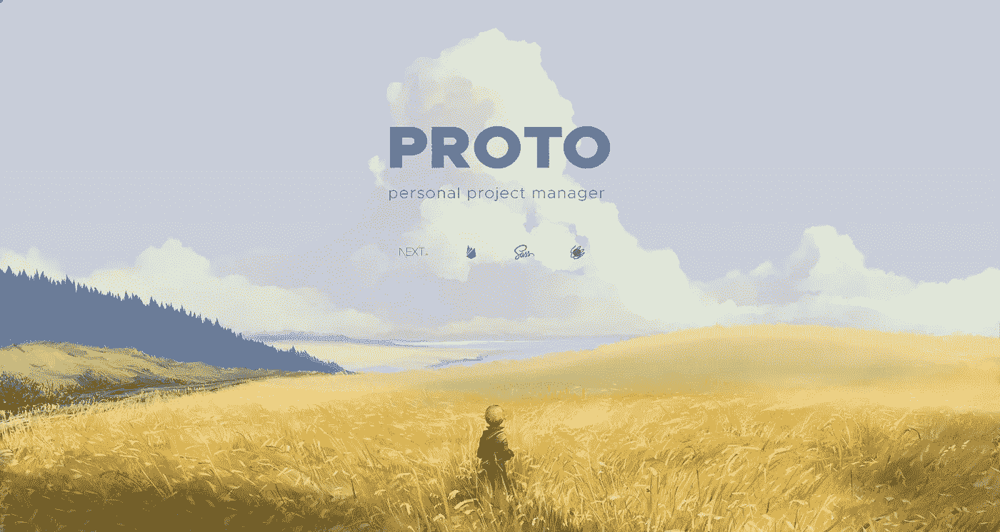

几年来，我一直在寻找完美的工具来管理我的项目。我用 Trello 跟踪我的任务，用 ideas 写笔记，用 Milanote 组织我的想法。这些奇妙的工具可以在很大程度上完成工作，并保持你的工作效率。

当我在做一个个人项目时，我会创建笔记，并将参考资料存储在 idea 中，然后我会使用 Trello 来跟踪我的任务。自从 2018 年推出 ideal 以来，我一直在使用这个工作流程。但是从一个工具到另一个工具的方法增加了额外一层不必要的工作。我想要一个单一的工具来处理这些需求。你可以实现 Trello 的看板，但是我仍然不喜欢用观念来跟踪我的任务。

最近我爱上了米拉诺特。这是一个非常简洁的工具，它可以让你记下想法，并把它们转换成图片、待办事项、专栏等板块和节点。但这里并不都是天堂，Milanote 并没有为上传到免费层的图片、链接和文件提供足够的配额。如果你想将它用于多个项目和需求，你必须购买付费订阅。如果你像我一样喜欢构建很多项目，你会喜欢 Milanote，我建议你尝试一下。还有一些专门用来管理项目的工具，比如 Plutio、ClickUp 等。如果你和一个团队一起做一个专业项目，这些工具会创造奇迹。但是对于一个小的个人项目来说，它们是多余的。

用真正需要的部分来管理个人项目的想法催生了 **Proto。我创建了 Proto 来管理我的小型个人项目。你可以看看[这里](https://proto-lilac.vercel.app/)或者点击[这里](https://github.com/ayushman-git/project-manager)进行 GitHub 回购。**

# 基础

原型的计划非常简单。创建一个工具，让你和谐地跟踪你的项目，不要在你的想法和执行之间增加额外的一层。要管理一个个人项目，你基本上需要三样东西——想法、故事和参考资料。对于 Proto，我试图包含这三个元素。Proto 有快捷方式(项目所必需的链接，如 firebase console、azure、netlify 等)，我可能会经常用到。一个 scrum 板，我可以在那里跟踪我的任务和一个参考网站列表。

到目前为止，我主要使用 Vue。Js 来创建我的前端项目。但是对于 Proto，我想改变一下。最近我在探索 NextJs & Gatsby，发现它们非常有吸引力。所以我浏览了他们的文档，对他们的工作方式有了一个基本的了解。最后决定用 **NextJs** 做 Proto。除了 NextJs，我使用 **firebase 认证**进行用户认证， **firebase firestore** 存储用户数据， **SASS** 进行样式化，**js-cookie**&**nookies**处理 cookie，最后， **react-spring** 在 proto 中喷洒样式。

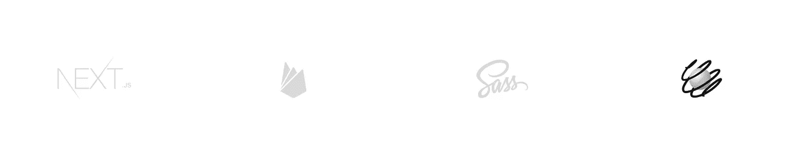

# 设计和布局

**Proto** 只有三页。首先是一个登陆页面，这是一个裸露的最小页面，让用户使用他们的谷歌或 GitHub 帐户登录/注册。我还没有花太多时间来设计登陆页面。就在这条路上。接下来的两个主要页面是主页和项目页面。

## 主页

这是用户登录后显示的页面。

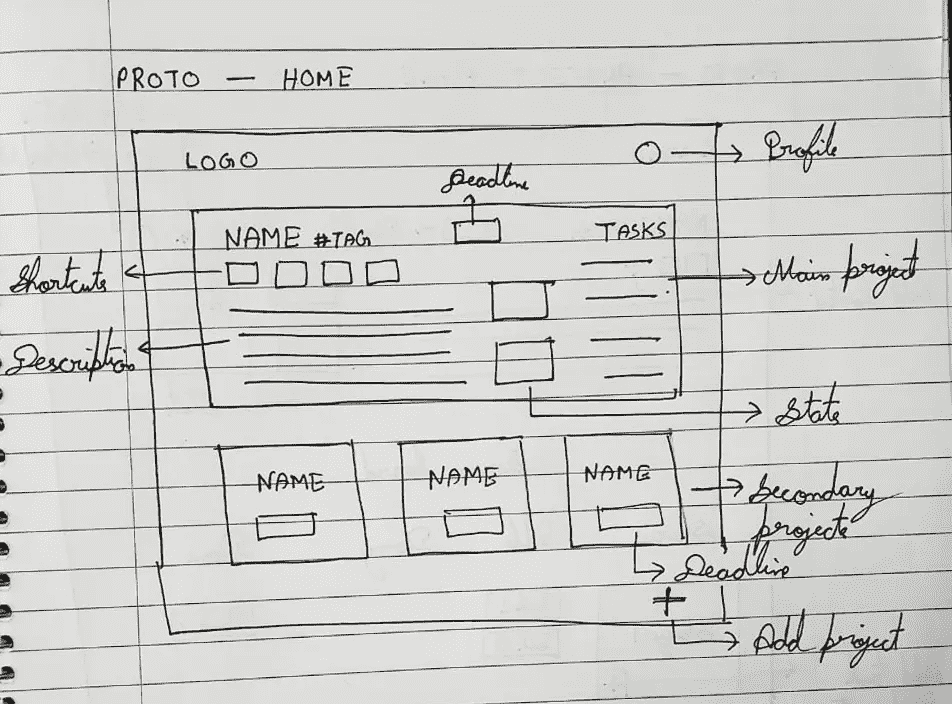

让我们在这里从上到下。在最上面，是我们的导航条。它有一个标志，在右边的用户资料。在导航栏下面，有一个显示主项目细节的模块。这个想法是有一个主模块，它将显示用户当前正在进行的项目的细节。基于视觉层次，这个模块将是主导的一个，然后有小模块，包含不活动的项目或未来的项目。

显示活动项目的主模块根据显示在右侧的类型排列任务，在中间和左侧有一些统计数据，在项目名称下面有快捷方式和描述。我认为这些是用户可能需要的基本信息。

在主模块下面，多个小模块包含关于用户当前不在工作的项目的信息。在这些模块中，我只显示了项目的名称和截止日期。

基于这个骨架，我创作了我的 Figma 设计。

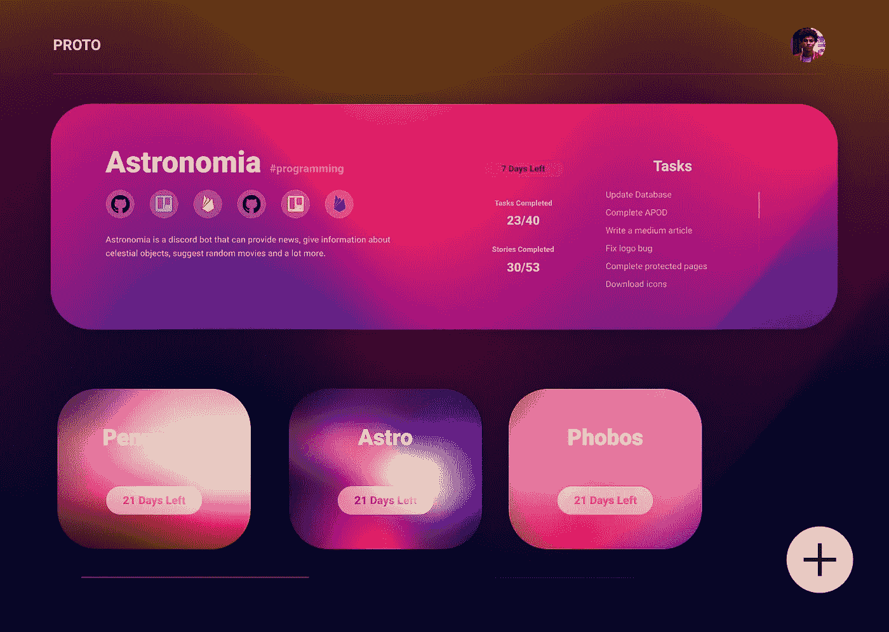

## 项目页面

每当用户点击任何项目时，他/她将被重定向到项目页面。

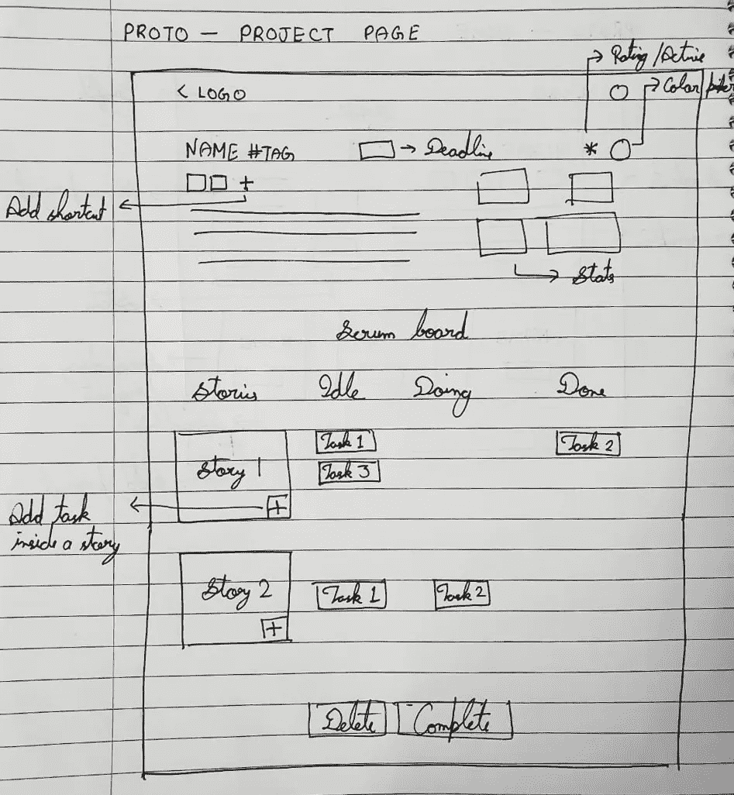

项目页面是 **Proto** 的面包和黄油。Navbar 保持不变，只是左侧有一个后退按钮。在导航栏下面，主模块与主页上的主模块保持一致。我添加了一个按钮，让用户将这个项目标记为活动项目，还添加了一个圆圈，用户可以通过它来更改主题。

然后是 scrum 板。scrum 板的主要思想是将整个项目转换成故事。这个故事的例子可以是'*用户可以添加项目*'。现在，这个故事将有多个可以跟踪的任务。

所以在 scrum 板里面，有四列— **故事，空闲，正在做和已经完成**。最后三个将用于跟踪任务的进度。用户可以点击一个故事，在故事中创建一个任务。然后，任务可以在不同状态之间移动。

我想在这一页上增加一个部分来处理参考文献。所以用户可以在这里添加网站作为参考。我还不能实现它，但我会很快添加它。

最后，两个按钮会将项目标记为已完成或删除项目。

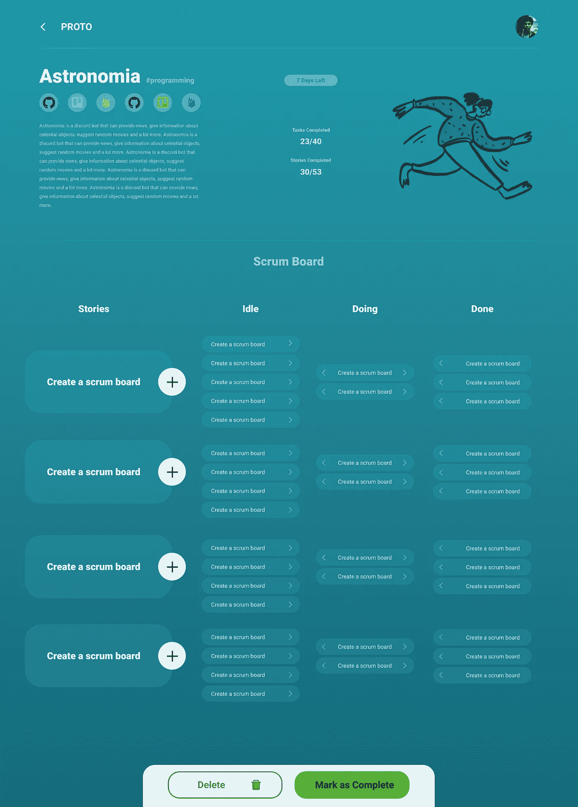

This is the Figma design I came up with for the project page.

# 实施身份验证

对于认证，我使用 firebase auth。Firebase auth 很容易设置。但是为 NextJs 设置身份验证有一点不同，因为 NextJs 是如何工作的。NextJs 是用 Node 构建的。Js，这允许它执行服务器端呈现或静态站点生成。所以它既是服务器又是客户端。这个想法对我来说有点难以理解。

无论如何，这意味着你需要初始化`firebase-SDK`以及 firebase 客户端。让我们看一下处理认证的三个文件。

## firebaseClient.js

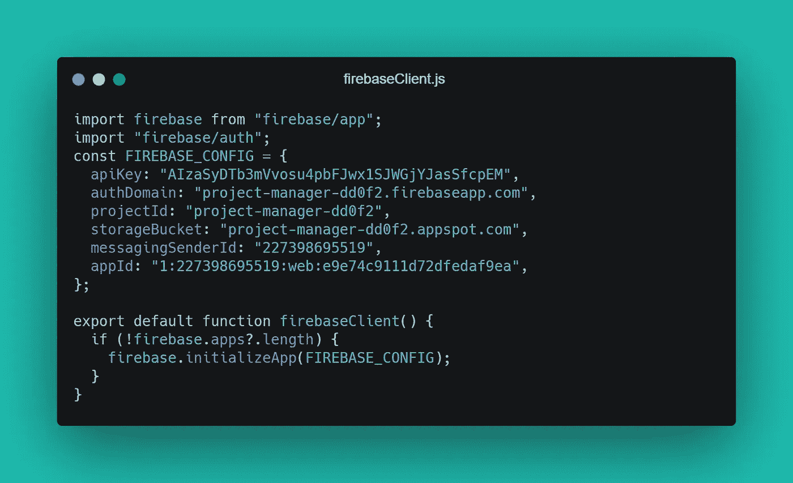

这个文件是我初始化 firebase 客户端的地方。我们需要一个可以从 firebase 控制台提取的配置对象。在这个文件中，我们导出了一个函数，它首先检查 firebase 中是否有一个现有的应用程序，如果有，那么它什么也不做，否则它使用 initializeApp 函数初始化 firebase 客户端。这里我们不需要隐藏客户端的配置。`FIREBASE_CONFIG`对象对用户的可见性不会改变任何事情。

## firebaseAdmin.js

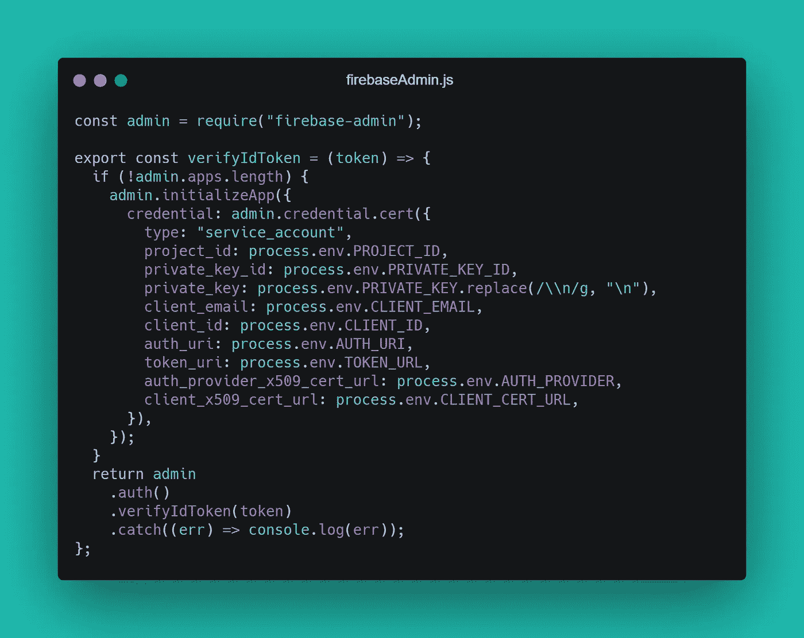

在这个文件中，我导出了`verifyIdToken` 函数。这个函数将一个令牌作为参数，然后它初始化 firebase-SDK，以便我们可以使用服务器端函数。最后，它执行令牌验证来验证用户。

在将页面发送给用户之前，我们将在服务器端执行`verifyIdToken` 函数。

## 认证. js

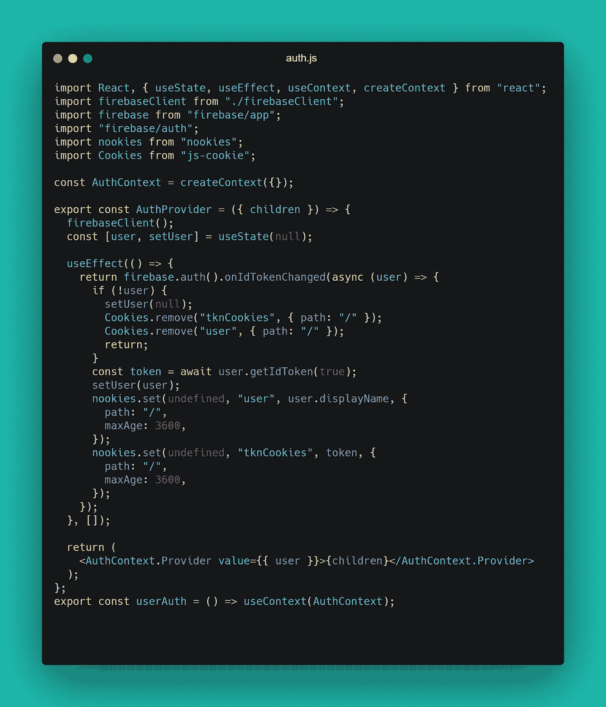

在 auth.js 中，在 useEffect 钩子内部，它将在挂载时执行回调函数。我正在执行`onIdTokenChanged` 函数，每次令牌改变时都会执行这个函数。所以每次用户登录或注销时。onIdTokenChanged 函数在其回调函数中传递参数用户的信息。因此，如果用户登录，它将包含有关用户的信息，如果用户没有登录，它将为空。

因此，如果没有用户，它将删除存储令牌和用户信息的 cookie，并将`user` 的状态更改为 null。但是如果有一个用户，它会用用户的信息设置变量`user` 的状态，并设置关于用户信息的 cookies。

这个函数导出两个东西——一个是值为 user 的上下文提供者，另一个是使用该上下文的`userAuth` 钩子。

## 通过提供商登录

我让用户使用他们的谷歌和 GitHub 帐户登录/注册。

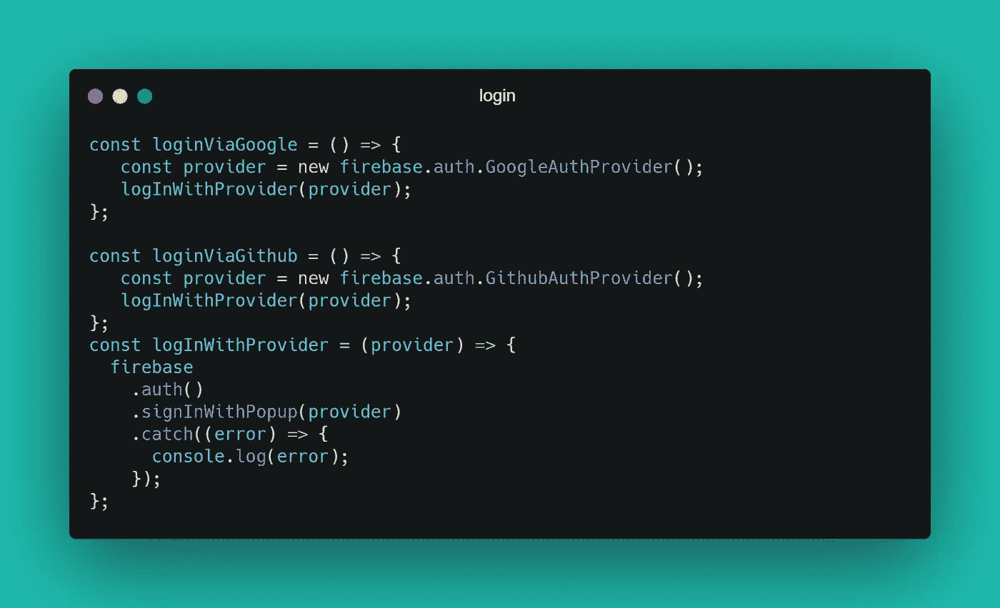

为了实现这一点，我正在使用 firebase auth 函数创建提供者。然后我将这个提供者作为参数传递给`signInWithPopup` 函数。

# 项目结构

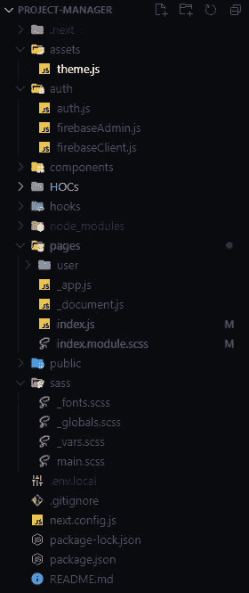

在组织原型结构时，我试图遵循 DRY 原则。 **assets** 文件夹包含导出主题细节的 theme.js 文件。 **auth** 文件夹有三个文件— auth.js、firebaseAdmin.js 和 firebaseClient.js，这三个文件是身份验证所必需的。然后有一个 **components** 文件夹，其中包含 proto 中使用的所有组件。**钩子**和**钩子**用于区分逻辑和组件。页面文件夹负责路由和决定显示哪个页面。 **sass** 文件夹包含项目的全局样式。

## 受保护的页面

让我们看看主页。主页受到保护，因此只有已登录的用户才能访问它。

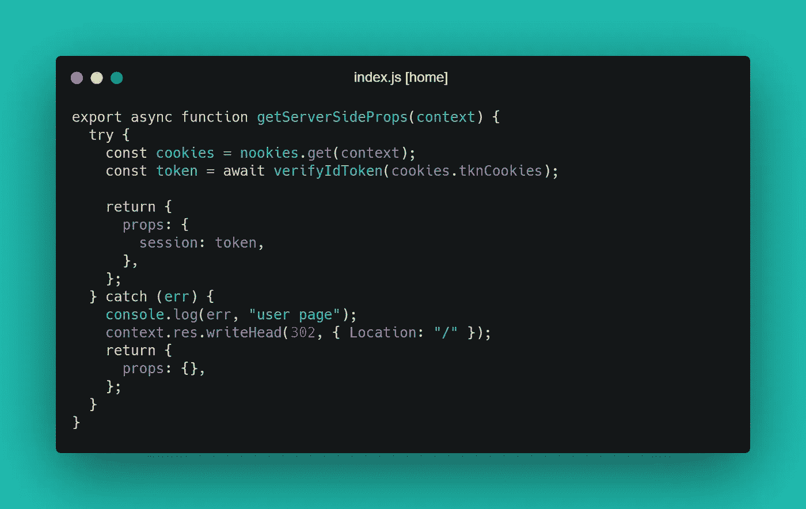

Next.js 提供了一个`getServerSideProps` 函数。它将使用由`getServerSideProps`返回的数据在每个请求上预先呈现这个页面。所以在这个函数中，我们可以检查用户是否可以访问这个页面。这里我访问的是用户第一次登录时存储的 cookie。然后我使用从`firebaseAdmin.js` 导出的`verifyIdToken` 函数来检查令牌的有效性。如果它是合法的，它会把用户的信息作为道具转发给我们的客户。但是如果有错误，它会将其重定向到登录页面('/')。

在客户端，我从 firestore 获取用户的项目并显示给用户。

# 造型和动画

对于基本的造型，我用 SASS。SASS 是一个 CSS 预处理器，这意味着它拥有 CSS 所拥有的一切，甚至更多。

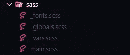

目前，我有四个 sass 文件。第一个处理字体——比如改变字体大小、字体系列等。`_globals.scss`处理全局需要的东西——比如改变默认输入、文本区域样式等。`_vars.scss`有变量，可能在很多地方都需要。

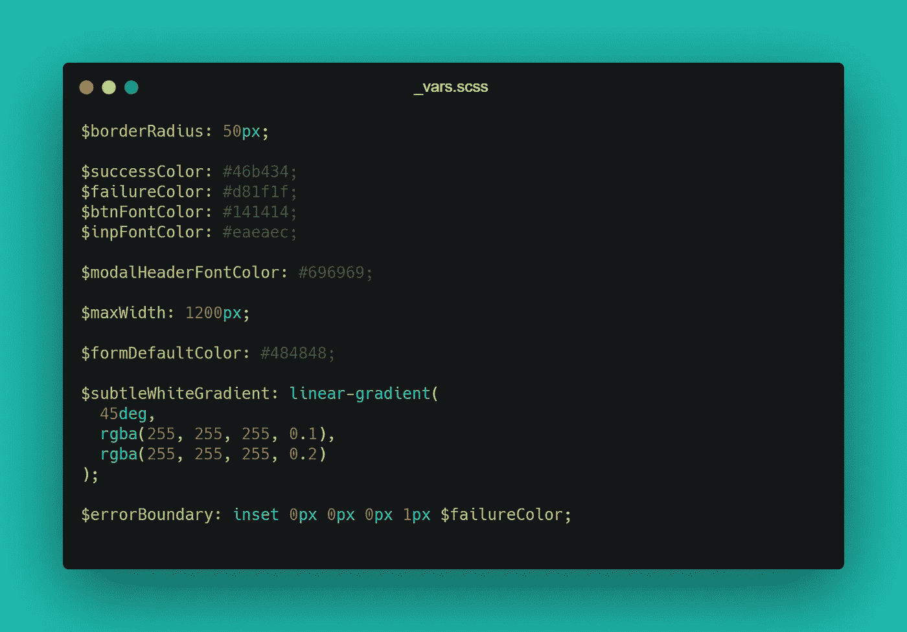

最后是包含所有其他 scss 文件的`main.scss`文件。

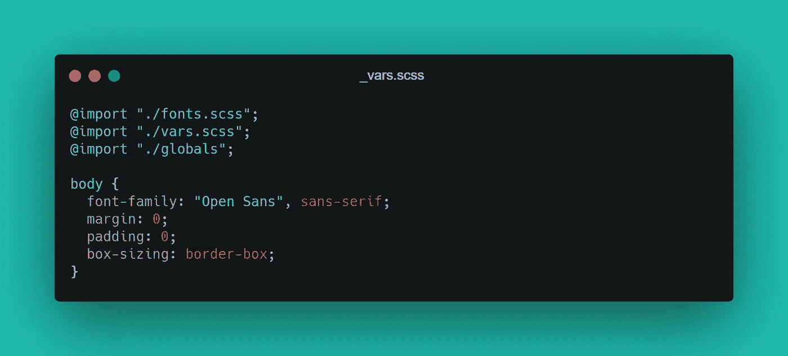

对于单个组件，我使用的是 scss 模块，它是开箱即用的。让我们来看看我们的一个组件。

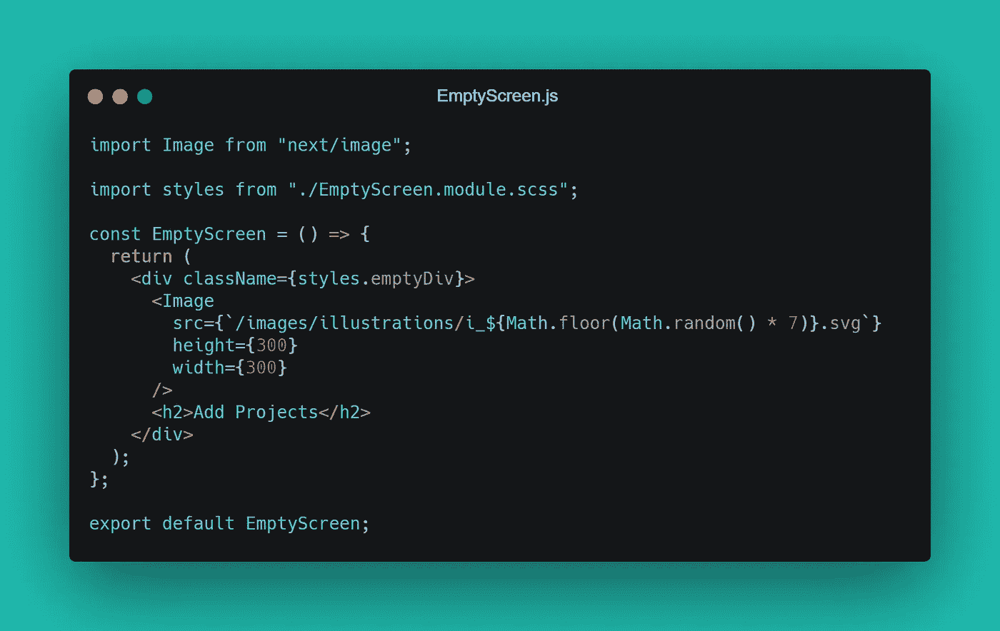

在这里，我从 **EmptyScreen** scss 模块导入样式。然后使用语法`{styles.<class name>}` 将其作为类名应用。这将为该类创建一个随机名称，使得它只能被导入到其中的组件访问。

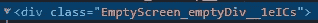

## 反作用弹簧

让我们让 proto 好看。为了添加过渡和动画，我使用了**反应弹簧**。这是一个动画库，其操作与典型的动画库略有不同。大多数动画库从 A 点过渡到 B 点，有一些曲线在固定的持续时间上。改变曲线决定了动画的流动。但是你不必担心 react-spring 中的持续时间或曲线。你只需要修改数值，它会根据真实物理计算出持续时间和曲线。

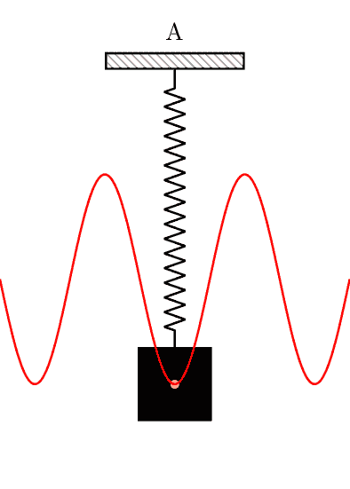

你也可以通过改变配置来改变感觉，修改质量，张力，摩擦力等等。更多信息请查阅他们的[文档](https://www.react-spring.io/)。

让我们来看看 **SecondaryCard** 组件，看看 react-spring 是如何工作的。

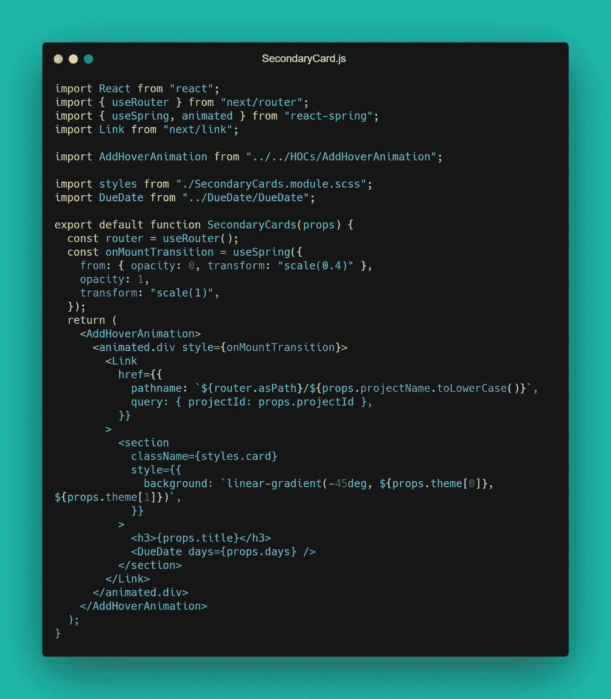

我们正在从`react-spring`进口`useSpring` 和`animated` 。之后，我们创建一个常量`onMountTransition` ，它使用了 useSpring 函数。在 useSpring 函数内部，我们传递一个对象来确定要转换哪些属性。在该对象中，我们通过添加一个包含初始值的对象的键来定义属性的初始值。在这个对象之外，我们可以确定最终值。

然后我们需要使用`animated` 前缀将我们想要制作动画的 HTML 元素转换成一个特殊的 react-spring 元素。所以在上面的代码中，我用`<animated.div>`转换`
`，然后在样式属性中传递`onMountTransition` 常量。

Changing scale and opacity

## 添加悬停效果

我们可以将整个动画封装在一个 HOC 中，并将该动画添加到其子动画中。这样我们就不用一遍又一遍的创作同一个动画了。

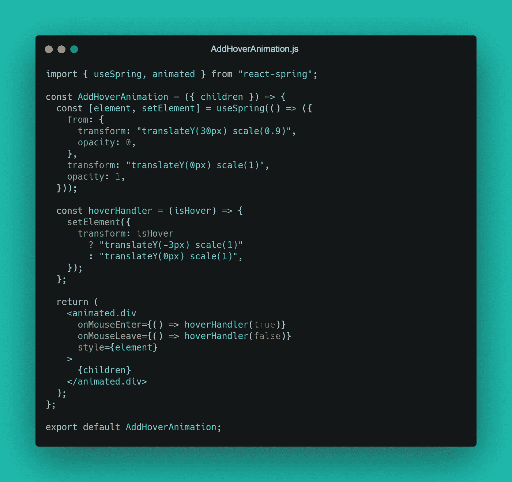

在这个 HOC 中，我们用另一个`div`封装子组件。这个 div 是特殊的 spring div，因为我们添加了前缀`animated` 。

与上次不同，我们用两个值来析构 useSpring 函数——元素是动画本身，而`setElement` 函数用来修改元素的动画，就像 useState 钩子一样。在 useSpring 函数中，我像上次一样传递对象来设置动画属性的初始值和结束值。但是这一次我们用函数`hoverHandler`在动画 div 上添加了`onMouseEnter` 和`onMouseLeave` 事件。这个函数是用`setElement` 函数改变元素的值。

所以每当用户悬停在卡片上时，元素的 Y 位置将被更改为-3px，从而使其向上移动。

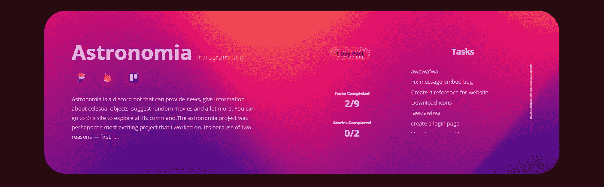

You can also make something cool like this using react-spring.

# 部署

我在维塞尔部署了 proto。整个部署过程非常简单。`Go to vercel.com > login > create a new project > link GitHub > attach the repo > finally add the environment variables in the settings.`

Vercel 还提供了多个 URL，一个是您的主 URL，其他的可以用于测试新的提交，然后才允许它们访问主 URL。

# 结论

Proto 是我创造完美项目经理的尝试。这是一个有点雄心勃勃的项目，远远不是一个可供消费者使用的成品。我只实现了最初设想的 20%。但是这 20%让我学到了很多我从来不知道的东西。这个项目让我走出了自己的舒适区，尝试了一些我通常试图远离的事情。

我以前主要使用 Vue.js，所以我对 React scene 还很陌生。但是我每天都在发现关于 react 的新东西。这个项目帮助我从我的 vue 心态转变到反应。

这个项目也不是一次性的努力，我会回来改进这个项目，增加新的功能和实现新的技术，我会在途中学习。