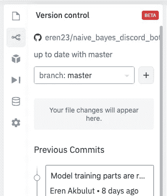

# 使用 Replit 在任何地方创建原型

> 原文：<https://javascript.plainenglish.io/prototype-from-anywhere-with-replit-aacc836bb48e?source=collection_archive---------8----------------------->

大家好，今天的教程将会很短，我会试着解释如何从你的浏览器开始并继续原型制作，基本上在任何地方都可以使用 Replit。

我在标题和入口都使用原型是有原因的，即使我发现它对于像 discord bots 等有趣的项目有用且稳定，但我不认为 Replit 是一个以生产为目的的工具，它最多是原型，如果不只是学习和玩语言的话。

# 什么是 Replit？

“是让编程更容易理解。我们为教育工作者、学习者和开发者构建强大而简单的工具和平台。”这句话正是 Replit 在他们自己的网站上的使命宣言。

但是 Replit 到底是什么？Replit 基本上是一个免费的在线 IDE，支持多种语言。你只需要一个谷歌、Github 或脸书账户就可以开始使用免费层，或者你也可以注册一个电子邮件地址。

# 语言支持

Replit 提供了各种语言选项，我认为没有哪种流行语言不受 Replit 的支持。我只发布一部分语言，当你想创建一个新的 Replit 时，你可以在 Replit 上选择。

正如你所看到的，这正是我能在屏幕上看到的。

我实际上不会使用 Replit 的所有部分和功能，我也不认为我会使用它们，但从我的角度来看，这是整个平台的真正要点。对于软件开发人员来说，2021 年是令人敬畏和兴奋的一年，你可能想亲自尝试一些东西，而不是看一些只是互相复制的教程。例如，我发现 swift 真的很酷，有一天我可能会尝试它，在我看来，Replit 将是开始 0 安装的最佳选择。

# 易于观察的用户界面

我认为 Replit 的用户界面非常简单，但却有很多功能，这就是为什么我觉得它很容易看。我现在分享一些我账户的截图，老实说，我不像以前那样使用浅色主题，但是我很喜欢 Replit 的默认设置，我正在使用它。

# Github 连接和 Git 能力

正如你在上面的图片中看到的，一旦你允许 Replit 访问你的帐户，你就可以很容易地从 GitHub 访问你的回购。您还可以在 Replit 上创建空项目，对它们进行处理，然后在 Github 上发布它们。

您可以跟踪您的 git 历史，并在 UI 上完全使用 git，因为 Replit 真的不是一个面向生产的平台，我强烈建议您只使用 UI。这是我在 Replit 上运行的一个项目的 git 菜单截图。

# 教程和社区

在教程部分，您可以找到许多级别的许多语言的大量资源。我还应该说，这个社区相当活跃，并且不难找到许多语言和平台的基础知识。

# 内置数据库

Replit 自带基于文档的数据库，当你想摆脱样板文件，同时能够使用数据库而不是在代码运行时存储数据时，它对许多项目非常有用。

# 自由层限制

尽管 Replit 的免费层允许你做很多事情，包括使用所有语言的所有特性，但是它有两个主要的限制。(我认为免费层和高级层之间有更大的区别，但这两者是最明显的区别。)

1.  无法创建私有项目。你只能在公共项目上工作，这可能会在某些时候困扰你，此时你可以考虑订阅。
2.  没有持续运行的项目。如果没有人发送任何东西，或者基本上没有在一个正在运行的项目上做任何事情，对于免费层用户来说，它将在 1 小时后停止。你可以通过运行一个网络服务器，每 10 分钟用一个像 up timer 这样的服务 doing 它，来实现这个功能，但这不是建议，做什么由你决定。然而，最确定的方式总是溢价。

今天我尝试了 Replit 中我最喜欢和使用最多的功能。我认为 Replit 的大部分特性都有，它对其他用例也很有用。这些基本面之后你就可以自己去发现了。下次见，照顾好你们自己。:)

*最初发表于*[*【https://blog.akbuluteren.com】*](https://blog.akbuluteren.com/blog/prototype-from-anywhere-with-replit)*。*