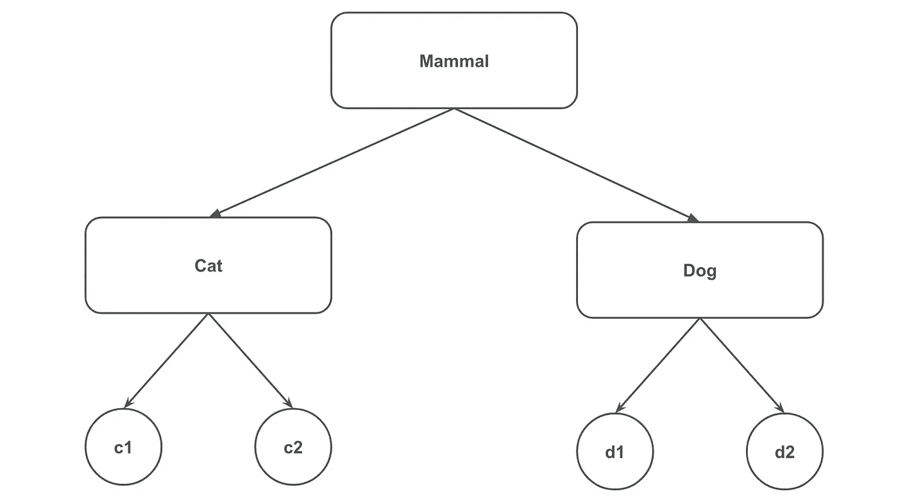
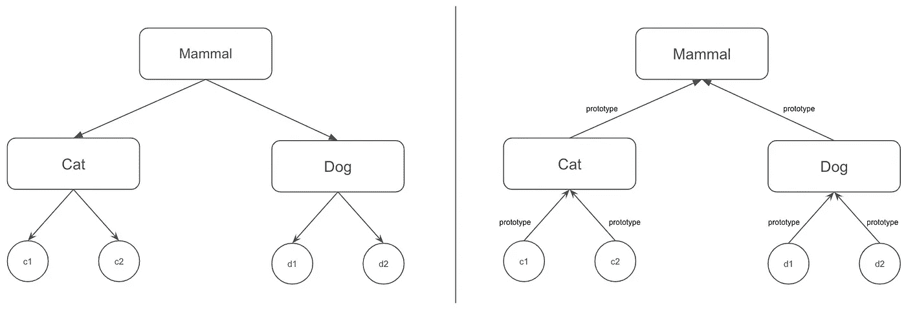
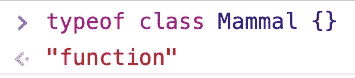

# 原型，这个陌生人！

> 原文：<https://javascript.plainenglish.io/prototype-this-stranger-7a444098cdd4?source=collection_archive---------11----------------------->

## JavaScript 中的对象、类和继承指南


Photo by [Vipul Jha](https://unsplash.com/@lordarcadius?utm_source=unsplash&utm_medium=referral&utm_content=creditCopyText) on [Unsplash](https://unsplash.com/s/photos/code?utm_source=unsplash&utm_medium=referral&utm_content=creditCopyText)

在这篇文章中，我们将看到如何在 JavaScript 中使用对象、类和继承。特别是，我们将讨论“*原型*的概念，以及它如何帮助我们解决与 JavaScript 中面向对象编程相关的特定问题。

# 一般概念

类、对象和继承是面向对象编程中非常重要的概念。在其经典版本中，基本概念基本上有三个:

*   真实世界的抽象，我们可以用它来表现，比如，一个人，一件事等等。一个类定义了一个状态(**属性**)和一个行为(**方法**)。
*   **Object** :是某个类的具体实例，就是我们使用`**new**`操作符时返回给我们的那个。它有自己特定的状态和行为。
*   继承:表示一种机制，允许您基于另一个已经定义的(**父对象**)创建一个对象(**子对象**)。

在图形上，我们可以用一个非常简单的例子来概括刚刚表达的概念:



**猫**和**狗**类继承了**哺乳动物**类的行为，而 **c1** 、 **c2** 是**猫**类的实例， **d1** 、 **d2** 是**狗**类的实例。

# JavaScript 对象

JavaScript 中任何不是原始类型的东西都是对象。对象是一组键值对，其中的值可以是对象、原始变量或函数。如果一个对象有多个键值对，它们必须用逗号分隔。可以用两种方式声明一个对象，第一种是使用`Object`构造函数，第二种是声明一个变量，其中的键值对被`**{}**`包围。让我们用一个小例子来看看如何声明一个对象:

```
const student = {
  name: 'Davide',
  number: '123456'
}const classroom = new Object({
  name: 'Computer Science I',
  teacher: 'Dennis Ritchie'
})console.log(student) 
console.log(classroom)
```

如果您运行这段代码，结果将是

```
{ name: 'Davide', number: '123456' }
{ name: 'Computer Science I', teacher: 'Dennis Ritchie' }
```

您可以使用点号`**.**`访问对象属性:

```
const student = {
  name: 'Davide',
  number: '123456'
}const classroom = new Object({
  name: 'Computer Science I',
  teacher: 'Dennis Ritchie'
})console.log(`Student: ${student.name}`)
console.log(`Teacher: ${classroom.teacher}`)
```

在这种情况下，结果将是:

```
Student: Davide
Teacher: Dennis Ritchie
```

## 定义对象属性

在 JavaScript 中有几种方法来定义对象的属性。第一个是指定对象名称，后跟:点、新属性的名称、等号和新属性的值:

```
const student = {
  name: 'Davide',
  number: '123456'
}student.birthday = '4th July'
console.log(student)
```

显然，如果我们运行这段代码，结果将是:

```
{ name: 'Davide', number: '123456', birthday: '4th July' }
```

在对象之间组合属性是一种常见的做法。一个财产一个财产地去做是很无聊的。静态函数`Object.assign`用几行代码帮助我们做到这一点。让我们通过一个小例子来看看它是如何工作的:

```
const obj = {}
const student = {
  name: 'Davide',
  number: '123456'
}Object.assign(obj, student, {
  birthday: '4th July'
})console.log(obj)
```

同样，在这种情况下，我们通过运行脚本得到的结果将是:

```
{ name: 'Davide', number: '123456', birthday: '4th July' }
```

该函数从最后一个对象开始迭代输入中传递的对象的所有属性，并将它们赋给先前输入中给定的对象。所以在上面的例子中，`birthday`属性被分配给`student`对象，之后`student`对象的属性被分配给`obj`。如果我们分配的属性存在于最左边的对象中，作为参数传递，这将被新的对象覆盖。如果我们修改脚本如下:

```
const obj = {
  birthday: '2nd July'
}const student = {
  name: 'Davide',
  number: '123456',
  birthday: '3rd July'
}Object.assign(obj, student, {
  birthday: '4th July'
})console.log(obj)
```

毫无疑问，我们通过运行这个脚本得到的结果将与前面的示例中得到的结果相同:

```
{ name: 'Davide', number: '123456', birthday: '4th July' }
```

定义对象属性的另一种方法是使用静态函数`Object.assign`。它不仅允许我们定义属性的名称和可能的值，还为我们提供了一系列对我们定义的属性有用的选项。特别是，该函数将三个参数作为输入:

*   要向其添加属性的对象；
*   属性的名称；
*   一个选项对象。

通过将 options 对象作为第三个参数传递，我们可以指定以下属性:

*   **可配置**:如果设置为`true`，属性可以被删除或修改。其默认值为`false`。
*   **可枚举**:如果设置为`true`，则该属性在对象的属性枚举过程中可见(例如`for..in`或`Object.keys()`)。默认值为`false`；
*   **值**:我们想要分配给属性的值。其默认值为`undefined`；
*   **可写**:如果设置为`true`，该属性可被覆盖。其默认值为`false`；
*   **get** :表示返回添加属性的值的方法的函数。其默认值为`undefined`；
*   **set** :表示设置添加属性的值的方法的函数。其默认值为`undefined`；

让我们用一些实际例子来看看如何使用这个函数。我们在我们的`student`对象上定义一个新的`birthday`属性。该属性只有在定义后才是可读的，并且不可编辑，因此，除了给 value 属性一个初始值，我们还将 writable 属性设置为`false`:

```
const student = {
  name: 'Davide',
  number: '123456'
}Object.defineProperty(student, 'birthday', {
  writable: false,
  value: '4th July'
})console.log(student) // [1]
console.log(student.birthday) // [2]// [3]
student.birthday = 'Another date'
console.log(student.birthday)
```

运行该脚本时，您会得到一个运行时错误，例如:

```
TypeError: Cannot assign to read only property ‘birthday’ of object ‘#<Object>’
```

让我们分析一下脚本中强调的三点:

*   我们没有设置`enumerable`属性，那么该属性将具有默认值`false`，因此当我们试图用`console.log`在屏幕上打印整个对象时，`birthday`属性及其相对值将不会显示。
*   第二个`console.log`将正确地在屏幕上打印生日属性的值。
*   我们没有将`writable`选项的值设置为`false`，`birthday`属性不能被覆盖，结果我们将在运行时得到一个错误。

让我们看看第 1 点和第 3 点的行为是如何变化的，对我们的代码做了这个小小的改变:

```
...
Object.defineProperty(student, 'birthday', {
  writable: true,
  enumerable: true,
  value: '4th July'
})
...
```

将`writable`和`enumerable`属性设置为`true`后，脚本将不会出错退出，还会显示之前不可见的`birthday`属性:

```
{ name: 'Davide', number: '123456', birthday: '4th July' }
4th July
Another date
```

在 JavaScript 中，可以使用`delete`删除对象的属性。现在让我们试着删除之前定义的`birthday`属性。让我们在脚本的末尾添加这两行:

```
...
Object.defineProperty(student, 'birthday', {
  writable: true,
  enumerable: true,
  value: '4th July'
})
...delete student.birthday
console.log(student)
```

如果我们运行这个脚本，我们将在运行时得到以下错误:

```
TypeError: Cannot delete property 'birthday' of #<Object>
```

我们得到这个错误是因为`configurable`参数的默认值是其`false`。这意味着不可能从我们的对象中删除`birthday`属性。如果我们尝试将它设置为 true，如下所示:

```
...
Object.defineProperty(student, 'birthday', {
  **configurable: true**,
  writable: true,
  enumerable: true,
  value: '4th July'
})
...delete student.birthday
console.log(student)
```

脚本将不再以错误结束，但结果会如预期的那样正确地打印在屏幕上:

```
{ name: 'Davide', number: '123456', birthday: '4th July' }
4th July
Another date
{ name: 'Davide', number: '123456' }
```

## 原型

所有的 JavaScript 对象都有[[prototype]]。此属性是对在属性搜索中查询的另一个对象的隐式引用。

如果对象没有特定属性，则检查对象的`prototype`是否有该属性。如果对象`prototype`不具有该属性，则对象`prototype`被选中，依此类推。这就是继承在 JavaScript 中的工作方式，JavaScript 是一种原型语言。这将在本文后面详细探讨。

## 对象.创建

在 JavaScript 中这个方法可以用来替换**新的**关键字。我们可以使用它来创建一个基于已定义原型的空对象，然后将它分配给一个不同的原型:

```
const anotherObject = {
  a: 2
}

// create an object linked to anotherObject
const myObject = Object.create(anotherObject)

myObject.a // the value will be 2
```

现在`myObject`与`anotherObject`挂钩。显然`myObject.a`实际上并不存在，但是，对属性的访问是成功的，因为在`anotherObject`上存在，并且实际上找到了值`2`。

# 遗产

基本上在 JavaScript 中，继承是通过一系列的 **[[prototype]]** 获得的。创建这个原型链有几种方法，但在本文中我们将分析最常见的方法:

*   功能的
*   构造函数
*   班级

使用 **[[prototype]]** 我们可以向现有的对象构造函数添加新的属性和方法。然后，我们可以告诉我们的 JavaScript 代码从原型继承属性。这个原型链允许我们通过指针函数引用从一个 JavaScript 对象到另一个对象重用属性和方法。想要与经典继承进行比较，下面是发生的图形:



## 功能继承

要用这种方法创建原型链，只需使用前面显示的`Object.create`函数。让我们用一个例子来看看怎么做:

```
const mammal = {
  introduceYourself: function () {
    console.log(`Hello I'm a ${this.type} and my name is: ${this.name}`)
  }
}const cat = Object.create(mammal, {
  type: { value: 'cat' },
  noise: { value: 'meow' },
  meow: { value: function () {
    console.log(`I ${this.verso}: MEEEEEOOOOOW`)
  }}
})const dog = Object.create(mammal, {
  type: { value: 'dog' },
  noise: { value: 'bark' },
  bark: { value: function () {
    console.log(`I ${this.noise}: WOOF WOOF`)
  }}
})const fuffy = Object.create(cat, { name: { value: 'Fuffy' } })
fuffy.introduceYourself()
fuffy.meow()const bobby = Object.create(dog, { name: { value: 'Bobby' } })
bobby.introduceYourself()
bobby.bark()
```

`mammal`对象是一个简单的 JavaScript 对象，使用括号`{}`定义。这种简单物体的原型是`Object.prototype`。前面描述的`Object.create`函数，我们已经创建了`cat`和`dog`对象，将所需对象的原型作为第一个参数传递，在本例中为`mammal`。所以`mammal`就是`cat`和`dog`的原型。当`bobby`和`fuffy`对象被创建时，它们作为第一个参数被分别传递给`Object.create`函数、`dog`和`cat`。所以`dog`是`bobby`的原型`cat`是`fuffy`的原型。整个原型链是:

*   `fuffy`的原型是`cat`；
*   `bobby`的原型是`dog`；
*   `dog`和`cat`原型为`mammal`；
*   `mammal`原型是`Object.prototype`。

分析`fuffy.introduceYourself()`执行的步骤(同样地`bobby.introduceYourself()`)，让我们试着更好地理解执行了哪些步骤:

*   检查`fuffy`是否具有属性`introduceYourself`；事实并非如此；
*   检查`fuffy`、`cat`的原型是否具有属性`introduceYourself`；事实并非如此；
*   检查`cat`、`mammal`的原型是否具有属性`introduceYourself`；执行它；
*   对`fuffy`执行功能`introduceYourself`，因此`mammal`类型、`this.type`将为`cat`、`this.name`将为“Fuffy”。

为了完成应用于原型继承的函数范例，创建一个`dog`和一个`cat`的实例可以用一个函数来概括:

```
...

function createCat (name) {
  return Object.create(cat, {
    name: { value: name }
  })
}function createDog (name) {
  return Object.create(dog, {
    name: { value: name }
  })
}const fuffy = createCat('Fuffy')
fuffy.introduceYourself()
fuffy.meow()const bobby = createCat('Bobby')
bobby.introduceYourself()
bobby.bark()
```

记住物体的原型可以用`Object.getPrototypeOf()`检查:

```
console.log(Object.getPrototypeOf(fuffy) === cat) //true
console.log(Object.getPrototypeOf(bobby) === dog) //true
```

## 构造函数继承

这种方法常用且简单，只需声明一个函数并使用 **new** 关键字调用它。让我们回到之前展示的例子:

```
function Mammal (name) {
  this.name = name
}Mammal.prototype.introduceYourself = function () {
  console.log(`Hello I'm a ${this.type} and my name is: ${this.name}`)
}function Cat (name) {
  this.type = 'cat'
  this.noise = 'meow'
  Mammal.call(this, name)
}Cat.prototype.meow = function () {
  console.log(`I ${this.noise}: MEEEEEOOOOOW`)
}Object.**setPrototypeOf**(Cat.prototype, Mammal.prototype)function Dog (name) {
  this.type = 'dog'
  this.noise = 'bark'

  Mammal.call(this, name)
}Dog.prototype.bark = function () {
  console.log(`I ${this.noise}: WOOF WOOF`)
}Object.**setPrototypeOf**(Dog.prototype, Mammal.prototype)const fuffy = new Cat('Fuffy')
fuffy.introduceYourself()
fuffy.meow()
const bobby = new Dog('Bobby')
bobby.introduceYourself()
bobby.bark()
```

构造函数`Dog`、`Cat`和`Mammal`的首字母大写。就像在面向对象编程中一样，这是一个惯例，在这种情况下也是如此。

当`new Cat('Fuffy')`被调用时，一个新的`Cat`实例被创建(`fuffy`)。这个新对象也是`Cat`构造函数中的`this`对象。之后，`Cat`将对自身的引用，`this`传递给`Mammal.call`。使用这个方法允许您通过传递给它的第一个参数来设置函数的`this`对象。然后，当`this`被传递给`Mammal.call`时，通过`Cat`构造函数内的`this`对象，对新创建的对象(最终被分配给`fuffy`)的引用也被创建。传递给调用的所有后续参数都成为函数的参数，所以传递给哺乳动物的名字的参数是“Fuffy”。`Mammal`构造器将`this.name`设置为“Fuffy”，这意味着最终`fuffy.name`也将是“Fuffy”。所以如果我们想描述整个原型链:

*   `fuffy`原型为`Cat.prototype`；
*   `bobby`原型为`Dog.prototype`；
*   `dog`和`cat`原型为`Mammal.prototype`；
*   `Mammal`的原型是`Object.prototype`。

## 类别继承

JavaScript 的现代版本中引入了一点语法糖。显然我们说的是关键字 **class** ，建议不要把这个关键字和其他 OOP 语言中的同一个词混淆，比如 Java。

JavaScript 中的这个关键字无非是创建一个构造函数，然后必须用 **new** 调用它。事实上，如果您使用任何浏览器的开发人员控制台并尝试键入:

```
**typeof** class Mammal {}
```

结果将是:



使用 class 只会减少代码行数，从而增加可读性，这对创建原型链很有用。现在让我们第三次也是最后一次回到我们的例子:

```
**class** Mammal {
  **constructor** (name) {
    this.name = name
  } introduceYourself () {
    console.log(`Hello I'm a ${this.type} and my name is: ${this.name}`)
  }
}**class** Cat **extends** Mammal {
  **constructor** (name) {
    super(name) this.type = 'cat'
    this.noise = 'meow'
  } meow () {
    console.log(`I ${this.noise}: MEEEEEOOOOOW`)
  }
}**class** Dog **extends** Mammal {
  **constructor** (name) {
    super(name) this.type = 'dog'
    this.noise = 'bark'
  } bark () {
    console.log(`I ${this.noise}: WOOF WOOF`)
  }
}const fuffy = new Cat('Fuffy')
fuffy.introduceYourself()
fuffy.meow()const bobby = new Dog('Bobby')
bobby.introduceYourself()
bobby.bark()
```

在这种情况下，原型链也是:

*   `fuffy`原型是`Cat.prototype`；
*   `bobby`的原型是`Dog.prototype`；
*   `dog`和`cat`的原型是`Mammal.prototype`；
*   `Mammal`的原型是`Object.prototype`。

关键字`extends`使得原型继承更加容易。在示例代码中，`Dog`扩展了`Mammal`类，将确保`Dog.prototype`的原型是`Mammal.prototype`。每个类中的构造函数方法相当于构造函数的函数体。例如，这个函数:

```
function Dog (name) {
  this.name = name
}
```

相当于:

```
class Dog {
  constructor (name) {
    this.name = name
  }
}
```

`Dog`类构造函数方法中的`super`关键字是通过将`this`设置到当前实例中来调用父类构造函数的通用方法。在构造函数`Dog.call(this, name)`的例子中，这里变成了`super(name)`的等价物。

# 结论

JavaScript 中原型继承的概念经常会引起一些混乱。我希望通过阅读这篇文章，它会更加清晰和简单。好吧，现在…

```
HAPPY, CODING!
```

# 文献学

 [## ECMA-262 - Ecma 国际

### 敬请注意，规范性文案是 HTML 版本；已经制作了 PDF 版本，以生成可打印的…

www.ecma-international.org](https://www.ecma-international.org/publications-and-standards/standards/ecma-262/) [](https://www.packtpub.com/product/ecmascript-cookbook/9781788628174) [## ECMAScript 食谱| Packt

### 通过使用 ES6 和 ES8 编写高效的模块化代码，成为更好的 web 程序员

www.packtpub.com](https://www.packtpub.com/product/ecmascript-cookbook/9781788628174) 

*更多内容请看*[***plain English . io***](http://plainenglish.io/)