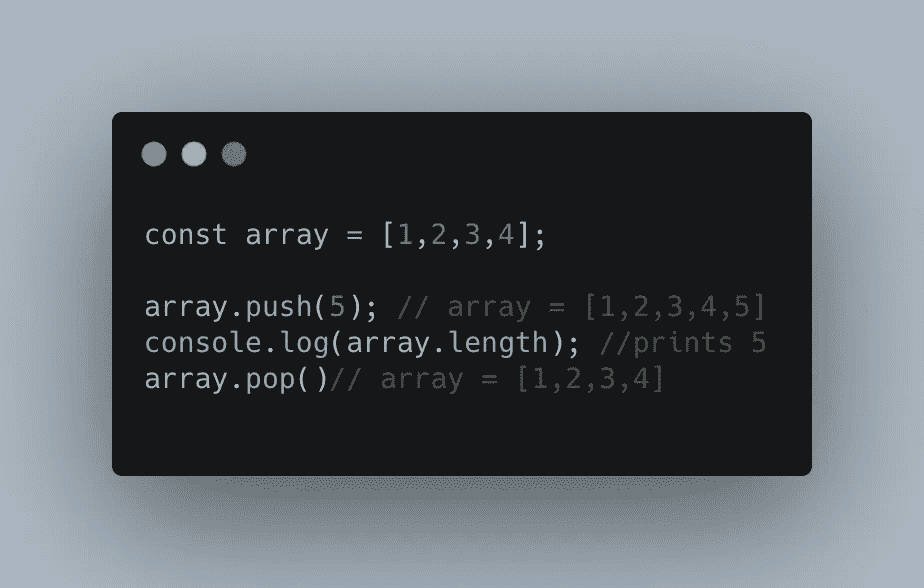
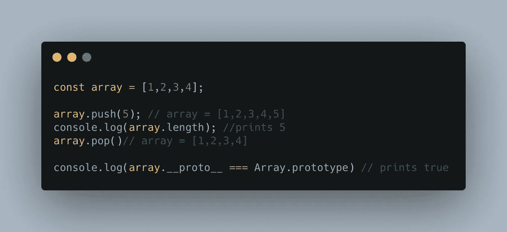
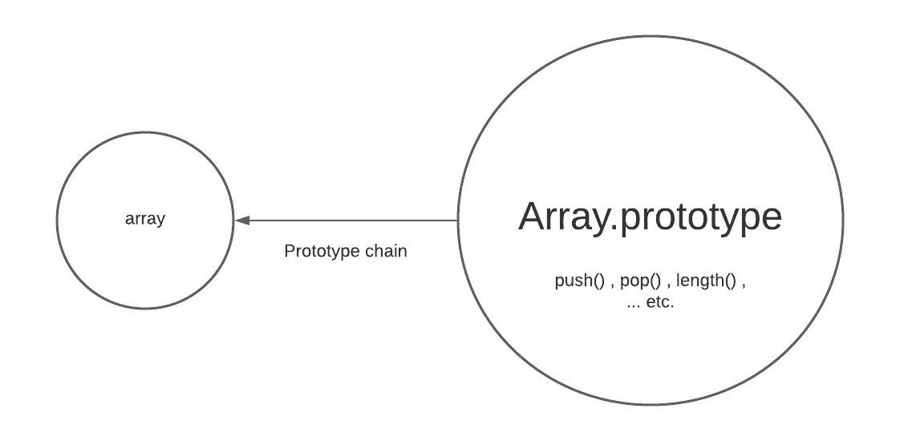
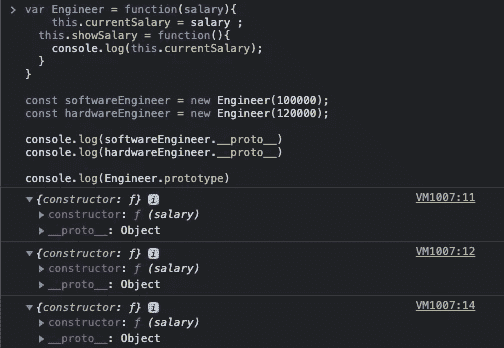
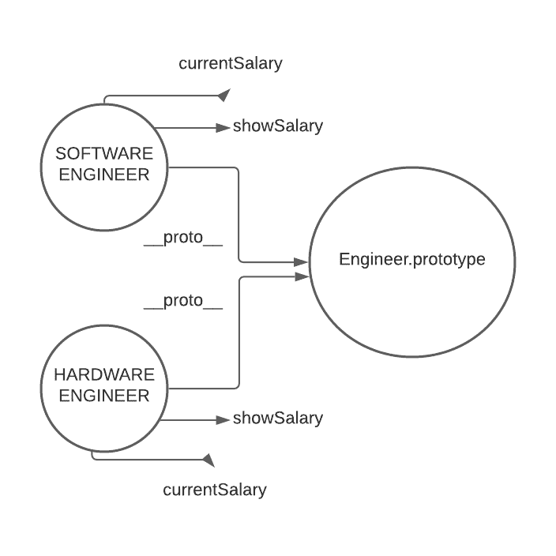
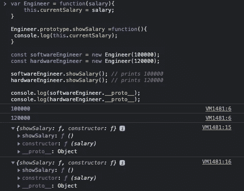
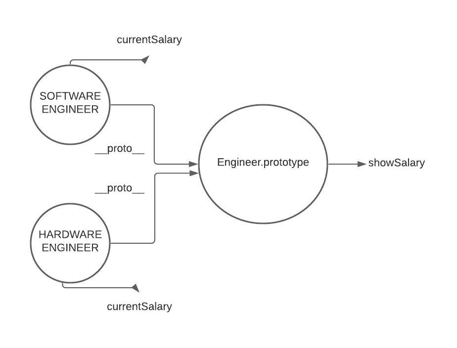

# JavaScript 中的原型是什么？— JavaScript 访谈系列

> 原文：<https://javascript.plainenglish.io/prototypes-in-javascript-js-interview-series-e254cc08f75?source=collection_archive---------7----------------------->

Photo by [Juanjo Jaramillo](https://unsplash.com/@juanjodev02?utm_source=medium&utm_medium=referral) on [Unsplash](https://unsplash.com?utm_source=medium&utm_medium=referral)

原型。这是 JavaScript 中最重要的话题之一，也是 JavaScript 访谈中经常遇到的话题。在本文中，我们将详细研究原型。那么，我们开始吧。

在深入研究 JavaScript 中的原型概念之前，我们先打个比方。

每年，各行各业都推出新产品，但这些产品并没有出现在消费者的餐桌上。然而，一些突出的功能成为公司即将发布的产品的一部分。因此，您可以假设未发布的产品是已发布产品的原型。

现在你明白了，是时候深入研究了。

**JavaScript 中的对象是什么？**

对象将状态和行为结合成一个实体。JavaScript 充满了对象，例如，数组、字符串和函数也被认为是对象。让我们考虑数组对象。它内置了 pop()、push()、length()等方法。

当我们在这里定义一个“数组”时，我们看到它自动继承了 push()、length、pop()方法。嗯，这是因为*的原型。* Tada！

根据定义，*“在 JavaScript 中，每个对象都拥有一个对上级对象的引用，它从上级对象继承它的属性。这个高级对象被称为原型，这种行为被称为原型继承。原型继承通过原型链发生。”*

Example 1.

这里我们看到“数组”的原型是数组对象。

***注:*** *数组。__proto__ 为我们提供了“数组”的原型——把它想象成“数组”继承的对象(或高级对象)。另一方面，Array.prototype(可以把它看作一种模板)是所有数组的原型对象。也就是说，它是像“array”这样的对象的原型对象，并且它包含所有数组将继承的方法。*

‘array’ inherits methods from Array.prototype (see Example 1.)

**详细了解原型链:**

为了详细理解原型继承，让我们考虑一个例子。考虑一个构造函数“工程师”及其实例“软件工程师”和“硬件工程师”。

Example 2

如您所见。__proto__(也称为 dunder proto)与 Engineer.prototype 相同。当创建新实例“softwareEngineer”和“hardwareEngineer”时，它们各自都有一个不属于其原型的单独函数(“showSalary”)。请看下图以获得更清晰的概念。

Prototypal inheritance diagram for Example 2.

现在，如果我们希望“showSalary”函数成为单个实例原型的一部分，该怎么办呢？解决方法是在 Engineer.prototype 中设置“showSalary”函数。

Example 3.

这里，我们看到构造函数和 showSalary 都是对象原型的一部分。

Prototypal inheritance diagram for Example 3.

既然我们已经理解了原型链通常是什么样子，让我们继续讨论 JavaScript 如何利用原型链。

原型链接是如何工作的？

好了，如果你已经把上面的例子理解透彻了，那么这就是小菜一碟了。当用户试图访问对象的属性时，JavaScript 倾向于在对象本身中搜索属性的可用性。如果该属性在对象中不可用，JavaScript 将在原型链中向上移动一步，并在对象的原型中搜索该属性。如果属性在原型中可用，那么 JavaScript 使用原型中的属性；否则，它沿着原型链向上，直到能够找到属性。

在示例 3 中，JavaScript 最初在对象中搜索方法“show salary”(“software engineer”和“hardwareEngineer”)。在对象中找不到它时，JavaScript 沿着原型链向上移动，在它们的原型(Engineer.prototype)中找到“showSalary”方法。

我希望文章中的例子足够清晰，能够帮助您理解 prototype 在 Javascript 中是如何工作的。

另外，阅读 Object.create() [这里的](https://medium.com/me/stats/post/6f3ee100f99d)来理解原型链是如何为对象创建的。

*更多内容尽在*[***plain English . io***](http://plainenglish.io/)