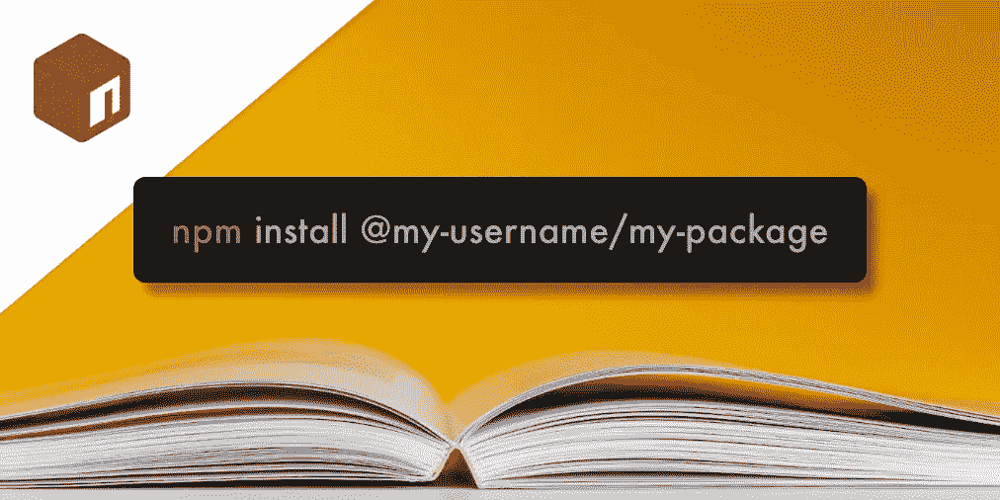

# 使用 TypeScript 将限定范围的包发布到 NPM

> 原文：<https://javascript.plainenglish.io/publish-a-scoped-package-to-npm-using-typescript-b36f2f7475c9?source=collection_archive---------9----------------------->



我是 npm 注册表的忠实粉丝。对于许多开发者来说，尤其是那些来自训练营的开发者，被介绍到 Node 和 NPM 是一个关键时刻。

让我们看看如何使用 Node.js 和 TypeScript 向 NPM 添加一个*范围的包*。

## 这个计划

这里的想法是能够在您的 npm 用户名范围内安装和使用我们自己的 npm 包。例如`npm install @user/package`

我们可以很容易地配置一个现有的项目。然而，如果这对你来说是新的，为了熟悉起见，在一个干净的目录中测试这个概念可能会更有好处。

# 设置新项目

首先，我们可以创建一个新目录，并使用 TypeScript 作为依赖项初始化节点。我们给这个文件夹起的名字也将是我们发布包的名字。参见[官方文件](https://docs.npmjs.com/cli/v7/configuring-npm/package-json#name)了解命名约定的最佳实践。

```
mkdir once && cd once
npm init -y && npm i typescript 
npm i @types/node -D
```

如果我们使用 Git，我们也应该马上忽略`node_modules`目录。

*另请注意，* `*.gitignore*` *文件中被忽略的任何内容在 npm 部署中也会被自动忽略。为了覆盖这种行为，我们可以创建一个空的* `*.npmignore*` *文件。*

```
touch .gitignore && echo "node_modules" >> .gitignore
```

# 配置 TypeScript

在最后一步中，我们安装了 TypeScript 作为项目的依赖项。让我们配置这种依赖性，以更好地满足我们的需求。

我们可以在根目录下创建一个名为 **tsconfig.json** 的新文件，内容如下:

TypeScript configs

下面是我们在 **tsconfig.json** 文件中所写内容的大致要点。

*   `"outDir": “dist"` —发射**。js** 、 **.d.ts** 和 **.js.map** 文件到这个目录
*   `"noImplicitAny": true` —发出不存在类型注释的错误
*   `"module": "CommonJS"` —设置程序的模块系统
*   `"target": "es6"` —现代浏览器支持
*   `"allowJs": true` —允许**。目录中的 js** 文件
*   `"declaration": true` —生成 **d.ts** 文件
*   `"sourceMap": true` —生成源地图文件
*   `"strict": true` —实施更强的类型检查行为
*   `"esModuleInterop": true` —解决 es6 相关问题
*   `"moduleResolution": "node"` —指定模块解析策略

# 创建模块

一旦我们获得了 TypeScript 的配置设置，我们就可以开始编写代码了！让我们创建我们在 **tsconfig.json** 文件中指定的`src`目录。在这样做的同时，让我们也向这个目录添加一个新的 typescript 文件。

```
mkdir src
touch ./src/index.ts
```

Npm 依赖关系可以通过模块访问，模块是基本级别的可重用功能。这是您将实现代码库的地方，稍后将在 npm 注册表中编译和访问该代码库。我将创建一个只执行一次的函数，但是不要觉得有义务使用我的代码。

Creating the Module

至此我们已经准备好编译了！从终端，我们可以运行命令`npx tsc`，我们应该看到一个新的子目录出现标题为**。/dist** 。这个目录将包含我们可以在 Node 中实际执行的代码的内容。

现在，让我们花点时间将这个命令作为脚本添加到我们的 **package.json** 中。我更喜欢去掉**。/dist** 目录，以消除任何重叠的可能性。

Adding a “build” script to the package.json

## 用 Jest 测试模块

此时，我们应该确认我们的代码按预期工作。毕竟如果现在不行，部署的时候很可能也不行。让我们安装我们需要的 Jest。

```
npm i jest @types/jest ts-jest -D 
touch jest.config.js
```

我们需要创建另一个配置文件来解释 Jest，我们可以把这个文件叫做 **jest.config.js**

jest.config.js

不要牵扯进来。让我们快速浏览一遍。记住，配置文件的存在是有原因的。即使它们看起来令人生畏，理解我们告诉代码做什么也是很重要的。

*   `transform: { '^.+\\.ts?$': 'ts-jest' }` —这里我们使用 ts-jest 包来允许 jest 测试用 TypeScript 编写的文件。
*   `testEnvironment: 'node'` —指定用于测试的环境。
*   `testRegex: '/test/.*\\.(test|spec)?\\.(ts|tsx|js)$'` —用于检测测试文件的模式。
*   `moduleFileExtensions: ['ts', 'tsx', 'js', 'jsx', 'json', 'node']` —使用的文件扩展名数组。

太棒了，现在我们对相关的配置有了更好的理解，让我们为之前创建的模块创建一个新的测试套件。首先，我们需要根据我们在 **jest.config.js** 文件中指定的搜索模式创建测试文件。

```
mkdir test && touch test/index.test.js
```

如果你正在做你自己的项目，那么就相应地测试你的模块。如果你正在跟随我和我的 execute once 函数，我们将想要在同一个声明上运行 2 个测试来验证我们实际上只执行了一次。在类似这样的代码中

Test suite for module

此时，我们应该能够在本地测试我们的模块。

```
npx jest
```

太好了，我已经通过了两项测试。我希望你也一样，如果你的测试没有通过，我会鼓励你现在花时间调试这个错误。同样，如果代码不能在本地工作，我们也不能期望构建能够工作。

我们还应该利用这个机会更新 **package.json** 中的`"test"`脚本。

Updating test script in package.json

从现在开始，我们可以通过简写的`npm t`或`npm run test`来访问我们刚刚运行的`jest`命令，这被视为团队间合作的通用命令。

# 发布到国家预防机制

我们期待已久的时刻到了！让我们更新 **package.json** 中的`"main"`入口点，指向我们编译的代码。

Updating the “main” script of the package.json

此时，我们应该能够在本地测试这个包。但是在此之前，让我们将这个项目配置为“用户范围的”。我们可以在最初创建项目时就这样做。但是为了保持有组织性，我们将把整个过程组合在一起。

```
npm init --scope=@npm-username -y
```

*如果这是您第一次登录 npm 注册表，您需要在*[*npmjs.com*](https://npmjs.com)*创建一个帐户，并使用* `*npm login*` *终端命令登录 npm。*

如果这个命令成功，我们应该在 **package.json 的`"name"`字段中看到我们的 npm 用户名。**这是我们在一个作用域包下的确认。

## **在本地测试用户范围的包**

在这一点上，我们几乎准备好部署，但在此之前，我们可能应该在本地测试这个包，以确保一切按预期工作。为此，我们需要获得该目录的绝对文件路径。

我们可以通过`pwd`终端命令访问这个目录的绝对路径。然后我们可以使用`npm install /absolute/path/to/folder`运行 npm 包的本地安装

```
pwd
mkdir ../test-scoped-package && cd ../test-scoped-package
touch index.js
npm init -y && npm install /absolute/path/to/scoped-repo
```

参考上面的命令，我使用`pwd`来收集当前工作目录的绝对路径。*然后我们使用* `*mkdir*` *命令创建一个全新的存储库，仅用于测试目的*，从那里我们创建一个 index.js 文件并安装包！

我们的工作目录现在应该如下所示

npm package & local test repo

当我们向 npm 发布我们的代码时，这就是我们将访问的内容。在我的例子中，它看起来像这样，但是这个包的范围应该在你的用户范围之下，而不是`@hi-matbub`👍

Testing the package in the testing-scoped-package directory

作为优秀的开发人员，我们也可以使用这段代码作为 README 文件的预览。让我们在这里也处理一下基本问题。

Creating a readme for the package

此时，我们已准备好发布到 npm 注册表。让我们添加一个预防性脚本，它将在我们发布之前执行，以确保我们的代码符合质量标准。

Adding “prepack” script

当我们发布到 npm 时，`"prepack"`脚本将自动执行。如果这里有任何失败，这个包将不会发布。在这一点上，我们准备发布！

```
npm publish --access public
```

## 结论

祝贺您，您刚刚在 npm 注册表上发布了您的第一个用户范围的包。庆祝的时间到了！

我真的希望这是有见地的。如果你想查看这个项目的源代码，你可以在 npm 注册中心的 [@hi-matbub/once](https://www.npmjs.com/package/@hi-matbub/once) 找到它。

祝你愉快👋