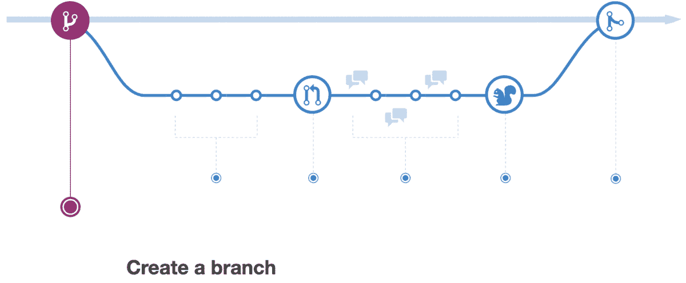
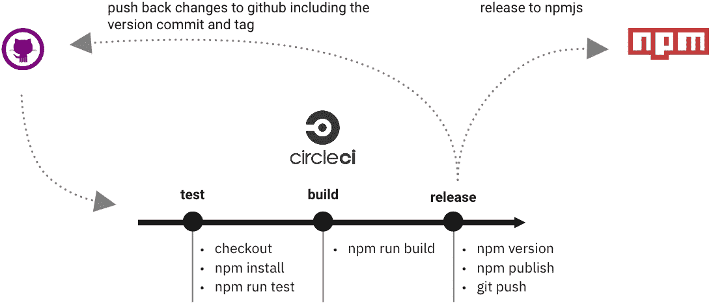
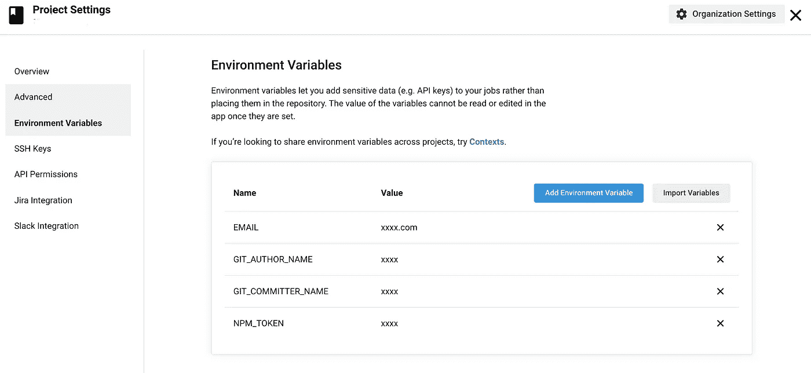
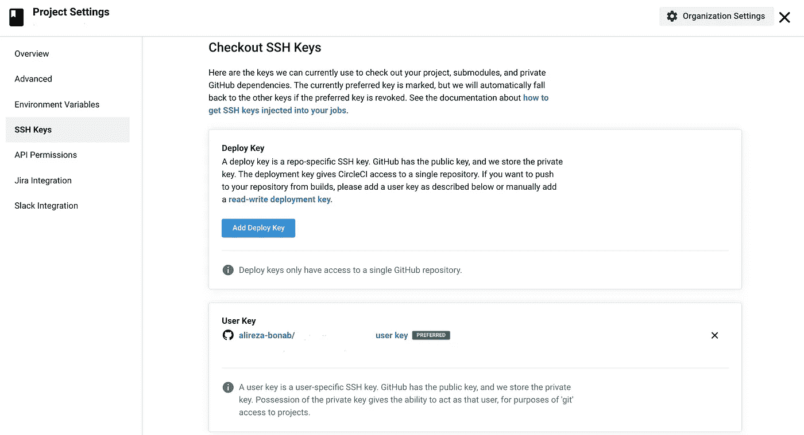

# 使用 CircleCI 发布 npm 软件包

> 原文：<https://javascript.plainenglish.io/publish-npm-packages-using-circleci-31f73abd5263?source=collection_archive---------18----------------------->

## 使用 CirclerCi 发布 npm 软件包的正确 CI/CD 设置和工作流

Photo by [Milad B. Fakurian](https://unsplash.com/@fakurian)

# 介绍

您总是可以在本地机器上手动发布您的 npm 包，但是如果您想为它创建 CI/CD 过程呢？这个问题引入了许多其他问题，比如如何管理分支或版本，如何管理产品发布。在本文中，我们将探索一个简单的基础过程，您可以根据您的项目偏好对其进行扩展。包含用于正确 CI/CD 流程的主要模块的基础。

发布有一些副作用:

*   版本控制
*   不同阶段/环境释放
*   跟踪发布

我们需要的是一个支持团队和项目需求的工作流。有两个著名的工作流影响了软件开发社区。 [Github-Flow](https://guides.github.com/introduction/flow/) 和 [Git-Flow](https://nvie.com/posts/a-successful-git-branching-model/) ，我们要用的是 Github-Flow 但是有一篇很好的[文章](https://medium.com/swlh/git-flow-vs-github-flow-3ad44bd46407)讨论了两者的区别。

# Github 流

Github-Flow 中的主分支总是为产品发布做好准备，发布定期进行，并且分支是轻量级的。

[Github Flow](https://guides.github.com/introduction/flow/)

*   为某个功能或错误修复创建分支
*   添加提交
*   打开拉式请求
*   讨论和回顾
*   合并和部署

# 发布工作流

以下是我们基于 Github 流程的规则:

*   仅对打开的拉取请求运行测试和构建流程
*   只有当测试通过并且构建成功时，合并才可用
*   其他分支机构将跳过 CI/CD 工作流程
*   对`master`分支的任何提交或合并都会触发释放过程
*   更改只能通过拉请求应用于`master`,并且受到保护
*   使用`npm publish patch`增加补丁版本
*   为了增加次要版本和主要版本，应该通过拉请求来实现
*   `npm publish`创建一个 **git 标签**
*   发布后，我们需要在不触发 CI/CD 工作流的情况下，将`tag`和更新的`package.json`推回到主分支

Release NPM Package with CircleCI Workflow

# CircleCI 配置文件

首先，在您的项目中创建`.circleci`文件夹，并创建`config.yml`文件，其中包含发布工作流的 CircleCi 配置。我将分解每个部分，但在此之前，如果你不熟悉 CircleCI，你可以从这里开始。

工作流程由 3 个步骤组成:

*   试验
*   建设
*   释放；排放；发布

最需要考虑的是`npm publish`有副作用。`npm publish`用发布版本标记分支，并用版本号更新`package.json`文件。最棘手的部分是在不触发 CircleCI 工作流和导致无限循环的情况下将这些更改收回到 git 存储库中。

## **初始配置**

在该文件的顶部，我们定义了 CircleCi 版本，该版本代表了我们可以在该文件中使用的功能集，我们还将创建一些默认配置，这些配置将被作业重用。可重用配置是 YAML 的特性，而不是 CircleCI 的配置定义方式。这就是所谓的 YAML 的`anchor` [特色](https://blog.daemonl.com/2016/02/yaml.html)。点击阅读更多关于 YAML 锚以及如何使用它来重用配置[的信息。](https://circleci.com/blog/circleci-hacks-reuse-yaml-in-your-circleci-config-with-yaml/)

默认配置包括`working_directory`和默认的 docker 图像，每个作业将在相应的容器中运行。

## 测试作业

首先，我们将用他们的步骤来定义我们的工作。在上面的代码中，我们定义了`jobs`，第一个作业是`test`。第 3 行注入测试作业的默认配置，即`working_directory`和`docker image`，作业的容器将基于此创建。

测试作业检查代码，然后根据 CircleCI 缓存中的`package.json`校验和恢复`node_module`依赖关系，并运行`npm install`和`npm test`命令来检查此阶段的一切是否正确。最后，将包括`node_module`在内的更改保存到工作区，供下次作业使用。

## **建造工作**

这个非常简单，它从第 4 行的工作区中获取最新的变更，并运行`npm run build`命令来构建项目。最后，将更改保存回工作区。

## 发布作业

Release job 还会从工作区中提取所有内容，然后将 Github.com 添加到容器的`known_hosts`文件中，因为在这个作业中我们会将一些更改推回 GitHub。版本控制步骤使用`-m` 参数运行`npm version patch`，该参数为[提交消息](https://docs.npmjs.com/cli/v6/commands/npm-version)获取一个字符串。

`[skip ci]`告诉 CircleCI 跳过这个提交。下一步是将包括更新的`package.json`提交和 **git 标签**在内的变更推回到 git 仓库。最后，通过将 npm 令牌添加到`.npmrc`文件并运行`npm publish`，新版本在 npmjs.com 上发布。

您可以通过在项目的根目录下放置一个类似下面的`.npmignore`文件来控制您想要发布到 npm 的内容。我的`npm run build`命令将包构建到`lib`文件夹中，所以我释放了包括`package.json`和`lib`文件夹在内的所有东西，不需要的文件和文件夹除外。

.npmignore file — controls files not to publish

通过 CircleCI 仪表板上的设置页面将`EMAIL`、`GIT_AUTHOR_NAME`和`GIT_COMMITTER_NAME`添加到项目的环境变量中。为了能够在工作流中执行 git 操作，这是必须的。

此外，`NPM_TOKEN`将通过 [CircleCI 仪表板](https://circleci.com/docs/2.0/env-vars/#setting-an-environment-variable-in-a-project)上的项目设置页面作为环境变量提供，这将由 npm 用于发布。

CircleCI — Project Setting Page — Environment Variables

为了能够对 git 存储库进行更改，包括使用更新的`package.json`提交和 CircleCI 仪表板上项目设置页面中的新版本 git 标签，我们需要配置一个用户密钥。([这很重要](https://support.circleci.com/hc/en-us/articles/360018860473-How-to-push-a-commit-back-to-the-same-repository-as-part-of-the-CircleCI-job))

CircleCI — Project Setting Page — SSH Keys

## 工作流程

在我们用特定的步骤定义了作业之后，我们将告诉 CircleCI 以什么顺序运行它们。这将使用`workflow`定义来完成。第一个要运行的作业是`test`，它没有任何先决条件。`build`依赖于成功的`test`，因此使用 CircleCI 配置规范，我们定义构建需要第 7 行中的测试。最后，发布依赖于成功的构建，并且只发生在主分支上。通过过滤分支，我们排除了在其他分支上运行这个步骤，并且主服务器上的一切都是生产就绪的。

# CircleCI 完整配置

# 参考

以下是一些帮助我了解 CircleCI 和 Github Flow 的链接。

*   [https://lucamezzalira . com/2014/03/10/git-flow-vs-github-flow/](https://lucamezzalira.com/2014/03/10/git-flow-vs-github-flow/)
*   [https://medium . com/swlh/git-flow-vs-github-flow-3a d44 BD 46407](https://medium.com/swlh/git-flow-vs-github-flow-3ad44bd46407)
*   [https://docs.npmjs.com/cli/v6/commands/npm-version](https://docs.npmjs.com/cli/v6/commands/npm-version)
*   [https://circle ci . com/blog/circle ci-hacks-reuse-YAML-in-your-circle ci-config-with-YAML/](https://circleci.com/blog/circleci-hacks-reuse-yaml-in-your-circleci-config-with-yaml/)
*   [https://discuse . circle ci . com/t/using-defaults-syntax-in-config-YAML-aka-YAML-anchors/16168](https://discuss.circleci.com/t/using-defaults-syntax-in-config-yaml-aka-yaml-anchors/16168)
*   [https://guides.github.com/introduction/flow](https://guides.github.com/introduction/flow/)
*   [https://circle ci . com/docs/2.0/env-vars/#在项目中设置环境变量](https://circleci.com/docs/2.0/env-vars/#setting-an-environment-variable-in-a-project)
*   [https://support . circle ci . com/HC/en-us/articles/360018860473-How-to-push-a-commit-back-to-the-same-repository-as-part-of-the-the-circle ci-job](https://support.circleci.com/hc/en-us/articles/360018860473-How-to-push-a-commit-back-to-the-same-repository-as-part-of-the-CircleCI-job)
*   https://hacker noon . com/how-to-publish-your-package-on-NPM-7 fc 1 f 5 aae 600