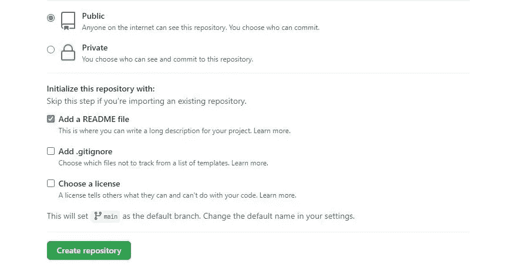
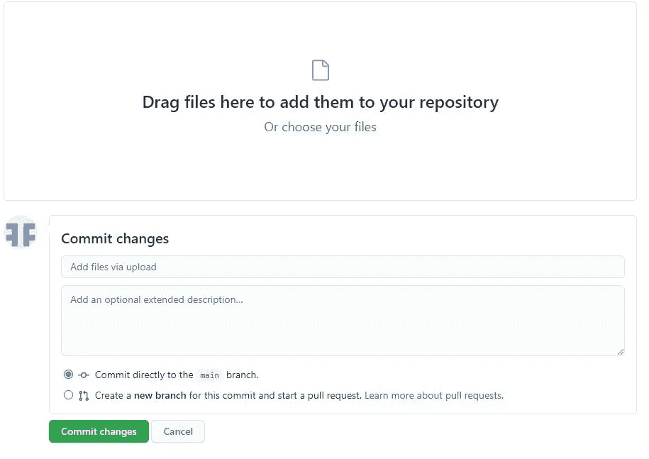
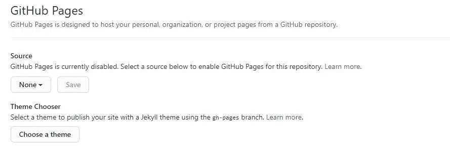
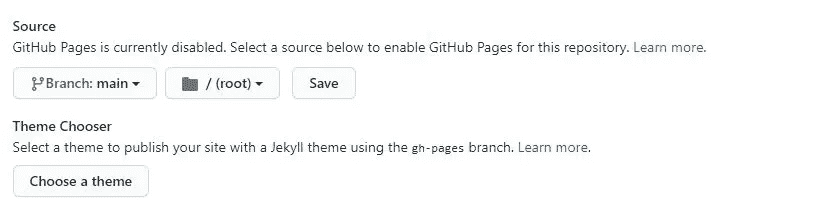

# 以 0 美元发布您的网站

> 原文：<https://javascript.plainenglish.io/publish-your-websites-for-0-a38ccd4f9e4?source=collection_archive---------15----------------------->

## 在互联网上发布你的第一个网站的 5 分钟指南

Photo by [Designecologist](https://www.pexels.com/@designecologist?utm_content=attributionCopyText&utm_medium=referral&utm_source=pexels) from [Pexels](https://www.pexels.com/photo/silver-imac-displaying-collage-photos-1779487/?utm_content=attributionCopyText&utm_medium=referral&utm_source=pexels)

发布你的网站是一个网站开发者最满意的工作之一。如果你是一个初学 web 开发的人，这对你来说更了不起。我能猜到你的感受。你可能想尽快创建并发布你的网站。我和你有同样的感觉。当我快要完成一个项目时，我很兴奋能在网上看到我的网站。

如果你不是一个初学 web 开发的人，你可能也想听听这篇文章。免费发布你的网站真是太棒了。也许你目前正在练习创建一个网站，你可能不想支付托管费用。

我给初学 web 开发的人总结一下。你有一个完整的网站，但你只能在本地访问。如果你打开你的 index.html 文件，它只是作为一个本地文件打开，因为它在你的桌面上，你没有把它发布到其他地方。

没有其他人可以访问这个网站。这对你来说可能毫无意义。您可能想要与您的朋友、家人或您自己共享您创建的网站，以便在互联网上查看。要做到这一点，你需要在某个地方托管你的网站。

有很多托管网站，如 GoDaddy，Bluehost。但是，如果你在学习，在做一些实践，你可能不想为这些付费。今天，我想给你展示一个免费的解决方案，发布你练习过的网站。创建这些网站后，您将能够与网络上的任何人共享链接。

在本文中，您将使用 [GitHub](https://github.com/) 来发布您的网站。你可能不熟悉 GitHub。GitHub 是一个开发平台。您可以在 GitHub 中托管和审查代码、管理项目和构建软件。你可以用它来创建你的作品集，分享你的得意之作。一般来说，你申请开发工作的公司会要求你展示你的 GitHub 页面。

现在，我想向你展示托管你的网站的功能。如果您没有 GitHub 帐户，第一步需要注册。

GitHub Main Page: Screenshot added by author

创建新的 GitHub 账户后，点击报警图标旁边的**“+”**按钮。然后，单击新的存储库。现在，您需要给出您想要的存储库名称。请注意，存储库名称将出现在 URL 中。选中“**用自述文件**初始化此存储库”框。对于剩余的步骤，检查它是必要的。然后，创建存储库。

Create Repository: Screenshot added by author

创建存储库后，转到存储库页面。然后，按下**【添加文件】**下拉菜单中的**上传文件**按钮。拖移您网站的文件夹。要提交更改，请给出一个名称，然后按绿色按钮。

Drag Files Here: Screenshot added by author

现在，您需要进入设置选项卡，找到 GitHub 页面部分。此部分旨在托管来自 GitHub 存储库的个人、组织或项目页面。

GitHub Pages: Screenshot added by author

点击显示“**无**的部分，选择“**主**并保存。您也可以从**主题选择器**中选择主题。

Choose Branch: main: Screenshot added by author

GitHub 可能需要大约半个小时来发布您的网站。您网站的网址将以**[**https://your-github-username.github.io/your-repository-name**](https://your-github-username.github.io/your-repository-name/)**的形式出现****

****仅此而已。你有一个网站和它的网址与你的朋友分享。****

****通过 GitHub 发布你的网站是一个不可思议的选择。除了是免费的，它也是有益的。将项目推送到 GitHub 后，您可以立即创建自己的网站。你可以把你的链接发给你的朋友和家人。你可以从你的同伴那里得到反馈。然后，您可以更改您的项目并再次发布您的网站。****

****它非常适合初学者，因为它易于部署。您需要将您的项目推送到 GitHub，并从设置中的 GitHub 页面创建您的网站。****

*****更多内容看* [***说白了. io***](http://plainenglish.io/)****