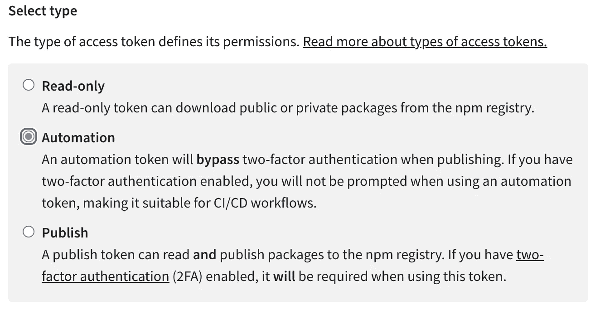

# 发布带有 GitHub 操作的 TypeScript 包

> 原文：<https://javascript.plainenglish.io/publishing-a-typescript-npm-package-with-github-actions-7f6486e7da95?source=collection_archive---------5----------------------->

## 是的。没有理由不自动化这一点。

将功能分离到 npm 包中是模块化应用程序的好方法。另外，如果你决定让它公开，你将会因为回馈开源而获得额外的因果积分。

如果您的代码存在于 Github 存储库中，那么发布到 npm 注册表将变得前所未有的简单。通过工作流和秘密管理，Github 可以让您自动化整个过程。


This is what it feels like not to automate. [Karolina Grabowska](https://www.pexels.com/de-de/@karolina-grabowska?utm_content=attributionCopyText&utm_medium=referral&utm_source=pexels) von [Pexels](https://www.pexels.com/de-de/foto/mann-hand-haus-gesichtslos-4498142/?utm_content=attributionCopyText&utm_medium=referral&utm_source=pexels)

# 设置项目

由于每个 npm 项目本身在技术上是一个包，所以没有什么特别的东西需要你去关注。

然而，您希望确保您选择的 TypeScript 和测试库是混合的(我在这里使用 jest，但是[选择您喜欢的](https://freddixx.medium.com/nodejs-testing-with-jest-vs-mocha-on-typescript-in-2021-7bffc28a4379))。

因为，你知道，毕竟，我们想成为优秀的开发人员，并且已经输入和测试了代码。你知道该怎么做。

```
yarn init -y
yarn add --dev typescript jest ts-jest @types/jest
```

完成后，用默认配置快速初始化 TypeScript:

```
yarn tsc --init
```

打开您新生成的`tsconfig.json`，并如下调整您的设置，以确保代码文件被编译为`./lib`，并且您从循环中排除了那个文件夹以及测试和`node_modules`。

就是这样。你的项目准备好了。您需要做的就是像平常一样添加代码，并确保导出它。

# 让您的代码准备好打包

在我介绍您的文件应该是什么样子之前，让我们花一点时间检查一下您的`package.json`。

正如你可能已经猜到的，这将是你的包的入口点，它包含了一些你真的想得到正确的配置，以确保顺利航行。

这些区段是`name`、`main`、`types`、`scripts`和`files`。以下是一个与上述`tsconfig.json`相对应的示例:

An example package.json for a TypeScript npm package.

无需深入细节，以下是您应该注意的几点:

*   `name`需要独一无二。光有你的 Github 用户名下是不够的。如果具有该名称的包已经存在，您将无法发布它(除非它被限定了范围)。
*   `main`和`types`支持一个文件。所以要确保从一个地方导出所有的功能。
*   属性描述了当你的包被安装时，哪些文件将被包含。我的例子将所有内容都限制在`lib`文件夹中。我强烈建议你把它们都放在一个地方。
*   最后，整理你的`scripts`。您希望在发布期间构建并测试您的包。这只会让你的生活更轻松。

也就是说，您的`src/index.ts`文件可以像这样简单:

```
import { Queue } from './queue';export { Queue };
```

TypeScript 将足够聪明地完成剩下的工作，并收集所有的定义以及所需文件的剩余部分:


Et voila: The build output.

一旦你上传你的代码到 Github(或任何其他类似的 DVCS)，你只剩下发布部分——你是一个好的开发者——你将完全自动化。

# 获取 Github 机密的 npm 令牌

npm 软件包注册中心唯一需要的就是一个授权令牌。它将验证您的身份并在发布过程中使用。

如果您还没有这样做，请前往[npmjs.com](https://www.npmjs.com/)创建一个帐户。

然后，在您的帐户设置中，转到**访问令牌**并生成一个新令牌。确保选择“自动化”作为类型:



Don’t pick 1 or 3\. Two is just right.

将该令牌复制到某个地方，这样它就不会丢失，并导航到您的存储库设置(不要与您的 Github 用户帐户设置混淆)。

接下来发生的事情将确保我们新生成的令牌将保持良好的保密性。

查找 secrets 部分并添加一个**新的存储库秘密**。将其命名为`NPM_TOKEN`，粘贴您之前复制的生成令牌，并点击**添加秘密**。


Here it is. Your npm token stored on Github.

现在，您的 npm 令牌被安全地加密并以其别名存储在 Github Secrets 上。

从现在起，你可以在任何脚本中引用它，而不必硬编码，从而向互联网上的任何人公开。

很漂亮，不是吗？

随着秘密的消失，让我们继续这个过程的最后一步，看看我们如何在这个过程中加入一些自动化。

# 发布带有 Github 操作的 npm 包

快到了。发布我们的 npm 包的最后一步是 Github 操作设置。

转到 Github 库的*动作*部分。如果您已经定义了现有的工作流，您可以直接打开一个新的工作流。如果这是您的第一个，请从登录页面选择**自行设置工作流**。

由于工作流只不过是模板化的 yaml 文件，您可以直接复制这个示例，它应该可以开箱即用:

如您所见，该工作流程在每次推送至 master 时执行，包括五个基本步骤。

除了检查代码和设置节点之外，它还运行预定义的[JS-dev tools/NPM-publish @ v1](https://github.com/marketplace/actions/npm-publish)动作，为您完成发布(假设您为它提供了令牌)。

除此之外，我们确保项目实际上正在构建，以便生成包的文件。如果我们愿意，这也是调用`run: yarn test`的地方。

# 包发布:就这么简单。

保存文件并将更新推送到主服务器后，工作流将自动执行并将您的软件包发布到 npm 注册表。

不要忘记增加您的`package.json`中的版本号，否则，操作将退出工作流运行而不发布。


有了所有这些设置，您就可以依靠 Github Actions 来发布您的包了。

那很容易，不是吗？

*嗨，我是弗里德里希！我在工作中是一名经理和开发人员，在家里是一名业余爱好者——厨师、音乐家、数据和语言爱好者。可以在*[*LinkedIn*](https://bit.ly/3m0DXaT)*上找我。*

*更多内容请看*[***plain English . io***](http://plainenglish.io/)