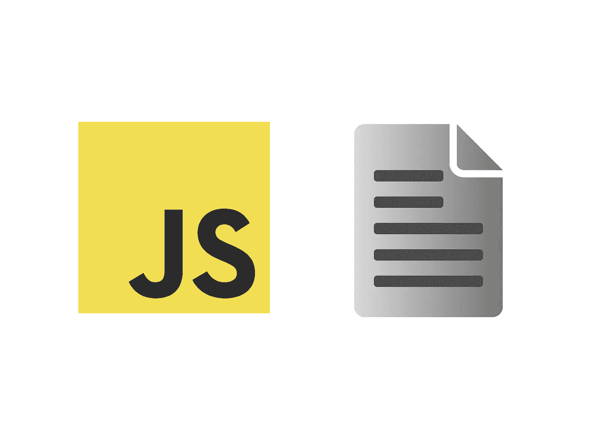

# 编写纯函数如何让您的 JavaScript 包变得更好

> 原文：<https://javascript.plainenglish.io/pure-functions-9d07c3f88067?source=collection_archive---------10----------------------->

## 这可能会使您的代码更加高效

你应该写纯函数。是的，你已经知道了。
但是到底是为什么呢？

嗯，因为可读性？因为可重用性和错误跟踪？
还有一个原因:性能原因。

为了看到它的作用，让我们举个例子。

我们有两个函数——“g”和“f”。函数“g”返回传递给它的内容——还会产生副作用:记录到控制台。
提醒:当一个函数依赖或修改其参数之外的东西时，就会产生副作用。

如你所见，函数“f”依赖于“g”。我们现在不关心实际运行这个。如果我们捆绑这段代码(我用[包](/parceljs-48a35df8b41a)做的)，这将是捆绑的 JavaScript:

正如你所看到的，这几乎是相同的代码，只是一点语法上的小技巧，比如只使用一个 const-keyword——总而言之，没有什么新的。

为了了解纯函数如何积极地改变我们的包，让我们将函数“g”设为纯函数:

如您所见，我们只删除了 console . log——现在，“g”没有副作用了。我们再用[包](/parceljs-48a35df8b41a)捆绑一下，看看如何捆绑 JavaScript 的变化。哦，别担心，我是为你做的。下面是生成的代码:

惊喜！我们的函数“g”根本没有被调用 bundler 用参数值替换了函数调用。因为“g”只返回传入的内容，所以这是有意义的。

基于这个例子，我们可以看到，当我们的函数是纯函数时，bundler 有更多的优化自由。当然，只返回参数值的函数并不常见。然而，这是纯函数如何改变捆绑过程的一个很好的例子。

除了完全删除函数调用，捆绑器还可以对这个纯函数进行其他优化。

例如，捆绑器可以针对 n=1 的情况优化纯函数。在这种情况下，不管 x，我们都会得到 0 作为结果(因为`n * x — x`总是 0，当 n = 1 时。请记住，乘法首先发生)。

因此，优化看起来像这样:

这种优化可能是更现实的场景。因为“g”仍然被调用，但是捆绑器最小化了调用这个函数的场景数量。如果“g”做了一个非常昂贵的计算，我们会为每一个避免的函数调用而高兴。

这显然取决于捆绑器——我尝试了多个，所有的捆绑方式都不同。

除了捆绑之外，为这种优化编写纯函数总是一个好主意。由于纯函数是可忽略的和独立的，开发人员可以像上面那样手动找出这样的优化。

暂时就这样吧！如果你想在网上阅读更多关于函数式编程的内容:

 [## 用 PureScript 为 Web 带来强大的函数式编程

### 就像 JavaScript 的 Haskell

javascript.plainenglish.io](/purescript-3ee759ce05aa) 

为了让我意识到这一点，我读了查尔斯·斯卡法尼的《T2》、《T3》、《T4》和《T5》、《T6》、《T7》。我与他的产品无关。

*更多内容请看*[***plain English . io***](http://plainenglish.io/)