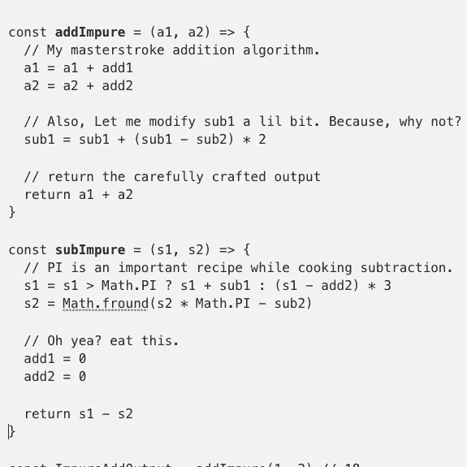

# 什么是纯函数，为什么有用？

> 原文：<https://javascript.plainenglish.io/pure-functions-why-c925c55347b8?source=collection_archive---------4----------------------->


Photo by [Mohammad Rahmani](https://unsplash.com/@afgprogrammer?utm_source=medium&utm_medium=referral) on [Unsplash](https://unsplash.com?utm_source=medium&utm_medium=referral)

纯函数使得应用程序状态 ***在执行的任何时候都是可预测的*** 。这极大地减少了我们应用程序中容易出错的地方。

让我们看两段代码来理解纯函数。

代码 1:

```
**const addPure = (a , b) => a + b
const subPure = (a , b) => a - b** const addOutput = **addPure** (1 , 2) // 3
const subOutput = **subPure** (10 , 5) // 5
const addOutput = **addPure** (1 , 2) // 3
const subOutput = **subPure** (10 , 5) // 5
```

代码 2:世纪之争的两个不纯函数。

```
let add1 = 5
let add2 = 10
let sub1 = 20
let sub2 = 10const **addImpure** = (a1, a2) => {
  // My masterstroke addition algorithm.
  a1 = a1 + add1
  a2 = a2 + add2

  // Also, Let me modify sub1 a lil bit. Why not?
  sub1 = sub1 + (sub1 - sub2) * 2 // return the carefully crafted output
  return a1 + a2
}const **subImpure** = (s1, s2) => {
  // PI is an important recipe while cooking subtraction.
  s1 = s1 > Math.PI ? s1 + sub1 : (s1 - add2) * 3
  s2 = Math.fround(s2 * Math.PI - sub2) // Oh yea? eat this.
  add1 = 0
  add2 = 0 return s1 - s2
}const ImpureAddOutput = addImpure(1, 2) // 18
const ImpureSubOutput = subImpure(10, 5) // 44.29203653335571
const ImpureAddOutput2 = addImpure(1, 2) // 3
const ImpureSubOutput2 = subImpure(10, 5) // 104.29203653335571
```

上面的例子可能看起来滑稽或愚蠢，你可能会想"*在现实生活中谁会这样编码呢？*”。

杂质开始很简单。

```
Hey, Let me just update the wish list count in the nav bar Component ***along with*** ***this***.
```

两个星期后，我们会有一个让我们挠头的错误，“谁在更改我在导航栏中的愿望清单计数？*太诡异了。”*

纯函数的核心原则是，

1.  在应用程序执行的任何时间点，当使用**相同输入**调用时，这些函数保证返回**相同输出**。
2.  执行**无副作用**。不修改外部状态，不写入数据库，不记录控制台日志，等等。

## 没有副作用？

如果不改变什么，软件是没有用的。用户在应用程序中执行的任何操作都是副作用。它需要写入数据库、更新值等等。

那么，学习这种技术有什么意义呢？在讨论了几个要点后，我们将进入那一部分。

## 减压器模式

好吧。您想要修改应用程序中的状态或对象。让我们用纯洁的方式来做它。

请看**下面的*减速器*下面的**功能。

要点

*   **不变性:**`initialState`将在应用生命周期的任何时间点保持`{name:’John’, age: 87}`。我们创建的任何对象都将保持不变，直到它们被垃圾回收。没有人会变异！
*   我们使用`reducerFunction`为我们做改变。我们通过**状态**和在该状态下要执行的**动作**。如果没有变异，它会根据动作类型生成一个新状态并返回。
*   `state`可以代表我们需要修改的任何状态。`action`参数通常携带一个**类型的**和可选的**有效载荷**数据，减速器功能可能需要这些数据来进行状态修改。

更多要点:

*   reducer 函数需要知道状态的结构。
*   如果你想知道为每个变化创建一个新的实例有多高效。

## 纯函数是如何无 bug 的？

他们不是。在上面的例子中，我们可以修改案例`‘DEC_AGE’`来增加年龄。这是意想不到的行为。那是一只虫子。

不可变的特性允许像 Redux DevTools 这样的工具做下面的事情。


> 我们可以像视频中的帧一样跟踪状态实例。对于可变数据结构，这是不可能的。

它跟踪每一个被派遣的行动。(不再有控制台日志)。并且我们可以精确定位导致意外状态变化的动作。

如果你想更详细地了解 redux 架构，请跟随[这个](https://karthickragavendran.medium.com/enterprise-application-architecture-with-redux-time-machine-attached-3da8c12b115a)。

## 隔离我们项目中不纯的代码。

> 尽可能把功能做的纯粹一些。这使得不纯的代码在应用程序崩溃时备受指责。

任何项目都有哪些杂质？将数据库调用或任何不纯的代码放在一个单独的模块中，您甚至可以将其命名为`sideEffects.ts`！

如果您正在使用 React，请使用像 redux 这样的功能状态管理系统，它会自动使项目的大部分功能正常化。我开始使用 redux 时并没有意识到它的好处，但后来我意识到使用 redux 的项目相对来说更健壮，而且不太容易出错。

这都是关于纯函数的。有意识的努力写尽可能多的函数 ***纯*** 。隔离不纯的函数。

谢谢你。



*更多内容请看*[***plain English . io***](http://plainenglish.io/)