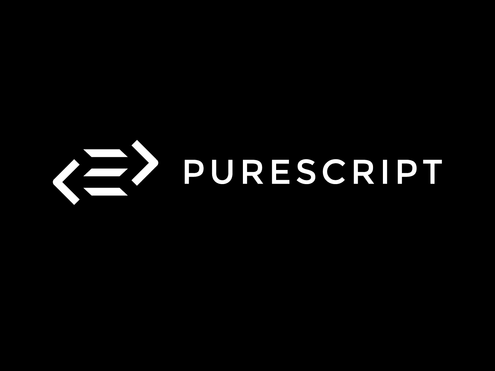
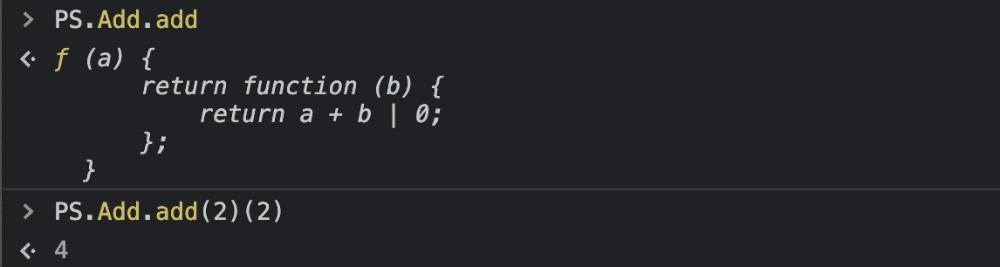

# 用 PureScript 将强大的函数式编程带入网络

> 原文：<https://javascript.plainenglish.io/purescript-3ee759ce05aa?source=collection_archive---------3----------------------->

## 就像哈斯克尔对于 JavaScript 一样



Source: [purescript.org](https://www.purescript.org/)

最近，我对函数式编程产生了兴趣。人们说学习它会让你成为一个更好的程序员。

因此，我想尝试一种纯粹的函数式语言:Haskell。
然而，我没有它的用例。最后，我想把东西带入网络——甚至是功能性编程。所以我研究并发现了一个非常有前景的项目: **PureScript** 。

这个项目让我非常惊讶，所以我想给你看看。如果你和我一样兴奋，让我们深入研究 PureScript 和纯函数式的网络编程。

# 那么，什么是 PureScript？

乍一看，PureScript 看起来像 Haskell。正如 Haskell 一样，它是一种纯粹的函数式编程语言。我们在编写代码时会回到这意味着什么。除了语法上的一些差异之外，PureScript 与 Haskell 有一个完全不同的目标:将函数式编程引入网络。

PureScript 完全在 Node.js 上运行。我们编写的所有代码都将被编译成 JavaScript，并在浏览器或 Node.js 中使用。

尽管它被忽视了，但它有一个丰富的生态系统:一个包管理器，用于 Express.js 和 DOM 操作的库，许多用于几乎所有事情的默认包，优秀的文档，一个游戏场和一个测试套件。

不要误解我。PureScript 不是即将到来的项目。这是一个项目，它已经将童年时代远远抛在了脑后，准备投入生产。

例如，卡尔达诺·区块链背后的团队在他们的一些网络项目中使用了 PureScript。想快速试用吗？太棒了，我们走！

# 让我们从 PureScript 开始

安装 PureScript 很容易。

```
npm install -g purescript 
npm install -g spago 
```

而`purescript`是编译器本身`spago`是管理项目的包管理器和工具。一旦两者都创建了，您就可以创建一个空目录并移入其中。然后，运行`spago init`。

# 了解 REPL

对编写一些 PureScript 代码感到兴奋吗？很好。首先，我们将在航站楼内使用西班牙 REPL 号进行。要启动它，运行:`spago repl`。如果您想退出，请键入`:quit`

REPL 是一个强大的原型制作工具。我们也可以在那里导入模块，甚至是我们在项目中编写的模块。让我们编写第一个函数，将两个值相加。在 REPL 输入以下代码，我会解释的:

```
add a b = a + b
```

好吧，这看起来很奇怪，对吧？但事实上，这是一种功能。作为函数的名称，我们提供了“add”。然后，用空格分隔，我们提供了参数“a”和“b”。

在等号后面，我们定义了我们的返回值。您可能想知道为什么这基本上是返回语句。原因是 PureScript 是一种纯函数式编程语言。

这种编程语言的目的是避免不纯的函数，即依赖于或操纵其范围之外的状态的函数。因此，在 Haskell 和 PureScript 中，所有函数都返回一些东西——如果不返回，它们什么也不做。

让我们调用我们的函数。要这样，在 REPL 输入:`add 2 4`。

这应该导致“6”被记录—我们得到了第一个函数！

# 编写和编译 PureScript

要离开 REPL，输入:`:quit` —以防你还在那里。REPL 很酷，但是在文本编辑器中写代码更酷。我使用 VS 代码来实现。幸运的是，对于 VS 代码，有很多可用的扩展。

确保安装“PureScript IDE”和“PureScript 语言支持”,以防你也使用 VS 代码。因为我们已经用`spago init`创建了一个新项目，让我们打开那里的文件。

目前，一切都围绕 src 目录中的`Main.purs`进行。默认情况下，你会看到一些代码记录了一个意大利面条表情符号。让我们把它改成类似“Hello World”这样的日志——这由您决定。

要运行你的 PureScript 代码，输入`spago run`——这会运行你的程序，你记录的所有东西都会显示出来。

正如我已经说过的，PureScript 是在考虑 JavaScript 世界的情况下创建的。所以要将你的 PureScript 应用捆绑到 JavaScript 上，你只需要运行`spago bundle-app`。您的捆绑应用程序的入口文件是项目根目录下的`index.js`。

当你运行`node index.js`或者在网站的脚本标签中包含这个 index.js 时，意大利面(默认)就会出现在控制台中。由于“src”目录中的`Main.purs`包含了我们 PureScript app 的主要函数，所以无论发生什么，最初都会有运行。

# 用 PureScript 编写我们的 add 函数

现在你可能会想，“我们刚刚在 REPL 中写了这个函数。为什么还要再来一次？”—我明白你的意思。但是将它写在一个真正的 PureScript 文件中并捆绑它教给我们更多的东西。

首先在 src 目录中创建一个名为`Add.purs`的新文件，紧挨着`Main.purs`。在这个文件中，我们将创建我们的函数。由于新文件也是新模块，我们在`Add.purs`中的代码看起来像这样:

```
module Add whereimport Preludeadd a b = a + b
```

现在，我们想在主函数中使用它，并在控制台中记录结果。
由于我们将模块定义为“add ”,我们现在可以在`Main.purs`中从该模块导入函数“Add ”:

```
import Add (add)
```

我们文件的完整代码如下所示:

您可能注意到了，我们现在使用一个名为`show`的函数来包装`add`的函数调用。这个“show”函数允许我们以字符串的形式返回一个整数，这样我们就可以记录它。

现在，运行`spago run`，你应该看到“5”出现在控制台中。当运行`spago bundle-app`并在任何地方导入 index.js 时，应该会发生同样的情况。

这不是太难，对不对？但是有一件事我们应该改变。
PureScript 使用所谓的类型推断。这意味着 PureScript 仅仅通过查看分配给它的内容来猜测任何函数或变量的类型。这很酷，但不是最佳实践。相反，我们可以为 PureScript(和 Haskell)提供函数返回的类型和参数。

因此，这:

```
add a b = a + b
```

变成了这样:

```
add :: Int -> Int -> Int
add a b = a + b
```

上面一行表示我们有一个名为“add”的函数，它接受一个整数和另一个整数，然后返回一个整数。但是为什么这条线不像`(Int, Int) -> Int`？

好问题！要理解这一点，我们需要知道实际上不存在一个以上参数的函数。事实上，像`add a b = a + b`这样的语法自动包含了*curry*。

Currying？这是函数式编程的概念，我们在函数中返回函数。这有助于将我们的代码分解成函数，每个函数只有一个参数。这里有一个简单的例子:

```
function add(a, b) {
  return a +b
}
```

会变成:

```
function add(a) {
  return function (b) {
    return a + b
  }
}
```

所以我们调用`add(2)(2)`来接收“4 ”,而不是调用`add(2, 2)`。

PureScript 在幕后为我们拍马屁。我们在将代码导出到 JavaScript 时会看到这一点。为此，再次运行`spago bundle-app`。然后，在浏览器中打开结果`index.js`。默认情况下，仍会记录“5”。但是我们也可以调用手动创建的 add 函数。

它可以通过下面的代码行获得，正如你所看到的，我们可以调用 curried 函数:



这就是我对 PureScript 的介绍。当然，我们只涉及了该语言的一小部分特性。我还想在未来介绍几件事:

*   PureScripts 数据类型&在 PureScript 中导入 JavaScript 函数
*   访问 DOM
*   使用 PureScript 编写 Express 或 React 应用程序

如果大家对 PureScript 有足够的兴趣，我很乐意多写一些——所以，请给我留下您的反馈:)

感谢您的阅读！下面是第二部分:

[](/purescript-cheatsheet-9ba7da3d393f) [## PureScript:编译成 JavaScript 的函数式语言

### PureScript 基础:对象、递归、映射等等

javascript.plainenglish.io](/purescript-cheatsheet-9ba7da3d393f) 

## 我很想在我的推特上看到你！

*更多内容看*[***plain English . io***](http://plainenglish.io)