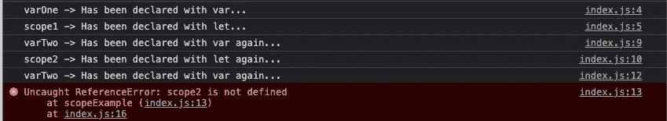

# 用 JavaScript 编码惯例结束通宵调试会话

> 原文：<https://javascript.plainenglish.io/put-an-end-to-night-long-debugging-sessions-with-javascript-coding-conventions-8c8f398f29b1?source=collection_archive---------12----------------------->

## 当然，朋友，JavaScript 也有编程约定。

Picture by [imgflip](https://imgflip.com/memetemplate/45023259/smash-computer)

想象一下，由于一个错误，你的咖啡机将不再为你服务[！](http://seekoapp.io/616468756f729a00099a9cb4)

家用电器、电脑和汽车，今天几乎所有的技术设备都有软件组件。该软件涵盖了生活的所有领域。所以，软件必须有一个特定的类是合理的。[为确保质量](http://seekoapp.io/616468766f729a00099a9cb6)，必须应用并坚持标准。

当然，这也适用于软件开发以及你应该如何设计你的 [JavaScript](http://seekoapp.io/616468776f729a00099a9cb8) 源代码。

# 更深层的原因

Image by [paxillop](https://pixabay.com/users/paxillop-14216341/) via [pixabay](https://pixabay.com/photos/ring-lord-of-the-rings-hobbit-4612457/)

[***为什么使用编码标准必不可少？***](https://www.multidots.com/importance-of-code-quality-and-coding-standard-in-software-development/#:~:text=Coding standards help in the,and thereby reduce the errors.&text=If the coding standards are followed, the code is consistent,at any point in time.)

这是因为他们帮助你实现所需的质量，使产品有价值。不仅产品变得更好，而且你如何操作你的源代码也变得更好。它会向你揭示它的错误。您需要更少的时间来实现新功能。这样，你就有能力开发更健壮的软件。

与实物产品相反，软件的生产不需要任何材料。因此，减少错误是你的主要目标。

只有这样才能提高你产品的质量。

错误的减少也导致安全的程序，因为没有更多的缺口可以被利用。软件开发的标准化带来了数倍的回报。

已经发明了编码标准来教授编程实践，这导致:

*   安全，
*   可靠，
*   可测试的，
*   和易于维护的代码。

不管项目涉及多少人，都应该遵循 JavaScript 的编码标准。例如，不要使用制表符来缩进，最好使用两个空格。

在这种情况下，这种方法是确保跨环境一致性的唯一方法。

# 每年都一样的程序，詹姆斯！

Picture from the short movie "Dinner for one"

对于不同的语言，可能适用不同的规则。不要对任何语言使用默认的指导原则。

保持一致的是一种语言的规则。您可以将它们应用到所有的 JavaScript 项目中。

[编码指南](http://seekoapp.io/616468856f729a00099a9cc2)处理以下规范:

*   变量和函数的声明和命名。
*   空格、注释和缩进的使用规则。
*   括号的使用
*   撰写陈述的原则

坚持这些规则，您的代码将更具可读性并保持其可维护性。

编码中最重要的规则之一是决定变量如何命名。经常使用 [*茶案*](http://seekoapp.io/616468866f729a00099a9cc4) [符号](http://seekoapp.io/616468876f729a00099a9cc6)。在这个变体中，几个单词串在一起。新单词的每个首字母都大写，而不是使用空格:

[***请不要混淆不同的拼法***](http://seekoapp.io/616468886f729a00099a9cc8) ***。***

解决这个问题的一个方法是总是用小写字母写所有的东西。[然而，](http://seekoapp.io/616468896f729a00099a9cca)发现使用*茶包*可以增加可读性。如果在运算符开始使用时使用空格，情况也是如此。

事实上，赋值`r = r1 + r2;`比变量`r=r1+r2;`更容易阅读。空格的使用极大地增加了代码的可读性。

它们在编写函数时也很有用:

[分号的使用很有争议](http://seekoapp.io/616468896f729a00099a9ccc)。[几条指导方针](http://seekoapp.io/6164688b6f729a00099a9cce)，还有[特别是我](http://seekoapp.io/6164688b6f729a00099a9cd0)坚持使用。即使它不是强制性的。使用分号可以清楚地表明语句在哪里结束，新的语句在哪里开始。

空格和括号的正确放置也增加了循环的可读性:

当然还有大小写的区别:

遵循这些规则已经显著提高了代码的可读性。

# 对象指南

您还应该对 JavaScript 中对象的[定义应用严格的规则。一般而言，请考虑以下原则:](http://seekoapp.io/6164688c6f729a00099a9cd2)

*   用分号结束对象的定义。
*   请始终将右括号(“}”)放在一个新的空行上。
*   不要在最后一次赋值后插入额外的逗号。
*   分配字符串值时，请始终用引号将它们括起来。
*   用冒号永久标记您的赋值。
*   为了更清楚起见，在值和属性之间加一个空格。
*   插入左括号(" { ")，始终与对象名在同一行。不要忘记空格，即使在这里。

因此，一个对象最好声明如下:

您仍然可以通过以下技巧来提高代码的清晰度:

*   行长度应该**而不是** **超过** **80 个字符**。
*   最好将**换行符**放在运算符或逗号之后。
*   大写字母**的使用**已经成为常量定义的惯例。

> 命名变量时下划线的使用呢？

在一些编程语言中，它们的使用已经悄然而至。使用下划线并不是一个坏主意，因为它们经常在数据库中使用。

然而，当你依靠这个符号时，你应该遵循最重要的建议:

**如果有什么的话，那么至少是一致地、始终如一地。**

# 最佳实践

所谓的最佳实践不仅仅存在于软件开发中。

这是指一种成功的方法，它描述了一项任务的经过验证的或最佳的解决方案。应用程序通常从所需变量的定义开始。此外，考虑哪种数据类型可能是给定作业的最佳数据类型。这样做需要考虑以下几点:

*   尽可能避免使用全局变量。
*   不要覆盖全局变量和函数。
*   尽可能使用局部变量。
*   如果定义变量时没有关键字`var`、`let`或`const`，默认情况下它们是全局有效的。
*   总是在函数中局部声明变量。

防止未声明变量的一种方法是使用[严格模式](http://seekoapp.io/6164688e6f729a00099a9cd6):

我已经提到了一个在开始时声明所需变量的好主意。

这种方法确保代码干净，并减少不需要的语音声明的风险。此外，它更容易防止全局变量。最后，它确保声明只在作用域中的一个地方进行。

变量的初始化一定不能遗漏，应该直接从一开始就做:

在定义循环时保留早期声明的方法也很有帮助:

在声明变量时，还有一点需要记住。`var`和`let`的区别。

这个例子`scopeExample.js`应该能说明区别。

主要区别在于范围规则:

*   用关键字`var`声明一个变量，它有一个函数范围。
*   用`let`关键字声明一个变量，它只在声明它的块`{...}`中有效。

# 典型的基准电压误差

执行`scopeExample()`功能会导致一条错误信息(图 1)。引发了 ReferenceError。

Figure 1 — Error in scopeExample from scopeExample.js

这是因为变量`scope2`是用`let`声明的，在块外不再有效。

引入`let`是因为如果用`var`声明的变量仍然有效，在某些情况下可能会令人困惑。

下面的例子应该再次强调这一点:

此时，您可能认为变量 counter 在`for`循环之外不再有效。但从例子中可以看出，确实如此。

***这里问题比较明显*** 。

但是如果代码更复杂，您当然可以想象相应的声明会被忽略，从而导致问题。

不仅范围会导致问题。能够描述变量或对象的基本可能性也会导致不必要的副作用:

在这种组合中，对象`potion`或其内容可能被(附加的)赋值所改变。

如果从一开始就知道不需要额外的修改，那么借助于关键字`const`来声明对象会更安全。

因此，以后不需要的改变不再可能。当然，这个过程也可以应用于数组。

> 提示:它不阻止任何人覆盖该对象的属性。只有该对象的顶级引用是安全的。如果您也想确保财产安全，请查看`[Object.freeze()](https://developer.mozilla.org/de/docs/Web/JavaScript/Reference/Global_Objects/Object/freeze)`方法。

# 闪避动态类型语言特征

JavaScript 缺乏严格的类型绑定。

一个变量可以存储任何数据类型，一个曾经声明的变量可以很容易地改变要存储的数据类型。

下面的例子应该可以澄清这个问题:

很明显，运行时的最后一次赋值会导致一个严重的问题。

如果给变量`myVarString`赋值一个数字，这不仅会导致应用程序崩溃，而且这样的错误通常很难在代码中发现。

一旦使用了变量，就不应该改变它的数据类型。由于 JavaScript 的这一特性，可能会出现如下可怕的赋值:

变量`number`中现在有什么？当然，弦`'1337'`。

# 外卖食品

*   *代码约定包括变量和函数的声明*和命名，*使用空格、注释和缩进的规则*，*使用圆括号的规则*，*和编写语句的原则*。
*   遵守代码约定使得你的代码*安全*，*可靠*，*可测试*，并且易于*维护*
*   请不要混淆命名方式。
*   整个项目/团队保持一种风格的规则。
*   使用对象指南使*保持一致*。
*   *使用**最佳实践*通过*避免*使用全局变量，*不要覆盖*全局变量和函数，使用局部变量，
*   *总是用`var`、`let`或`const`声明*变量。
*   *总是在函数中局部声明*变量。

当你从事软件工作时，把提到的规则放入你的文件夹中。不管是私人的还是职业的。

考虑最佳实践，您将确保您/您的团队的源代码保持更好的可读性。只有可读的源代码才是可维护的。

获取 26 份备忘单，只研究你真正需要的东西，以获得你的第一份网络开发工作！

[Arnold Code Academy 26 Web Developer Cheatsheets](https://arnoldcodeacademy.ck.page/26-web-dev-cheat-sheets)

*更多内容请看*[***plain English . io***](http://plainenglish.io/)