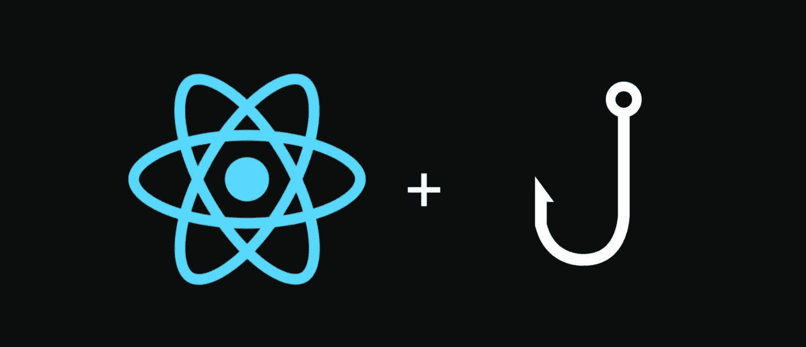

# 将上下文用于使用上下文

> 原文：<https://javascript.plainenglish.io/putting-context-into-usecontext-5dbe77c276d1?source=collection_archive---------8----------------------->



Image credits to [Aditya Loshali](https://levelup.gitconnected.com/handling-complex-form-state-using-react-hooks-76ee7bc937) and freeCodeCamp

我是 React 和 React 挂钩的忠实粉丝。

在你翻着白眼说“别让另一个 React 钩住博客”之前，听我说完。

Sorry!

毫不奇怪，行业标准已经远离了基于类的组件和生命周期。在这篇文章中，我不会讨论基于函数还是基于类的组件——你可以在 [Dev](http://dev.to) 和 [Medium](http://medium.com) 上阅读数十篇关于这个主题的博客。

然而，我确实想阐明我学到的一个特别有用的东西，那就是使用上下文。

## 什么是使用上下文？

useContext 是一个 React 挂钩，它允许我们拥有和使用全局状态管理，而不需要基于类的组件。

回顾一下，组件、虚拟 DOM、道具和状态是使 React 如此独特和流行的关键特性。状态是我们如何跟踪元素和组件在前端是如何呈现和交互的。

例如，假设您正在填写一份调查。当你点击一个复选框时，会有一个变量跟踪你是否点击了这个复选框。如果您或另一个用户单击了，组件的状态(在本例中是复选框)将被设置为与之前相反的状态，因此从 false(未单击)变为 true(当前状态)。当您取消选中该框时，state 现在应该被设置为与单击的值相反的值—现在为 false。

```
import {useState} from "react"export default function Survey(){
  const [clicked, setClicked] = useState(false) const clickHandler = () => {
    setClicked(!clicked)
} return (
    <> <label>Do you want to take our customer survey for a chance to win $10,000?</label>
    <input type="checkbox" onClick={clickHandler}></input> </>
  )
```

useContext 允许我们在全局状态下存储一些数据，并通过变量访问这些数据。在某些情况下，这个挂钩消除了我们使用和传递道具的需要。如果您的应用程序需要访问其大部分组件的数据，那么 useContext 将是保持代码干燥的有效方法。

总来说，状态管理是有用的，但是在 React 中会变得非常复杂。在 JavaScript 中，状态是异步更新的，这意味着您的代码可能正在运行，但状态不会像代码的其余部分一样更新和解析。这就是为什么有这么多的状态管理方法，比如 Redux，这是一个 React 框架，它通过使用存储和 reducers 来管理状态，因此只有必要的组件才能访问显示和更改状态(在存储中设置)。不过，Redux 的实现和调试可能很有挑战性，即使有了这个特殊的框架，在状态管理方面仍有很大的改进空间。

在发表这篇文章的时候，[反冲. js](https://recoiljs.org/) 是“一个实验性的 React 应用程序状态管理库”，据其 [GitHub](https://github.com/facebookexperimental/Recoil) 称。这个令人兴奋的 Redux 框架于 2020 年发布，旨在改善状态管理。这显示了状态管理对我们的前端是多么重要和复杂。

## 它与 useState 有何不同？

useState 和 useContext 可能*看起来*相似，因为它们都与状态管理有关。在我看来，useState 是一种不太稳定的维护状态的方式。使用 useContext 的好处是我们可以实例化一个变量来使用 Context，并将其直接导入到任何组件中。由于这是全局状态管理，我们不能改变 useContext 中的设置。然而，对于 useState，我们必须将它的值作为 props 传递下去，这很容易在刷新或重新呈现时被更改和丢失。

我不常使用 useContext。不过，看到它投入使用，让我意识到这个特殊的 React 挂钩是多么有用。在 React 中处理状态可能很棘手，而 useContext 是类组件和 Redux 之间的一个很好的媒介。它既容易使用又容易理解。

也就是说，状态管理是复杂的，这就是为什么不断有新技术被创造出来以改进我们存储它的方式。useContext 本身并不是没有缺陷，但总的来说，我期待在我未来的产品中使用这个特殊的 React 钩子。

感谢您的阅读。如果你有兴趣了解更多关于 useContext 的信息，我强烈建议你查看下面的链接。

## 资源

[](https://frontarm.com/james-k-nelson/usecontext-react-hook/) [## useContext():一个明显胜出的 React 挂钩

### 今天早些时候，React 团队发布了 React 16.8，以及期待已久的 hooks API。如果你还没有…

frontarm.com](https://frontarm.com/james-k-nelson/usecontext-react-hook/) [](https://reactjs.org/docs/hooks-reference.html#usecontext) [## 钩子 API 参考-反应

### 钩子是 React 16.8 中的新增功能。它们允许您使用状态和其他 React 特性，而无需编写类。这个…

reactjs.org](https://reactjs.org/docs/hooks-reference.html#usecontext) [](https://dev.to/techcheck/react-hooks-usecontext-1j90) [## React 挂钩-使用上下文

### 当您需要通过多个嵌套的子组件向下发送道具时，useContext 钩子是一个很好的钩子…

开发到](https://dev.to/techcheck/react-hooks-usecontext-1j90) [](https://kentcdodds.com/blog/how-to-use-react-context-effectively) [## 如何有效使用 React 上下文

### 当前可用的翻译:在 React 的应用程序状态管理中，我讨论了如何使用本地状态的混合…

kentcdodds.com](https://kentcdodds.com/blog/how-to-use-react-context-effectively)