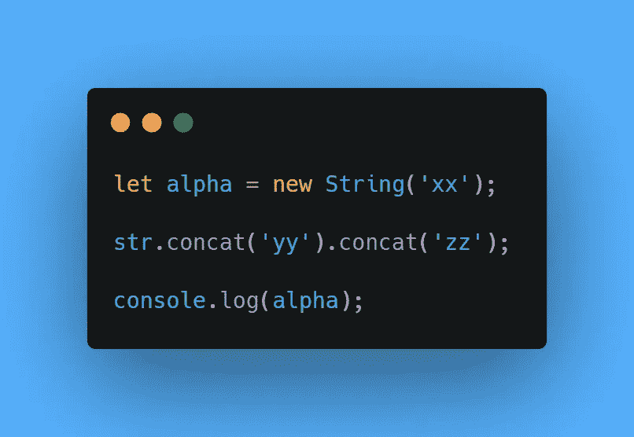
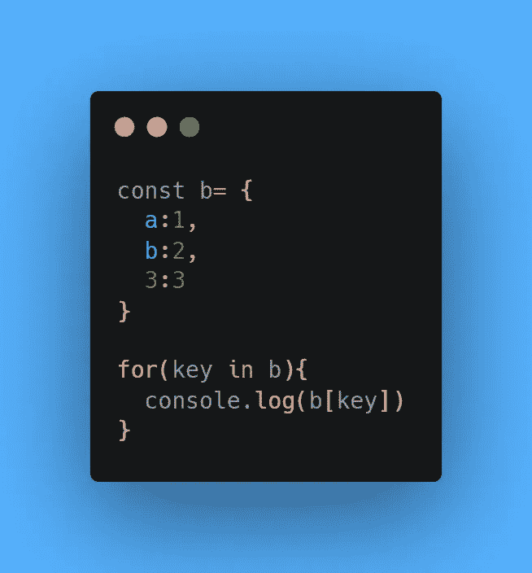
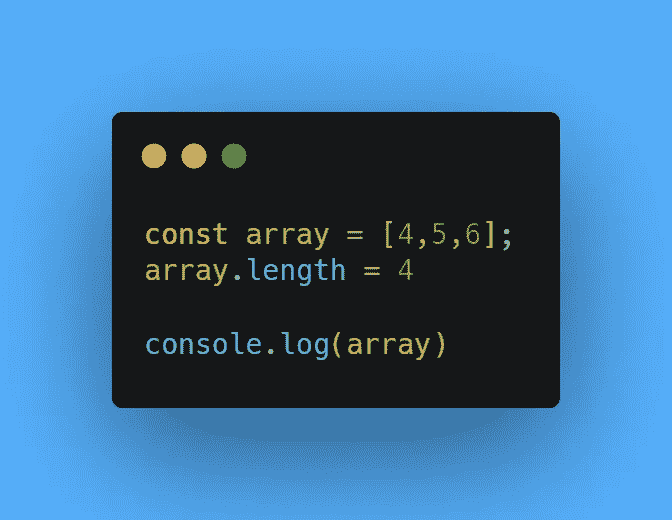

# 掌握 JavaScript 编码面试的问题

> 原文：<https://javascript.plainenglish.io/question-to-master-the-javascript-coding-interview-4f39a38aaecc?source=collection_archive---------7----------------------->

## 第 5 部分:13 个 JavaScript 编码面试问题

## 1.不管环境如何，哪些属性都可以访问全局对象？

*   globalThis

## 2.控制台输出会是什么，为什么？

*   控制台输出会是， **xx** 因为 ***concat*** 返回一个新的字符串，原来的**字符串**不受影响。

## 3.JavaScript 中括号()的专业名称是什么？

*   分组运算符。

## 4.JavaScript 运行时中的队列是什么？

*   一个**队列**不同于一个**堆栈**，因为它是一个相关*函数*的列表，其中最近的函数必须被执行，以便正确地执行旧的函数。
*   而**队列**是 ***先进先出*** ，这意味着最早的消息首先被处理。

## 5.控制台输出会是什么，为什么？

*   控制台输出将是一个**未捕获的语法错误:意外数字。**
*   因为在 JavaScript 中，*键*必须是字符串。

## 6.假设启用了 TypeScript，一个接口可以扩展另一个接口。这是真的吗？

*   是的，当一个接口扩展另一个接口时，它可以访问父接口的属性，而子接口只是覆盖更多的属性。

## 7.假设启用了 TypeScript，对象将继承其父类的所有字段和方法。这是真的吗？

*   不，一个对象不会继承有**‘private’**修饰符的字段和方法。

## 8.控制台输出会是什么，为什么？

*   由于数组在索引 **4** 处没有任何数字，因此在控制台中会显示为**未定义**。
*   **console.log(array)** 的输出会是**【4，5，6，未定义】。**

## 9.箭头函数有什么局限性？

*   箭头功能不应用作**方法**
*   箭头函数不能用作**构造函数**。
*   箭头函数没有参数，比如 **super** ，或者 **new.target** 关键字。
*   箭头函数不能在其体中使用 **yield** *关键字*。

## 10.传统函数和箭头函数的默认作用域有什么区别？

*   传统功能默认 ***本*** 为**窗口** *范围*。
*   箭头函数在创建它们的*作用域*中执行。

## 11.如果我们在 for 循环中丢失了一个括号，会抛出什么类型的错误？

*   语法错误。

## 12.JavaScript 支持类上的静态变量吗？

*   是的，这是 JavaScript 最近增加的功能，到 2020 年并不是所有的浏览器都支持。

## 13.try 语句后面总是跟有至少一个 catch 语句。这是真的吗？

*   不会，因为一个 ***try*** 语句后面可能跟一个 final 语句，而不是一个 ***catch*** 语句。

 [## 掌握 JavaScript 编码面试的 50 个问题

### JavaScript 编码面试问题:第 1 部分

javascript.plainenglish.io](/50-questions-to-master-the-javascript-coding-interview-639d2ac12630)  [## 掌握 JavaScript 编码面试的问题(第 2 部分)

### JavaScript 编码面试问题—第 2 部分。

javascript.plainenglish.io](/55-questions-to-master-the-javascript-coding-interview-ba49f7b2065a)  [## 掌握 JavaScript 编码面试的问题

### 第 3 部分:11 个 JavaScript 编码面试问题

javascript.plainenglish.io](/questions-to-master-the-javascript-coding-interview-part-3-7f26339f9caf)  [## 掌握 JavaScript 编码面试的问题

### 第 4 部分:11 个 JavaScript 编码面试问题

mohit19.medium.com](https://mohit19.medium.com/questions-to-master-the-javascript-coding-interview-12b07d4b77e7) 

*更多内容请看*[***plain English . io***](http://plainenglish.io)